# 011：配置基于云的Chef服务器 🚀

## 概述
在本节课中，我们将学习如何配置一个基于云的Chef服务器。这个服务器将作为中央管理点，用于存储和分发所有需要在客户端节点上运行的配置（食谱和菜谱）。在大型组织中，手动管理成百上千个节点是不现实的，因此一个集中的自动化服务器至关重要。

上一节我们介绍了Chef的基本概念和工作站设置，本节中我们来看看如何建立这个中央管理服务器。

## 创建Chef管理账户
首先，我们需要在Chef官网上创建一个管理账户。这个账户将用于管理你的组织、节点和所有自动化配置。

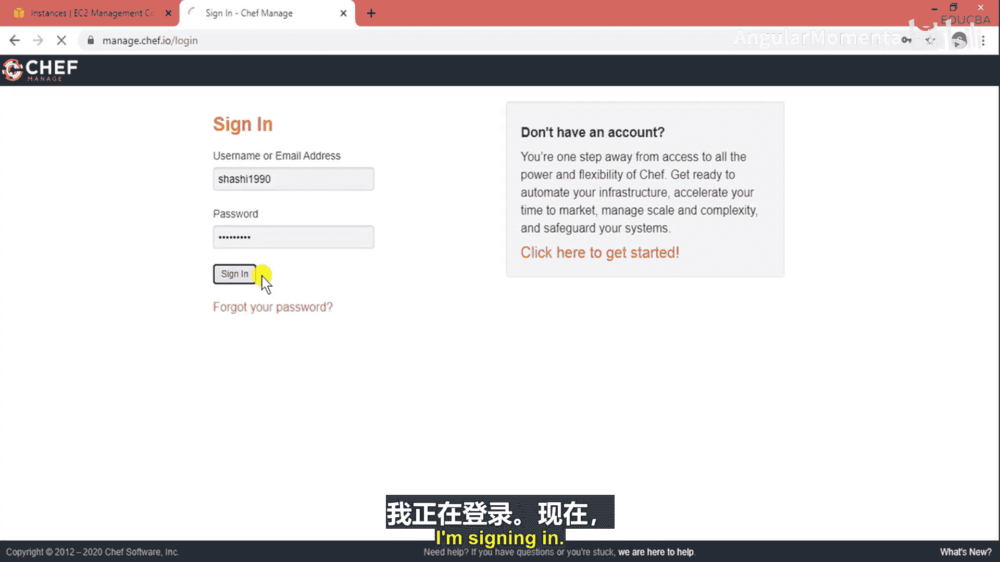

以下是创建账户的步骤：
1.  访问Chef官网并点击“Get Started”按钮。
2.  填写你的姓名、公司名称、邮箱地址和一个未被占用的用户名。
3.  同意相关条款，然后点击“Get Started”。
4.  接下来，你需要创建一个组织（Organization）。输入组织的全名和简称。

我已经拥有一个账户，因此我将直接登录。登录后，你会进入管理界面。


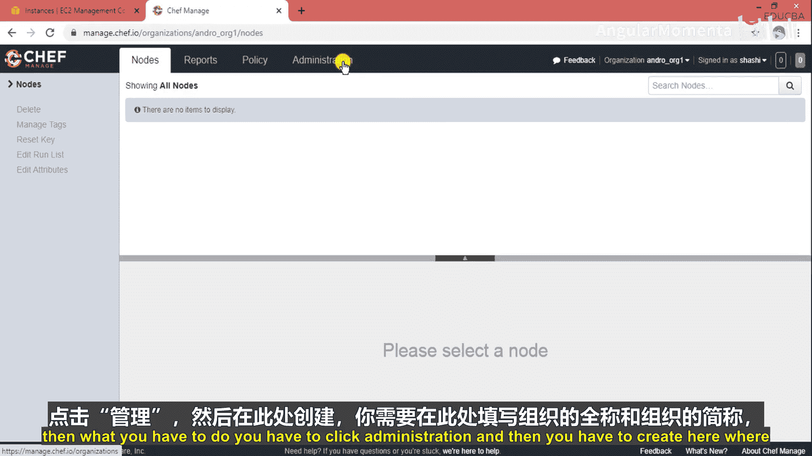

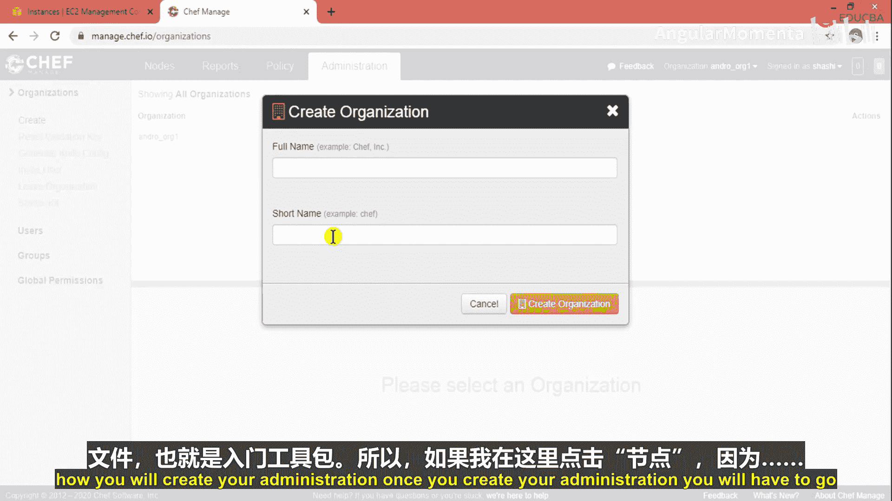

## 下载Starter Kit（入门工具包）
成功创建组织后，你需要下载一个名为“Starter Kit”的压缩包。这个工具包包含了将你的服务器实例连接到Chef管理平台所需的所有配置文件。

如果你还没有创建组织，可以点击“Administration”然后创建。创建组织后，导航到“Starter Kit”部分进行下载。

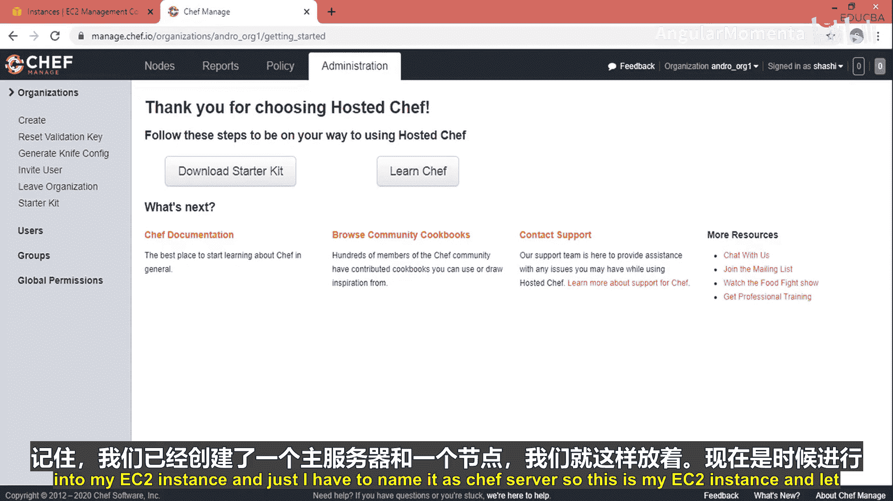

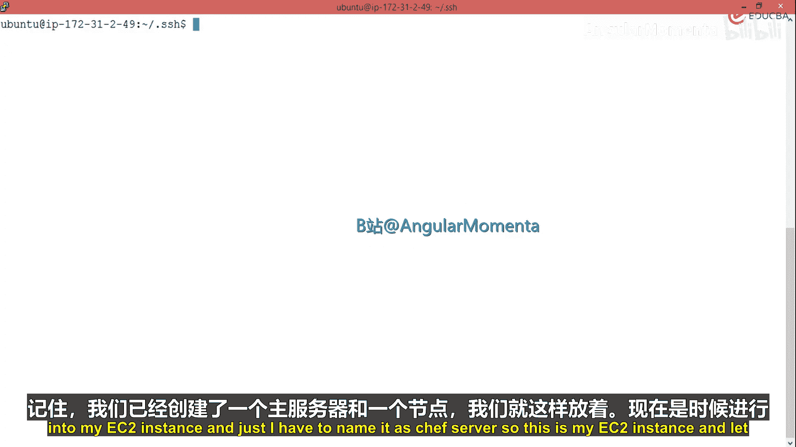


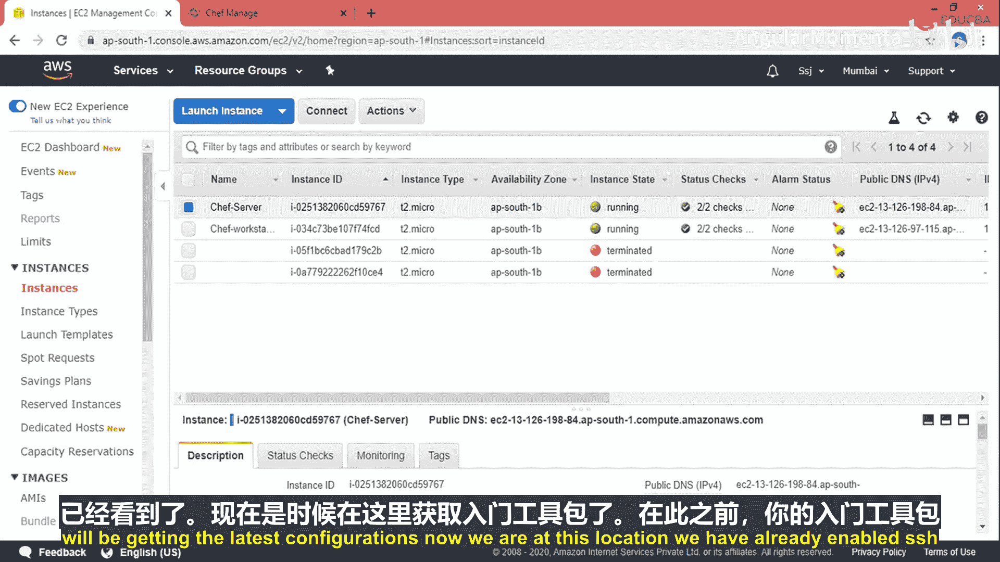

点击“Download Starter Kit”按钮，将ZIP文件保存到本地。这个文件需要上传到我们计划用作Chef服务器的EC2实例上。

## 准备EC2实例作为Chef服务器
回顾之前的课程，我们已经创建了一个主服务器和一个节点。现在，我们需要将其中一个实例专门用作Chef服务器。

我将把之前的主服务器重命名为“Chef-Server”，它将作为我们所有自动化操作的中心工作站。


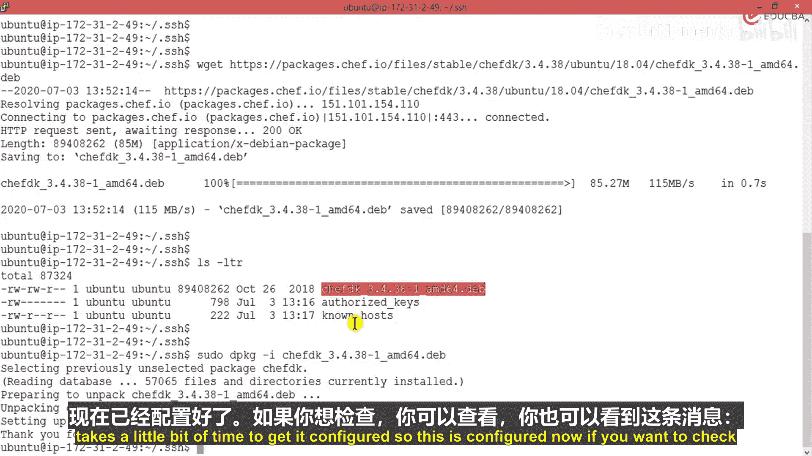

所有自动化配置都将在这个服务器上创建和管理，而各个客户端节点会定期向这个服务器拉取最新的配置。

## 在服务器上安装Chef Development Kit (ChefDK)
在将Starter Kit上传到服务器之前，必须确保服务器上已经安装了ChefDK。ChefDK是运行Chef工具链所必需的开发套件。

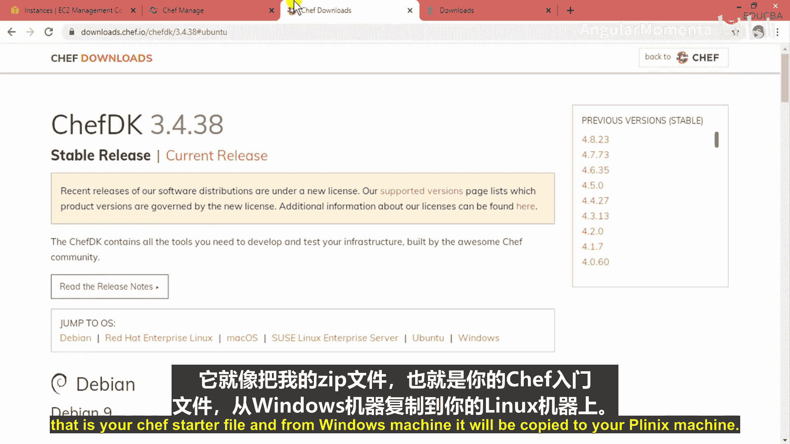

首先，通过SSH连接到你的EC2实例（Chef服务器）。

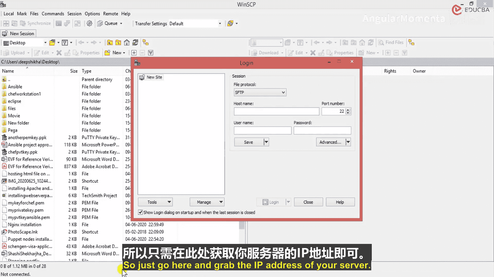

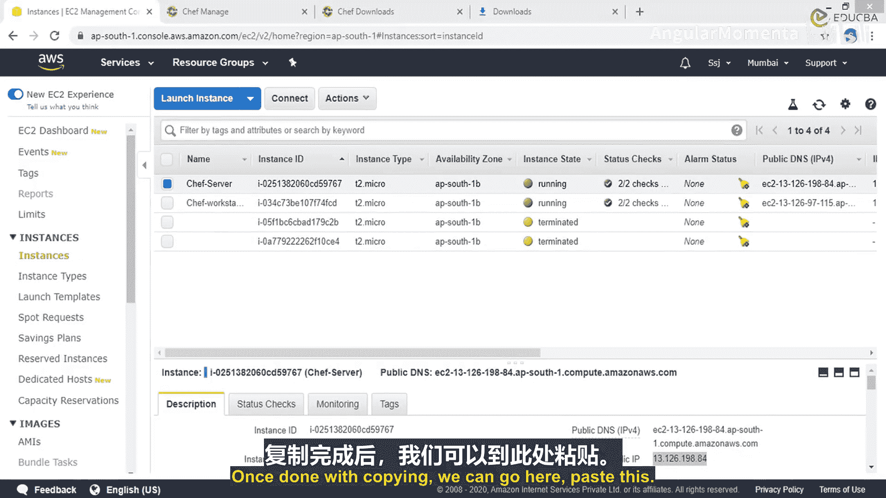


然后，从Chef官网获取ChefDK的安装链接。选择适合你操作系统（如Ubuntu）的版本，复制其下载链接。

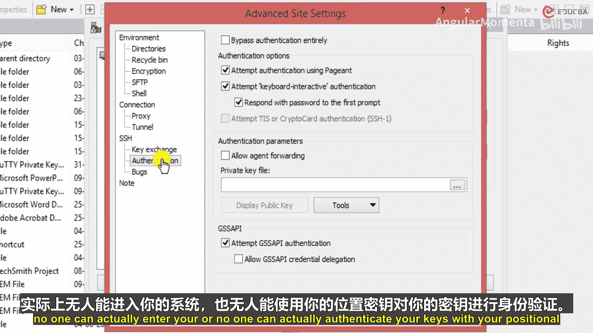

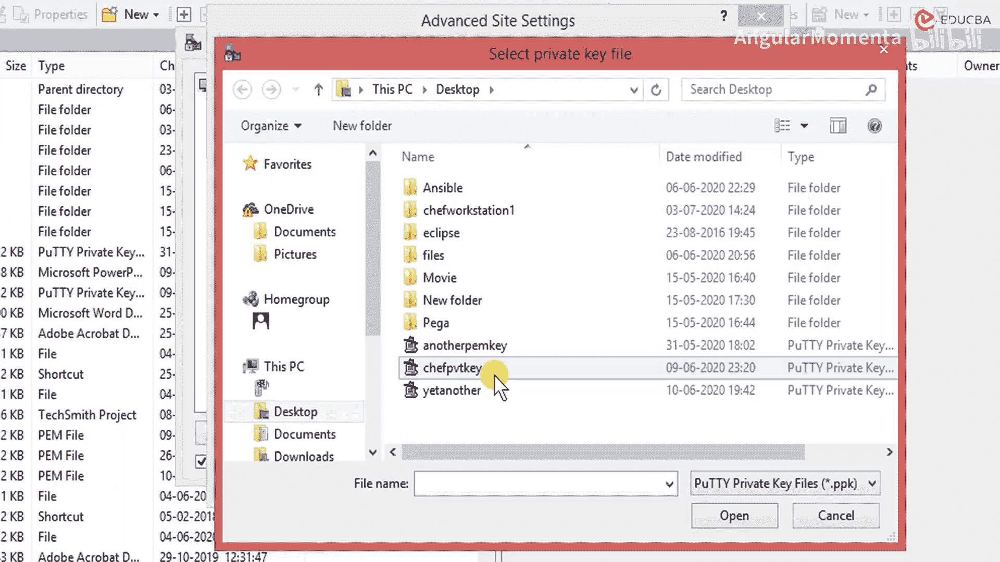

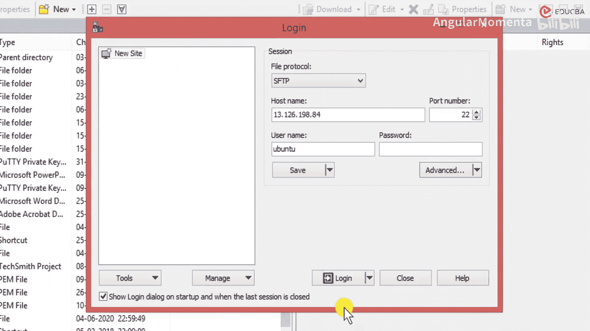

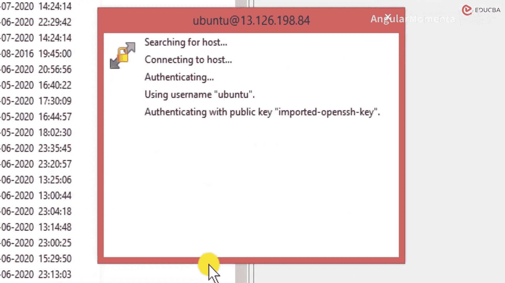

在服务器终端中，使用`wget`命令下载该安装包：
```bash
wget [复制的ChefDK下载链接]
```
下载完成后，使用`dpkg`命令安装它：
```bash
sudo dpkg -i [下载的ChefDK包文件名]
```
安装过程可能需要一些时间。安装完成后，你可以通过运行以下命令来验证安装是否成功：
```bash
which chef
```
如果命令返回了Chef的安装路径，说明安装成功。


## 上传并配置Starter Kit
现在，我们需要将之前从网站下载的`chef-starter.zip`文件上传到服务器。我使用WinSCP工具在Windows和Linux机器之间传输文件。

打开WinSCP，输入你的EC2实例（Chef服务器）的公共IP地址、用户名（如`ubuntu`），并使用与实例关联的`.pem`密钥文件进行身份验证。


连接成功后，将本地的`chef-starter.zip`文件拖放到服务器的远程目录中（例如用户主目录）。

回到服务器的终端，导航到文件所在目录并解压它：
```bash
unzip chef-starter.zip
```
如果系统提示未找到`unzip`命令，你需要先安装它：
```bash
sudo apt-get install unzip
```
解压后，你会得到一个名为`chef-repo`的目录。进入该目录，可以看到其中包含`cookbooks`、`roles`等子目录以及关键的`.chef`隐藏目录。
```bash
cd chef-repo
ls -la
```
`.chef`目录里存放着`knife.rb`配置文件和你用户的验证密钥，这些是服务器与Chef管理平台通信的凭证。

## 验证服务器配置
最后，我们验证服务器是否已成功与云端Chef管理平台连接。在`chef-repo`目录下，运行以下命令：
```bash
knife client list
```
这个命令会列出已注册到你的Chef组织下的客户端。如果它能成功执行并返回信息（例如你组织的验证客户端名称），则表明你的Chef服务器配置成功，已经可以开始管理节点了。

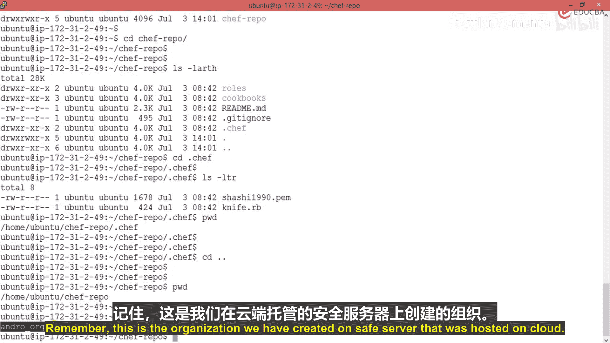


## 总结
本节课中我们一起学习了如何配置一个基于云的Chef服务器。我们完成了从创建Chef管理账户、下载Starter Kit、准备EC2实例、安装ChefDK，到上传配置并最终验证服务器连接的完整流程。现在，你已经拥有了一个功能完整的中央自动化服务器，为后续在大量节点上批量部署和管理应用配置打下了坚实的基础。下一节，我们将学习如何将节点注册到这个服务器并开始应用自动化配置。