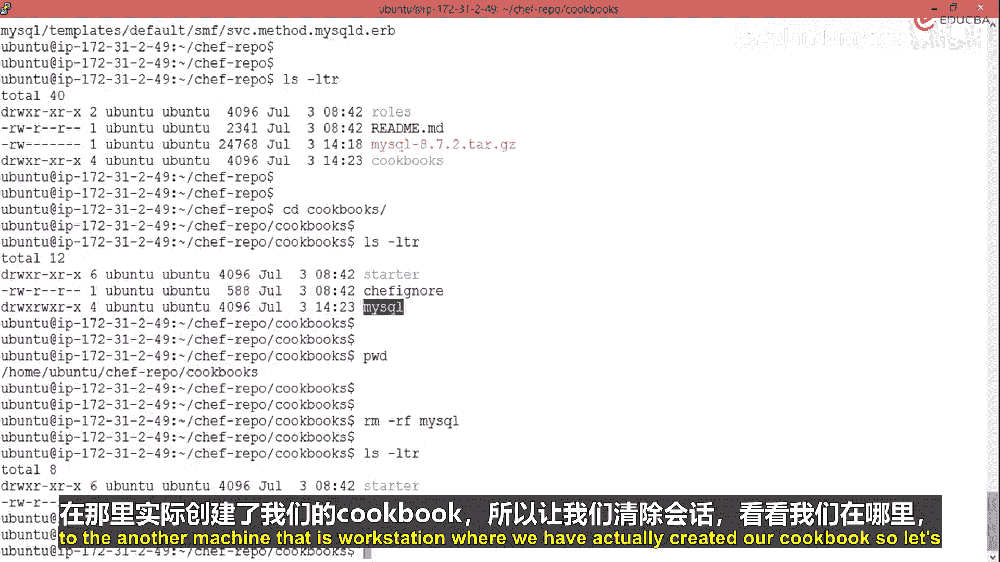
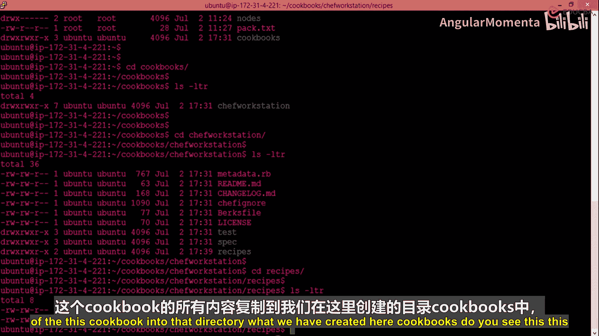
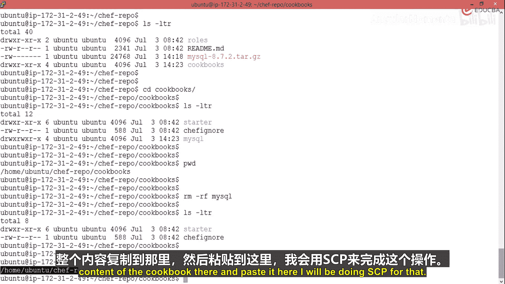
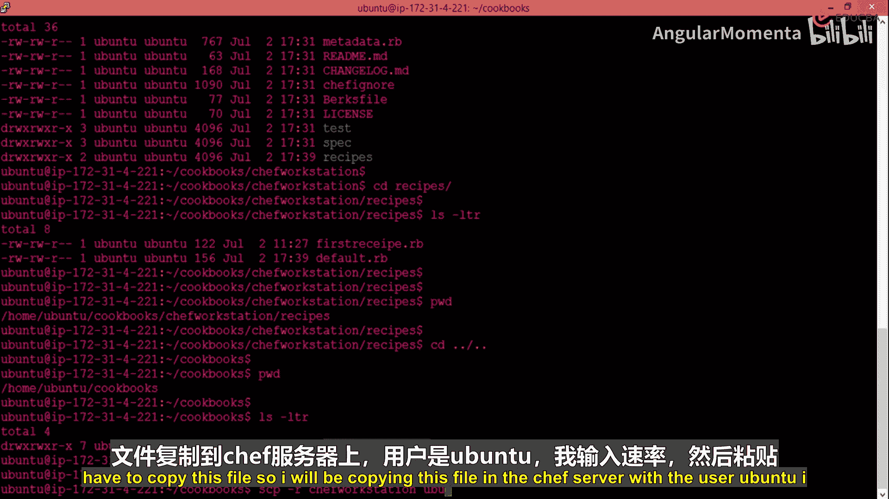
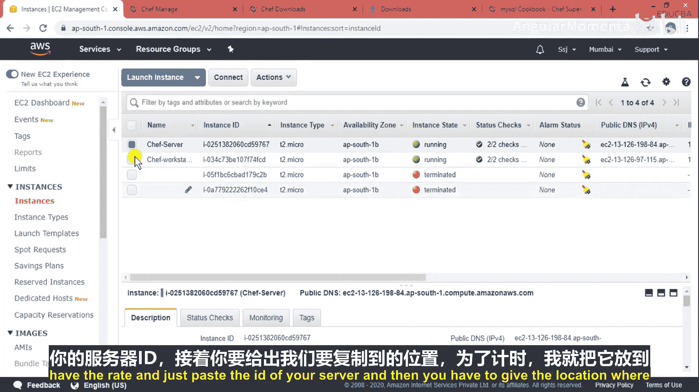
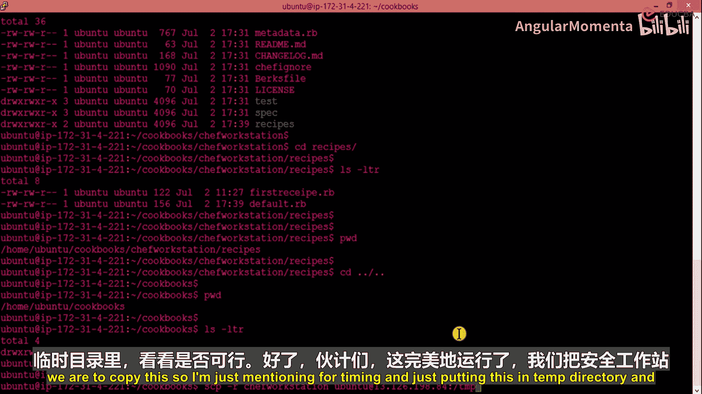
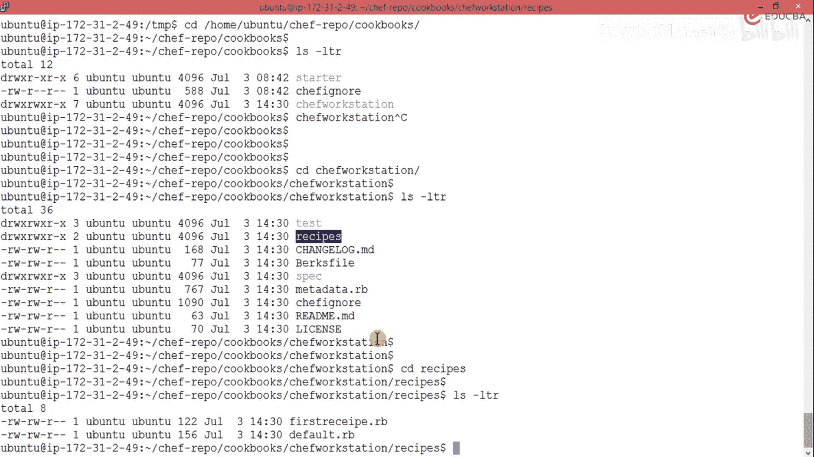
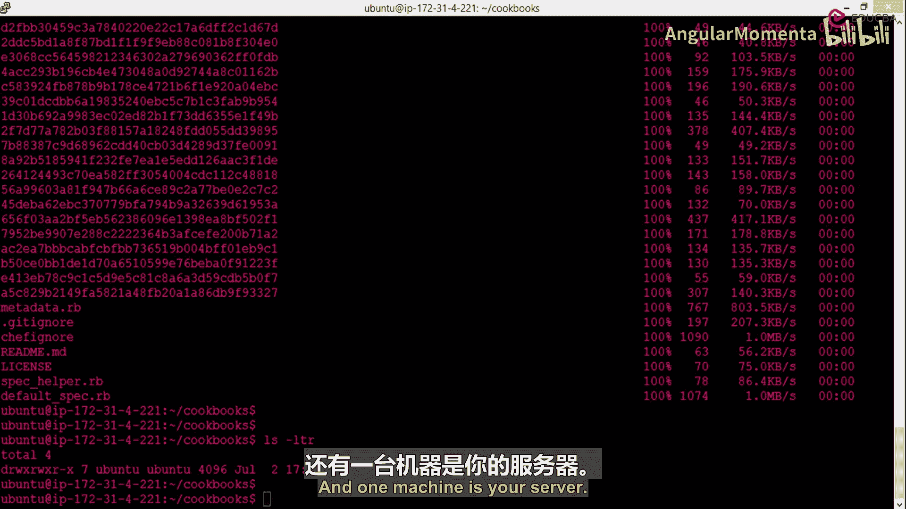
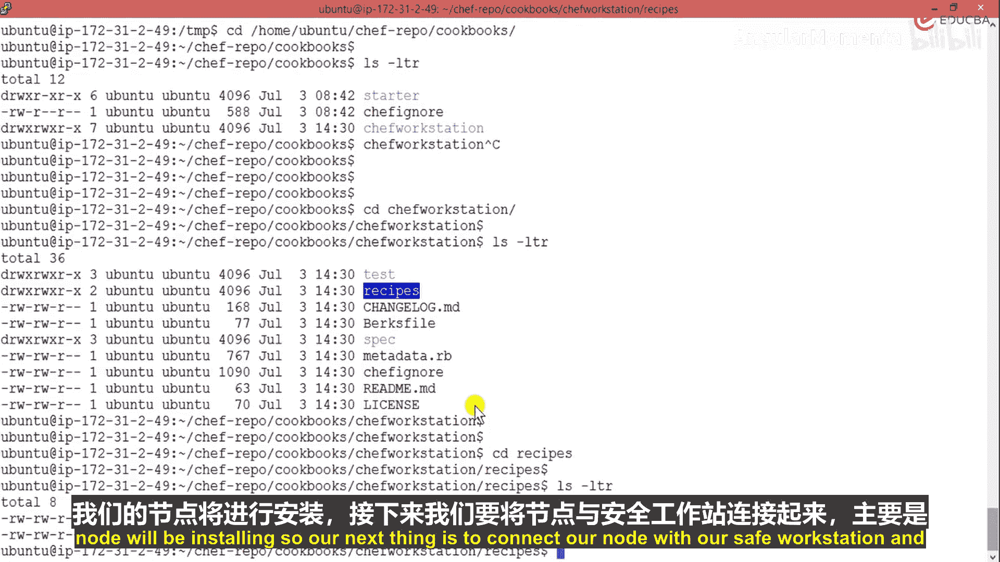

# 012：配置云端持续集成

## 概述
在本节课中，我们将学习Chef中一个强大的命令行工具——`knife`。我们将了解它的作用，如何使用它从Chef Supermarket下载社区食谱（cookbook），以及如何在Chef工作站和服务器之间传输文件。最后，我们将为自动化流程准备一个节点（Node）机器。

上一节我们介绍了Chef的基本架构和组件，本节中我们来看看连接和管理这些组件的核心工具。

## 理解Knife工具
`knife`是Chef生态系统中一个非常流行的命令行接口。它主要用于与Chef服务器进行交互。

具体来说，`knife`的作用是检查您的Chef服务器状态，并将您的节点（Node）与服务器连接起来。它是一个在线的命令行模式工具。例如，当我们执行 `knife client list` 命令时，它实际上会连接到我们的服务器，并检查组织内的客户端列表。

## 探索Chef Supermarket
为了更深入地理解`knife`和Chef服务器的强大之处，我们需要知道，服务器上预存了大量社区贡献的食谱（recipes）。我们可以直接获取这些食谱，无需自行修改，即可在系统中安装软件。

`knife`和服务器的一个强大功能在于，Chef服务器提供了一个集中位置来获取所有类型的食谱。这个位置被称为“Supermarket”。您可以访问 `supermarket.chef.io` 来浏览。

例如，如果您需要Apache的配置食谱，只需在Supermarket中搜索“Apache2”，即可找到相关食谱。您只需点击获取，并使用`knife`命令即可将其下载到您的Chef机器上。

同样，如果您想配置MySQL服务器，也可以搜索“MySQL server”。Supermarket上会列出所有相关的代码、默认配置和软件包信息。

## 使用Knife下载Cookbook
以下是如何使用`knife`命令直接从Supermarket下载一个cookbook的演示。



假设您想下载MySQL的cookbook，您需要执行以下命令：
```bash
knife cookbook site download mysql
```
这个命令会从Supermarket下载名为“mysql”的cookbook。下载完成后，您会收到提示信息，并且cookbook会以tar压缩包的形式保存在您的Chef仓库目录中。

您可以使用 `ls -ltr` 命令来查看下载的文件。接着，可以使用以下命令解压这个tar文件：
```bash
tar -xzf mysql-*.tar.gz -C cookbooks/
```
解压后，您可以在 `cookbooks/` 目录下找到mysql相关的文件夹和文件。通过这种方式，您就成功地从服务器使用`knife`命令下载了所需的配置。





## 在服务器与工作站间传输Cookbook
`knife`命令不仅能下载，还能上传食谱。我们已经在本地的Chef工作站上创建了一个食谱。现在，我们将把这个食谱复制到Chef服务器上。

首先，我们位于工作站的cookbooks目录中，例如 `~/chef-repo/cookbooks/sample_cookbook`。这个cookbook内部有 `recipes/` 目录，其中包含了 `default.rb` 等配方文件。







我们将使用 `scp` 命令安全地将整个cookbook目录结构复制到服务器上。命令格式如下：
```bash
scp -r /path/to/local/cookbook opentech@<server_ip>:/tmp/
```
这个命令会将本地cookbook递归地复制到服务器的 `/tmp/` 目录下。操作成功后，您可以在服务器上验证文件是否已存在。

接着，在服务器上，我们需要将这些文件移动到正确的Chef仓库目录中。通常路径是 `~/chef-repo/cookbooks/`。您可以使用以下命令：
```bash
cp -r /tmp/sample_cookbook ~/chef-repo/cookbooks/
```
完成之后，进入 `~/chef-repo/cookbooks/` 目录，您应该能看到名为 `sample_cookbook` 的文件夹。这表示我们成功地在工作站和服务器之间建立了通信，并传输了配置。

## 准备自动化节点（Node）
目前我们的设置包含两台机器：一台作为开发工作站，另一台作为Chef服务器。为了实现完整的自动化，我们还需要至少一台作为被管理节点的机器。

我们可以创建任意数量的节点机器，并仅通过工作站和服务器这两台机器来维护它们。服务器作为开发机，工作站作为自动化控制机。

现在，让我们快速创建一台新的EC2实例作为节点。在AWS控制台中，启动一个新实例，选择适当的AMI（例如Amazon Linux 2），配置安全组以允许所有流量（仅用于实验目的），然后启动实例。





创建完成后，我们就拥有了一台新的节点机器。接下来的关键步骤是将这个节点与我们的Chef工作站，尤其是Chef服务器连接起来，以便开始推送和管理配置。



## 总结
本节课中我们一起学习了Chef的核心命令行工具`knife`。我们了解了它作为与Chef服务器交互的桥梁作用，实践了如何使用它从Chef Supermarket下载社区cookbook，以及如何在Chef工作站和服务器之间传输我们自己的cookbook。最后，我们为自动化流程创建了一个新的节点机器，为后续将配置自动化部署到节点上做好了准备。