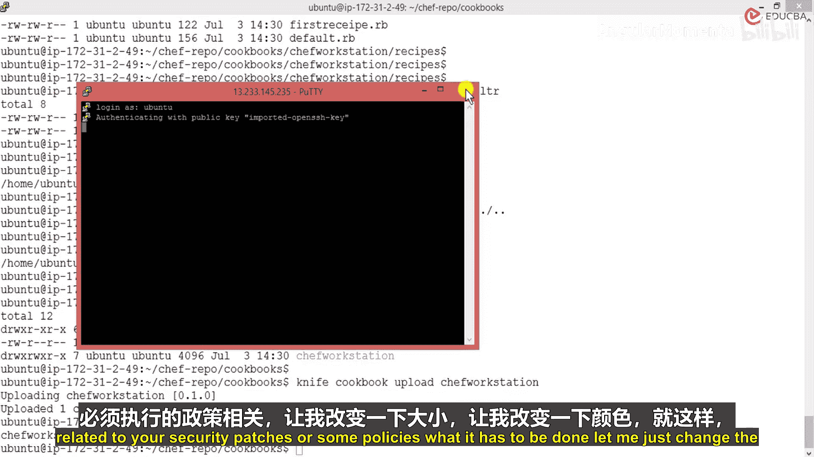
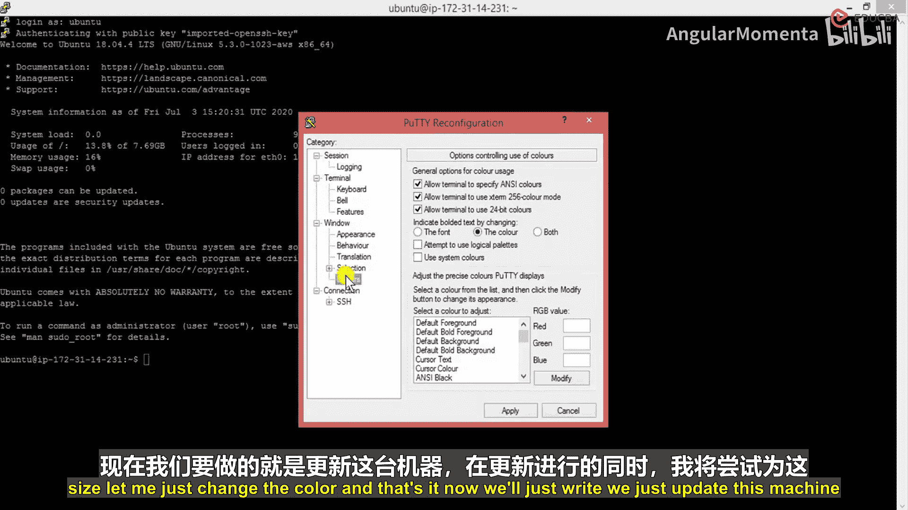
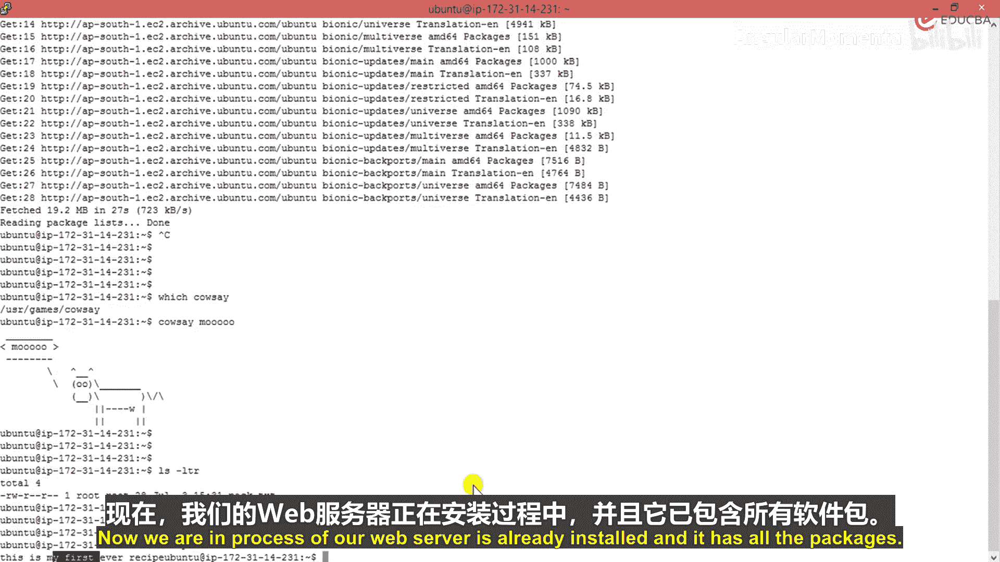

# 013：引导启动Chef节点 🚀

在本节课中，我们将学习如何将已创建的Chef节点引导启动，使其与Chef服务器建立连接，并自动安装必要的软件和配置。我们将使用`knife bootstrap`命令来完成这一自动化过程。

## 概述

上一节我们成功创建了Chef节点。本节中，我们来看看如何通过引导启动（Bootstrap）流程，将该节点与我们的Chef服务器关联起来，并自动应用我们上传的食谱（Cookbook）。

## 上传食谱到Chef服务器

首先，我们需要将本地工作站上创建的食谱上传到中央Chef服务器。以下是具体步骤。

我将使用`knife`命令来上传我们的食谱。`knife`是用于与Chef服务器交互、执行上传或下载操作的主要工具。

*   **命令**：`knife cookbook upload chef-workstation`
*   **说明**：此命令将连接到我们创建的云端Chef服务器账户，并将名为`chef-workstation`的食谱安装到服务器上。

执行此命令后，系统显示上传成功。我们可以通过另一个命令来验证服务器上现有的食谱。

*   **验证命令**：`knife cookbook list`
*   **预期结果**：执行此命令后，应列出已上传的食谱，例如`chef-workstation`。在上传之前，此命令会返回零个食谱。

我们也可以登录Chef服务器的Web管理界面，在“策略”（Policy）部分查看到`workstation`食谱及其所有内容和权限，这进一步确认了上传成功。

## 理解引导启动（Bootstrap）

目前，虽然节点已创建，但并未与Chef服务器关联。节点不知道应该联系哪个服务器来获取食谱和指令。引导启动过程将自动化解决这个问题。

**引导启动** 是指Chef服务器自动为节点安装必要软件、创建身份验证密钥并将其添加到组织中的过程。我们的节点虚拟机目前甚至没有安装Chef客户端软件，引导启动将管理这一切。

简单来说，引导启动会告诉节点：“我是你的服务器，你需要联系我来获取运行所需的食谱”，并提供所有必要的登录凭证和软件。

## 更新节点系统（可选）

在开始引导启动之前，可以选择先更新节点虚拟机的系统。这是一个可选但通常有益的操作，可以确保系统补丁和软件包是最新的。





我将通过运行系统更新命令来完成此步骤。更新过程需要一些时间。

## 执行引导启动命令

当系统更新进行时，我们可以在Chef工作站上准备并执行引导启动命令。我将切换到Chef代码仓库目录。

引导启动使用`knife bootstrap`命令。我们需要指定节点的IP地址或域名、登录用户名以及要应用的食谱。

*   **核心命令示例**：
    ```bash
    knife bootstrap <NODE_IP_ADDRESS> -x <USERNAME> -P <PASSWORD> --sudo --use-sudo-password -N <NODE_NAME> -r 'recipe[<COOKBOOK_NAME>::<RECIPE_NAME>]'
    ```
*   **过程说明**：该命令会为节点创建新的客户端和节点记录，下载并安装Omnibus（包含Chef客户端），然后自动编译并运行指定的食谱。

执行命令后，一个自动化的安装和配置过程开始。它安装了所有必需的软件包，并应用了我们食谱中定义的配置。整个过程大约耗时45秒。

## 验证引导启动结果

引导启动完成后，我们需要验证配置是否已成功应用到目标节点。

我们可以在目标节点上检查，是否生成了食谱中定义的文件。例如，我们的食谱可能包含创建特定配置文件的指令。

*   **验证方法**：登录目标节点，检查预期文件是否存在并包含正确内容。
*   **结果**：在目标节点上，我们找到了由食谱指令创建的文件（例如`factor.txt`），并且其内容与我们食谱中定义的一致。这证明引导启动成功，配置已从Chef服务器复制并应用到了节点。

## 总结



本节课中，我们一起学习了Chef自动化中的关键步骤——引导启动节点。我们首先将本地食谱上传到了Chef服务器，然后理解了引导启动的概念，即自动化安装软件、建立认证和关联节点的过程。最后，我们通过一条`knife bootstrap`命令，成功地将新节点接入Chef管理体系，并验证了自动化配置部署的结果。至此，一个基本的“服务器-节点”自动化管理链路已经建立。