# 014：安装MySQL服务器 🗄️

在本节课中，我们将学习如何使用Chef自动化安装MySQL数据库服务器。我们将创建一个专门的Cookbook和Recipe，并将其应用到目标节点上，为后续的Web应用项目提供数据存储支持。

## 概述

上一节我们介绍了如何引导（Bootstrap）一个节点。我们引导了一个名为`web1`的节点。本节中，我们将创建一个数据库服务器节点，并编写一个Chef Recipe来自动化安装MySQL服务器。

## 回顾节点引导过程

节点引导的语法非常简单。我们使用`knife`命令行工具。基本命令结构如下：

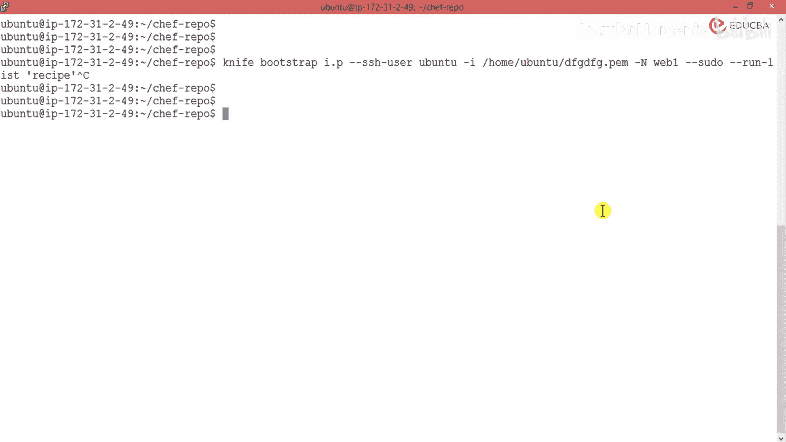

```bash
knife bootstrap <IP_ADDRESS> -x <USERNAME> -i <PATH_TO_PEM_FILE> -N <NODE_NAME> --sudo --run-list 'recipe[<COOKBOOK_NAME>::<RECIPE_NAME>]'
```

以下是命令各部分的解释：
*   `knife bootstrap`: 引导节点的主命令。
*   `<IP_ADDRESS>`: 目标节点的IP地址。
*   `-x <USERNAME>`: 用于SSH连接的用户名（例如，Ubuntu系统常用`ubuntu`，EC2常用`ec2-user`）。
*   `-i <PATH_TO_PEM_FILE>`: SSH私钥文件的路径。
*   `-N <NODE_NAME>`: 为节点定义的名称（例如`web1`）。
*   `--sudo`: 以sudo权限执行命令。
*   `--run-list`: 指定节点需要运行的Recipe列表。

执行此命令后，Chef服务器会连接到目标节点，安装必要的Chef客户端软件包，并根据`run-list`执行指定的Recipe，从而完成节点的配置。

目前，我们有两个节点：一个Web服务器（`web1`）和一个即将配置的数据库服务器。

## 创建MySQL Cookbook

我们将创建一个新的Cookbook来管理MySQL服务器的安装。这个Cookbook将在工作站（Workstation）上创建，任何安装了Chef Development Kit（ChefDK）的机器都可以执行此操作。

进入Cookbooks目录，使用以下命令生成Cookbook：

```bash
chef generate cookbook cookbooks/mysql
```

此命令会创建名为`mysql`的Cookbook及其所需的全部目录结构。

## 创建数据库服务器Recipe

接下来，我们在`mysql` Cookbook中创建一个专门用于安装数据库的Recipe。

进入新创建的`mysql` Cookbook目录，使用生成命令创建Recipe：

```bash
chef generate recipe db_server
```

此命令会在`recipes`目录下创建名为`db_server.rb`的Recipe文件。使用生成命令可以确保文件符合Chef的标准格式并包含必要的元数据。

现在，编辑`db_server.rb`文件，编写安装MySQL服务器的逻辑。

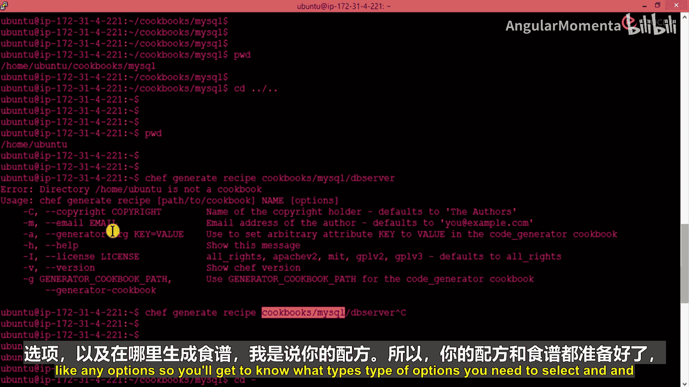

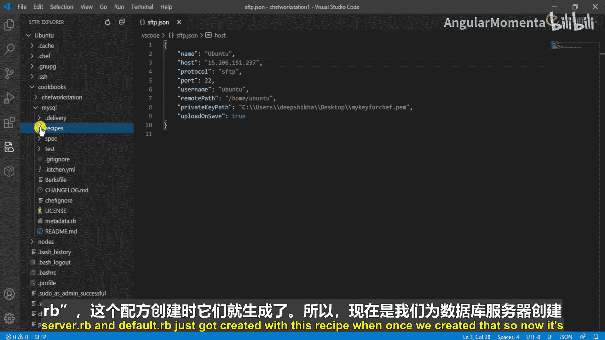

## 编写安装MySQL的Recipe

Recipe的编写非常简洁。我们使用Chef的`package`资源来声明需要安装的软件包。Chef会根据目标节点的操作系统自动选择正确的包管理工具（如APT、YUM）。

打开`cookbooks/mysql/recipes/db_server.rb`文件，输入以下内容：

```ruby
package 'mysql-server'
```

这行代码告诉Chef：“确保在此节点上安装名为`mysql-server`的软件包”。Chef会自动处理安装过程，无需我们指定具体的操作（如`action :install`），因为安装是`package`资源的默认行为。

保存文件。至此，安装MySQL服务器的Recipe就编写完成了。

## 上传Cookbook并引导数据库节点

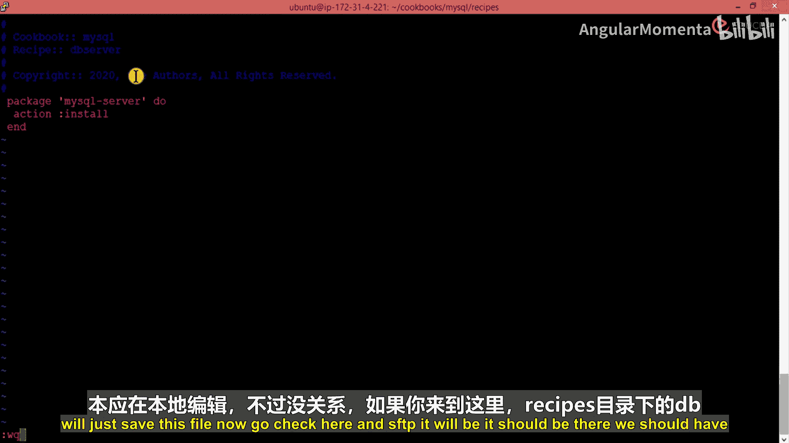

我们的实验环境包含三台机器：工作站、Chef服务器、一个Web主机和一个数据库主机。目前，我们只在工作站上创建了Cookbook。

为了在数据库节点上运行这个Recipe，我们需要将Cookbook上传到Chef服务器，然后引导数据库节点并指定运行此Recipe。

首先，将工作站上生成的`mysql` Cookbook复制到Chef服务器的相应目录。假设Chef服务器的仓库路径为`/chef-repo/cookbooks/`，可以使用`scp`命令进行复制：

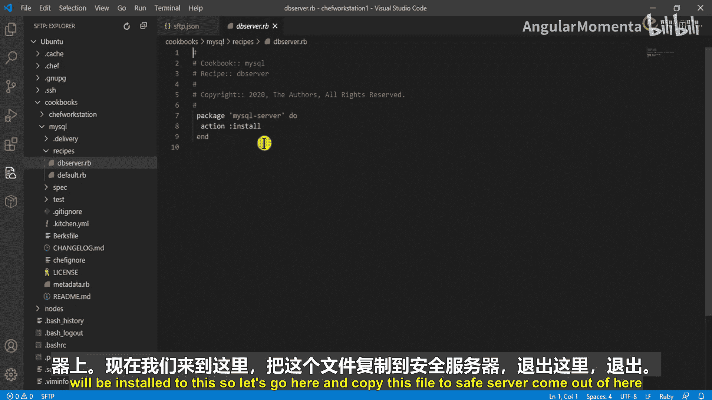

```bash
scp -r cookbooks/mysql root@<CHEF_SERVER_IP>:/chef-repo/cookbooks/
```

复制完成后，登录Chef服务器验证`mysql` Cookbook已存在于`/chef-repo/cookbooks/`目录中。

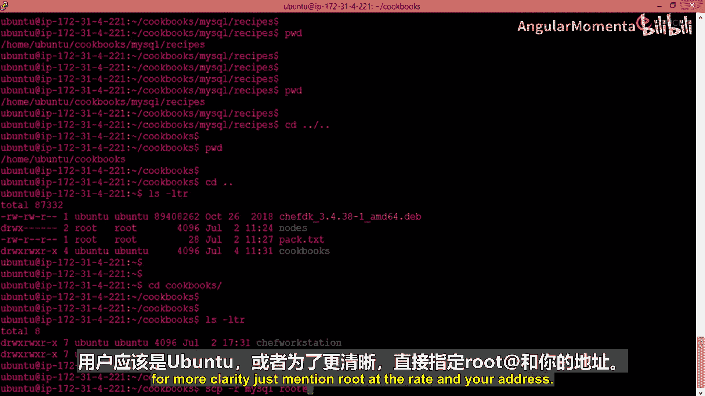

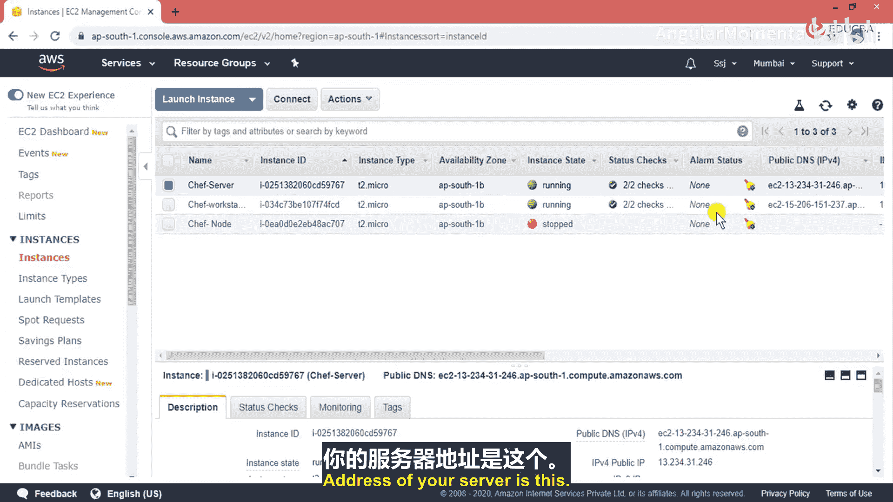

最后，引导数据库节点。使用与之前类似的`knife bootstrap`命令，但将节点名称改为`db1`，并将运行列表指向我们刚创建的Recipe：

```bash
knife bootstrap <DB_NODE_IP> -x ubuntu -i /path/to/your.pem -N db1 --sudo --run-list 'recipe[mysql::db_server]'
```

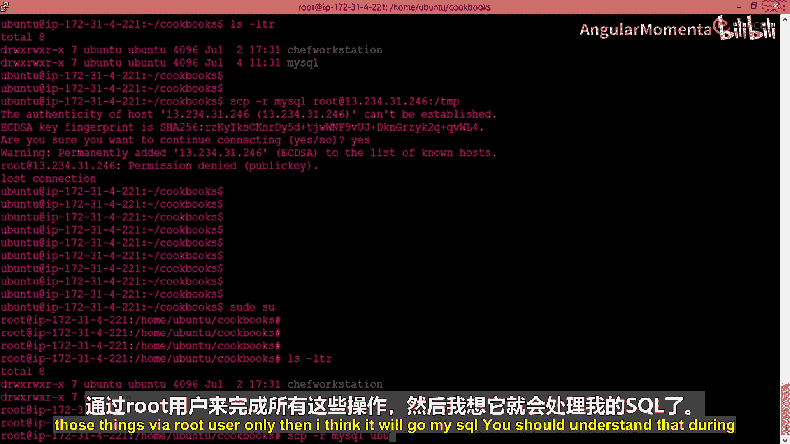

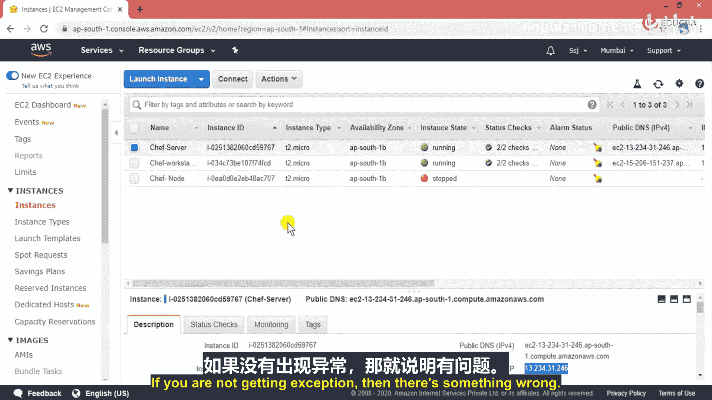

执行此命令后，Chef服务器将配置新的数据库节点，并自动安装MySQL服务器。

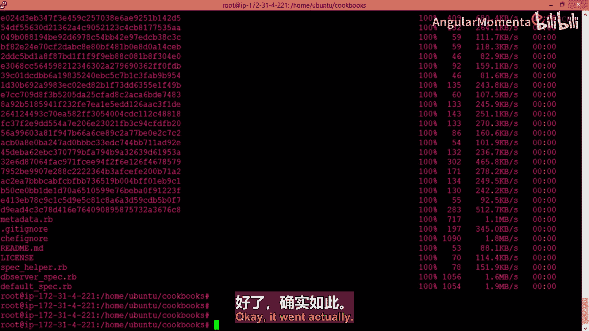

## 总结

本节课中我们一起学习了如何为数据库服务器创建专门的Chef Cookbook和Recipe。我们完成了以下步骤：
1.  回顾了使用`knife bootstrap`引导节点的命令语法。
2.  使用`chef generate cookbook`命令创建了`mysql` Cookbook。
3.  使用`chef generate recipe`命令在Cookbook中创建了`db_server` Recipe。
4.  编写了用于安装`mysql-server`软件包的简单Recipe代码。
5.  了解了将Cookbook上传至Chef服务器并引导新节点运行该Recipe的流程。

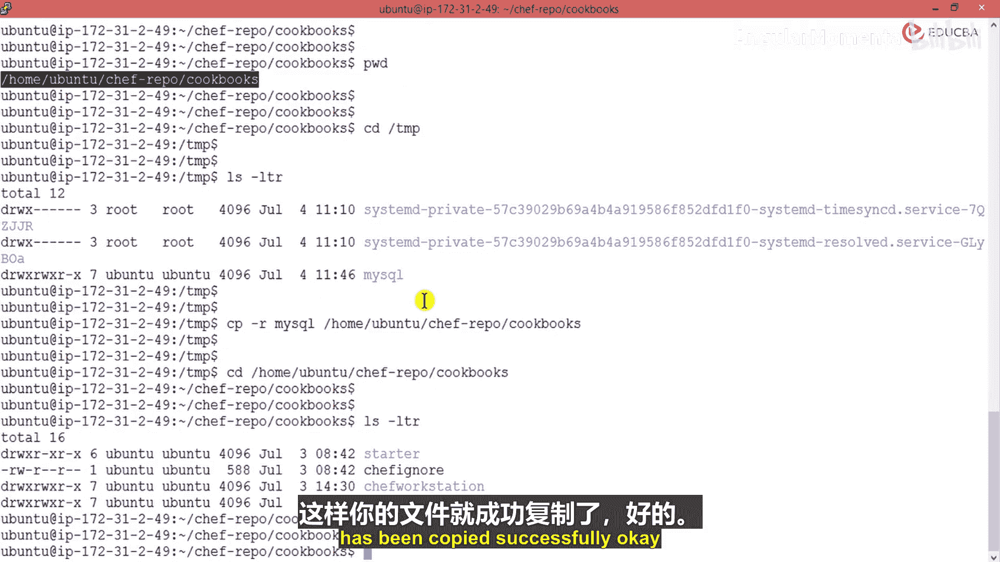

通过本节学习，你掌握了使用Chef自动化安装基础服务（如MySQL）的方法，这是构建自动化云基础设施的关键一步。