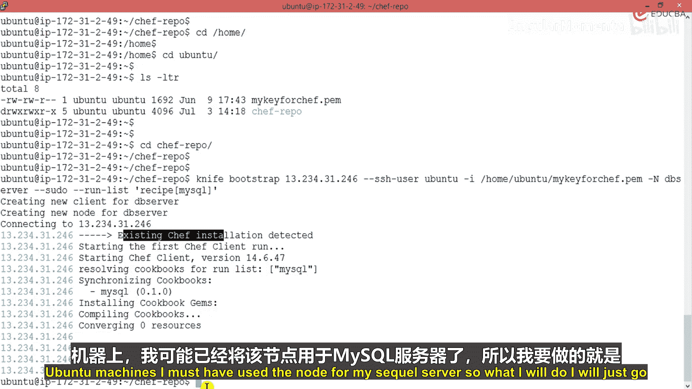
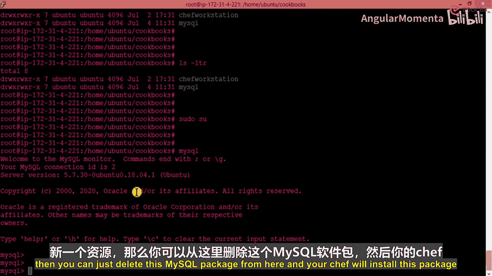
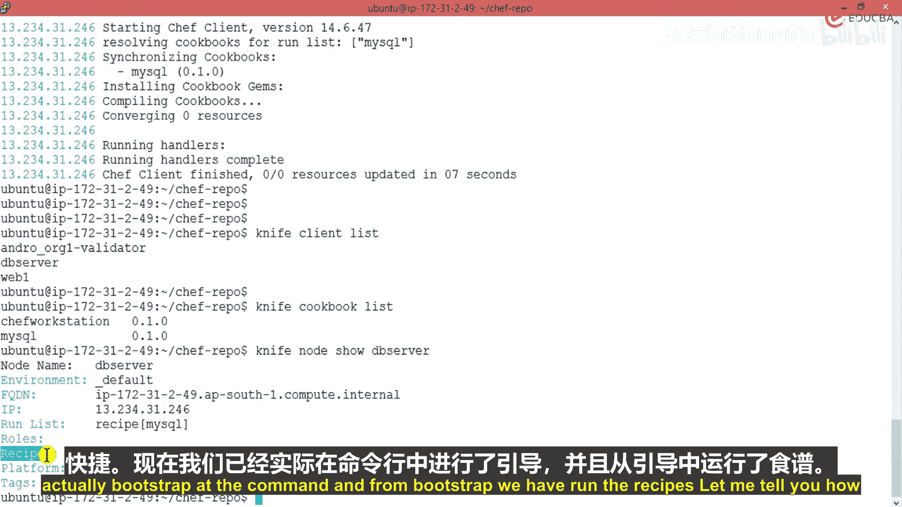
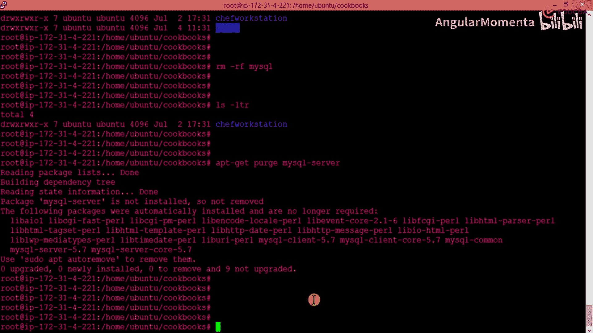
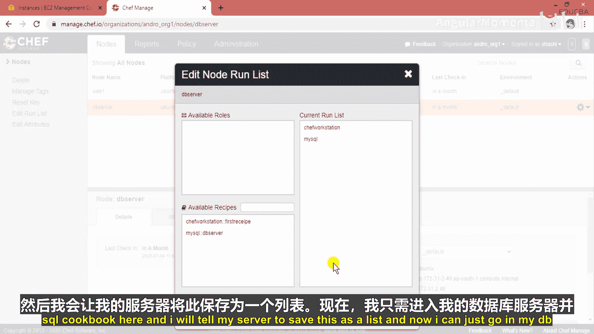
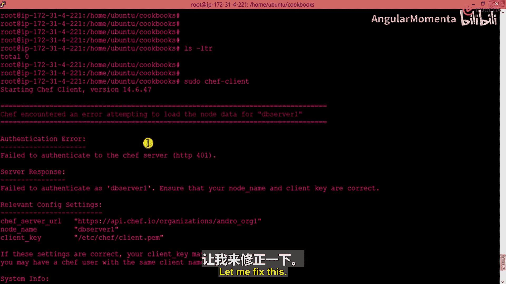

# 015：集中式Chef服务器 🚀

在本节中，我们将学习如何将编写好的Cookbook上传到Chef服务器，并通过服务器将配置应用到节点上。我们将涵盖上传Cookbook、引导节点、管理节点列表以及通过Web界面管理运行清单等核心操作。

---

上一节我们介绍了如何编写Cookbook。本节中，我们来看看如何通过Chef服务器集中管理并应用这些Cookbook。

首先，我们需要将本地的Cookbook上传到Chef服务器。命令非常简单，使用 `knife upload` 即可。

以下是上传名为 `mysql` 的Cookbook的命令：
```bash
knife upload cookbook mysql
```
此命令会将 `mysql` Cookbook上传至服务器。之后创建新节点时，就无需手动复制Cookbook，可以直接从服务器获取并运行。



上传完成后，我们需要引导一个节点（例如DB服务器）并将其加入Chef服务器的管理。引导命令会初始化节点并安装Chef客户端。



以下是引导节点的命令格式，需要指定节点的IP地址、SSH用户和密钥：
```bash
knife bootstrap <NODE_IP_ADDRESS> --ssh-user <USERNAME> --sudo --identity-file <PATH_TO_PEM_FILE> --node-name <NODE_NAME> --run-list 'recipe[<COOKBOOK_NAME>]'
```
例如，引导一个名为 `db01` 的节点并运行 `mysql` Cookbook：
```bash
knife bootstrap 192.168.1.100 --ssh-user ubuntu --sudo --identity-file ~/.ssh/mykey.pem --node-name db01 --run-list 'recipe[mysql]'
```
命令执行后，Chef会连接到节点，检查并安装Chef客户端，同步Cookbook，并执行指定的配方单。

接下来，我们可以验证节点是否成功加入以及Cookbook的执行情况。

要查看所有已注册到Chef服务器的客户端节点，可以使用以下命令：
```bash
knife client list
```
此命令会列出所有关联的客户端，例如 `db01` 和 `web-server`。

要查看服务器上所有可用的Cookbook，可以使用：
```bash
knife cookbook list
```
此命令会显示例如 `workstation` 和 `mysql` 这两个Cookbook。



如果需要查看某个节点（如 `db01`）的详细信息，包括其IP地址和已分配的配方单，可以使用：
```bash
knife node show db01
```



除了命令行，我们还可以通过Chef服务器的Web管理界面来管理节点和运行清单。

登录Web界面后，在“Nodes”部分可以看到所有节点。点击一个节点（如 `db01`），然后选择“Edit Run List”。在这里，你可以通过图形化界面添加或删除该节点需要运行的Cookbook，例如添加 `workstation` 或 `mysql`。保存后，配置即会更新。

最后，在目标节点上，我们可以手动触发Chef客户端运行，以从服务器拉取最新的配置并应用。

在节点上执行以下命令：
```bash
sudo chef-client
```
该命令会联系Chef服务器，获取当前节点的运行清单，并执行所有指定的配方单，确保节点状态符合预期。



---



本节课中我们一起学习了Chef服务器的核心管理操作。我们掌握了如何将Cookbook上传至服务器、如何引导新节点、如何使用命令行和Web界面查看与管理节点及运行清单，最后还学会了在节点上手动运行Chef客户端以应用配置。通过这些步骤，你可以实现云基础设施配置的集中化与自动化管理。