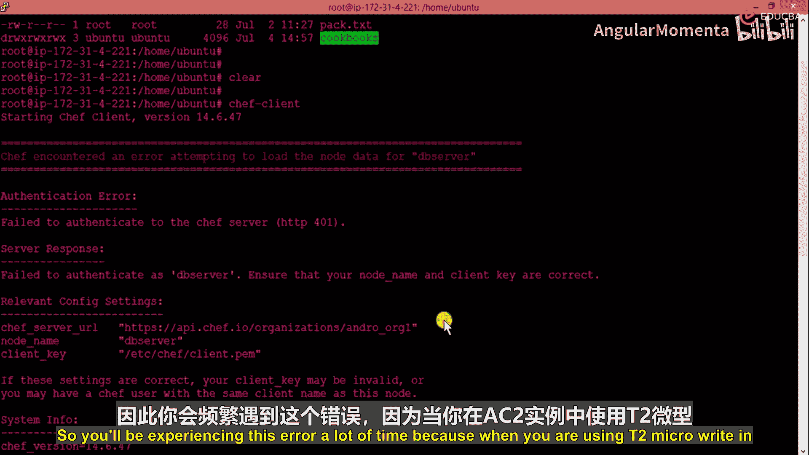
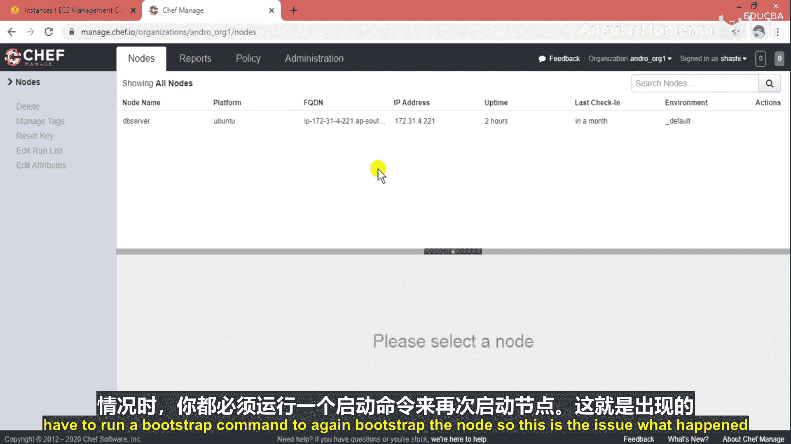
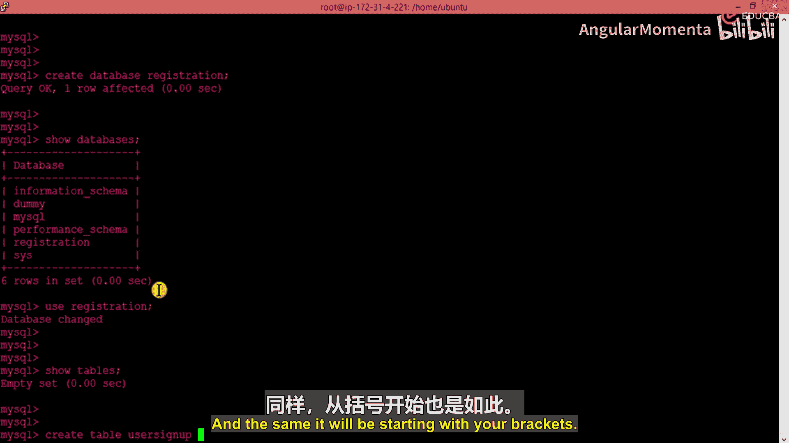
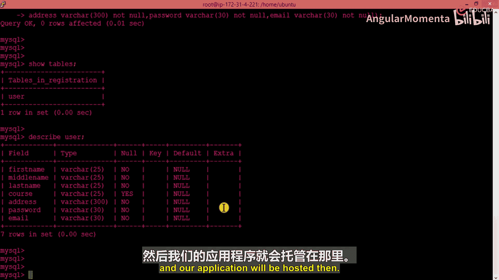

# 016：设置数据库

## 概述
在本节课程中，我们将学习如何解决Chef节点通信错误，并手动设置一个MySQL数据库。我们将创建一个用于“大学注册表单”的数据库和表结构，为后续部署Web应用做好准备。

## 解决节点通信错误
上一节我们介绍了Chef的基本配置，但在实际使用中，你可能会遇到节点通信问题。

以下是常见的错误场景：使用AWS EC2 T2 Micro实例时，如果服务器被关闭后重启，其IP地址会动态变化。这会导致之前通过引导（bootstrap）配置的节点（如Web服务器、数据库服务器）无法与Chef服务器正常通信。




每次发生IP地址变更时，你都需要重新运行引导命令来配置节点。解决此问题的方法是再次引导节点。




运行命令 `chef-client` 或重新执行引导命令后，通信问题通常可以得到解决。

## 手动设置MySQL数据库
既然我们已经解决了节点问题并安装了MySQL服务器，现在让我们进入MySQL并手动设置我们的数据库。

首先，登录到MySQL控制台。使用以下命令，其中 `-u` 指定用户，`-p` 表示需要密码。

```bash
mysql -u root -p
```

输入密码后，你将进入MySQL命令提示符界面。

## 查看与创建数据库
登录后，我们可以先查看当前已存在的数据库。

```sql
SHOW DATABASES;
```

系统会显示预安装的数据库，例如 `information_schema`, `mysql`, `performance_schema`, `sys`。

对于我们的案例——创建一个大学注册表单，我们需要一个专门的数据库来存储用户信息。以下是创建数据库的步骤：

1.  使用 `CREATE DATABASE` 语句。
2.  为数据库命名，例如 `registration`。

```sql
CREATE DATABASE registration;
```

执行后，再次使用 `SHOW DATABASES;` 命令，你将看到新创建的 `registration` 数据库。

## 使用数据库并创建表
数据库创建成功后，我们需要进入该数据库并创建存储数据的具体表格。

使用以下命令切换到 `registration` 数据库：

```sql
USE registration;
```

现在，我们位于目标数据库内。数据存储在表中，但目前还没有任何表。可以验证一下：

```sql
SHOW TABLES;
```

结果显示为空，表示没有表。接下来，我们创建一个名为 `user_signup` 的表，用于定义注册表单的字段结构。



以下是创建表的SQL语句。我们定义了多个字段，并规定它们不能为空（`NOT NULL`），以确保数据的完整性。

```sql
CREATE TABLE user_signup (
    first_name VARCHAR(25) NOT NULL,
    middle_name VARCHAR(25) NOT NULL,
    last_name VARCHAR(25) NOT NULL,
    course VARCHAR(30) NOT NULL,
    address VARCHAR(300) NOT NULL,
    email VARCHAR(45) NOT NULL,
    password VARCHAR(255) NOT NULL
);
```


执行上述命令后，表就创建成功了。

## 验证表结构
现在，让我们验证表是否已创建及其结构是否正确。

首先，查看当前数据库中的所有表：

```sql
SHOW TABLES;
```

你应该能看到 `user_signup` 表。接着，使用 `DESCRIBE` 命令查看表的详细结构：

```sql
DESCRIBE user_signup;
```


结果将显示我们定义的所有字段：`first_name`, `middle_name`, `last_name`, `course`, `address`, `email`, `password`，以及它们的类型（`VARCHAR`）和约束（`NOT NULL`）。

## 总结与后续步骤
本节课中，我们一起学习了两个关键操作。

首先，我们解决了因EC2实例IP动态变化导致的Chef节点通信错误，方法是重新引导节点。

其次，我们手动设置了一个MySQL数据库。我们创建了名为 `registration` 的数据库，并在其中定义了 `user_signup` 表，该表包含了注册表单所需的所有字段。




至此，我们的数据库已经准备就绪。接下来的任务是创建一个HTML表单文件（例如 `.html` 或 `.php` 文件），将其部署到Apache Web服务器上，并配置其与数据库的连接，最终完成整个应用的部署。