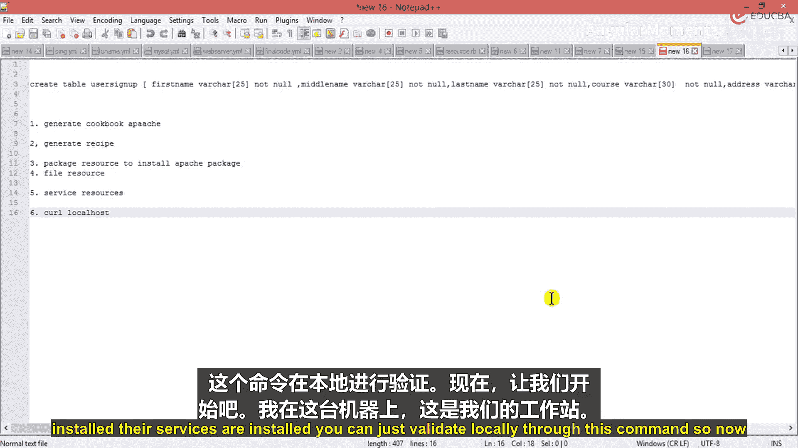
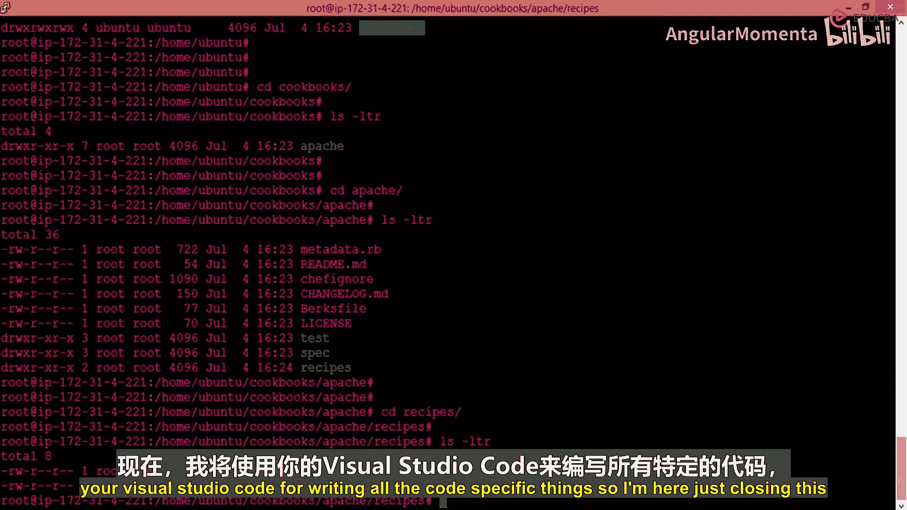
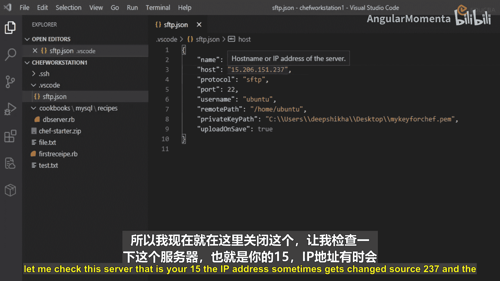
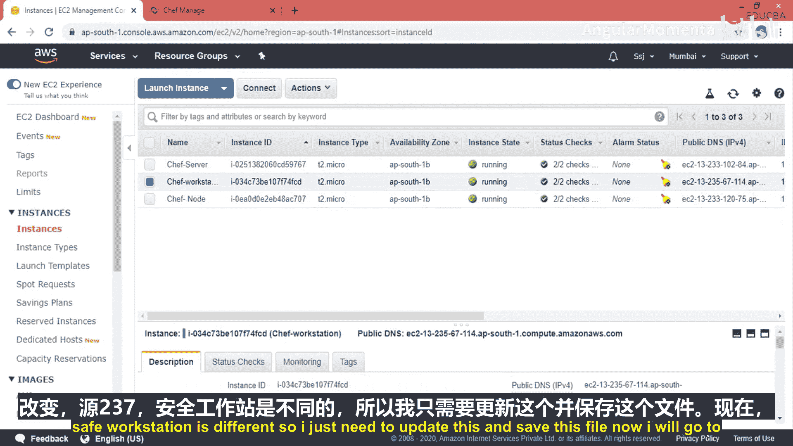
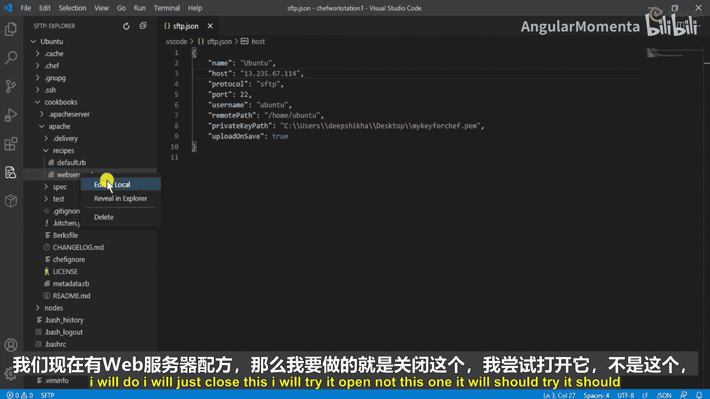

# 017：配置网络服务器 🖥️

在本节课中，我们将学习如何使用Chef自动化配置一个Apache网络服务器。我们将创建一个Cookbook，编写一个Recipe来安装Apache、配置网页文件并确保服务自动启动。

---

## 概述

我们将通过以下步骤创建一个Apache网络服务器：
1.  生成一个名为“Apache”的Cookbook。
2.  在该Cookbook中生成一个名为“web_server”的Recipe。
3.  在Recipe中编写代码，使用Chef资源来安装Apache软件包、配置默认网页并管理服务状态。
4.  配置默认Recipe以包含我们的`web_server` Recipe。
5.  在目标节点上运行Chef Client来应用配置，并通过`curl`命令验证结果。

---

## 生成Cookbook与Recipe

首先，我们需要在Chef工作站上生成一个Cookbook。Cookbook是Chef中配置管理的基本单元，它包含了所有的Recipes、属性、模板等。

以下是生成Cookbook的命令：

```bash
chef generate cookbook cookbooks/apache
```

这个命令会在`cookbooks`目录下创建一个名为`apache`的Cookbook，并生成其标准目录结构。

接下来，我们需要为这个Cookbook生成一个具体的Recipe。Recipe是包含一系列资源声明（如安装软件包、创建文件、启动服务）的Ruby文件。

以下是生成Recipe的命令：

```bash
chef generate recipe cookbooks/apache web_server
```

此命令在`cookbooks/apache/recipes/`目录下创建了一个名为`web_server.rb`的Recipe文件。

---

## 编辑Recipe文件

现在，我们将在`web_server.rb`文件中编写配置Apache服务器的逻辑。我们将使用三种主要的Chef资源：`package`、`file`和`service`。

### 1. 安装Apache软件包

首先，我们需要确保Apache软件包（在Ubuntu/Debian系统中名为`apache2`）被安装。我们使用`package`资源来实现。

```ruby
package 'apache2' do
  action :install
end
```

这段代码声明了一个`package`资源，其名称为`apache2`，并指定动作为安装(`:install`)。

### 2. 创建默认网页

仅仅安装Apache是不够的，我们还需要提供一个网页供其服务。我们将使用`file`资源在服务器的默认网站目录下创建一个`index.html`文件。

```ruby
file '/var/www/html/index.html' do
  content '<h1>Hello, World!</h1>'
  action :create
end
```

这段代码创建了一个文件，路径为`/var/www/html/index.html`，内容是一个简单的HTML标题，动作为创建(`:create`)。

### 3. 启动并启用Apache服务

最后，我们需要确保Apache服务正在运行，并且设置为开机自动启动。这通过`service`资源完成，我们可以使用一个数组来指定多个动作。

```ruby
service 'apache2' do
  action [:start, :enable]
end
```

这段代码管理名为`apache2`的服务。动作`[:start, :enable]`表示启动服务，并启用它在系统启动时自动运行。

---



## 配置默认Recipe

为了让Chef在运行Cookbook时自动执行我们的`web_server` Recipe，我们需要修改默认的Recipe文件`default.rb`。通常的做法是在其中包含（`include_recipe`）我们自定义的Recipe。

打开`cookbooks/apache/recipes/default.rb`文件，添加以下内容：

```ruby
include_recipe 'apache::web_server'
```

这行代码告诉Chef，当执行`apache` Cookbook的默认Recipe时，去执行`apache::web_server`这个Recipe。

---

## 应用配置与验证

所有代码编写完成后，我们需要将Cookbook上传到Chef Server，并在目标节点（我们的Web服务器）上运行`chef-client`来应用配置。

1.  **上传Cookbook**：在Chef工作站上执行 `knife cookbook upload apache`。
2.  **运行Chef-Client**：在目标节点上执行 `sudo chef-client`。

应用成功后，我们可以通过`curl`命令来验证Apache服务器是否正常工作。







```bash
curl http://localhost
```

如果配置正确，此命令将返回我们在`index.html`文件中编写的“Hello, World!”内容。

---

## 总结



本节课中，我们一起学习了如何使用Chef自动化配置Apache网络服务器。我们掌握了从生成Cookbook和Recipe，到使用`package`、`file`、`service`等核心资源编写配置代码的完整流程。关键步骤包括：安装软件包、部署网页文件、管理服务状态，以及通过默认Recipe组织执行顺序。最后，通过运行`chef-client`和应用`curl`验证，我们确保了自动化配置的成功执行。