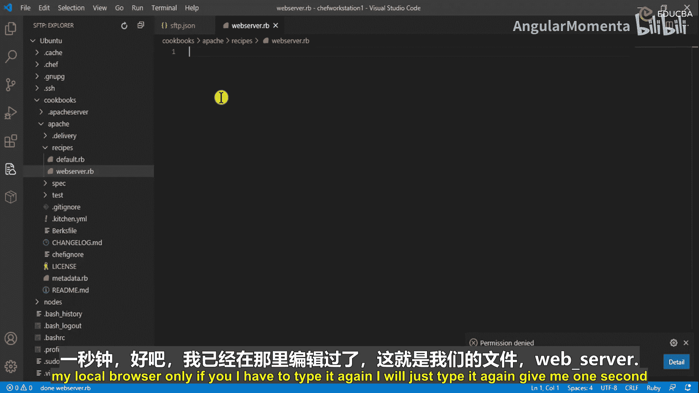
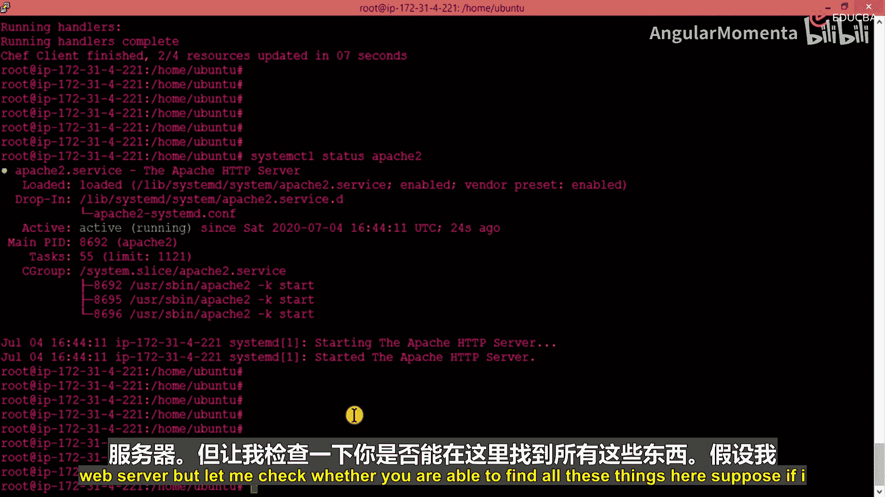
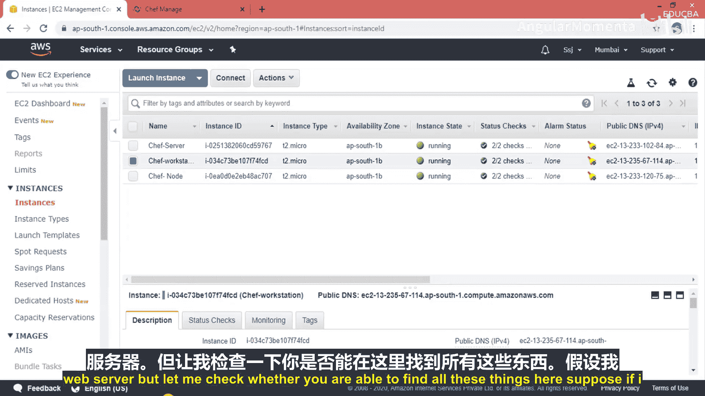
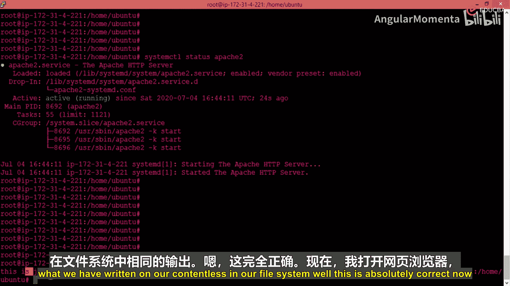
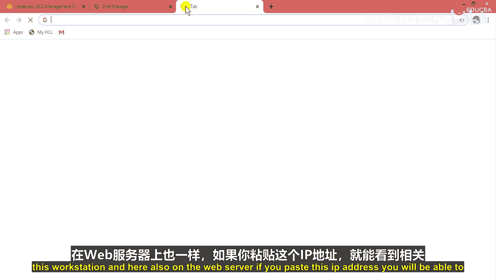
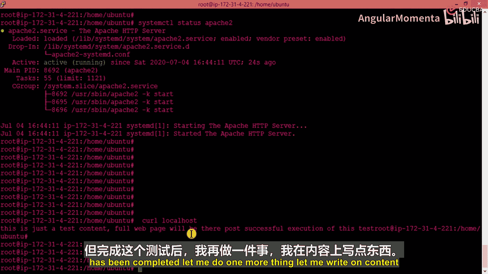

# 018：配置Web服务器（续）

在本节课中，我们将继续配置Web服务器。我们将学习如何在Chef配方单中定义资源，包括安装软件包、创建网页文件以及管理服务。通过实践，你将掌握编写一个完整Web服务器配方单的核心步骤。

上一节我们介绍了Chef配方单的基础结构，本节中我们来看看如何具体定义资源来配置一个Apache Web服务器。

## 创建软件包资源

首先，我们需要创建一个软件包资源来安装Apache2。软件包资源负责在目标节点上管理软件包的安装、升级或移除。

以下是定义软件包资源的代码：
```ruby
package 'apache2' do
  action :install
end
```
在这个资源块中，`package`是资源类型，`'apache2'`是资源名称。`action :install`指定了要执行的操作。即使省略`action`参数，Chef在运行时通常也会默认执行安装操作。

## 创建文件资源

接下来，我们需要创建一个文件资源。这个资源将在Web服务器的默认目录下生成一个HTML索引文件，用于测试。



以下是定义文件资源的代码：
```ruby
file '/var/www/html/index.html' do
  action :create
  content 'Hey, this is just a normal index file for testing. I will create web page post successful deployment.'
end
```
在这个资源块中，`file`是资源类型，`'/var/www/html/index.html'`是文件的目标路径。`action :create`指示Chef创建该文件。`content`参数定义了文件的具体内容。在实际生产环境中，更常见的做法是使用`source`参数来指定一个模板文件的位置，而不是直接将内容写在配方单里。

## 创建服务资源

最后，我们需要创建一个服务资源来管理Apache2服务。服务资源可以启动、停止、启用或禁用系统服务。

以下是定义服务资源的代码：
```ruby
service 'apache2' do
  action [:enable, :start]
end
```
在这个资源块中，`service`是资源类型，`'apache2'`是服务名称。`action`参数接收一个数组`[:enable, :start]`，这表示Chef将依次执行“启用服务”和“启动服务”两个操作。**重要提示**：一个资源块只能有一个`action`参数。如果需要多个操作，必须将它们放在同一个数组内，而不是为同一个资源定义多个`action`块。

至此，我们已经完成了Web服务器配方单的编写。它包含了安装Apache2、创建测试网页以及确保服务开机启动并立即运行的全部逻辑。

## 整合配方单

现在，我们需要在主配方单（例如 `default.rb`）中引用刚刚编写的Web服务器配方单，这样Chef在运行时才会执行它。

以下是引用其他配方单的语法：
```ruby
include_recipe 'cookbook_name::recipe_name'
```
根据我们的配置，具体代码如下：
```ruby
include_recipe 'apache::webserver'
```
请确保拼写正确，任何错误都可能导致语法问题，需要重新修正。



## 测试配方单





配方单编写完成后，可以在本地工作站进行测试。虽然理想情况下应该通过Chef服务器部署到目标节点，但本地测试可以快速验证语法和基本逻辑。

可以使用以下命令在本地执行配方单：
```bash
chef-client --local-mode --runlist 'recipe[apache::webserver]'
```
如果运行成功，你将看到Chef客户端执行了一系列操作。可以通过以下命令验证Apache2服务状态：
```bash
systemctl status apache2
```
如果服务显示为“enabled”和“active (running)”，则说明配方单运行成功。此外，可以测试我们创建的网页文件：
```bash
curl localhost
```
这条命令应该会输出我们在文件资源中定义的HTML内容。你也可以在浏览器中输入工作站的IP地址来查看这个测试页面。





本节课中我们一起学习了如何编写一个完整的Chef配方单来配置Web服务器。我们定义了三个核心资源：**package** 用于安装软件，**file** 用于创建配置文件，以及 **service** 用于管理系统服务。我们还学习了如何通过 `include_recipe` 整合配方单，并初步尝试了在本地运行测试。在后续课程中，我们将学习如何将编写好的Cookbook上传到Chef服务器，并通过引导（bootstrap）流程将其部署到目标云服务器节点上。