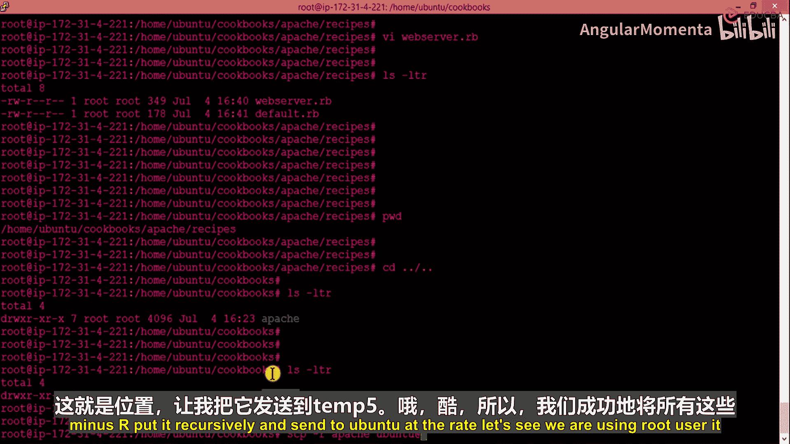
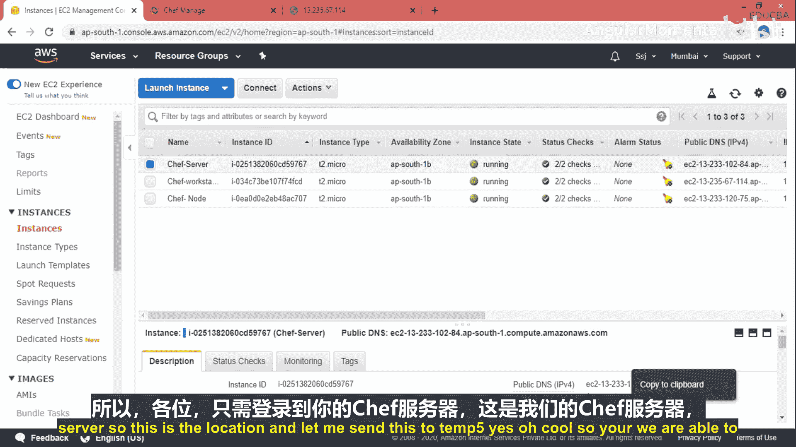
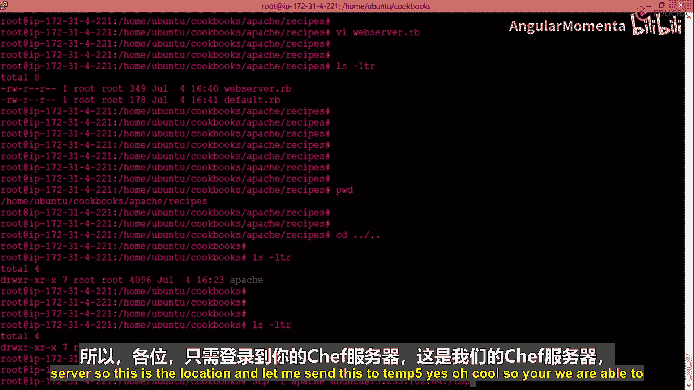
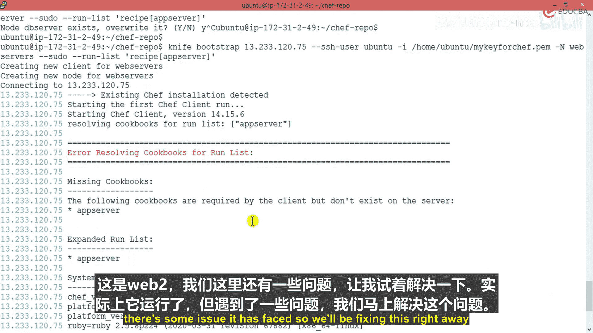

# 019：配置网络服务器的进阶内容

在本节中，我们将学习如何将包含网站内容的Cookbook上传到Chef服务器，并将其应用到目标节点（Web服务器）上。我们将涵盖文件传输、Cookbook上传以及节点引导（Bootstrap）等关键步骤。

上一节我们介绍了如何编写基础的Cookbook来配置Apache服务器。本节中，我们来看看如何将包含实际网站内容的Cookbook部署到服务器上。

## 传输Cookbook文件



首先，我们需要将编写好的Cookbook从工作站传输到Chef服务器。在我们的示例中，Cookbook名为`apache`，其中包含网站文件。





以下是传输Cookbook目录到Chef服务器临时目录的命令：

```bash
scp -r apache/ ubuntu@<chef-server-ip>:/tmp/
```

此命令使用`scp`（安全复制）将本地的`apache`目录递归地复制到Chef服务器的`/tmp`目录下。`-r`参数确保复制目录内的所有内容。

## 在Chef服务器上整理Cookbook

文件传输完成后，我们需要登录到Chef服务器，将文件移动到正确的Chef仓库位置。

1.  登录到Chef服务器。
2.  导航到临时目录，确认文件已成功复制。
3.  使用`cp -r`命令将`apache`目录复制到Chef仓库的Cookbooks目录中。

```bash
cp -r /tmp/apache/ /path/to/chef-repo/cookbooks/
```

**注意**：在单台机器内复制目录时，必须使用`-r`参数进行递归复制。跨机器复制（如`scp`）的语法类似，但需要指定主机、用户和密钥信息。

## 上传Cookbook到Chef Server

Cookbook放置到本地Chef仓库后，即可将其上传至Chef Server，供所有节点使用。

**关键点**：`knife`命令必须在Chef仓库的根目录下执行，因为它依赖于初始化时生成的配置文件。

以下是上传名为`app_server`的Cookbook的命令：

```bash
knife cookbook upload app_server
```

此命令会将Cookbook及其所有文件上传到Chef Server。如果上传成功，你将在Chef管理界面或通过其他`knife`命令看到这个Cookbook。

## 引导（Bootstrap）Web服务器节点

最后一步是将这个Cookbook应用到目标Web服务器节点上。我们使用`knife bootstrap`命令来完成，该命令会在目标节点安装Chef客户端并将其注册到Chef Server，同时指定初始的运行列表（Run List）。

以下是引导节点的命令示例：

```bash
knife bootstrap <web-server-ip> -x ubuntu -i ~/.ssh/chef.pem -N web2 --sudo --run-list 'recipe[app_server]'
```

命令参数解析：
*   `<web-server-ip>`： 目标Web服务器的IP地址。
*   `-x ubuntu`： 指定用于SSH登录的用户名。
*   `-i ~/.ssh/chef.pem`： 指定SSH私钥文件的路径。
*   `-N web2`： 为节点在Chef Server中命名。
*   `--sudo`： 以sudo权限执行命令。
*   `--run-list 'recipe[app_server]'`： 指定节点首次运行时需要执行的食谱（Recipe）。

执行此命令后，Chef Server会指导目标节点完成Chef客户端的安装和配置，并立即运行`app_server`这个Cookbook，从而完成Web服务器的自动化配置。

**注意**：引导命令较长，需确保所有参数（如用户名、密钥路径、Cookbook名称）都正确无误，否则可能导致失败。如果遇到权限或连接问题，需要根据错误信息进行排查。



本节课中我们一起学习了将Cookbook部署到生产环境的完整流程：从工作站传输文件到Chef服务器，在服务器端整理Cookbook结构，使用`knife upload`命令上传Cookbook，最后通过`knife bootstrap`命令将Cookbook应用到新的节点上。这个过程是使用Chef进行自动化配置的核心环节。