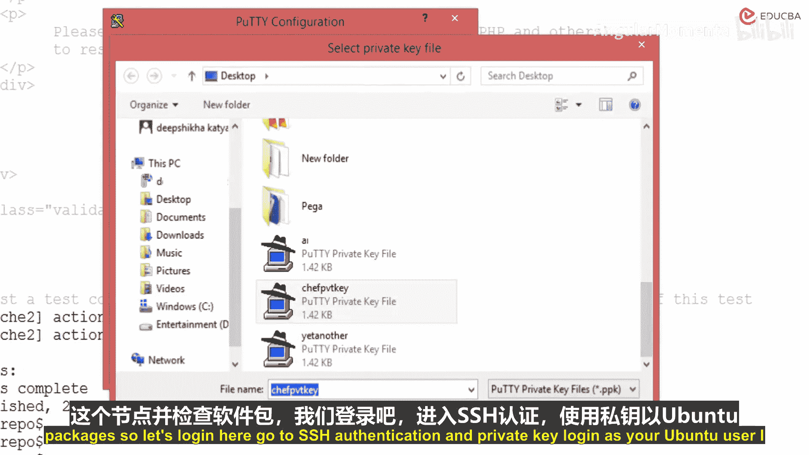
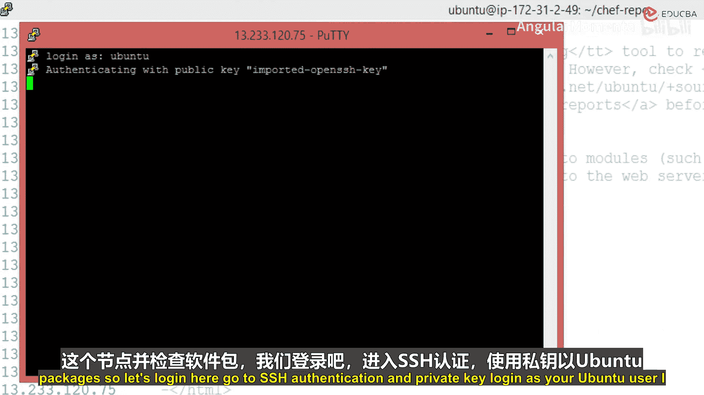
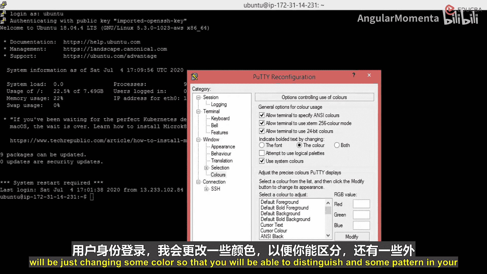
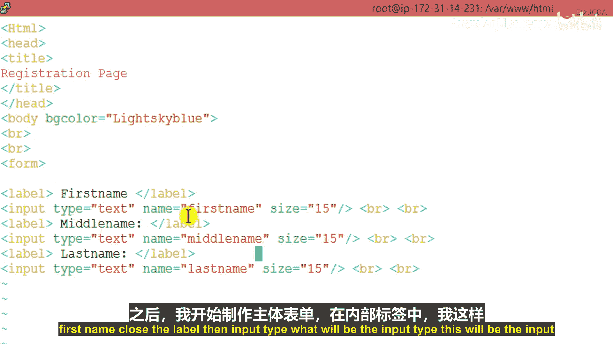

# 020：部署与验证

在本节课中，我们将学习如何解决Chef部署过程中遇到的常见问题，并完成一个Web服务器的自动化部署与验证。我们将通过一个具体的例子，展示如何修复cookbook名称不匹配导致的错误，执行部署命令，并最终验证部署结果。

## 部署问题与修复

上一节我们介绍了Chef的基本部署流程，本节中我们来看看在实际操作中可能遇到的问题及其解决方法。

在部署过程中，我们遇到了一个错误。问题恰好出在服务器应用上。我们曾将文件移动过位置。我们将一个服务器应用移动到了应用服务器目录。当时我们认为服务器上可能存在命名约定问题。但这个操作本身引发了一些相同的问题。

如果你查看这里的路径，会发现它指向了外部。但这就是当时存在的一个问题。我们已经修复了它。所以，主要错误是解析运行清单的cookbook时出错，原因是缺少cookbook。这是因为在我们编译这个cookbook时，名称是不同的。我们后来更改了它。你可以看到客户端在那里失败了。前置条件未满足。

为了修复这个问题，我执行了以下操作。我回到了cookbook所在的位置。然后我将其重命名回原始名称。它原本是`app_server`，但原始名称是`apache`。所以我将其移回`apache`目录。这样，无论何时编译，它都会以`apache`的名义进行编译。然后我再次使用了相同的命令。这次完全没有问题。

当你遇到类似问题时，需要进行一些隐藏的试错方法来发现并解决这些问题。命令本身没有问题。我再次以相同用户`ubuntu`的身份执行了相同的命令，并将PEM文件放在了正确的位置。这是文件名。然后创建了这个名为`web_server`的节点，其运行清单为`recipe[apache]`。之前使用的是`app_server`，所以出现了差异。现在它显示Web服务器节点已存在，因为第一次运行时它创建了节点，但未能成功执行或编译你的cookbook，所以当时失败了。

这里还有一个客户端的问题。记得吗，客户端会被安装，即Chef DK，它已经存在了，所以系统询问是否覆盖。我选择了是，覆盖它。覆盖之后，它为Web服务器创建了一个新的客户端。每次执行此操作时，你都会遇到选择：是，覆盖或否。如果你确定可以覆盖，就选择是，因为它总是会安装正确且最新的版本。

## 执行部署与收敛

然后它为Web服务器创建了一个新节点。接着，它联系我们在引导命令中指定的Web服务器地址。它到达了这个位置。现在，它正在安装你的cookbook。在从你的Chef服务器获取所有cookbook并安装之后，它开始收敛你的Chef服务器。这是你的`apache`配方单，这是你的Web服务器节点。

它有两个任务需要执行。第一个任务是下载Apache软件包。这就是我们需要安装的。如果你在这里看到绿色的消息，意味着你的软件包已成功下载。如果你发现任何红色的内容，则说明存在问题。这里有两个状态信息。第一个状态是下载文件，第二个是创建网页的HTML文件。你可以看到后台发生的所有事情。这些过程实际上是在后台进行的。

这是我们为网页定义的内容。这只是一个HTML页面。它刚刚完成，你可以在这里查看日志。

## 验证部署结果

现在，如果你打开你的服务器，你将能够在你的节点上找到已安装的Apache服务器。最后一条消息是我们写入的内容。这是一条成功消息，例如“service[apache2] action start (up to date)”。这是我们配方文件中定义的**服务资源**，而不是软件包资源。之后，我们将其设置为启用状态。因此，无论何时重启虚拟机，你的服务器都会自动启用。最后一条消息是：“Chef Client finished, 2/2 resources updated in 18 seconds”。这花费了18秒完成，并已上传到你的Chef客户端，我们将其命名为你的Web服务。

现在进行验证，我们将访问这个服务器。复制这个地址。然后粘贴到这里。这就是我们在HTML页面中定义的内容。这没问题。

接下来，我将登录到这个节点机器内部进行检查。

以下是登录和检查的步骤：

1.  使用SSH认证和私钥登录。
2.  以`ubuntu`用户身份登录。
3.  我将更改一些颜色设置以便于区分。
4.  调整终端外观以增加辨识度。
5.  使用`systemctl status apache2`命令检查Apache是否已安装并运行。
6.  确认服务状态为“active (running)”。
7.  我们之前提供的内容是“dummy content”。现在我们需要更改这个内容。
8.  进入`/var/www/html`目录。
9.  编辑`index.html`文件。当前该文件是只读的。
10. 首先切换到root用户：`sudo su`。
11. 现在可以登录并修复这个问题。
12. 删除文件中的所有现有内容。
13. 开始编写注册表单所需的所有HTML标签，如`<body>`和标题。
14. 表单需要的字段包括：用户名（或名字）、中间名、姓氏以及电子邮件地址。
15. 我将在这里打开HTML标签。
16. 然后添加`<body>`标签。在这个HTML文件中，我将整合所有CSS样式、字体大小、颜色等设置。
17. 这部分内容超出了本课程的范围，我将简要说明，因为编写整个HTML文件需要时间。我会在构建文件时定期解释我所做的工作。这里不需要深入的HTML知识，你只需要了解基本语法，知道需要编写哪些标题和列。我假设你正在观看视频，我会定期展示编写的内容。

例如，到目前为止，我已经初始化了HTML标签，然后在`<head>`里设置了标题“Registration Page”，并将背景颜色设置为浅天蓝色。你可以将其改为红色或其他颜色，但我觉得浅天蓝色便于书写和定制。之后，我开始了`<body>`和`<form>`标签，并在`<label>`标签内添加了“First Name”标签，然后关闭标签，再指定输入类型`<input type=`。

---

本节课中我们一起学习了如何诊断和修复Chef部署中的cookbook名称错误，使用`knife bootstrap`命令成功部署了一个Apache Web服务器节点，并通过登录节点验证了软件包的安装、服务的运行以及自定义网页内容的部署。关键在于确保cookbook名称的一致性，并理解部署命令的输出信息以进行问题排查。