# 021：Apache Web服务器部署与自动化

在本节课中，我们将学习如何使用Chef自动化部署一个Apache Web服务器，并创建一个简单的学生注册表单页面。我们将涵盖从编写HTML文件到通过Chef服务器管理多节点部署的完整流程。

---

## 编辑HTML文件

上一节我们配置了基础环境，本节中我们来看看如何创建Web应用的内容。

我编辑了一个HTML文件，其中包含一个课程注册表单。这个表单根据用户选择的工程学科（如机械工程、计算机科学、信息科学、化学工程、电子通信工程等）提供不同的选项。

以下是表单包含的主要字段：
*   **姓名**：分为名、中间名和姓。
*   **课程选择**：下拉菜单，包含多种工程学科选项。
*   **性别**：通过单选按钮选择男性或女性。
*   **国家代码与电话号码**：用于输入联系方式。
*   **地址**：文本输入框。
*   **邮箱与密码**：用于注册和登录的凭证字段。

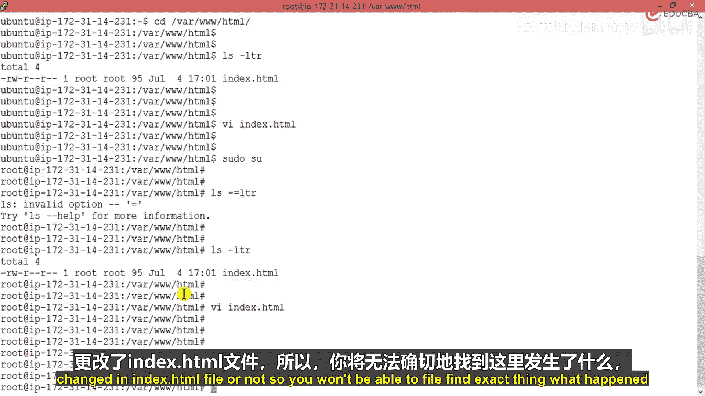

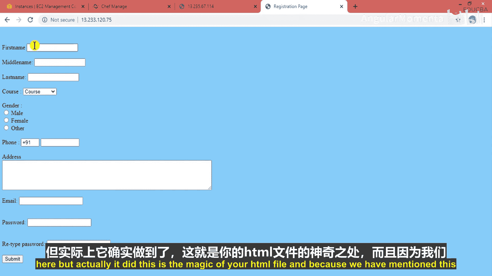

这个HTML文件已经完成，应该没有问题。现在保存文件。

---

## 运行与测试HTML文件

文件已保存，接下来我们运行它。但请注意，Web服务器可能尚未感知到`index.html`文件的变更。

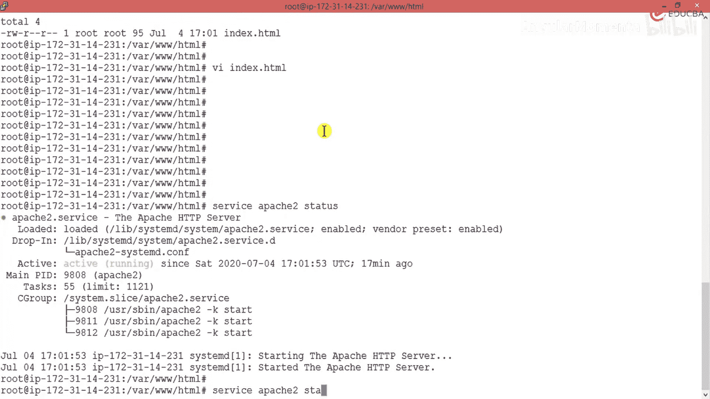

最初刷新页面时，可能看不到变化。这是因为我们需要触发服务器重新加载配置。由于我们在Apache配置中设置了`start`和`enable`参数，服务器会定期检查更新。一旦`index.html`文件发生变更，服务器将获取最新版本。

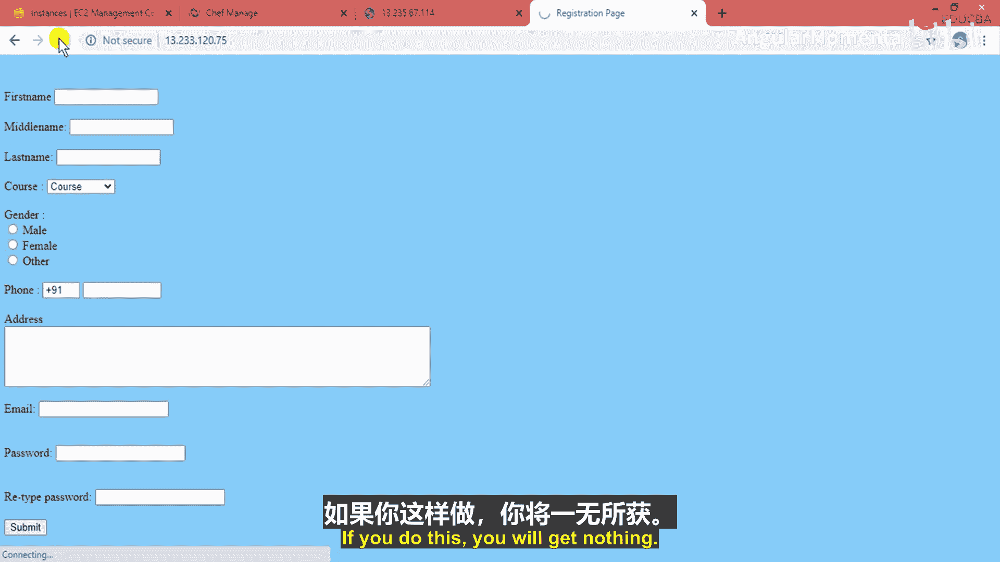

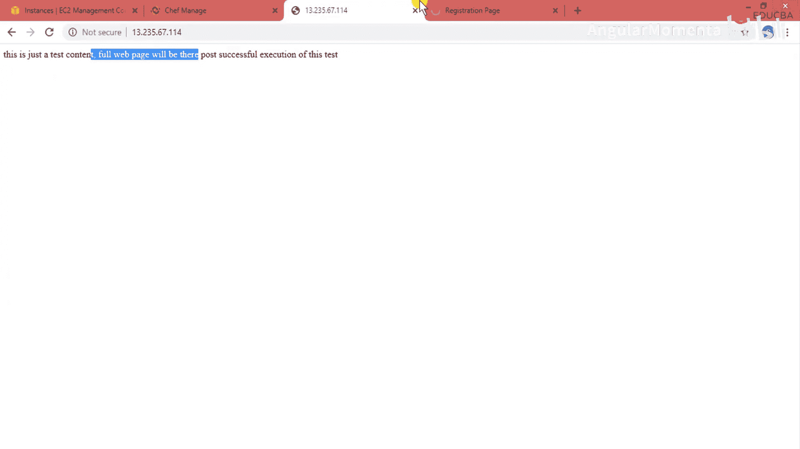

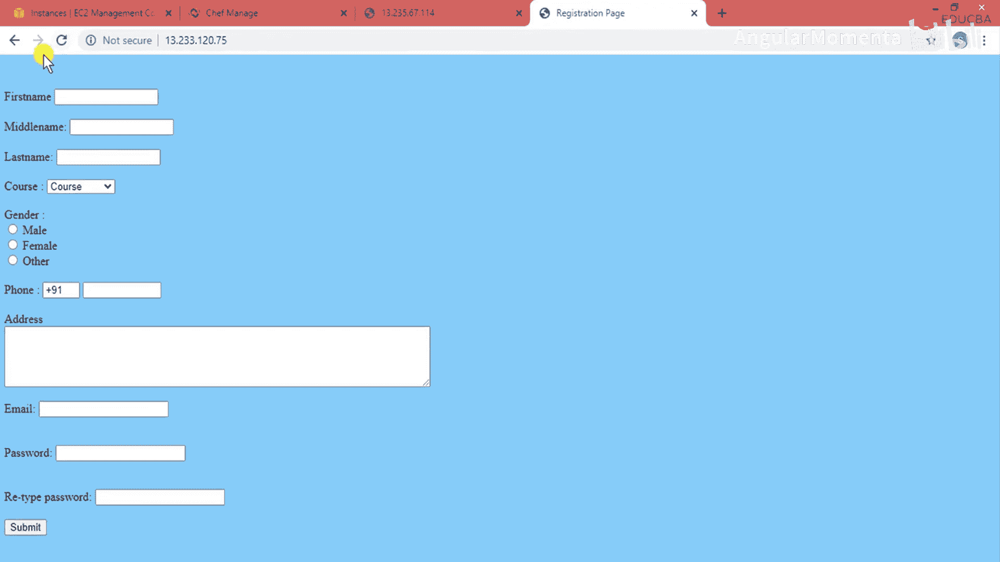

再次刷新页面后，注册表单成功显示。

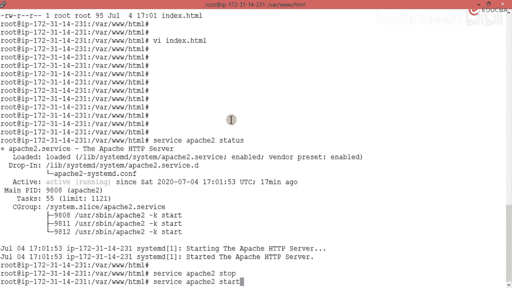

---

## 处理服务状态问题

有时，页面可能无法加载，这通常是因为Web服务器服务状态异常。以下是排查步骤：

首先，检查Apache服务的状态，它应始终处于运行状态。
```bash
systemctl status httpd
```

如果发现服务已停止，页面将无法访问并显示空白或错误信息。此时，需要重新启动服务。
```bash
systemctl start httpd
```

服务启动后，它将自动获取最新的HTML文件。刷新浏览器，表单和所有预设的样式、字段都会正常显示。

---

## 表单功能总结

至此，我们完成了注册页面的基础功能。当学生进行在线注册时，他们将看到此页面。页面背景设为天蓝色，当然颜色可以调整。

学生需要完成以下步骤：
1.  填写姓名。
2.  选择要攻读的课程。
3.  选择性别。
4.  提供电话号码和地址。
5.  设置邮箱和密码以接收学院提供的学习资料。

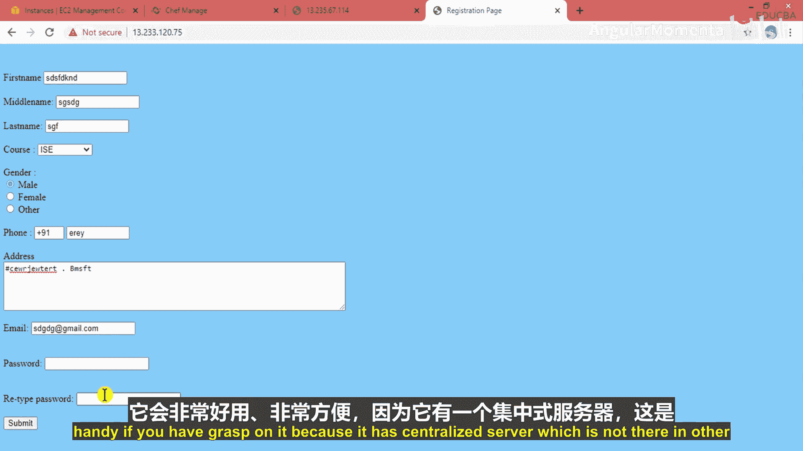

点击提交按钮后，流程将转向支付页面。完成课程费用支付后，学生即可使用凭证登录，访问学院提供的所有学习内容。

---

## Chef自动化架构的优势

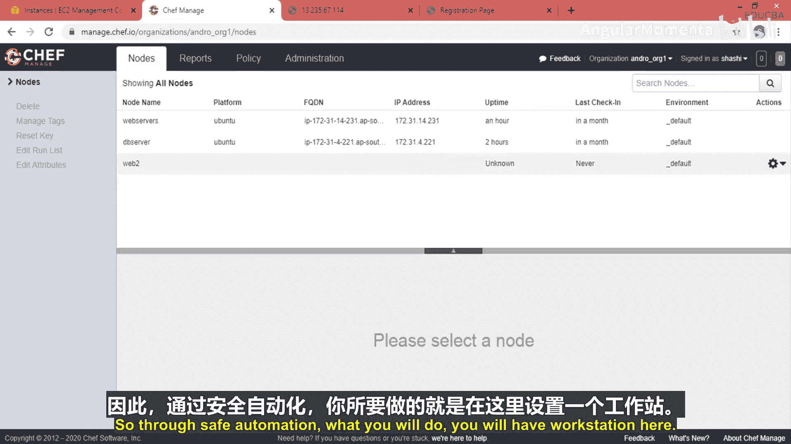

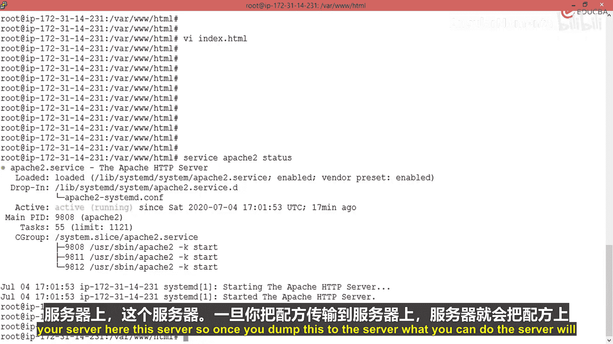

通过这个案例，我们借助Chef自动化完成了整个设置。我们所做的只是：
1.  创建Web服务器。
2.  安装数据库服务器（此案例中未深入，但流程类似）。
3.  编写HTML文件。

Chef的强大之处在于管理多节点部署。与Ansible或Puppet相比，Chef拥有一个中心化服务器，这对于管理大量机器非常高效。

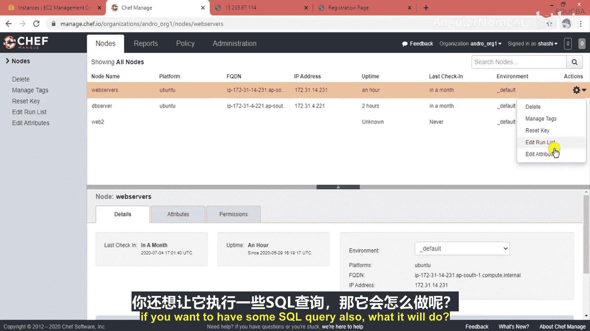

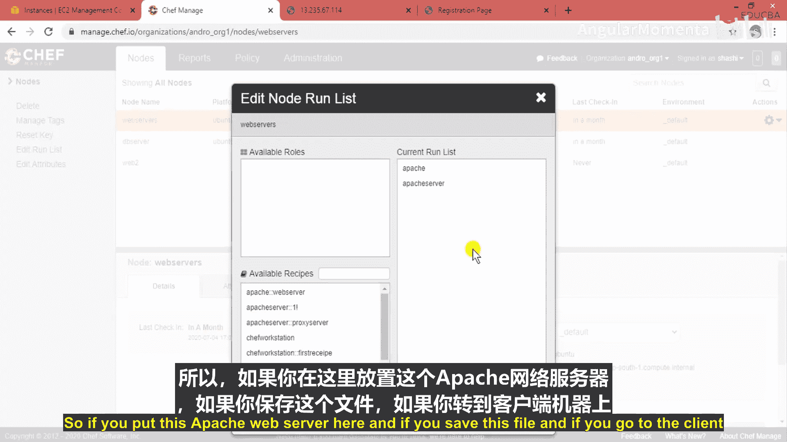

假设组织中有上百甚至上千台节点需要部署此应用。你无需登录每台机器手动操作。Chef的工作流程如下：
1.  在**工作站**上创建所有配方和文件。
2.  使用`knife`命令将配方上传到**Chef服务器**。
3.  在Chef服务器上，为特定节点（如Web服务器）编辑`run-list`，添加需要运行的食谱（例如Apache食谱）。
4.  在客户端节点上，以root权限执行`chef-client`命令。
5.  Chef客户端将自动从服务器拉取配方并执行，完成所有安装和配置。

这个过程非常简便、高效。关键在于理解其层次结构、架构和流程。熟练掌握`knife`命令行工具至关重要，因为它可以用于管理节点、查看结构、以及从市场上下载食谱等。

---

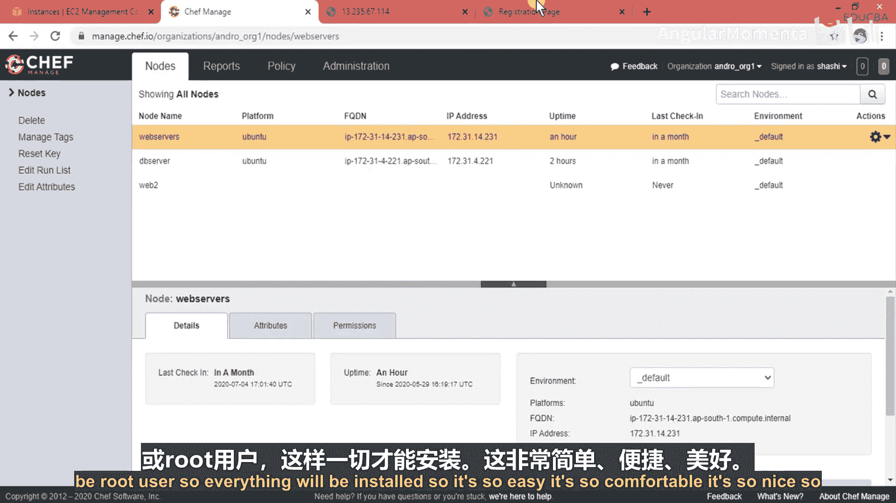

## 本节课总结

本节课中，我们一起学习了：
1.  如何创建并部署一个包含学生注册表单的HTML页面。
2.  如何管理Apache Web服务器的服务状态以确保应用可访问。
3.  深入了解了Chef自动化架构的核心价值，即通过中心化服务器和`run-list`管理，实现一键式、批量化的应用部署到多个节点。
4.  通过实际案例，看到了Chef如何将复杂的部署流程简化为简单的配方管理和命令执行。

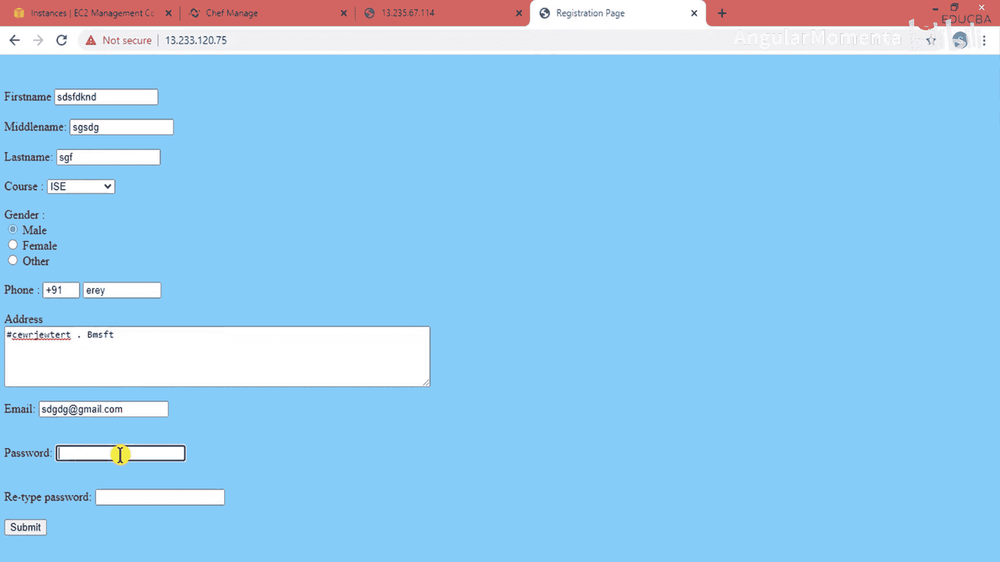

我们成功实现了预期的输出，并验证了Chef在云基础设施自动化中的高效性。