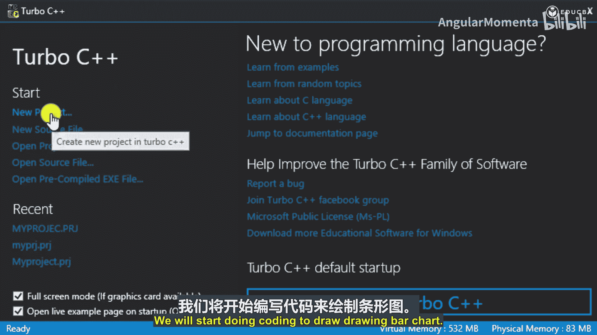
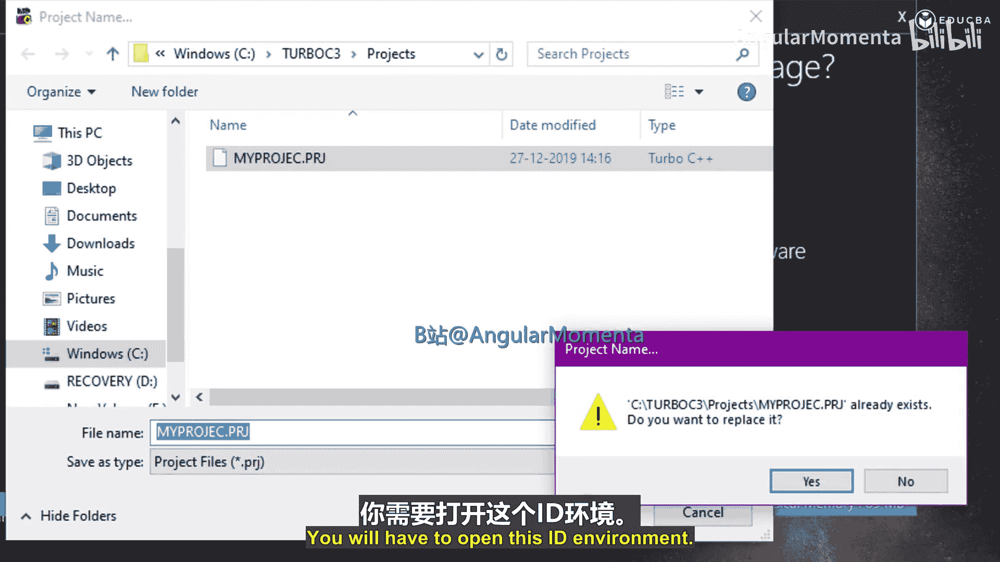
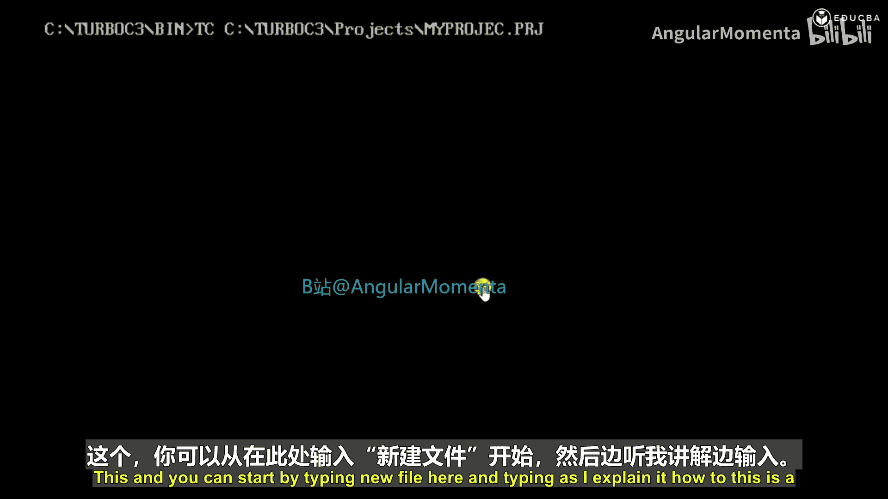
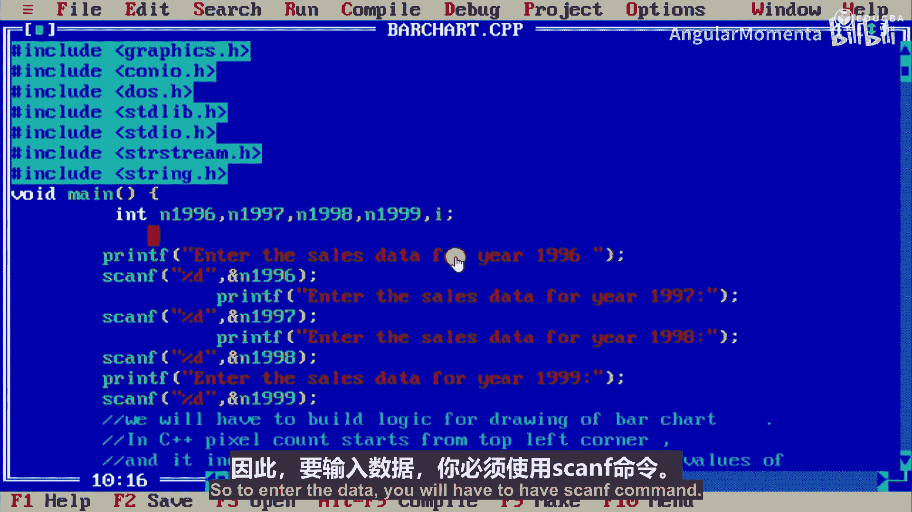
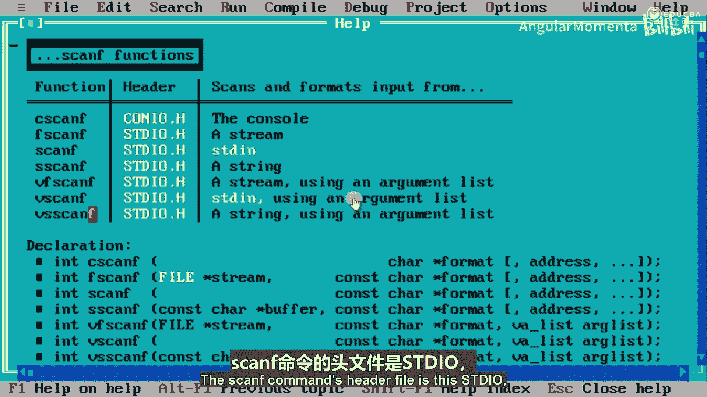
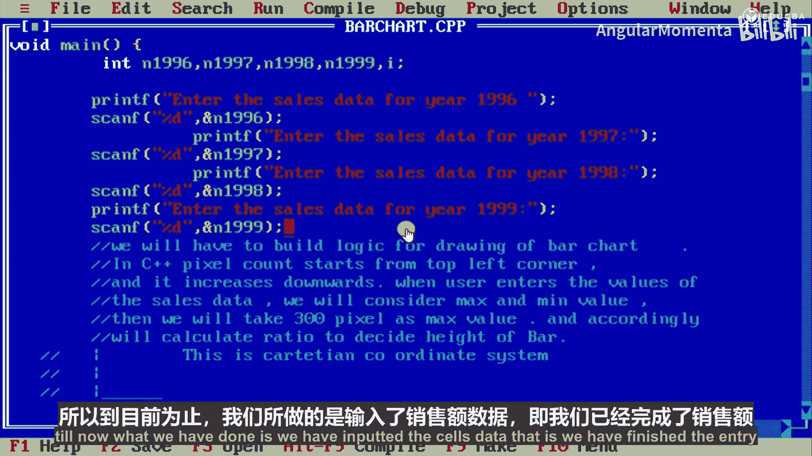

# 001：使用图形编程在C++中创建销售图表 📊

在本节课中，我们将学习一个非常有趣的主题：如何在C++中绘制图表，包括条形图、饼图和折线图。

实际上，C++并非面向应用的语言，它是一种中级语言。但你可以通过使用图形命令在C++中绘制折线图、条形图和饼图。我们将要开发与销售管理相关的图表，其难度级别为中级。

## 项目概述

要完成这个项目，你必须具备以下技能：你必须具备C++命令的基础知识，即C++的基本语法；然后是C++图形命令。C++中的图形命令与基本语法级别的命令不同，你需要了解像素在屏幕上的排列方式。屏幕由许多小像素点组成，这些像素点会被颜色点亮。了解单个像素在屏幕上的排列方式，以及这对绘制条形图等图表有何帮助，是非常重要的。

你还应该具备销售的基本知识，因为我们将要创建对销售部分有帮助的图表。此外，坐标系的知识也是必需的，即基本的坐标系：X轴和Y轴，以及像素在此坐标系中的排列方式。

## 项目目标

项目目标是：参与者必须能够在大学级别或行业级别的项目中实现高级C++概念。然后，绘制条形图、饼图和折线图。学习如何在C++中输入数据，即输入命令和数据输入，并使用笛卡尔坐标系绘制图表。

## 你将学到什么

从这个项目中，你将学到如何在C++图形编程中使用笛卡尔坐标系。我之前提到过，笛卡尔坐标系描述了像素的排列方式，通常是X轴和Y轴，以及我们如何利用它来绘制图表。我们将用简单的C++语言进行实际编码。此外，你还将了解销售管理中使用的不同图表类型，并学习构建绘制条形图、饼图和折线图的逻辑。

## 先决条件

先决条件是：你应该具备C++的基础知识、销售管理的基础知识以及笛卡尔坐标系的知识。

## 目标学生

目标学生是：具备C++基础知识的学生、正在学习C++的学生以及C++图形开发者。

## 你将获得的技能

完成这个项目后，你将拥有以下技能：开发条形图、饼图和折线图逻辑的实时经验；学习如何在C++程序中输入数据；能够使用C++图形命令；能够构建在C++中绘制条形图、饼图和折线图的逻辑；并能够绘制这些图表。此外，你还能获得销售管理中使用的不同图表的知识。

考虑一个销售管理系统。在公司里，公司希望提升其销售额。因此，公司需要绘制去年、今年以及前几年的对比图表。在公司仪表板上，对比分析总是必需的，这样高层管理人员可以非常容易地看到他们的销售情况是上升还是下降。因此，这些图表在销售管理系统中非常重要，可以用条形图、饼图或折线图的格式来表示。

我们将以此为例。作为案例研究的一部分，将涵盖以下场景：我已经告诉过你，数据输入屏幕用于输入销售数据，选择图表类型后，将显示条形图、饼图或折线图的屏幕，三种图表类型将显示三个屏幕。

## 开始编码

我们将开始编码来绘制条形图。你需要有Turbo C++的IDE，或者你也可以使用Visual C++。我使用的是Turbo C++。你需要打开这个IDE环境。

你可以从这里开始，点击“新建文件”，然后按照我的解释输入代码。这是一个我已经写好的程序，我将逐步向你解释，你可以同时在你的空白文件中编写，并直接使用这个程序。

首先，你需要添加C++的内置库。C++会提供这些库，以便你可以直接使用。这些命令写在头文件中。如果你在这里查看，这些是`printf`命令的帮助文件。我使用了`printf`，所以需要包含这些头文件。

以下是使用的头文件：`graphics.h`、`conio.h`、`dos.h`、`stdio.h`、`stdlib.h`、`string.h` 和 `stream.h`。这是使用的语法：`#include` 后跟你的头文件，你可以这样输入和使用它。然后是 `void main()`，花括号打开，圆括号打开和关闭，然后花括号打开。这是C++的主要语法。

这里我使用的变量是：`N1996`、`N1997`、`N1998` 和 `N1999`，以及变量 `i`。我将这些用作整型变量。我们将输入这些数据，即前几年（1996、1997、1998、1999）的销售数据。

要输入数据，你需要使用 `scanf` 命令。`scanf` 命令的头文件是 `stdio.h`，我们已经包含了这个文件。

`printf` 命令，我们将写入“输入1996年的销售数据”，然后使用 `scanf`。`%d` 是语法，`d` 用于输入整数；如果是字符串，则需要使用 `%s`。这是一个数字，所以我使用了这个语法。`scanf` 的语法是：圆括号打开，引号内是 `%d`，引号关闭，逗号，然后是变量 `&N1996`，圆括号关闭，分号。这是 `scanf` 的语法。

`printf` 的语法是：圆括号打开，然后是字符串，圆括号关闭，分号。这是 `printf` 的语法。请记住，这是整个程序中我们将使用的语法。

所以，`printf` 输入1996年的销售数据，`scanf` 使用 `%d` 和 `&N1996`。然后，输入1997年的数据，语法与之前类似。我们在这里使用了它。然后 `scanf`，圆括号打开，`%d`，然后我们将输入第二年的数据，即1997年的数据。`&` 符号是语法，这是一个变量，这是 `&` 符号和输入 `N1996` 的语法。

这里我们所做的是输入了 `N1997` 年的数据。然后 `printf`，语法与之前类似。`printf` 输入1998年的销售数据。然后，`scanf`。然后是第三个变量，1998年的变量。`scanf` 使用 `%d`，然后输入1998年的变量。然后，`printf` 输入1999年的销售数据。并使用 `scanf` 输入1999年的数据。

现在，我们所做的是输入了销售数据。如果你以某个公司为例，该公司四年的总销售额，我们将在同一图表上进行比较，这样管理层可以非常容易地检查销售额是下降还是上升。

到目前为止，我们所做的是输入了销售数据，即我们已经完成了销售数据的输入。

## 总结

本节课中，我们一起学习了在C++中使用图形编程创建销售图表的基础知识。我们了解了项目的目标、所需的先决条件以及你将获得的技能。我们还开始了实际的编码过程，学习了如何输入销售数据，并理解了基本的C++语法和图形命令。在接下来的课程中，我们将继续构建图表的绘制逻辑并完成图表的显示。