# 002：绘制条形图（第二部分）

在本节课中，我们将学习如何在C++图形模式下绘制条形图。我们将从理解屏幕像素坐标系统开始，然后初始化图形模式，最后使用图形库函数绘制坐标轴和条形图。

## 概述：像素坐标与图形模式

上一节我们介绍了如何获取销售数据。本节中，我们来看看如何在屏幕上绘制条形图。首先需要理解C++图形编程中的像素坐标系统。

这是一个完整的屏幕。像素计数从左上角的 `(0, 0)` 开始。坐标向下和向右递增。例如，从 `(0,0)` 到 `(1,0)`，`(2,0)` 等等。当用户输入销售数据时，我们会找出最大值和最小值。然后，我们可以设定一个像素值（例如300或100）作为最大值，并据此计算比例来决定条形的高度。或者，也可以直接根据数据在屏幕上绘制。

像素是屏幕上微小的点。通过图形命令用不同颜色高亮这些点，就能形成图像。在图形模式下操作，需要关注像素的排列方式和构建绘图逻辑。

## 初始化图形模式

目前我们处于文本模式。在文本模式下，输入字符会显示在屏幕上。但图形模式不同，它工作在像素级别，无法直接输入文本字符。为了进入图形模式，需要使用专门的图形命令。

以下是初始化图形模式所需的函数和变量。

首先，使用 `initgraph` 函数来初始化图形模式。该函数会自动检测计算机使用的图形驱动程序和桌面模式，并据此初始化。

我们需要先声明一些变量。变量名可以自定义，例如我使用了 `gd`（图形驱动器）、`gm`（图形模式）和 `errorcode`（错误代码）。这些变量的意义稍后会解释。

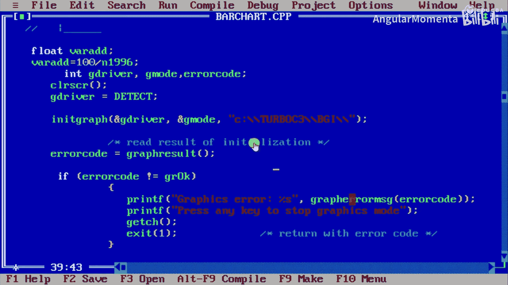

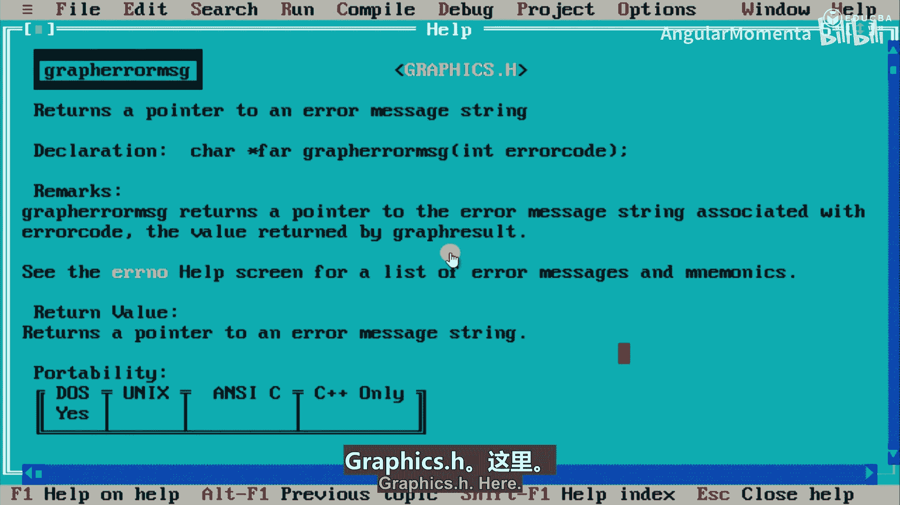

`cleardevice()` 命令用于清除屏幕。
`DETECT` 是C++中的保留字，用于自动检测图形驱动器。
`initgraph(&gd, &gm, “C:\\turboc3\\BGI”);` 用于初始化图形。这里的路径指向存储 `BGI` 驱动文件（如 `EGAVGA.BGI`）的目录。注意，路径中使用双反斜杠 `\\`，因为单反斜杠在C++中会被解释为转义字符，导致错误。

`grapresult()` 函数用于获取图形初始化的结果。
`errorcode` 变量用于存储可能出现的错误代码。语法是：`errorcode = graphresult();`。

如果存在错误（`errorcode != grOk`），则使用 `printf(“Graphics error: %s\n”, grapherrormsg(errorcode));` 来打印错误信息。`grapherrormsg` 函数能从错误代码中提取对应的错误信息。

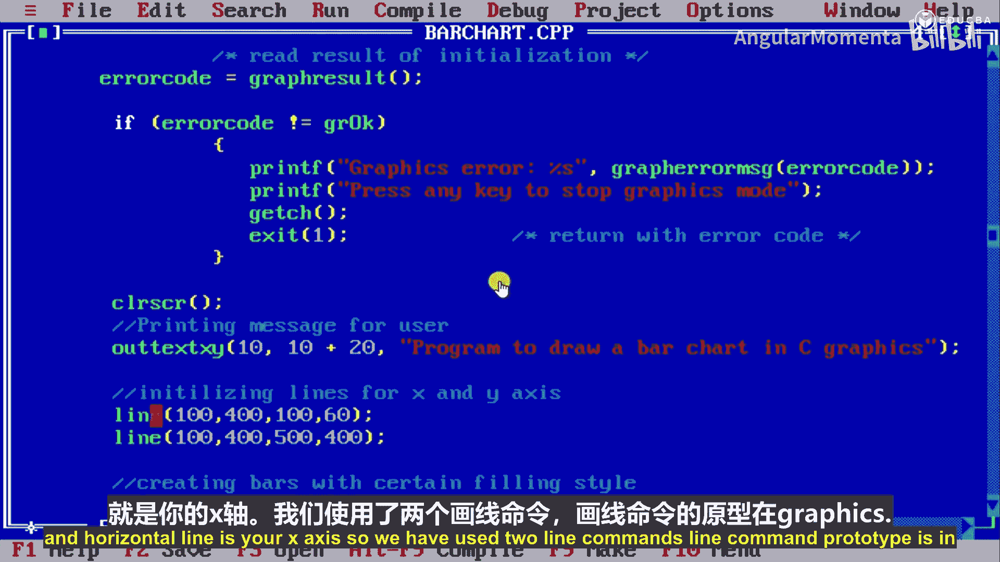

初始化图形模式后，使用 `cleardevice()` 清屏，并为用户打印提示信息：`outtextxy(10, 10, “Program to draw a bar chart in C graphics”);`。执行 `initgraph` 后，程序就进入了图形模式。

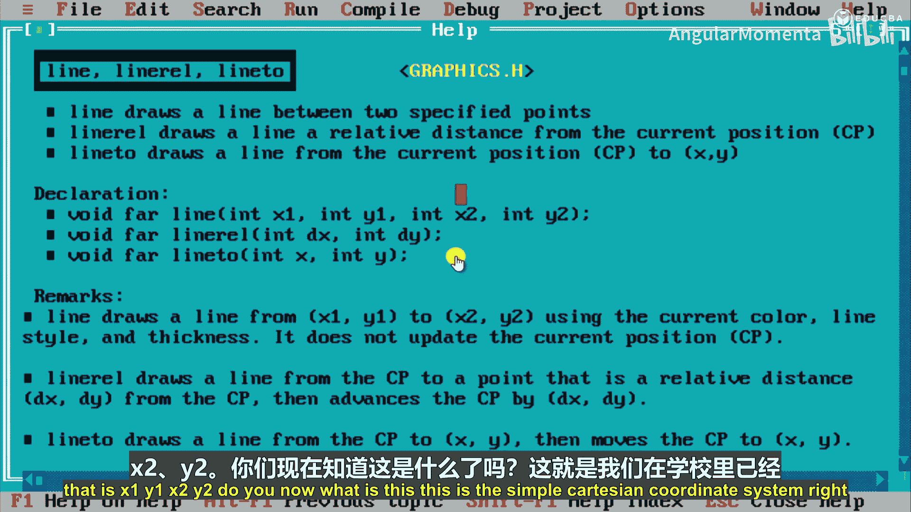

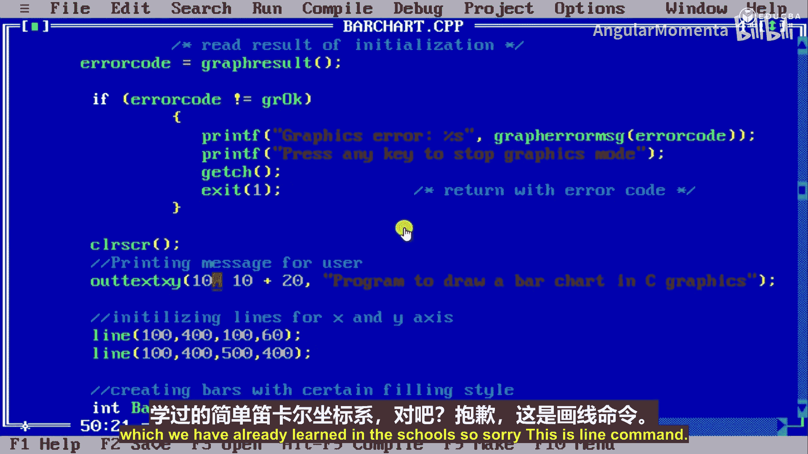

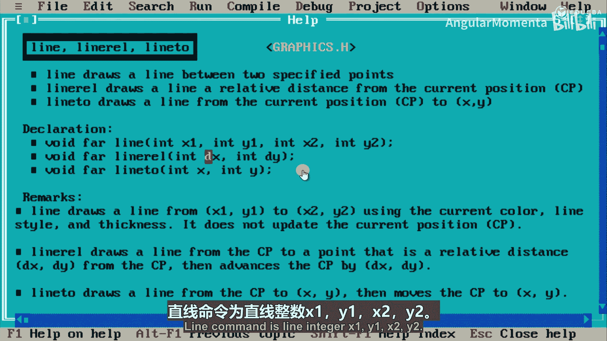

## 绘制坐标轴

现在，我们处于图形模式中。接下来需要绘制条形图的坐标轴。

我们需要绘制一条水平线作为X轴和一条垂直线作为Y轴。这里使用 `line` 命令，其函数原型定义在 `graphics.h` 头文件中。

`line` 命令的语法是：`line(int x1, int y1, int x2, int y2);`。其中 `(x1, y1)` 是线条起点的坐标，`(x2, y2)` 是线条终点的坐标。这基于笛卡尔坐标系。

例如，绘制Y轴的命令可能是：`line(100, 400, 100, 60);`。
绘制X轴的命令可能是：`line(100, 400, 500, 400);`。
这样就绘制出了基本的X轴和Y轴。

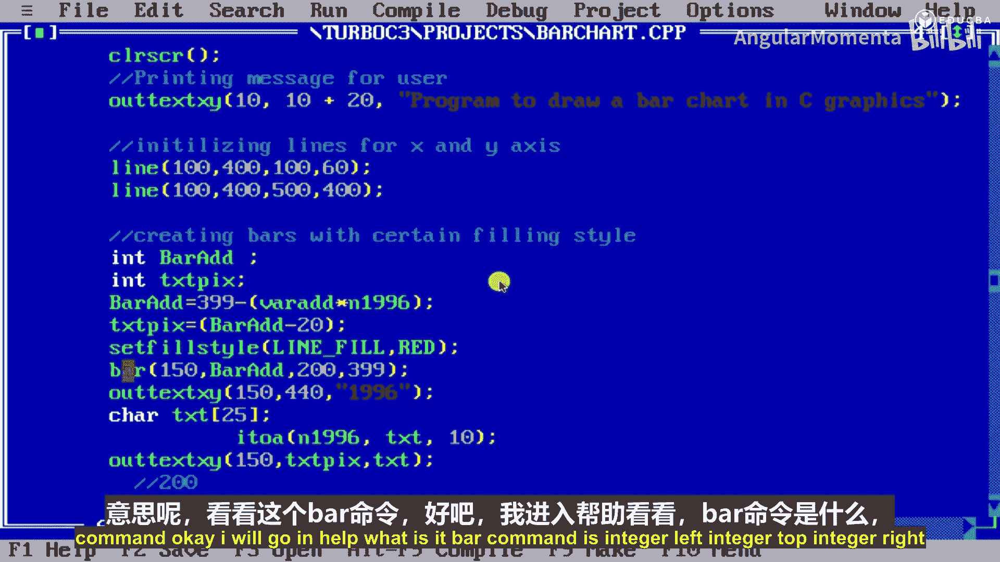

## 绘制条形图

到目前为止，我们已经完成了以下步骤：
1.  包含必要的头文件（库）。
2.  在屏幕上输入销售数据。
3.  解释了屏幕像素排列方式。
4.  使用 `initgraph` 方法初始化了图形模式。
5.  使用了清屏命令。
6.  绘制了X轴和Y轴。

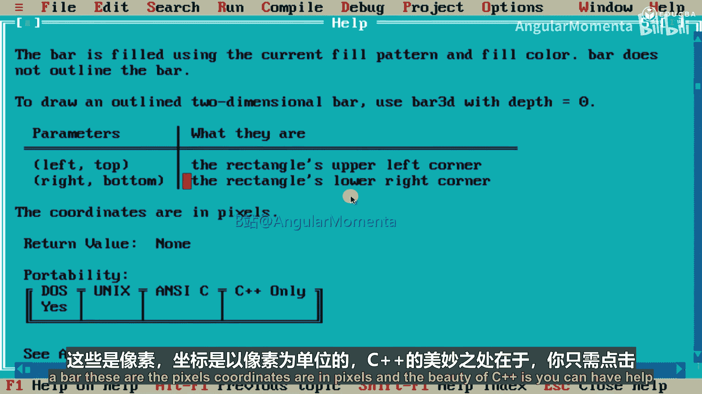

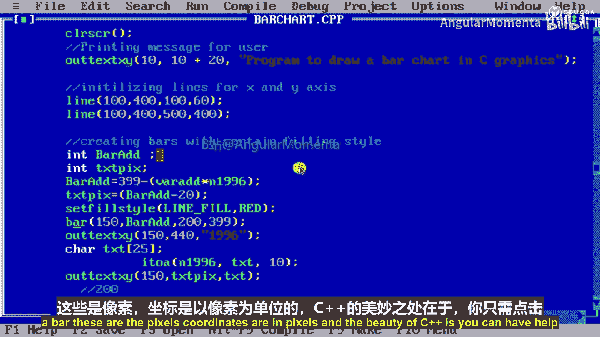

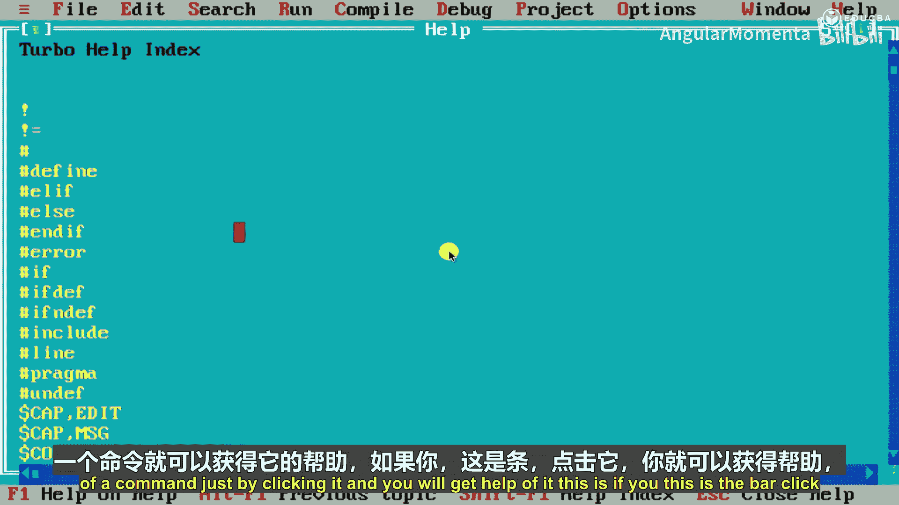

现在，我们将使用 `bar` 命令在屏幕上绘制条形图。

我使用了整数变量 `barAdd` 和 `textP`。
计算 `barAdd` 的公式是：`barAdd = 399 - varAdd * 1996;`。
这里 `varAdd` 是一个浮点变量，因为计算可能需要小数，所以不能使用整型数据类型。

`399` 是一个参考点。我们用它减去 `varAdd * 1996` 的结果。
`varAdd` 代表条形左上角的Y坐标。这是什么意思呢？请看 `bar` 命令。

`bar` 命令的语法是：`bar(int left, int top, int right, int bottom);`。
这些参数中，`(left, top)` 是矩形左上角的坐标，`(right, bottom)` 是矩形右下角的坐标。这些坐标的单位都是像素。

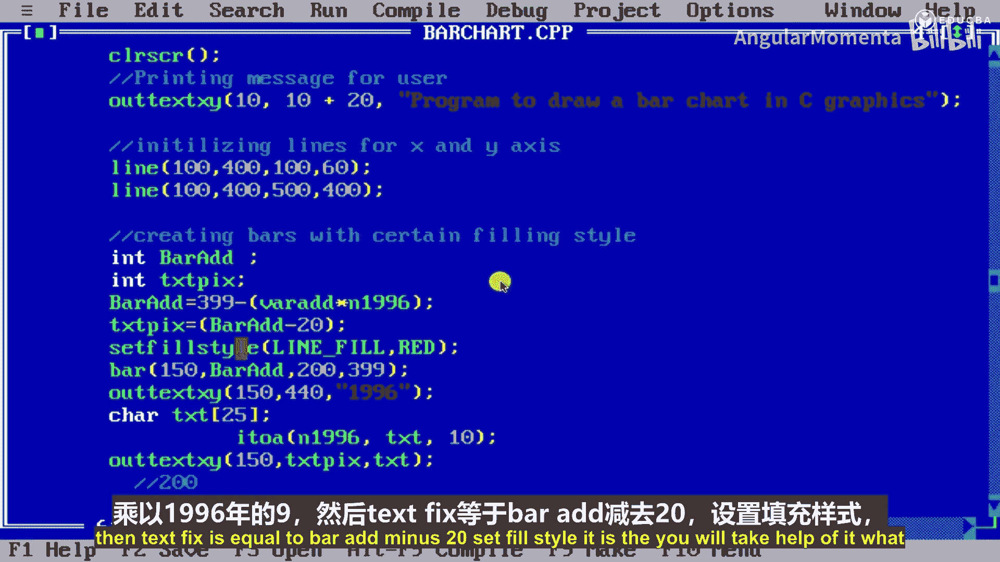

C++的优点在于，你可以通过点击获取命令的帮助信息。例如，`bar(50, 50, 150, 400)` 会绘制一个条形。其中 `(50, 50)` 是条形的左上角，`(150, 400)` 是条形的右下角。

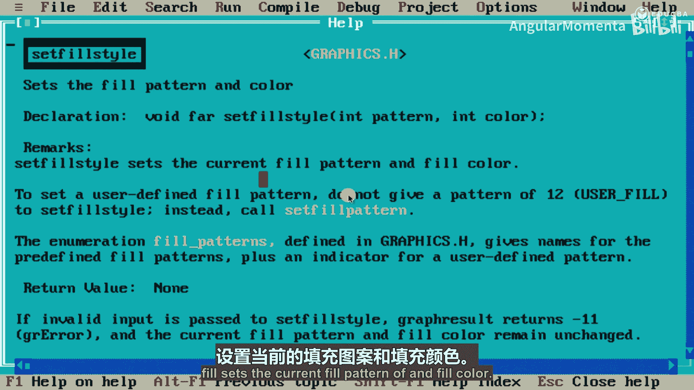

为什么使用 `399` 呢？因为像素坐标从 `(0,0)` 开始。为了绘制条形，你需要从整个图形区域的高度中减去这个值，以获得实际的有效坐标。在标准的笛卡尔坐标系中，零点在左下角。但在C++图形模式中，零点在左上角。因此，我们需要用 `399` 减去计算出的值来绘制条形。

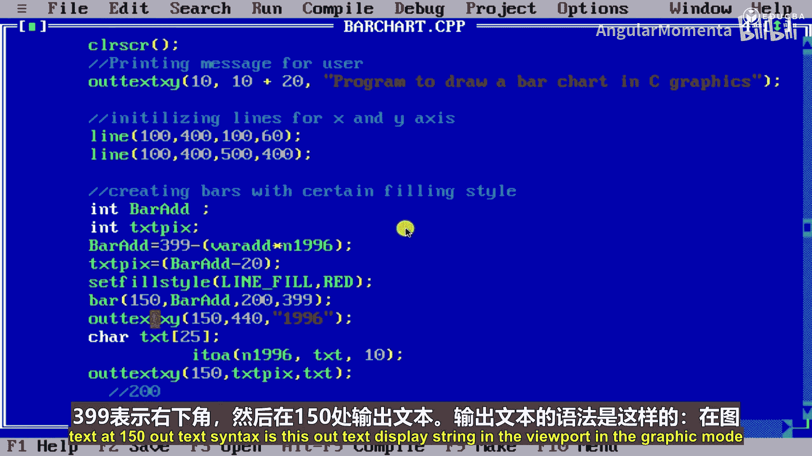

我还使用了 `textP = barAdd - 20;`。如果你想在条形顶部显示文本，就需要计算文本的像素位置。因此，我设置了文本坐标 `textP` 为 `barAdd - 20`。然后，你可以使用 `outtextxy(150, textP, text);` 在屏幕上绘制文本。

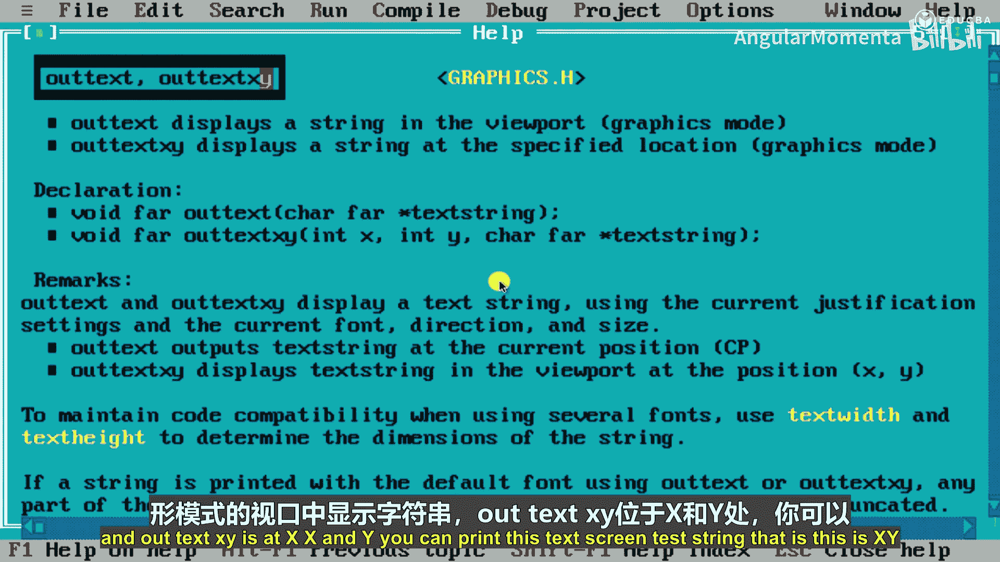

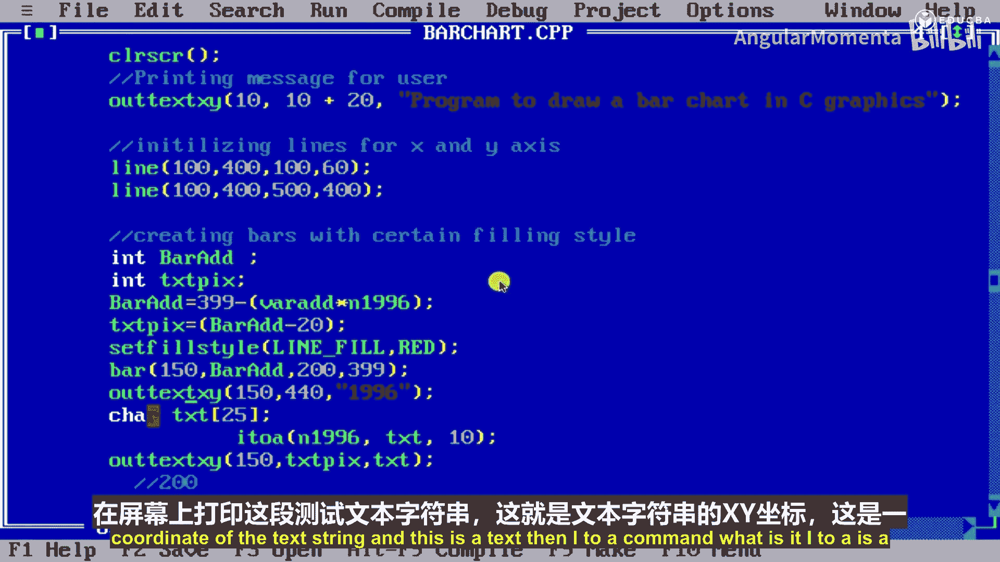

总结一下当前的步骤：
1.  `barAdd = 399 - varAdd * 1996;`
2.  `textP = barAdd - 20;`
3.  `setfillstyle(SOLID_FILL, RED);`：这个函数设置填充模式和颜色。`SOLID_FILL` 表示实心填充，`RED` 是C++中表示红色的保留字，像素将用红色高亮。
4.  `bar(150, barAdd, 200, 399);`：这是主要的 `bar` 命令，用于在屏幕上绘制一个矩形（即条形）。
5.  `outtextxy(150, textP, text);`：`outtextxy` 函数在图形模式的视口中显示字符串。其语法是 `outtextxy(int x, int y, char *textstring);`，其中 `(x, y)` 是文本字符串的坐标。
6.  `itoa()` 命令：这是一个变量转换命令，将整数转换为字符串。在图形模式下，不能直接显示整数文本，必须将其转换为字符串，因为 `outtextxy` 需要的 `textstring` 参数是字符数组（字符串）类型。

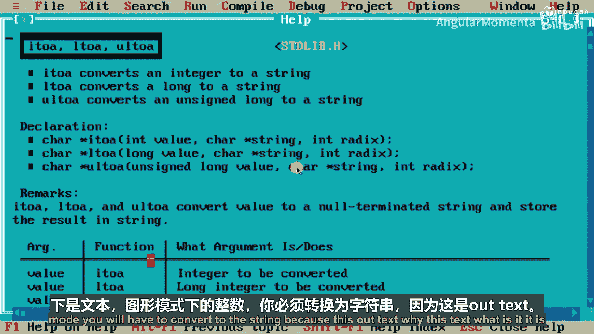

## 总结

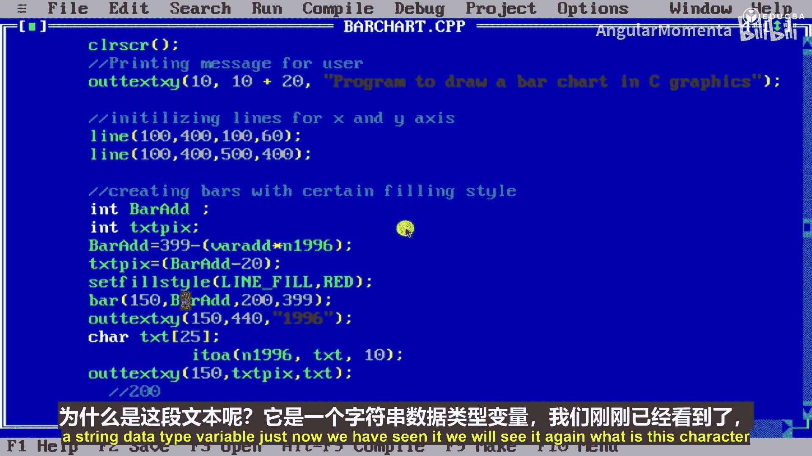

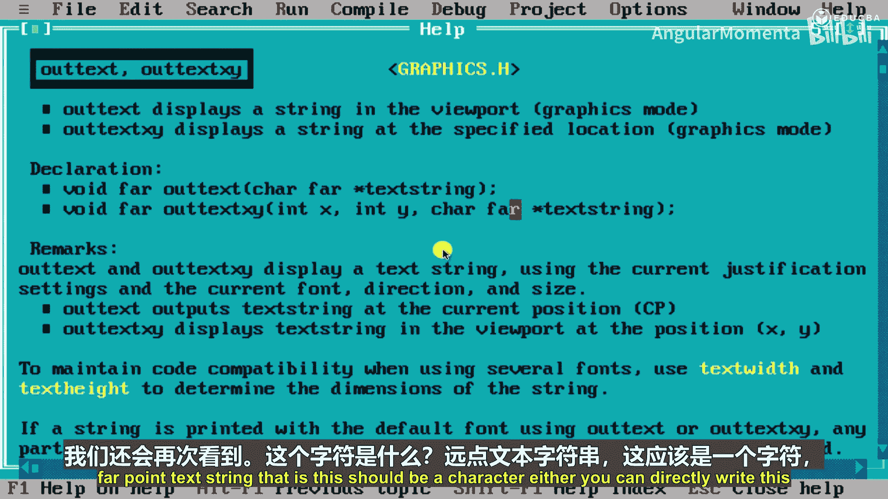

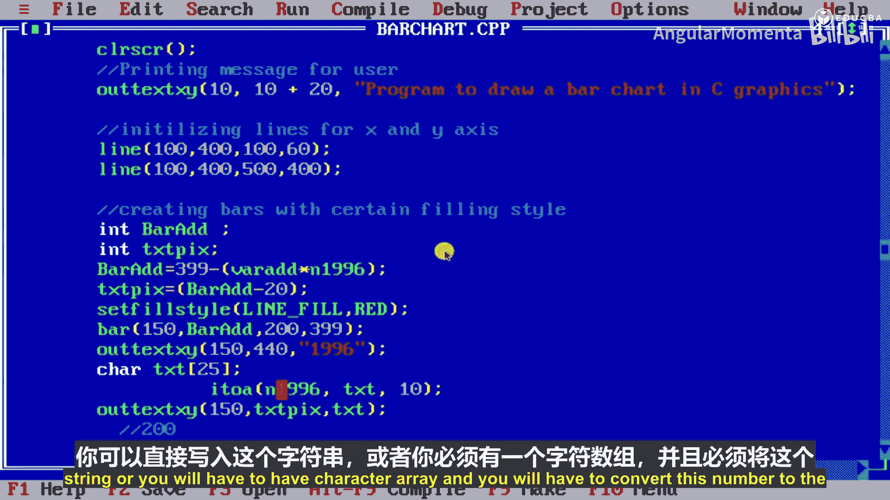

本节课中，我们一起学习了在C++图形模式下绘制条形图的核心步骤。我们从理解像素坐标系开始，然后初始化了图形模式，绘制了X轴和Y轴，最后详细讲解了使用 `bar` 命令绘制条形、使用 `setfillstyle` 设置样式以及使用 `outtextxy` 添加文本标签的过程。关键是要注意图形坐标原点在左上角，这与数学中的笛卡尔坐标系不同，在计算位置时需要转换。