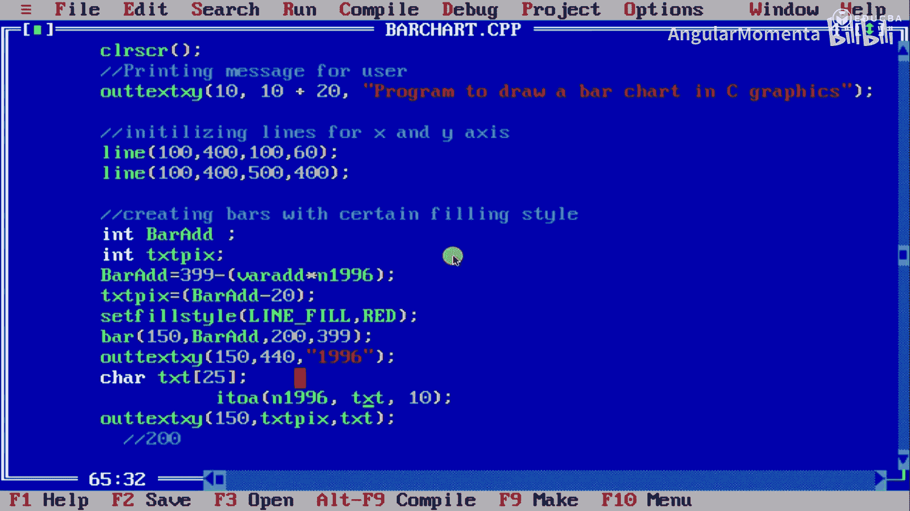
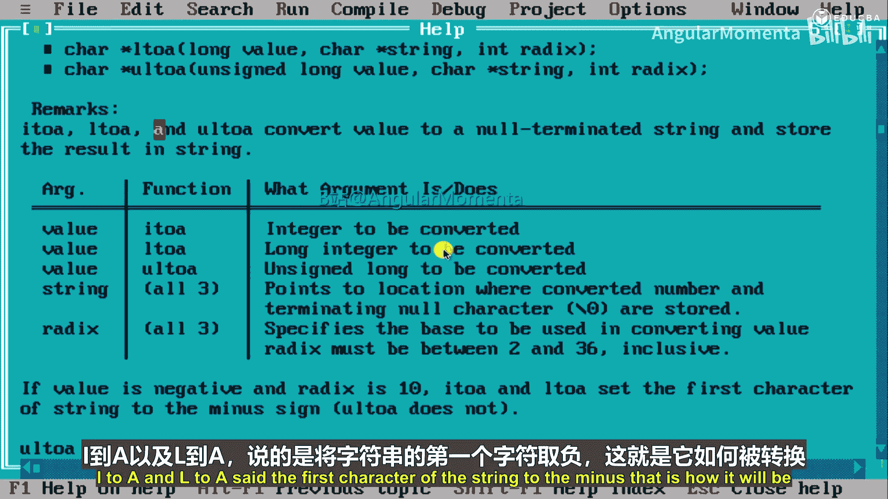
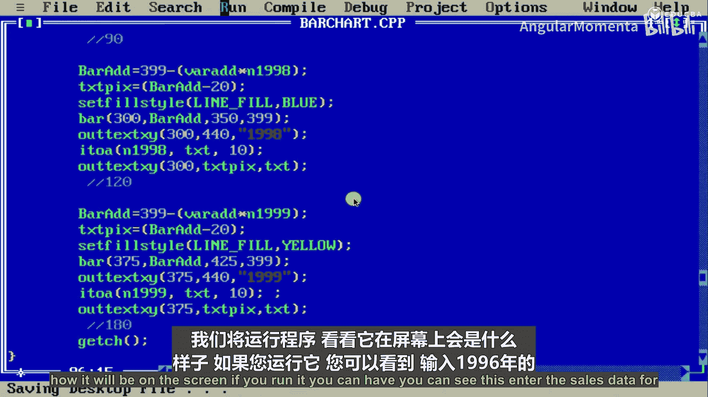
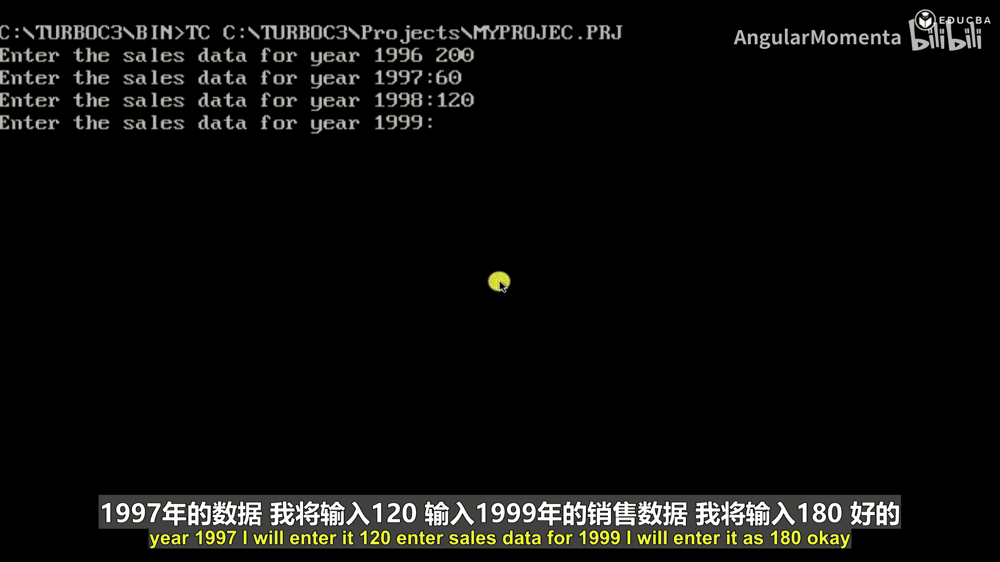
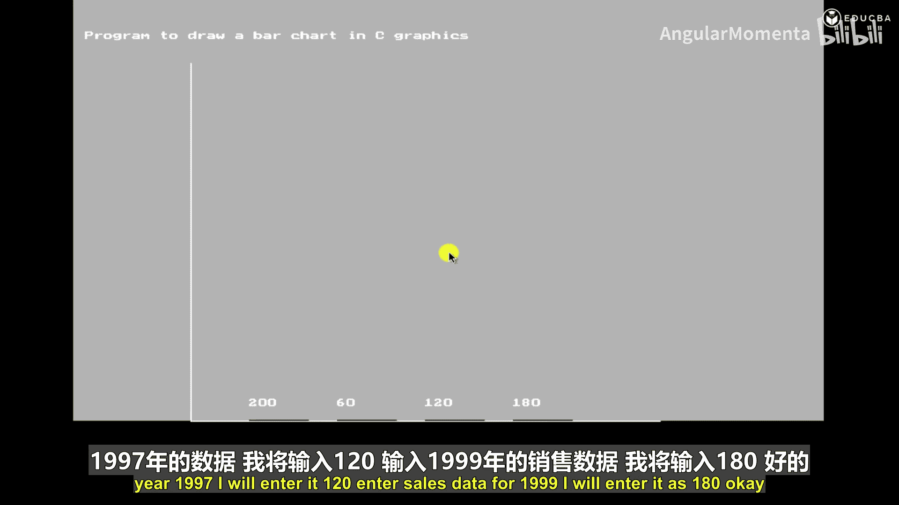
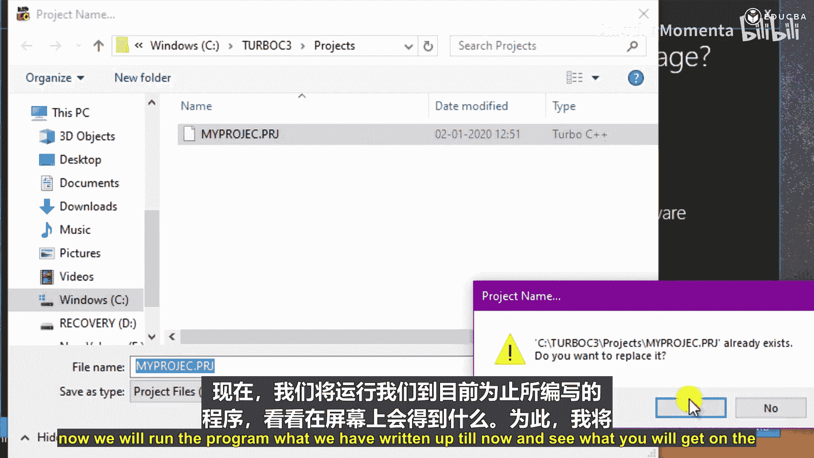
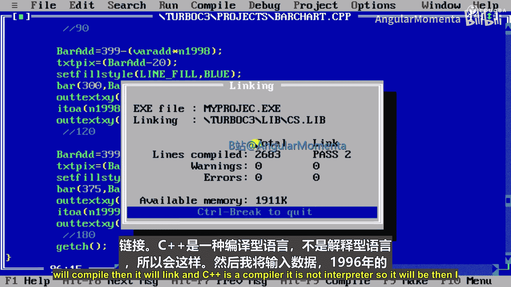
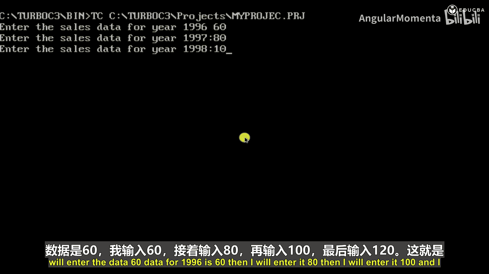
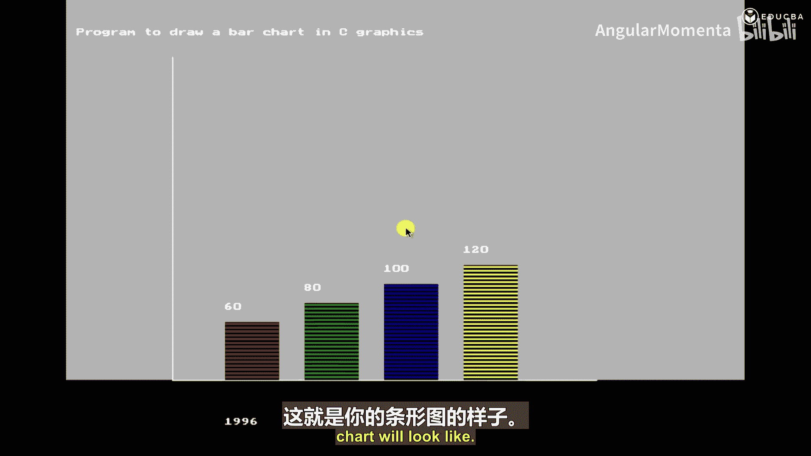

# 003：条形图第四部分 📊



在本节课中，我们将学习如何使用C++的图形编程功能，根据用户输入的数据，绘制一个包含多个年份销售数据的条形图。我们将重点讲解如何将整数数据转换为字符串进行显示，以及如何为不同年份的条形设置不同的颜色。



---

## 概述

上一节我们介绍了如何绘制单个条形并设置其样式。本节中，我们将继续完善程序，为多个年份（1996, 1997, 1998, 1999）的销售数据分别绘制条形，并为每个条形添加对应的年份标签和数值标签。核心在于使用 `itoa` 函数进行数据转换，并使用 `outtextxy` 函数在图形界面上显示文本。

## 核心概念：`itoa` 函数

`itoa` 函数用于将整数（`int`）转换为字符串（字符数组）。其语法如下：
```c
char* itoa(int value, char* str, int base);
```
*   **`value`**: 要转换的整数值。
*   **`str`**: 指向存储结果字符串的字符数组的指针。
*   **`base`**: 转换所使用的基数，必须在2到36之间（包含）。对于十进制数，我们使用 `10`。

如果 `value` 是负数且基数 `base` 为10，转换后的字符串第一个字符将是负号（`-`）。通过这个函数，我们可以将销售数据（整数）转换为字符串，然后使用 `outtextxy` 命令将其显示在图形屏幕上。

---

## 绘制1997年条形图

现在，我们来看看如何为1997年的数据绘制条形图。方法与1996年类似，但会使用不同的颜色和位置。

以下是绘制1997年条形图的步骤：

1.  **计算条形高度**：`bar_add = 399 - (sales_1997 * 2);`。这里 `sales_1997` 是用户输入的1997年销售额。乘数 `2` 是一个缩放因子，用于在图形视口中更好地显示条形。
2.  **计算文本位置**：`text_pix = bar_add - 20;`。将文本显示位置设置在条形顶部上方20像素处，确保标签清晰可见。
3.  **设置填充样式和颜色**：`setfillstyle(SOLID_FILL, GREEN);`。这里我们使用绿色填充条形，以区别于1996年的红色。
4.  **绘制条形**：`bar(225, bar_add, 275, 399);`。此命令绘制一个矩形。
    *   `(225, bar_add)` 是条形左上角的坐标。
    *   `(275, 399)` 是条形右下角的坐标。
    *   条形宽度固定为 `275 - 225 = 50` 像素。
    *   条形高度由 `399 - bar_add` 动态决定，取决于销售数据。
5.  **显示年份标签**：`outtextxy(225, 440, "1997");` 在坐标 `(225, 440)` 处显示文本“1997”。
6.  **显示销售数据标签**：
    *   首先将整数 `sales_1997` 转换为字符串：`itoa(sales_1997, text, 10);`。
    *   然后在条形上方显示该字符串：`outtextxy(225, text_pix, text);`。

---

## 绘制1998年与1999年条形图

遵循相同的模式，我们可以继续为1998年和1999年的数据绘制条形图。主要变化是条形在X轴上的起始位置依次右移，以及使用不同的颜色。

以下是后续年份的实现要点：

*   **1998年条形图**：
    *   条形左上角X坐标：`300`
    *   使用颜色：`BLUE`
    *   绘制命令：`bar(300, bar_add, 350, 399);` （条形宽度仍为50像素）
    *   标签位置相应调整。

*   **1999年条形图**：
    *   条形左上角X坐标：`375`
    *   使用颜色：`YELLOW`
    *   绘制命令：`bar(375, bar_add, 425, 399);`
    *   标签位置相应调整。

每个年份的条形高度都通过公式 `bar_add = 399 - (sales_year * 2);` 独立计算，其中 `sales_year` 是对应年份的销售数据。

---

## 程序运行与结果展示

在代码的最后，我们使用 `getch();` 函数等待用户按键，以便观察生成的图形窗口。

现在，我们将运行完整的程序。程序会提示用户依次输入1996至1999四个年份的销售数据。例如，我们输入：60, 80, 100, 120。



程序运行后，将在图形模式下显示一个条形图。X轴下方标有年份（1996, 1997, 1998, 1999），每个条形上方显示其对应的销售数据。条形使用不同的颜色（红、绿、蓝、黄）区分，直观地比较了这四年间的销售情况。





生成的条形图清晰地展示了输入数据（60, 80, 100, 120）对应的条形高度递增趋势。




---



## 总结

本节课中我们一起学习了如何使用C++图形库创建多数据系列的条形图。我们掌握了以下几个关键点：
1.  使用 `bar()` 函数绘制矩形条形。
2.  使用 `setfillstyle()` 函数为不同的条形设置不同的颜色。
3.  使用 `itoa()` 函数将整型销售数据转换为字符串。
4.  使用 `outtextxy()` 函数在图形屏幕上精确位置显示文本标签（年份和数值）。
5.  通过计算动态确定条形的高度和位置，从而将用户输入的数据可视化。





通过本课程，你已经能够编写一个完整的C++程序，它接收用户输入，并生成一个具有多组数据、颜色区分和清晰标签的销售条形图。