# 004：绘制饼图 🥧

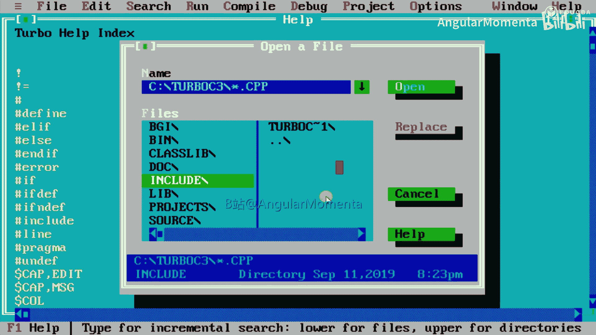

在本节课中，我们将学习如何使用C++的图形编程功能来绘制一个饼图。之前我们已经学习了如何绘制柱状图并输入销售数据，本节将重点介绍饼图的绘制原理和实现步骤。

## 概述

饼图是一种圆形图表，用于展示各部分数据占总体的比例。我们将通过C++图形库中的特定函数，将四个年份的销售数据可视化为一个饼图。

## 图形初始化

与绘制柱状图类似，我们首先需要初始化图形模式。以下是初始化图形系统的基本代码结构。

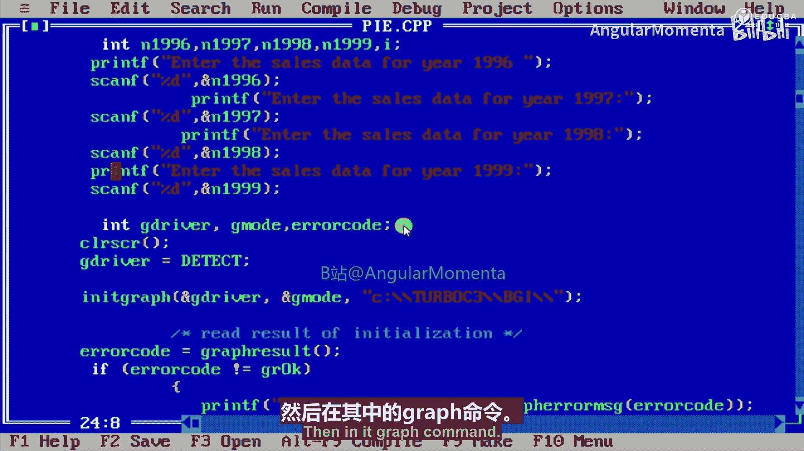

```cpp
#include <graphics.h>
#include <stdio.h>
#include <conio.h>

int main() {
    int gdriver = DETECT, gmode, errorcode;
    initgraph(&gdriver, &gmode, "C:\\TC\\BGI");
    errorcode = graphresult();
    if (errorcode != grOk) {
        printf("Graphics error: %s\n", grapherrormsg(errorcode));
        printf("Press any key to halt:");
        getch();
        exit(1);
    }
    // ... 后续绘图代码
    getch();
    closegraph();
    return 0;
}
```

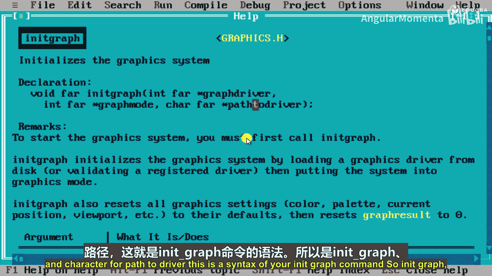

这段代码的作用是检测并初始化图形驱动器，如果初始化失败则输出错误信息并退出。

## 数据输入

在绘制图表前，我们需要从用户那里获取四个年份的销售数据。以下是使用`printf`和`scanf`函数在文本模式下输入数据的示例。

```cpp
int n1996, n1997, n1998, n1999;
printf("Enter the sales data for year 1996: ");
scanf("%d", &n1996);
printf("Enter the sales data for year 1997: ");
scanf("%d", &n1997);
printf("Enter the sales data for year 1998: ");
scanf("%d", &n1998);
printf("Enter the sales data for year 1999: ");
scanf("%d", &n1999);
```

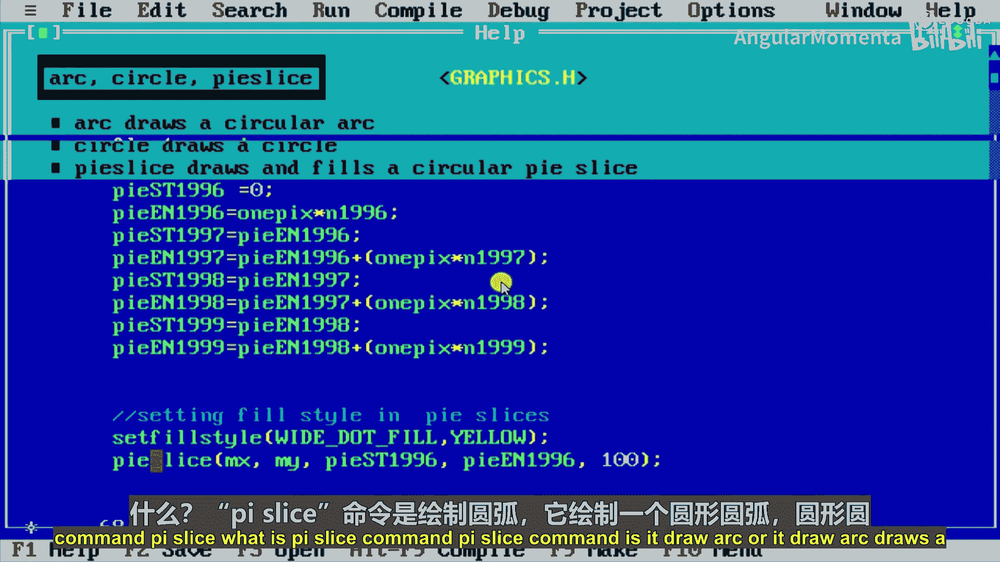

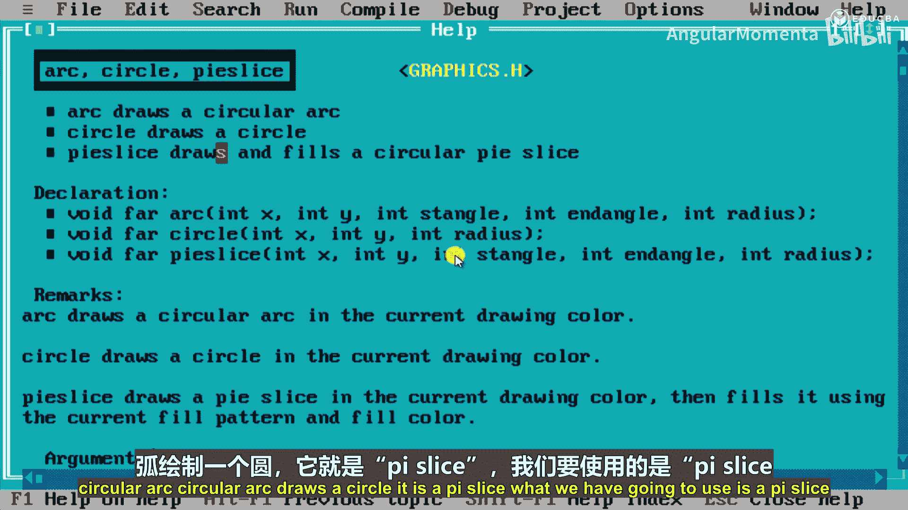

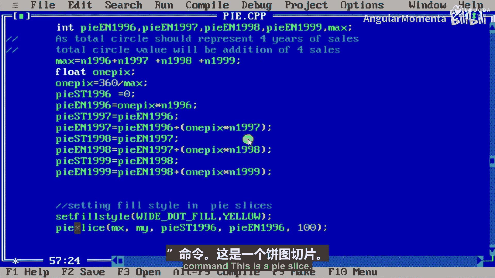

## 饼图绘制逻辑

饼图的核心是将数据值转换为圆上的角度。一个完整的圆是360度。每个数据部分所占的角度由其值在总和中的比例决定。

我们首先计算所有数据的总和（`max`），然后确定单位数据值对应的角度（`one_ps`）。

```cpp
int max = n1996 + n1997 + n1998 + n1999;
float one_ps = 360.0 / max;
```

接着，我们计算每个年份数据段的起始角度和结束角度。第一个数据段（1996年）的起始角度为0。

```cpp
int st1996 = 0;
int en1996 = one_ps * n1996;

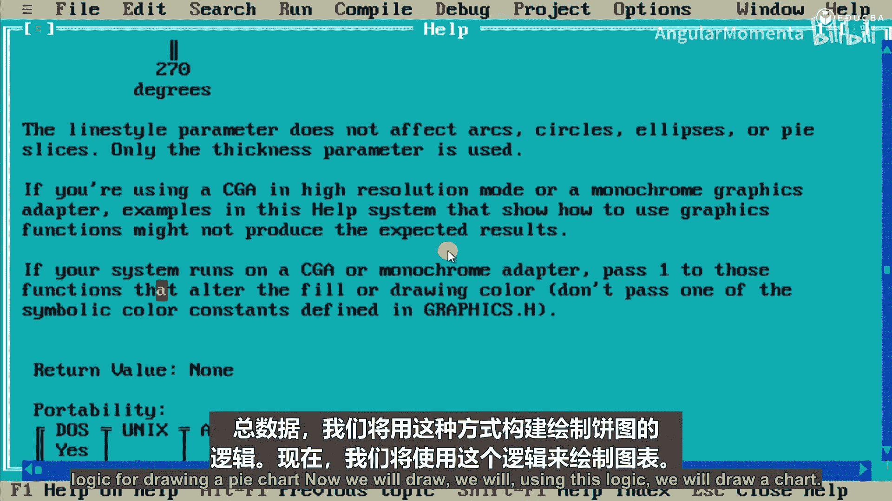

int st1997 = en1996;
int en1997 = st1997 + (one_ps * n1997);

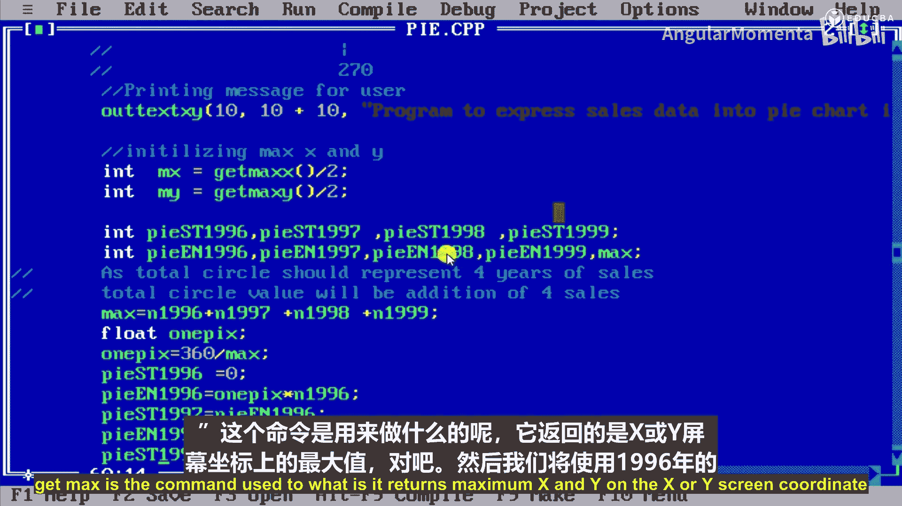

int st1998 = en1997;
int en1998 = st1998 + (one_ps * n1998);

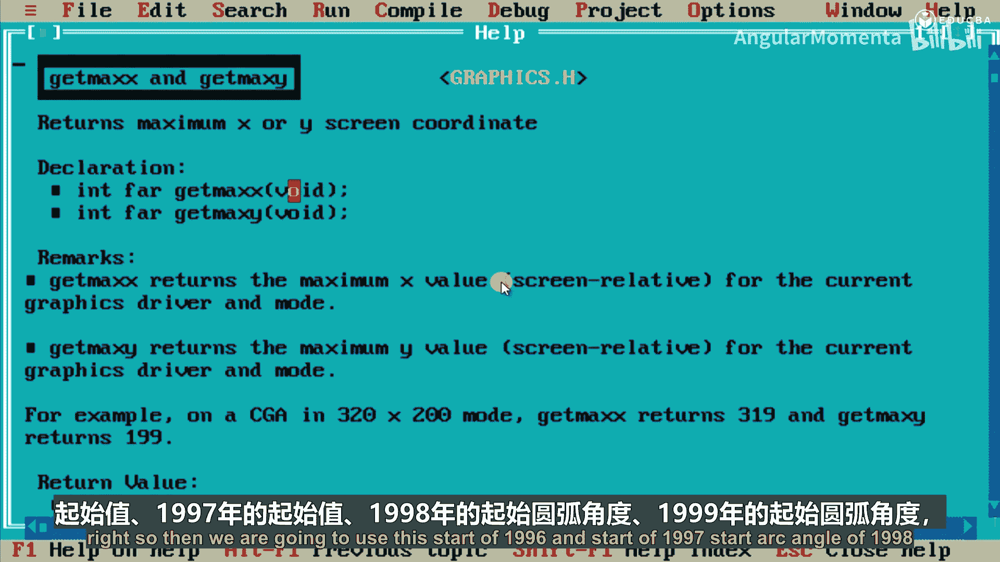

int st1999 = en1998;
int en1999 = st1999 + (one_ps * n1999);
```

## 使用 `pieslice` 函数绘图

`pieslice` 函数用于绘制饼图的一个扇形切片。其语法如下：
`pieslice(x, y, stangle, endangle, radius)`
其中，`(x, y)` 是圆心坐标，`stangle` 和 `endangle` 是扇形的起始和结束角度（以度为单位），`radius` 是半径。

以下是绘制四个年份数据扇形的代码。我们为每个扇形设置了不同的填充颜色。

```cpp
// 设置填充样式和颜色，并绘制扇形
setfillstyle(SOLID_FILL, YELLOW);
pieslice(320, 240, st1996, en1996, 100);

setfillstyle(SOLID_FILL, BROWN);
pieslice(320, 240, st1997, en1997, 100);

setfillstyle(SOLID_FILL, BLUE);
pieslice(320, 240, st1998, en1998, 100);

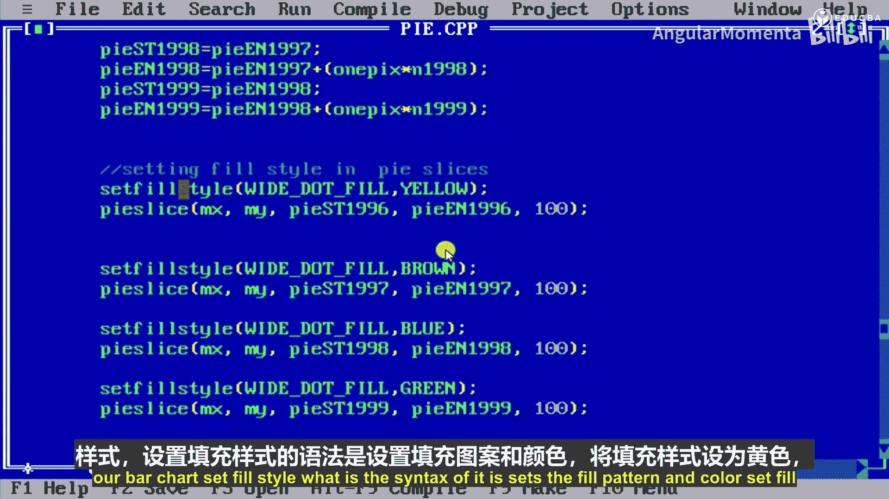

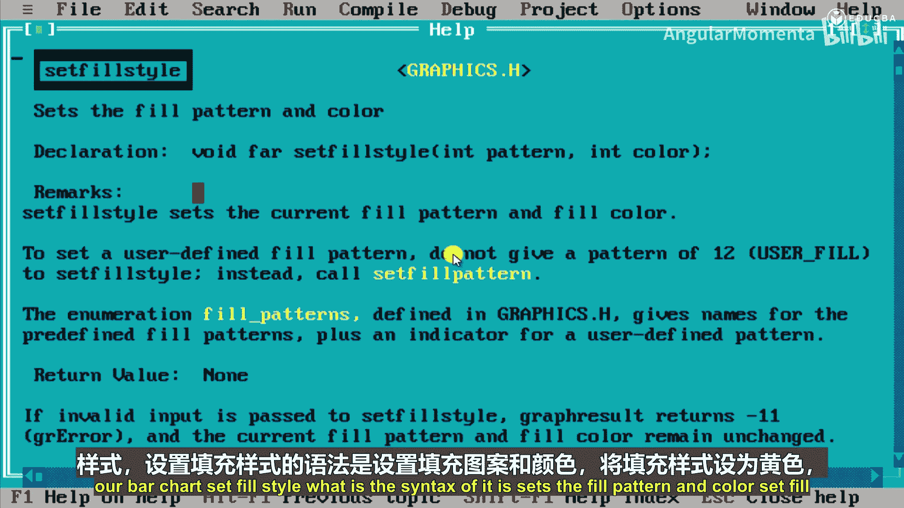

setfillstyle(SOLID_FILL, GREEN);
pieslice(320, 240, st1999, en1999, 100);
```

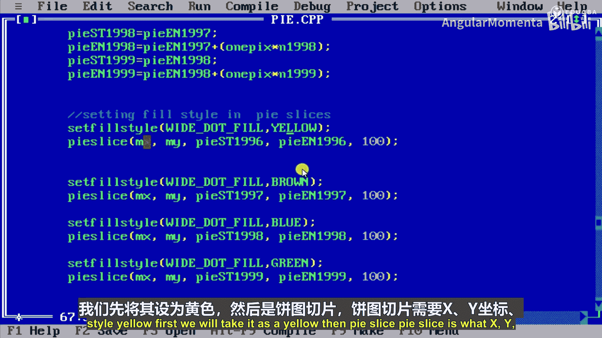

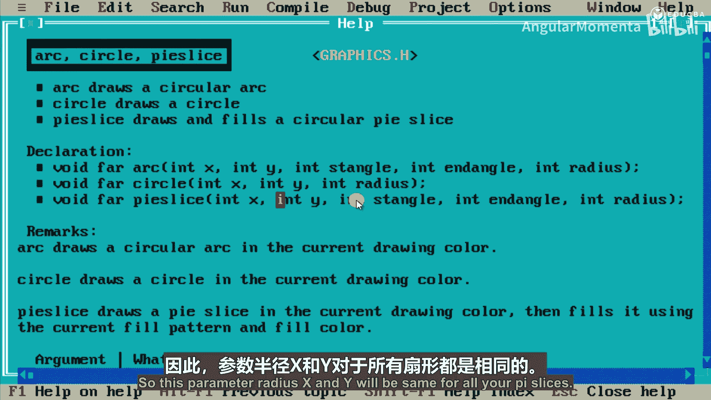

## 完整代码示例

将以上所有部分组合起来，就得到了绘制销售数据饼图的完整程序。运行程序后，输入四个数据（例如80, 120, 60, 100），即可在图形窗口中看到对应的饼图。

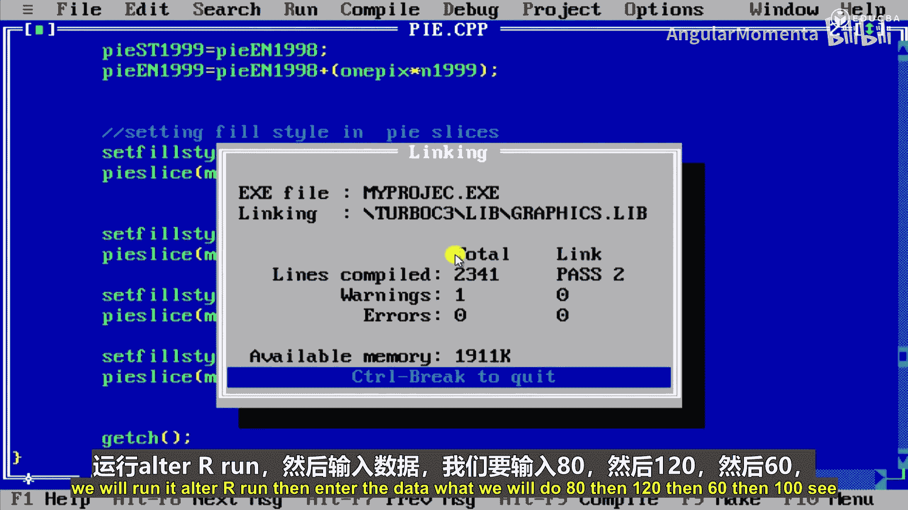

## 总结

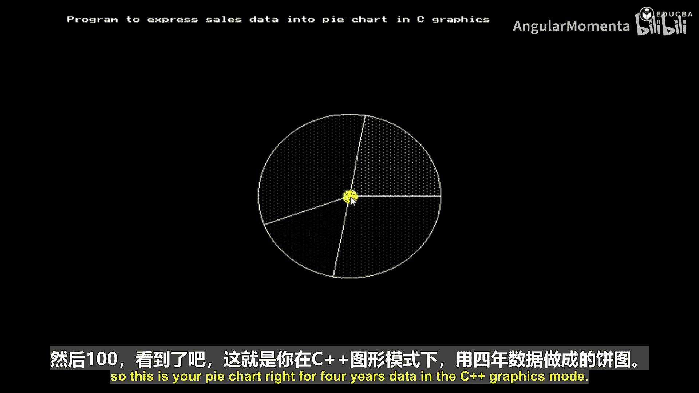

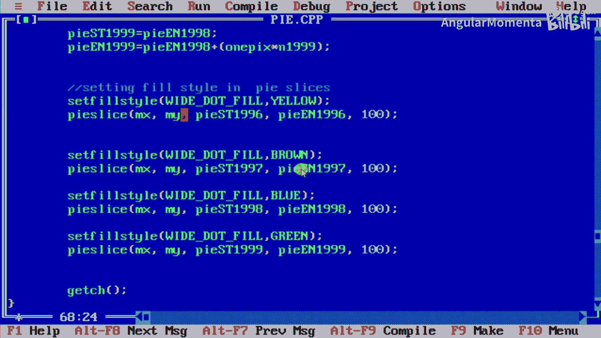

本节课我们一起学习了在C++中使用图形编程绘制饼图的方法。我们回顾了图形模式的初始化、数据的文本输入、将数据转换为角度的逻辑，以及使用 `pieslice` 函数绘制彩色扇形切片的具体步骤。通过本教程，你应该能够理解饼图的基本原理并动手实现一个简单的销售数据饼图。