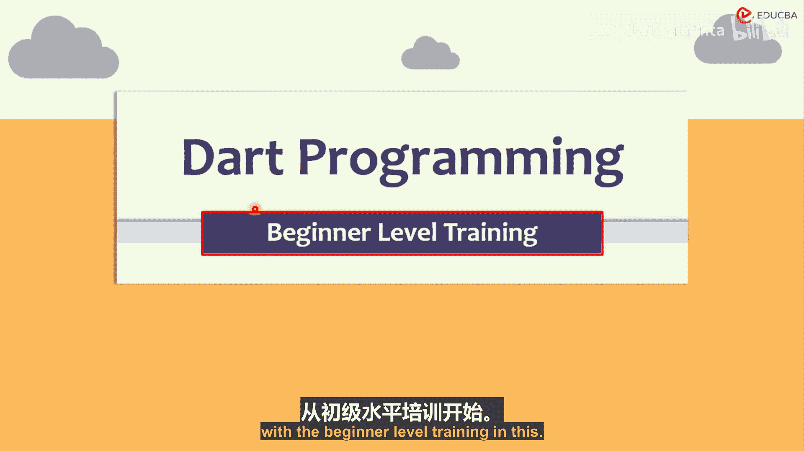
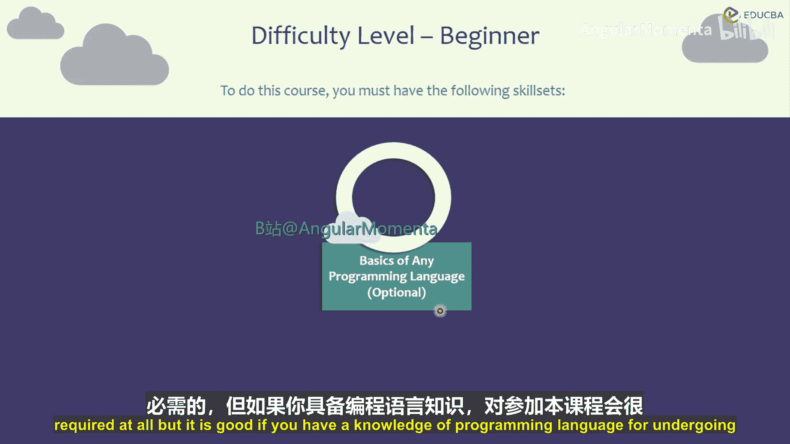
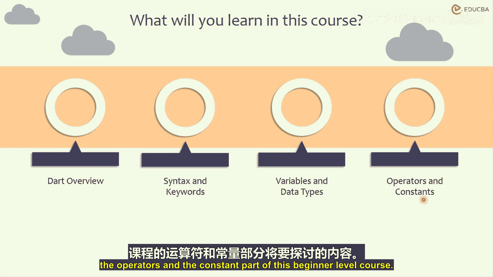
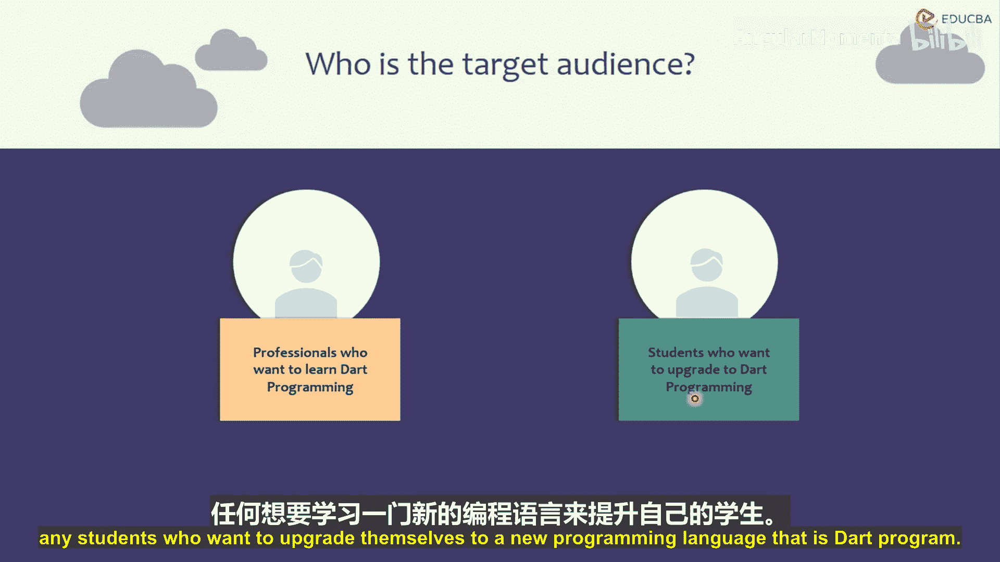
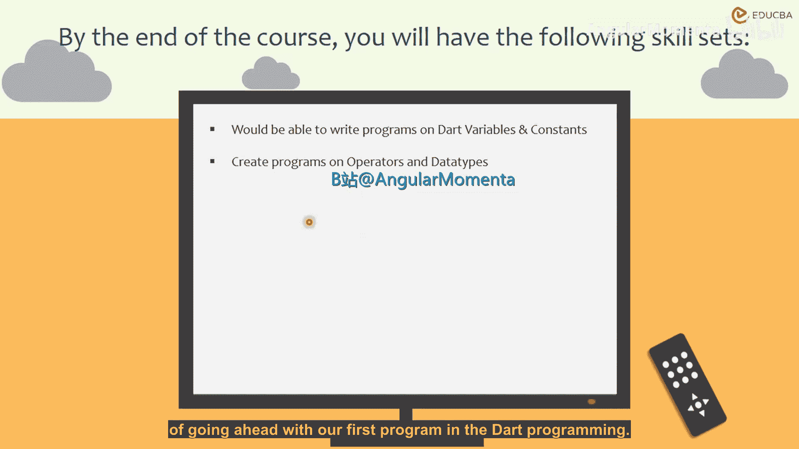

# 001：课程介绍

在本课程中，我们将从零开始学习Dart编程语言的基础知识。本课程专为初学者设计，旨在帮助你建立坚实的编程基础，为后续学习更高级的Dart应用开发铺平道路。

## 课程难度与先决条件

本课程的难度级别为**初学者**。学习本课程没有硬性的技能要求，但如果你具备任何编程语言的基础知识，将有助于你更快地理解和掌握课程内容。这并非强制要求，只是一个有益的建议。

## 课程内容概览

接下来，让我们了解一下在这个Dart初学者课程中，我们将具体学习哪些内容。

以下是本课程的核心模块：

1.  **Dart概述**：我们将探讨什么是Dart编程语言，为什么使用它，以及使用Dart可以完成哪些任务。
2.  **语法与关键字**：我们将学习Dart语言特有的语法规则和关键字，了解它们的用途和用法。
3.  **变量与数据类型**：我们将学习如何创建变量，理解变量的概念，学习如何在变量中存储值，并了解Dart中可用的不同数据类型。
4.  **运算符与常量**：我们将学习什么是运算符及其使用方法，了解Dart中可用的各类运算符。同时，我们将理解常量的概念，学习如何使用常量，以及如何结合运算符和常量来创建程序。

## 目标受众

本课程适合所有希望学习Dart编程的人士。无论你是希望学习一门新编程语言的职场人士，还是希望提升自我、学习Dart编程的学生，都可以从本课程开始。

## 学习成果

在完成本课程后，你将获得以下技能：

*   你将能够编写涉及各种变量和常量的程序。
*   你将能够创建使用运算符和数据类型的程序。

总而言之，完成本课程后，你将具备足够的能力来创建涉及变量、常量、运算符或数据类型的任何基础程序。

本节课中，我们一起了解了Dart初学者课程的概览、目标与学习路径。从下一节开始，我们将正式进入Dart编程的世界，首先从Dart语言的概述学起。