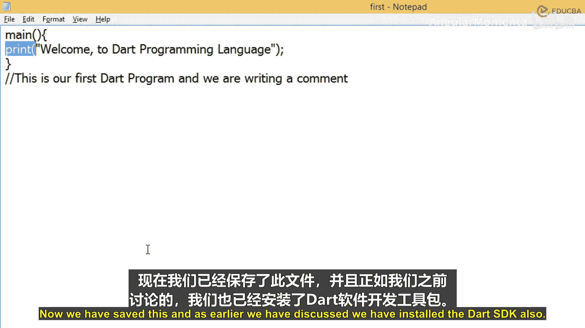
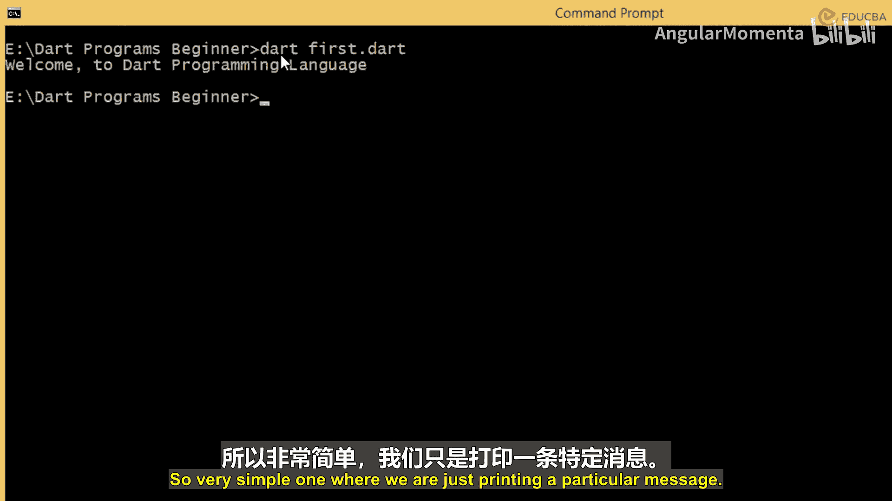
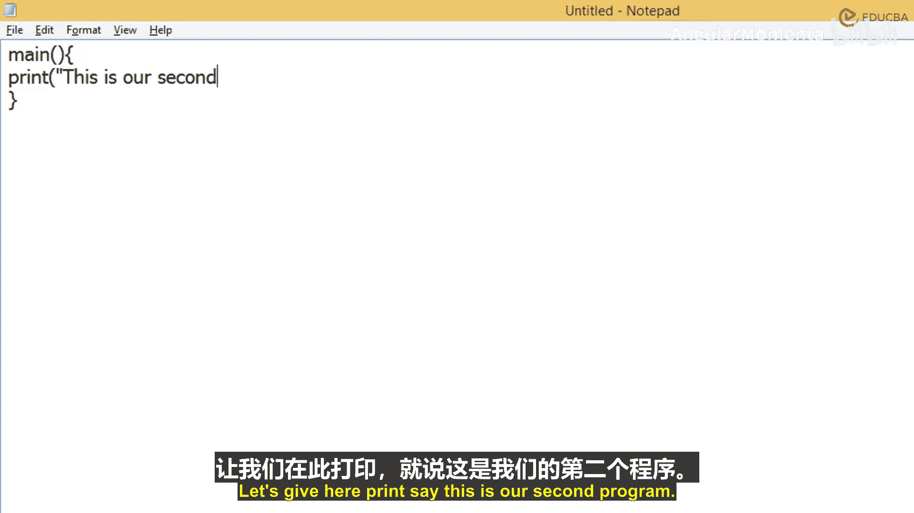

# 002：Dart语言基础入门 🚀

在本节课中，我们将要学习Dart编程语言的基础知识，包括它的起源、特点、应用场景，并通过编写第一个简单的Dart程序来实践。

## 概述

Dart是一种由Google开发的开源编程语言。其最新稳定版本发布于2020年8月。我们将使用这个稳定版本进行学习。编程语言用于根据语言规范创建特定程序。Dart本质上是一种开源编程语言。

## Dart语言简介

Dart最初是为开发移动应用程序而创建的。你也可以用它来构建Web服务器、桌面应用、移动应用或物联网设备。这是创建Dart语言的基本意图。

它也是一种面向对象的编程语言。因此，Dart编程也包含了类、继承、重写、重载等所有面向对象编程的特性。它基本上融合了所有面向对象编程的特性，并且其语法看起来与Java语法相似。如果你有相关知识会更好，但即使没有，你也可以从初级课程开始。你将非常透彻地了解每一个语法，所以这没有问题。

## 为什么使用Dart？

现在，我们来谈谈为什么使用Dart编程语言。它的一个基本优点是它是一种跨平台语言。它基本上支持当前所有主流操作系统，无论是Windows、Mac还是你正在使用的任何其他操作系统，甚至在移动应用平台如Android、Apple或其他任何平台上，它都能运行。

第二个重要点是它是开源的。你可以在线获取它，只需下载Dart SDK，使用你的记事本创建程序，在Dart中运行。你还可以通过各种IDE来使用它，甚至可以使用Flutter通过Dart语言创建移动应用程序。所有这些之所以可能，是因为它是开源的，并且非常稳定，你也可以将其用于实时应用程序。

另一个优点是它支持面向对象编程特性。因此，如果你具备这种编程概念的知识，使用Dart语言开发程序对你来说会非常容易。

## 安装与准备

正如我们已经讨论过的，我们需要安装Dart SDK。它基本上包含了编译器，或者你也可以称之为软件开发工具包，其中包含了所有的虚拟机、独立机器、命令行接口环境等。你只需要下载、安装它，然后就可以开始创建你的程序了。

现在，我们已经非常清楚地了解了这门语言是什么，它是如何被开发的，由谁开发的，以及我们将在代码中使用的当前稳定版本是什么。

## 第一个Dart程序

现在，让我们快速创建一个关于它的基本示例，我们将在命令行上简单地打印“欢迎来到Dart编程语言”。

我们将从这里的主方法开始。告诉你，如果你没有任何编程语言背景，主方法基本上是程序的入口点，程序将从此处开始执行。就像我们在所有其他语言中也有这个一样，我们将其作为启动Dart程序的入口点。因此，当你编译并运行当前的Dart程序时，只有你写在这个主方法开闭括号内的内容才会执行。

在这个方法内部，我们简单地使用一个名为`print`的方法，并写上“欢迎来到Dart编程语言”。理解这个语法：`print`基本上是Dart的一个内置方法，它将在命令行上打印一些内容。它会打印你放在这对双引号内的任何内容。

你写的这个语法不必和我们写的一模一样，它可以是任何你需要给用户的信息，这些信息应该只打印在你的Dart命令行上。把那条信息放在这对双引号里，并用分号结束这一行，这意味着这个特定语句在这里结束。这基本上是行的结束，就像我们按回车键换到新一行一样，这里我们告诉编译器这是行的结束。我们想做的只是为用户打印一条消息，说“欢迎来到Dart编程语言”。

我们还可以写下这样的内容，例如，说“这是我们的第一个Dart程序，我们正在写一个注释”。现在，你如何理解这句话？“这是我们的第一个Dart程序，我们正在写一个注释。”当你执行和运行程序时，这个语句实际上不会执行，因为你在这里放了两个斜杠，这意味着这是一个注释。注释仅供程序员理解他写的是什么。

现在，这只是我们写的一行程序，但假设一下，如果你正在编写一个使用Dart编程创建的完整应用程序，你应该知道这些方法基本上是做什么用的，以供你参考。在那里，你可以使用这个注释，你可以放任何你想让未来理解某个特定方法是关于什么的内容。所以，你可以在那里使用这个注释点。

## 程序解析

我们已经完成了第一个程序。`main`是我们程序的入口点，程序将从此处开始执行，所以它必须存在。`print`函数是一个内置函数，我们没有创建它，它是默认存在的，它只会显示或打印你写在双引号内的任何内容。

现在我们将保存这个程序。我们将把它保存在D盘，我们有一个“dart_program_beginners”文件夹，在这里我们将其保存为“first.dart”。`.dart`必须是扩展名。现在我们已经保存了它，并且如前所述，我们也安装了Dart SDK。

现在我们要做的是，让我们打开命令提示符。我们在D盘的“dart_program_beginners”文件夹中。现在我们将执行`dart first.dart`。这个`dart`意味着我们想使用Dart SDK进行编译，我们的文件名是“first.dart”。你按回车，它会打印消息“欢迎来到Dart编程语言”，与你给`print`命令的内容相同。所以它不会打印`main`、开闭括号、`print`、然后圆括号、双引号和文本，它只执行你写在`print`特定方法内部的内容。

这是一个非常简单的程序，我们只是打印一条特定的消息。

## 第二个程序示例

现在我们要做的是，让我们回到这里，创建一个新文件，我们将再次通过创建主方法来开始。让我们给你的`print`语句写上“这是我们的第二个程序”。

## 总结

本节课中，我们一起学习了Dart编程语言的基础知识。我们了解了Dart的起源、跨平台和面向对象的特性，以及为什么选择使用它。我们实践了如何编写、保存和运行一个简单的Dart程序，理解了`main`函数作为程序入口点的重要性，以及如何使用`print`函数输出信息和添加注释。这为后续更深入的Dart学习打下了坚实的基础。