# 003：Dart语言基础续篇 🚀

在本节课中，我们将继续学习Dart语言的基础知识，重点探索`print`函数的多种用法、代码注释的写法以及Dart语法中的基本规则。通过实际编写和运行多个示例程序，你将掌握如何有效地输出信息和管理代码。

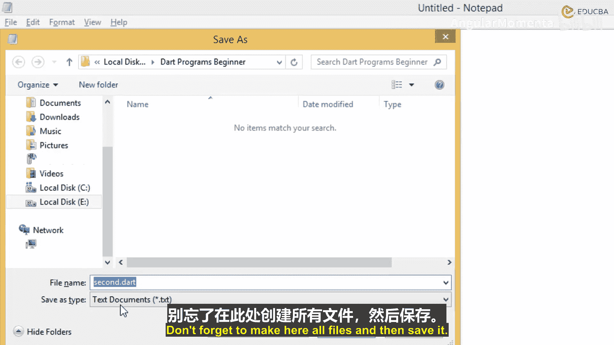

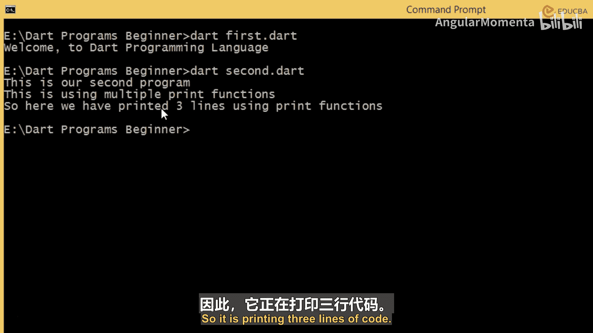

---

上一节我们介绍了Dart程序的基本结构。本节中，我们来看看如何使用`print`函数输出多行信息。

以下是使用多个`print`函数输出多行消息的示例。

```dart
print('This is using');
print('Multiple');
print('Print Functions');
```
我们使用了三个`print`命令，分别打印了三行文本。将此代码保存为`second.dart`并运行，将在控制台看到三行输出。

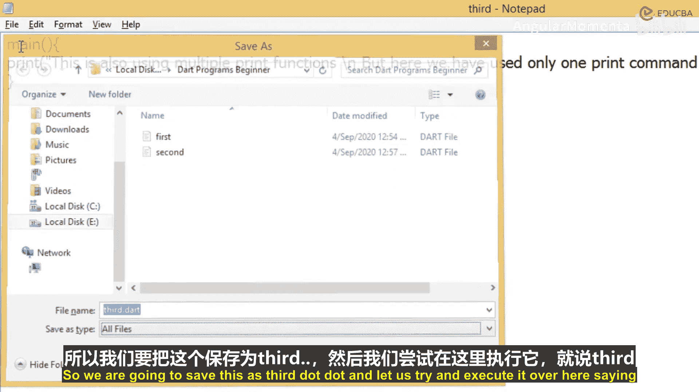

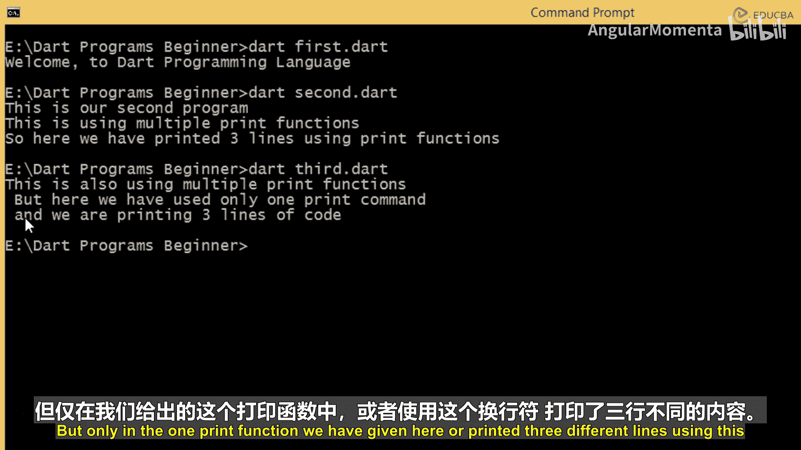

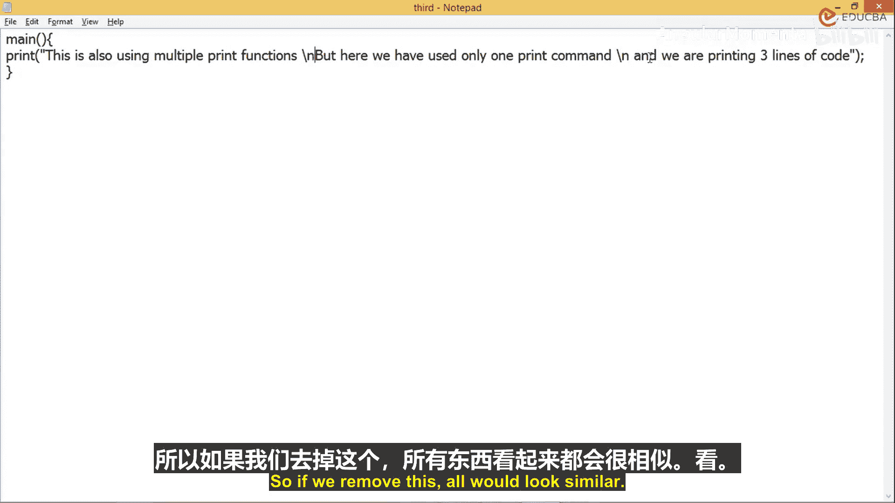

---

除了使用多个`print`函数，还有一种更简洁的方法可以在一个`print`函数中输出多行文本。

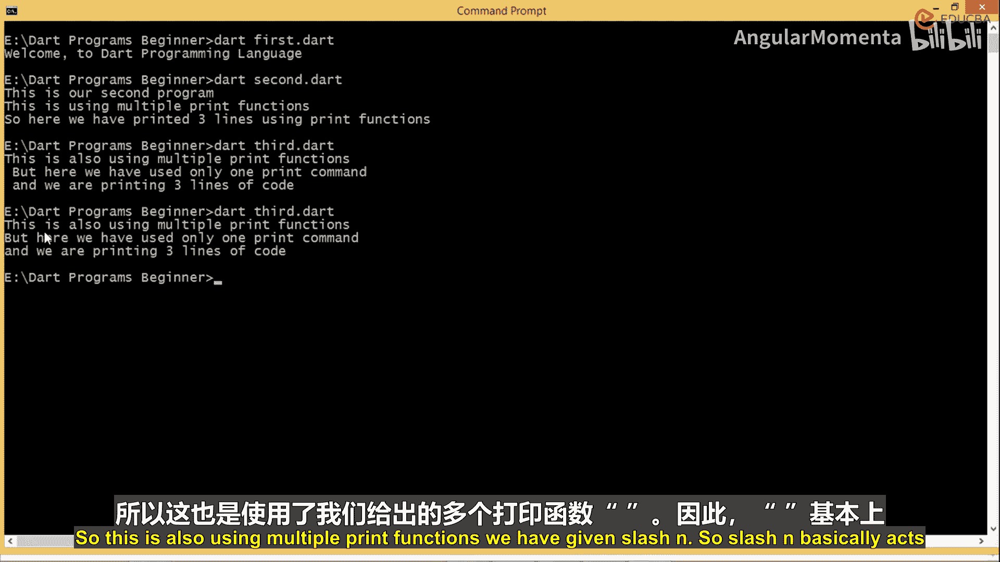

以下是在单个`print`函数中使用换行符`\n`的示例。

```dart
print('This is using\nMultiple\nPrint Functions');
```
这里，我们只使用了一个`print`函数。`\n`字符代表换行，它的作用等同于结束一个`print`语句后，在新的一行开始另一个`print`语句。这种方法将多个输出行合并到了一个函数调用中。

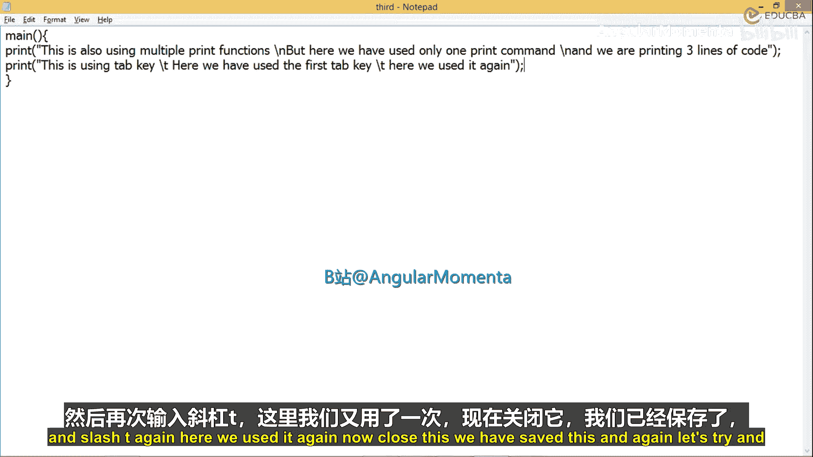

---

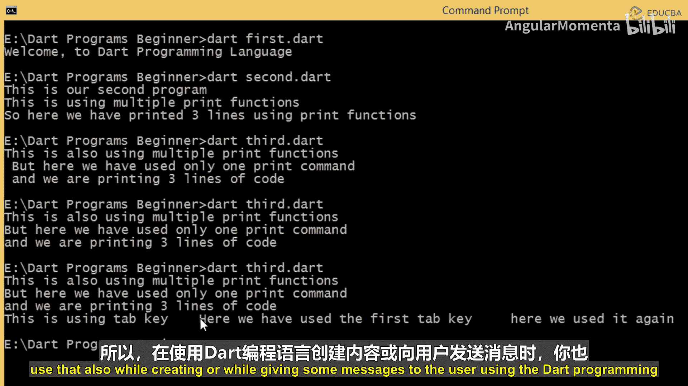

除了换行，我们还可以在输出中使用制表符来创建间隔。

以下是使用制表符`\t`的示例。

```dart
print('This is using\tMultiple\tPrint Functions');
```
`\t`代表制表符，它在输出中产生的空格比普通空格键更大，常用于对齐文本或创建视觉上的分隔。

---

在编程中，我们经常需要编写注释来解释代码，但又不希望它们被执行。Dart支持单行注释和多行注释。

以下是单行注释的示例，使用双斜杠`//`。

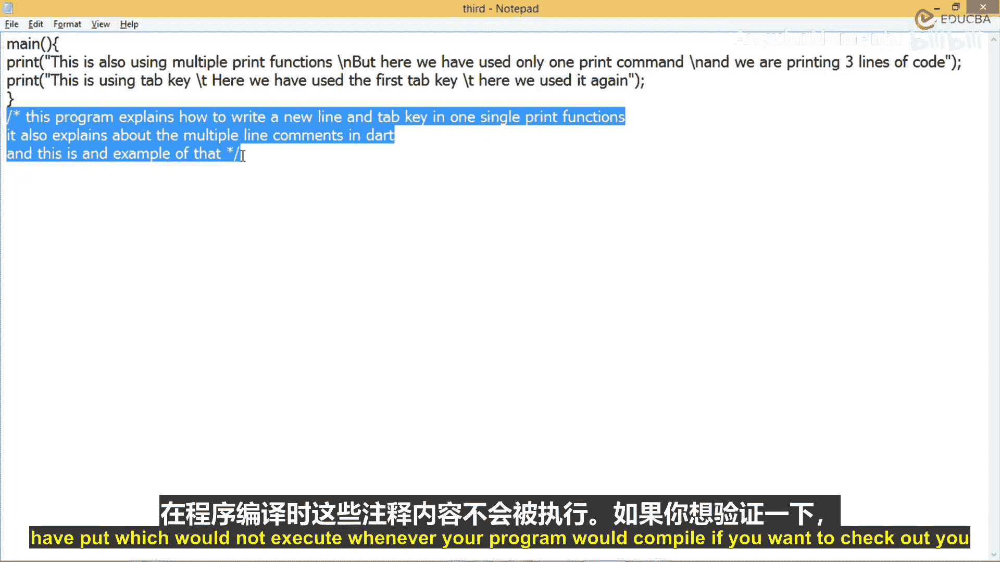

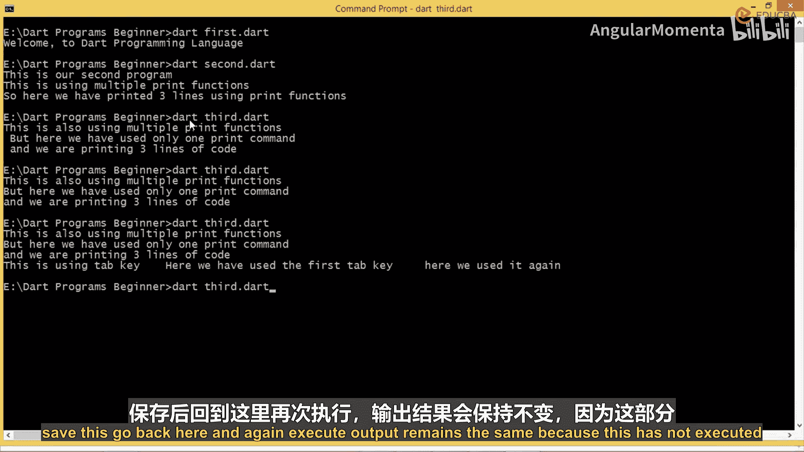

```dart
// 这是一个单行注释
print('Hello World');
```
双斜杠`//`之后直到行尾的内容都会被编译器忽略。

---

当注释内容较多时，为每一行都添加`//`会很繁琐。此时，可以使用多行注释。

以下是多行注释的示例，使用`/*`和`*/`包裹。

```dart
/*
这个程序解释了
如何在单个print函数中
使用换行符和制表符。
*/
print('Hello World');
```
被`/*`和`*/`包围的所有内容都会被视为注释，不会参与程序执行。如果尝试执行未注释的普通文本，编译器会因为无法识别语法而报错。

---

在Dart中，每一个可执行语句都必须以分号`;`结尾，这是语法强制要求的。

以下是一个缺少分号的错误示例。

```dart
print('Hello World') // 错误：这里缺少分号
print('Another line');
```
如果省略分号，编译器会明确指出错误发生的行号和位置，例如“第2行第37个位置期望一个分号”。因此，确保每条语句以分号结束至关重要。

---

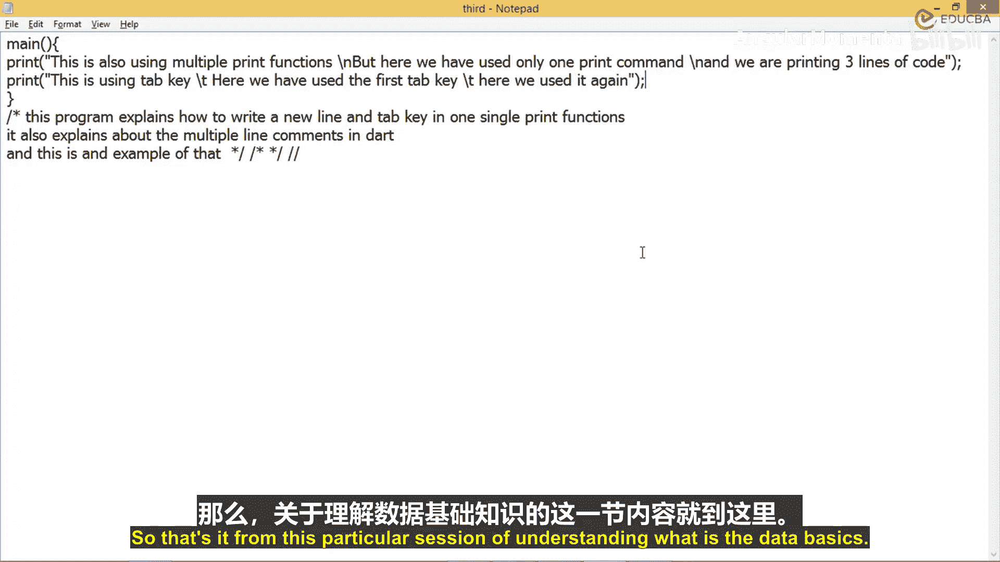

本节课中我们一起学习了Dart基础知识的延续部分。我们掌握了`print`函数的几种变化用法，包括输出多行文本、使用换行符`\n`和制表符`\t`。同时，我们也了解了如何使用`//`进行单行注释以及使用`/* */`进行多行注释。最后，我们强调了以分号结束每条可执行语句的重要性，这是避免编译错误的关键。在下一节中，我们将进一步学习Dart的语法规则和关键字。