# 005：变量与输出 📝

## 概述
在本节课中，我们将学习Dart编程语言中变量的创建与使用，以及如何通过`print`语句将变量值与文本结合输出到控制台。我们将通过多个示例程序来演示这些基础概念。

## 变量创建与命名规则
上一节我们介绍了Dart程序的基本结构。本节中，我们来看看如何创建和使用变量。

变量用于存储数据。在Dart中，我们使用`var`关键字来声明一个变量。变量名必须遵循特定的命名规则（标识符规则），并且不能使用Dart的保留关键字（如`var`）作为变量名。

以下是创建变量的基本语法：
```dart
var variableName = value;
```

## 第一个程序：打印姓名
现在，我们创建一个简单的程序来演示变量的使用。首先，我们创建`main`方法。

在`main`方法内部，我们创建变量。我们使用`var`关键字来创建变量。这里我们创建一个存储名字的变量。

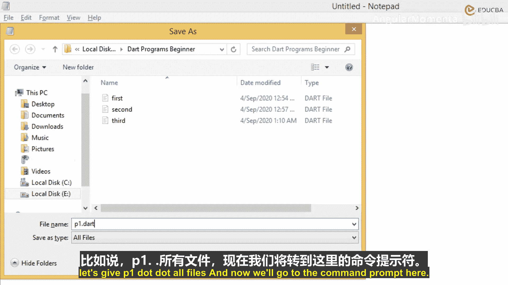

我们创建名为`firstName`的变量。我们为这个变量赋值“Richa”。每个语句必须以分号结束。

我们创建另一个名为`lastName`的变量，并为其赋值“Sherma”。

我们想要使用`print`方法输出结果。我们希望输出“welcome”以及变量`firstName`和`lastName`的值。

我们使用美元符号`$`和花括号`{}`来在字符串中插入变量值。我们输出“welcome Richa Sherma to dart programming”。这个程序的目标是组合文本与我们创建的变量值，并将其打印到命令提示符。

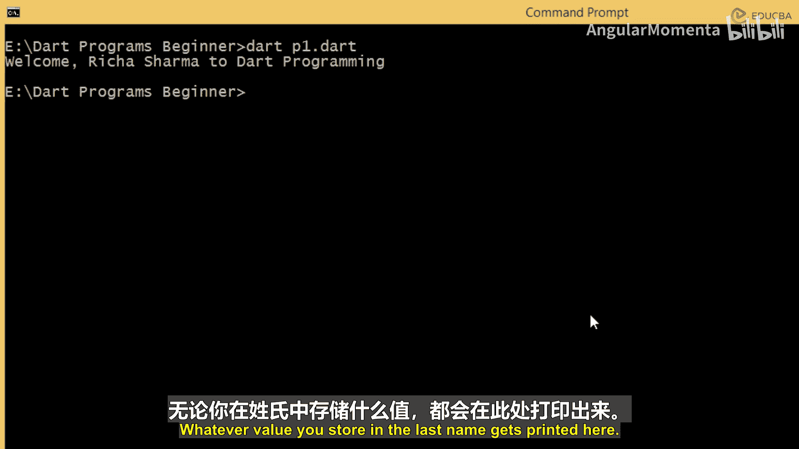

现在保存这个文件。我们将其保存为`P1.dart`。

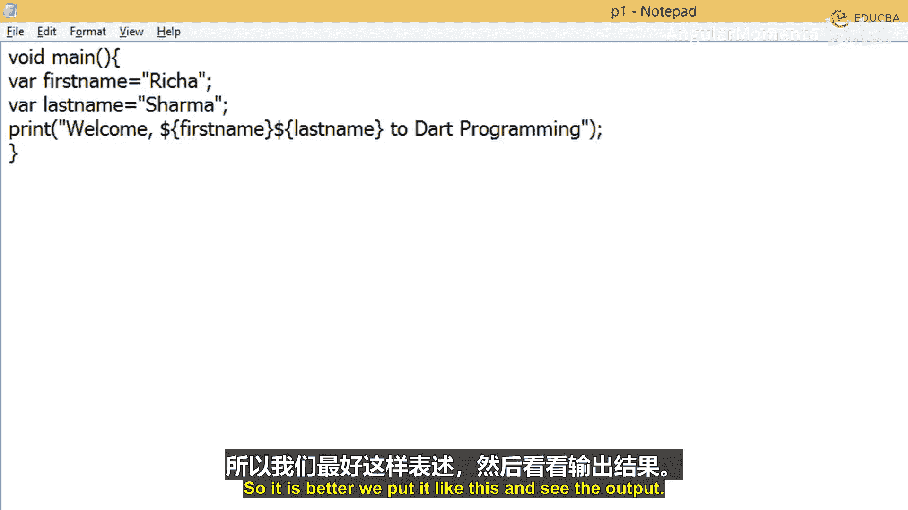

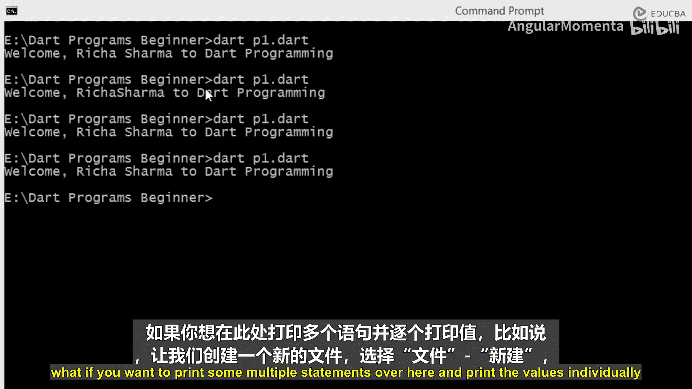

然后我们转到命令提示符，运行`P1.dart`。它输出“welcome Richa Sherma to dart programming”。

存储在`firstName`中的名字被打印在这里。存储在`lastName`中的姓氏被打印在这里。因为我们在这里给出了一个空格，所以空格出现了。如果你不放置空格，空格就不会出现。

假设我们不在这里放置空格，保存并再次执行。现在，它再次出现。即使你没有在这里给出空格，但在拼接值时你给出了一个空格，然后你结束了双引号。但这不是正确的做法。所以最好像这样放置。输出结果相同。

如果你想在这里打印多个语句并单独打印值呢？例如，让我们创建一个新的程序。

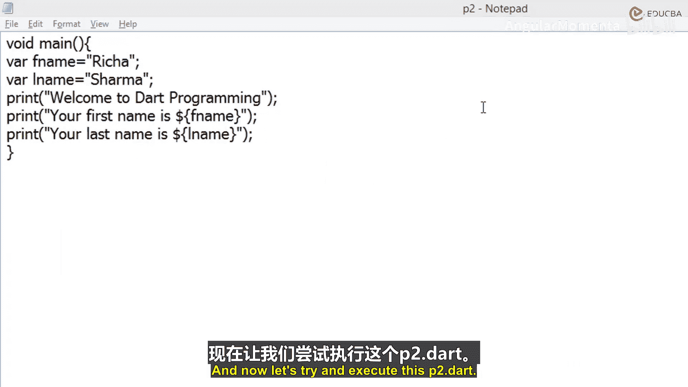

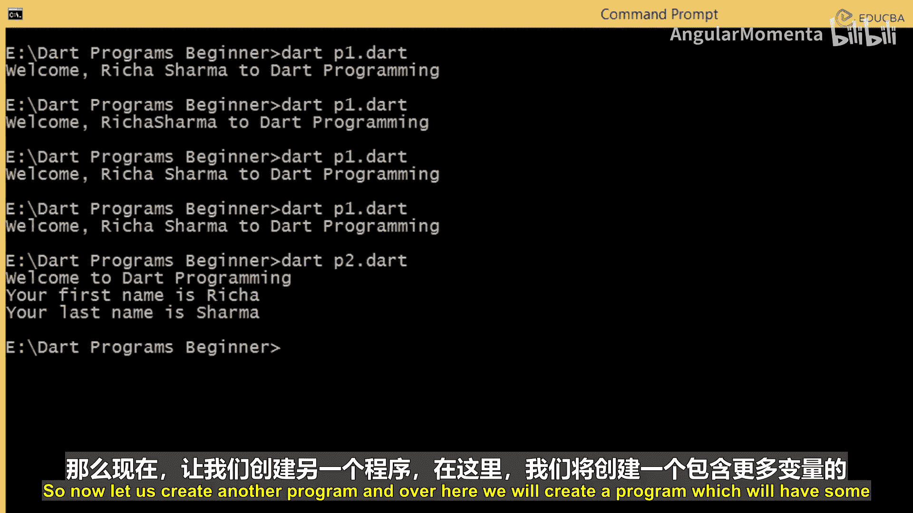

## 第二个程序：分别打印姓名
我们创建一个新文件。我们创建`main`方法。在内部，我们再次使用`var`创建`fName`变量并赋值“Richa”。我们创建`lName`变量并赋值“Sherma”。

我们使用`print`命令。我们说“Welcome to dart programming.”。然后我们说“Your first name is”，并在这里打印`$fName`的值。然后我们再次输出“Your last name is”，并在这里打印`$lName`的值。

我们将其保存为`P2.dart`。现在尝试执行`P2.dart`。它打印“Welcome to dart programming. Your first name is Richa. Your last name is Sherma.”。这是另一种打印输出的方式，完全取决于你希望如何向最终用户呈现输出。

## 第三个程序：员工信息
现在，让我们创建另一个程序。在这里，我们将创建一个包含更多变量的程序。

除了名字和姓氏，我们还将创建变量来存储年龄和部门名称。我们以员工为例，存储员工姓名、员工年龄和员工部门，然后打印这些值并显示给最终用户。

我们以`main`方法开始。我们创建变量`empName`并赋值“John Carter”。我们创建变量`empAge`并赋值一个数字，例如35。你创建的变量可以存储字符串或数字类型的值。类似地，我们再创建一个变量`salary`并赋值35000。然后我们创建变量`departmentName`并赋值“Accounts”。

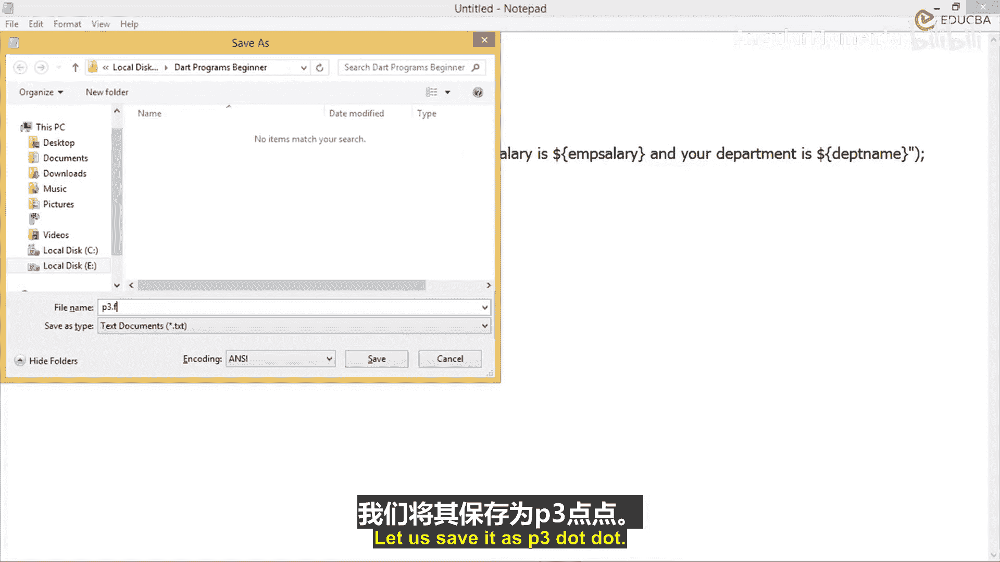

现在我们使用`print`命令。我们说“Welcome to ABC Corporation.”。然后我们打印“Your name is $empName, you are $empAge years old.”。然后我们说“Your salary is $salary”。然后我们说“Your department is $departmentName”。这就是我们想要在打印语句中输出的内容。

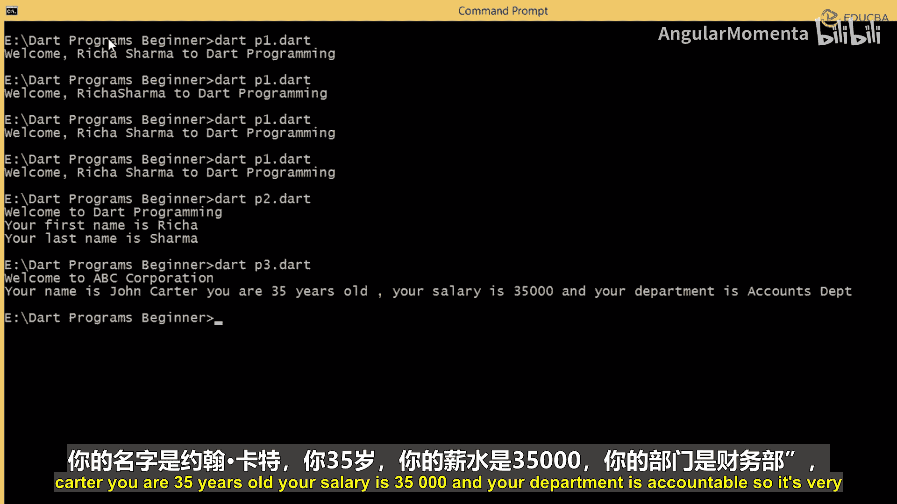

我们将其保存为`P3.dart`。让我们尝试执行`P3.dart`。它输出“Welcome to ABC Corporation. Your name is John Carter, you are 35 years old, your salary is 35000 and department is accounts.”。

这非常简单。你创建你希望创建的变量，根据适用于标识符的命名规则给予恰当的名称，然后在变量中存储适当的值，你可以按你希望的顺序打印它们，可以全部打印在一行，也可以分开打印。

你也可以使用这些值。假设我们说“Your name is $empName and you are $empAge years old.”。现在我们想在这里结束。我们想换行，然后在这里开始说“Your salary is $salary”。让我们执行它看看。

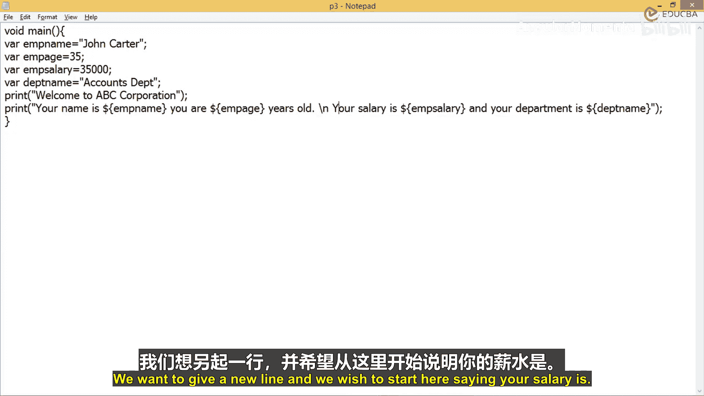

输出为：“Your name is John Carter you are 35 years old.” 句号。然后换行。“Your salary 35000 and department is accounts department.”。所以这完全取决于你如何创建打印语句，使用你学到的命令，或者在那种情况下创建多个打印语句。

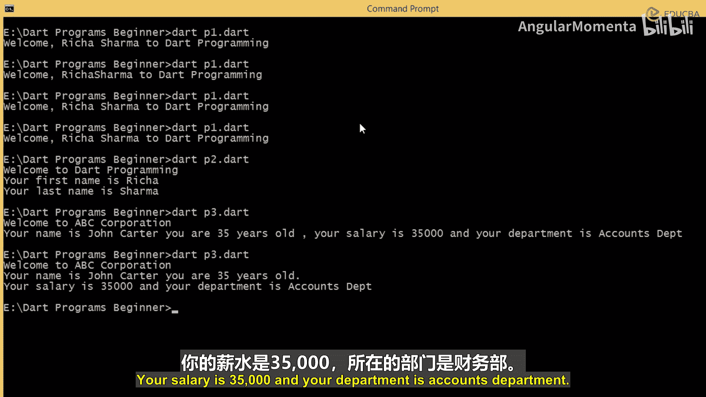

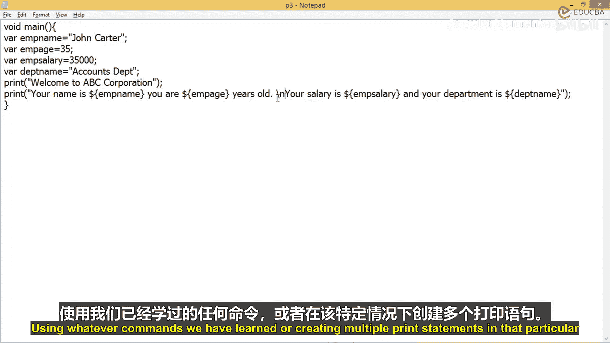

## 总结
本节课中，我们一起学习了Dart中变量的声明、赋值及基本命名规则。我们掌握了使用`print`语句结合字符串插值（`$variableName`或`${expression}`）来输出变量值的方法，并通过多个示例程序实践了如何组织代码以清晰地向用户展示信息。记住，良好的变量命名和清晰的输出格式对于编写可读性强的代码至关重要。