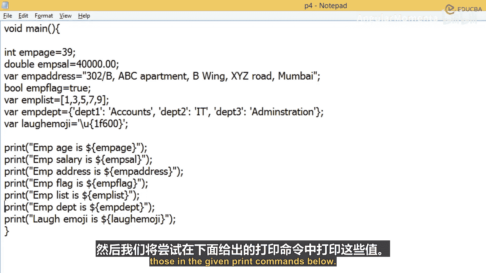
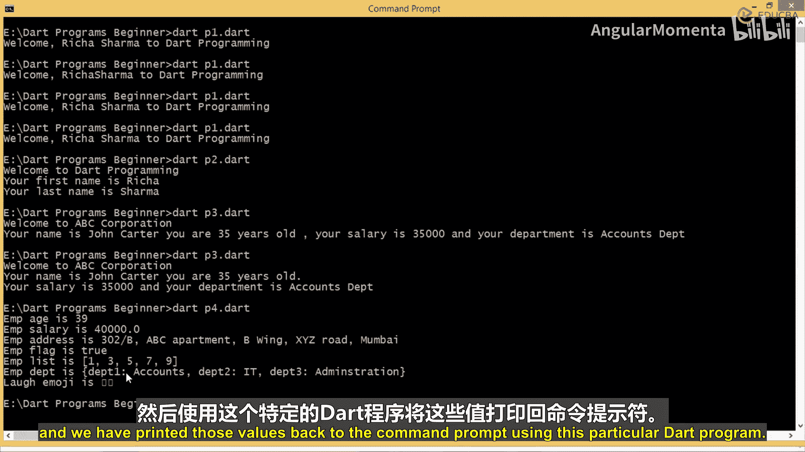

# 007：变量详解（续）📘

## 概述

在本节课中，我们将继续深入学习Dart编程语言中的变量类型。我们将探讨如何声明和使用`Map`、`Rune`和`Symbol`类型的变量，并通过一个完整的示例程序来演示如何存储和打印这些变量的值。

---

## 创建Map类型变量

上一节我们介绍了基本数据类型，本节中我们来看看如何存储键值对数据。

`Map`类型用于存储键值对数据。以下是创建和初始化`Map`变量的方法：

*   首先创建`department1`键，并为其赋值`Accounts`。
*   接着创建`department2`键，并为其赋值`IT`。
*   然后创建`department3`键，并为其赋值`Administration`。

通过这种方式，我们可以创建一个存储多个键值对的`Map`。

---

## Rune与Symbol类型变量

接下来，我们介绍两种用于存储特殊字符和标识符引用的变量类型。

`Rune`类型用于存储Unicode码点，例如一个32位的Unicode值。例如，我们可以创建一个`Rune`变量来存储表情符号：

```dart
var emoji = '\u{1f600}'; // 存储一个笑脸表情
```

`Symbol`类型用于通过标识符名称来引用对象。你可以使用`#`符号后跟标识符名称来创建：

```dart
var sym = #someIdentifier; // 创建一个Symbol类型的值
```

当你需要使用那些通过名称来引用标识符的API时，就可以使用`Symbol`数据类型。

---

## 综合示例程序

为了巩固理解，我们将创建一个程序，使用所有已学的变量类型。



以下是创建并打印各种类型变量值的完整程序：

```dart
void main() {
  // 声明并初始化各种类型的变量
  int empAge = 39;
  double empSalary = 40000.00;
  String empAddress = "B-12, Apartment, Xing, XP Road, Mumbai";
  bool empFlag = false;
  List empList = [1, 2, 3, 4, 5];
  Map empDepartment = {
    'department1': 'Accounts',
    'department2': 'IT',
    'department3': 'Administration'
  };
  var emoji = '\u{1f600}';

  // 打印所有变量的值
  print('Age is: $empAge');
  print('Salary is: $empSalary');
  print('Address is: $empAddress');
  print('Flag is: $empFlag');
  print('List is: $empList');
  print('Department is: $empDepartment');
  print('Emoji is: $emoji');
}
```

将上述代码保存为`.dart`文件并执行。在命令行中，表情符号可能无法正确显示，但在独立的集成开发环境（IDE）中运行，你将能看到完整的输出结果，包括年龄、薪水、地址、布尔值、列表、映射以及表情符号。

---

## 总结



本节课中我们一起学习了Dart中`Map`、`Rune`和`Symbol`变量的用法。我们创建了一个综合示例，演示了如何声明、赋值并打印这些不同类型的变量值。通过实践，你应能掌握使用Dart变量存储和操作各种数据的基础方法。