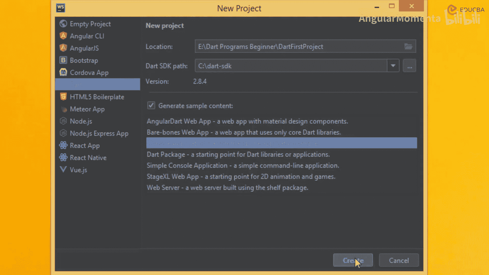
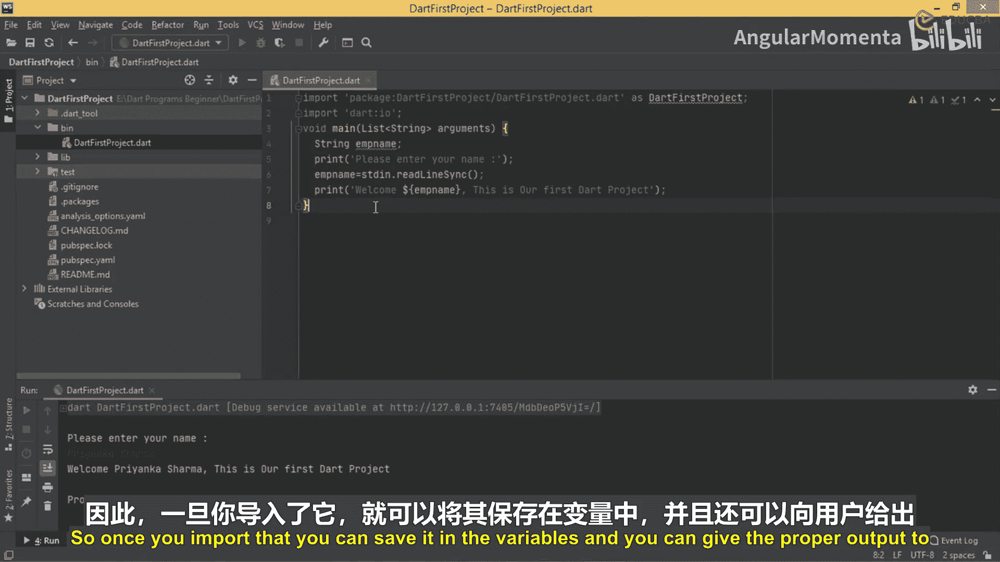

# 008：使用IDE创建第一个Dart项目 🚀

在本节课中，我们将学习如何使用集成开发环境（IDE）来创建和运行Dart项目。我们将从之前使用的记事本和命令提示符方式，过渡到更高效的WebStorm IDE，并创建一个能接收用户输入并打印欢迎信息的简单程序。

## 从命令行到IDE

上一节我们介绍了在记事本中编写代码并通过命令提示符执行的方法。本节中，我们来看看如何使用WebStorm IDE来简化这一流程。使用IDE可以避免在多个软件间切换，提高开发效率。

以下是两种主要的Dart开发方式：
*   使用IDE（如WebStorm）直接创建和管理项目，并在集成的终端中运行。
*   使用记事本编写代码，然后通过命令提示符手动执行Dart文件。



## 创建新项目

现在，我们开始使用WebStorm创建第一个Dart项目。首先，启动WebStorm并选择创建新项目。

以下是创建项目的步骤：
1.  如果Dart SDK未自动配置，需在设置中手动指定其安装路径。
2.  选择项目类型为“控制台应用程序”。
3.  设置项目名称（例如 `first_project`）和保存位置。
4.  点击“创建”按钮，IDE会自动生成项目结构和默认文件。

项目创建完成后，你可以在 `bin` 目录下看到一个与项目同名的 `.dart` 主文件。

## 编写第一个交互程序

接下来，我们将编写一个简单的交互式程序。这个程序会要求用户输入姓名，然后输出一条包含该姓名的欢迎信息。

为了实现从控制台读取输入，我们需要导入Dart的 `io` 库。核心代码如下：

```dart
import 'dart:io';

void main() {
  print('Please, enter your name:');
  String userName = stdin.readLineSync()!;
  print('Welcome $userName. This is our first Dart project.');
}
```

代码解析：
*   `import 'dart:io';`：这行代码导入了输入/输出库，使我们能够使用 `stdin` 来读取用户输入。
*   `stdin.readLineSync()`：这个方法会等待用户在控制台输入一行文本并按下回车键，然后将输入的文本作为字符串返回。
*   `String userName = ...`：我们将用户输入的值存储在一个名为 `userName` 的字符串变量中。
*   `print('Welcome $userName...')`：使用字符串插值（`$变量名`）将变量的值嵌入到输出信息中。

## 运行与测试程序

在WebStorm中运行程序非常简单。你可以点击“运行”按钮或使用快捷键 `Shift + F10`。IDE会自动编译并执行当前文件。

程序运行后，控制台会显示提示信息“Please, enter your name:”。输入一个名字（例如“John”）并按下回车，你将看到输出：“Welcome John. This is our first Dart project.”。

每次运行程序，它都会动态地等待新的输入，这证明了我们的程序是交互式的，并且变量 `userName` 的值是在运行时由用户决定的。

## 理解导入的重要性

为了加深理解，我们可以尝试注释掉导入语句 `import 'dart:io';`。你会发现，代码 `stdin.readLineSync()` 下方会出现错误提示“Undefined name ‘stdin’”。这是因为没有导入 `dart:io` 库，编译器就无法识别 `stdin` 这个对象。

这个实验清楚地表明：**任何涉及从用户获取输入或进行复杂输出（超出简单的 `print`）的操作，通常都需要导入 `dart:io` 库**。恢复导入后，错误便会消失。

## 总结



本节课中我们一起学习了如何使用WebStorm IDE创建和管理Dart项目。我们编写了一个简单的交互式控制台程序，它通过 `dart:io` 库中的 `stdin.readLineSync()` 方法接收用户输入，并使用字符串插值功能将结果输出。使用IDE的优势在于它集成了代码编辑、错误提示和程序运行环境，让开发过程更加流畅高效。