# 009：Dart示例续篇 🚀

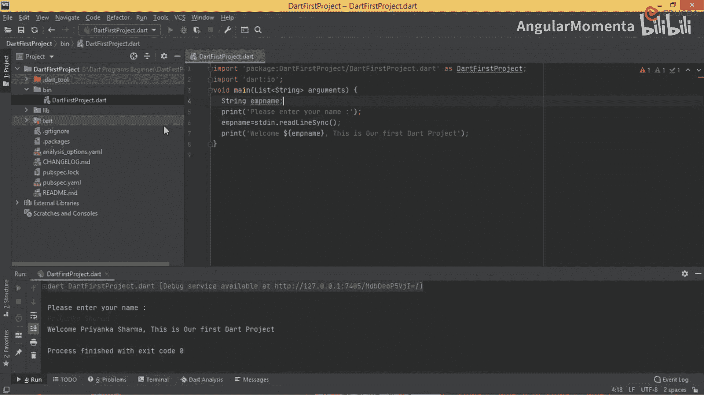

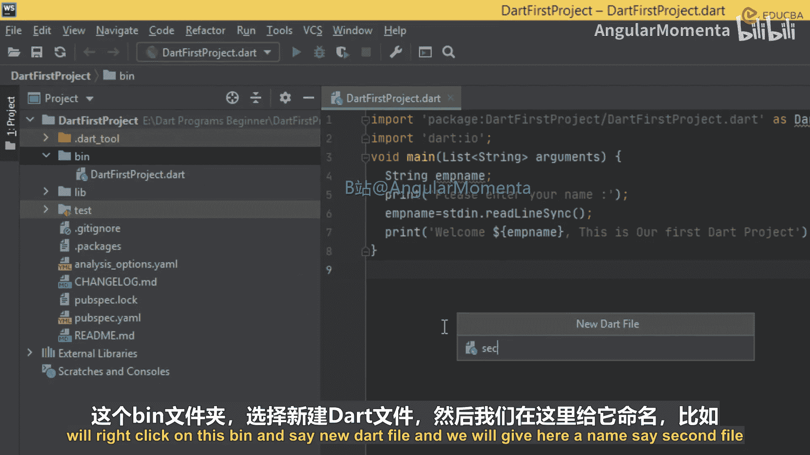

在本节课中，我们将学习如何创建一个新的Dart文件，并编写一个程序来接收用户的输入，然后将输入的值打印出来。我们将重点学习如何处理不同类型的变量，特别是如何将字符串输入转换为整数和浮点数。

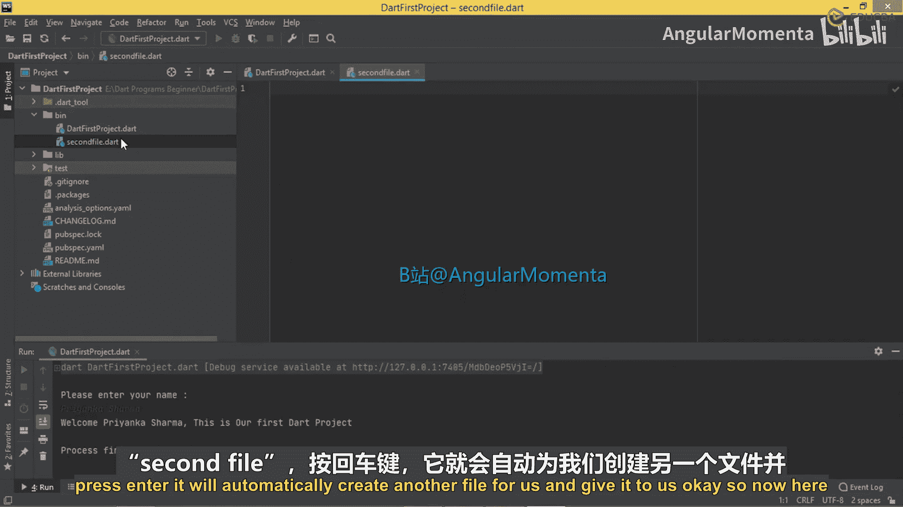

## 创建新文件

上一节我们介绍了基本的Dart程序结构。本节中我们来看看如何创建一个新的Dart文件来编写另一个程序。

以下是创建新文件的步骤：

1.  在项目资源管理器中，右键点击 `bin` 目录。
2.  选择 `New Dart File`。
3.  将新文件命名为 `second_file.dart`，然后按回车键。

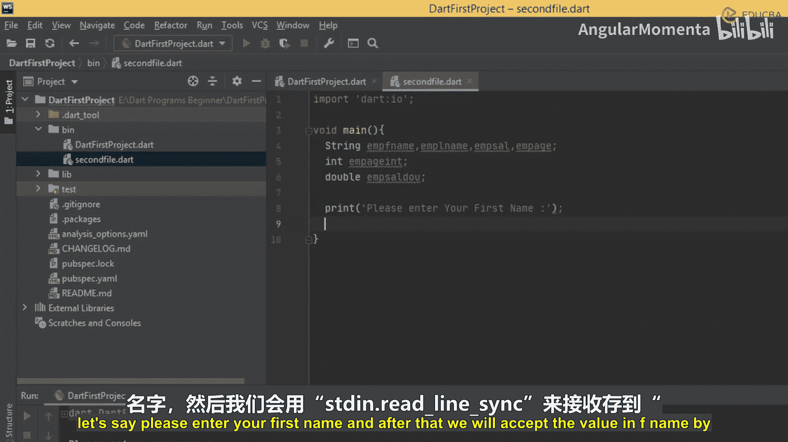

系统会自动为我们创建并打开这个新文件。

## 编写程序代码

现在，我们开始在新文件中编写代码。首先，我们需要导入Dart的输入输出库，并定义主函数。

以下是程序代码的编写步骤：

```dart
import 'dart:io';

void main() {
  // 变量声明
  String fName, lName, eAge;
  int ageInt;
  double salaryDouble;
  String eSalary;

  // 接收用户输入
  print('Please enter your First Name:');
  fName = stdin.readLineSync();

  print('Please enter your Last Name:');
  lName = stdin.readLineSync();

  print('Please enter your Age:');
  eAge = stdin.readLineSync();
  ageInt = int.parse(eAge); // 将字符串转换为整数

  print('Please enter your Salary:');
  eSalary = stdin.readLineSync();
  salaryDouble = double.parse(eSalary); // 将字符串转换为浮点数

  // 打印用户输入的信息
  print('Your First Name is: $fName');
  print('Your Last Name is: $lName');
  print('Your Age is: $ageInt');
  print('Your Salary is: $salaryDouble');
}
```

## 代码执行与结果

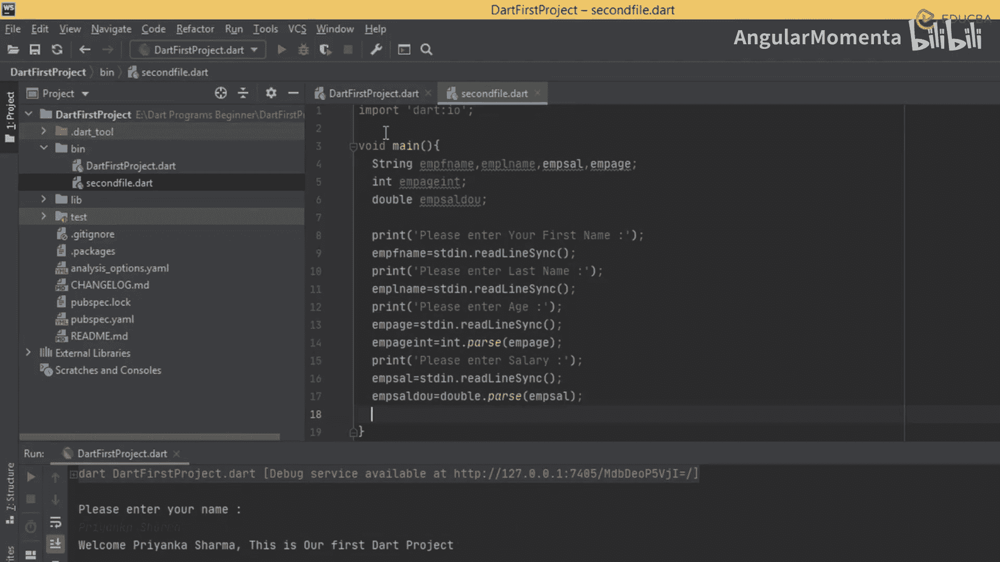

编写完代码后，我们需要运行这个新文件来查看效果。

以下是运行程序的步骤：

1.  确保当前编辑的是 `second_file.dart` 文件。
2.  点击运行按钮或使用快捷键执行程序。
3.  程序会在控制台中依次提示输入信息。

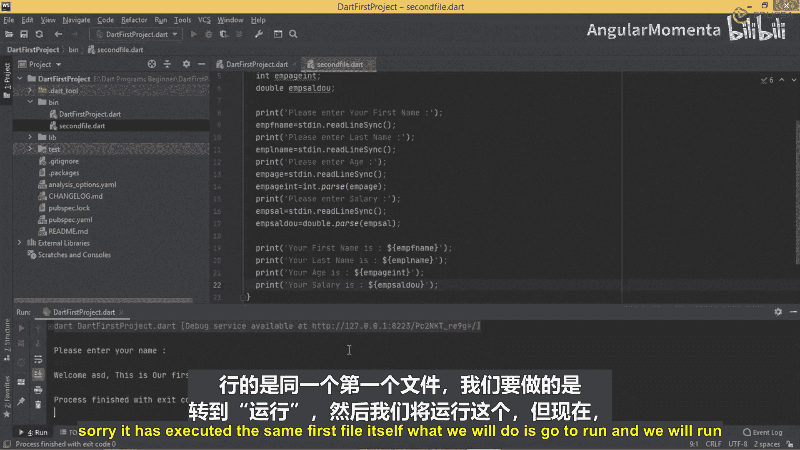

例如，当程序运行时：
- 提示 `Please enter your First Name:`，输入 `Rume`。
- 提示 `Please enter your Last Name:`，输入 `Shaha`。
- 提示 `Please enter your Age:`，输入 `40`。
- 提示 `Please enter your Salary:`，输入 `45000`。

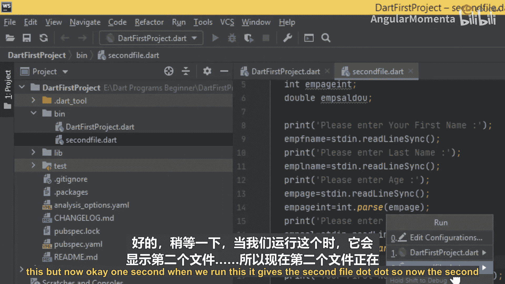

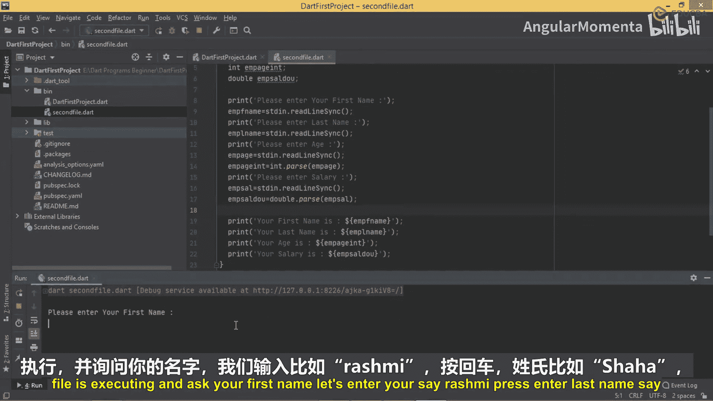

程序将输出以下结果：
```
Your First Name is: Rume
Your Last Name is: Shaha
Your Age is: 40
Your Salary is: 45000.0
```
请注意，薪水 `45000` 被输出为 `45000.0`，这是因为 `salaryDouble` 是双精度浮点数类型。

## 核心概念总结

本节课中我们一起学习了如何创建新文件、接收用户输入以及进行类型转换。

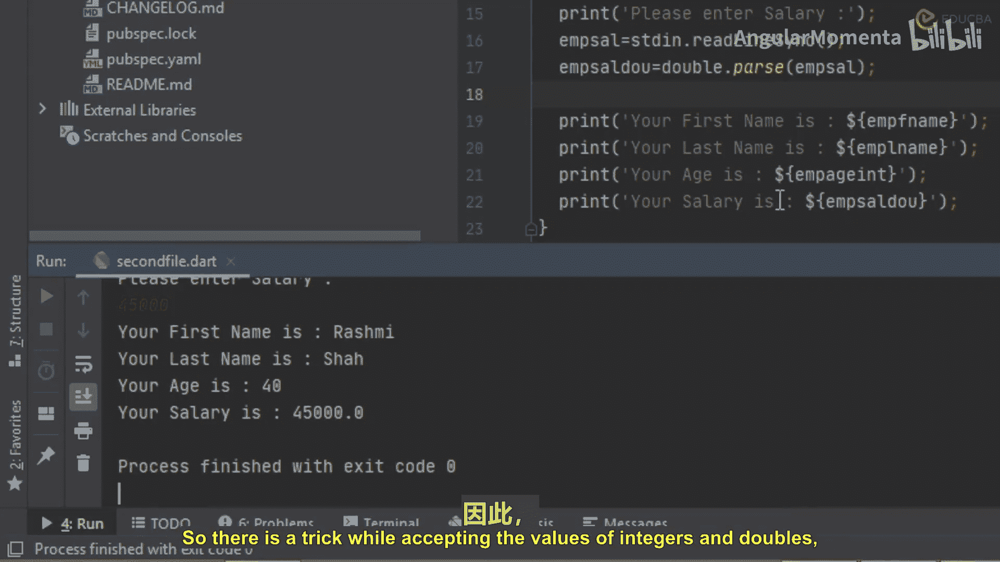

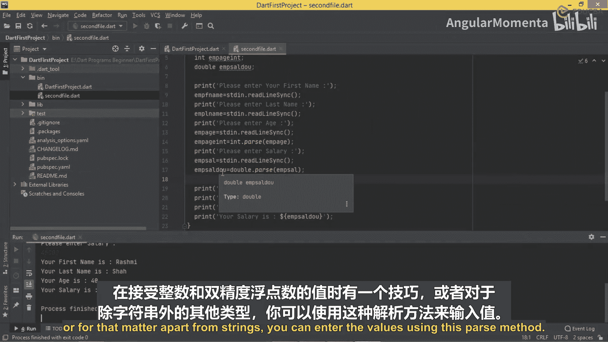

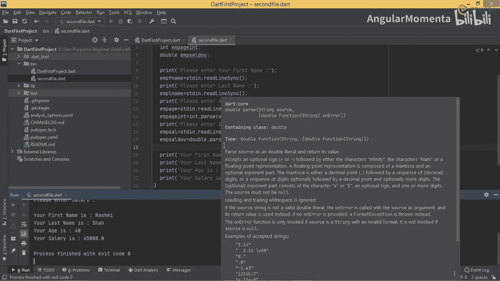

以下是本课的核心要点：

*   **创建文件**：在 `bin` 目录下右键可以创建新的Dart文件。
*   **接收输入**：使用 `stdin.readLineSync()` 从控制台获取字符串输入。
*   **类型转换**：使用 `int.parse()` 和 `double.parse()` 方法将字符串转换为整数和浮点数。这是处理非字符串输入的关键技巧。
*   **输出变量**：使用字符串插值（如 `$variableName`）在 `print` 语句中输出变量的值。

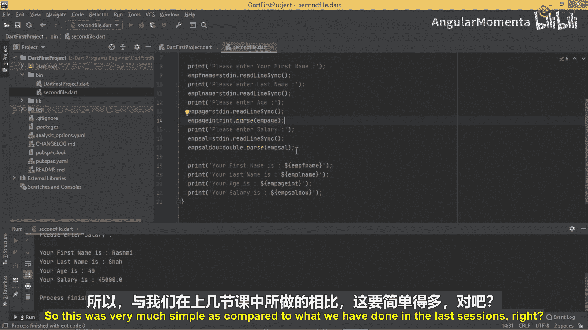

通过本课的学习，我们掌握了如何编写一个交互式的Dart程序，它不再使用固定的静态值，而是可以动态接收并处理用户输入的任何数据。这比我们之前课程中编写的程序更加灵活和实用。