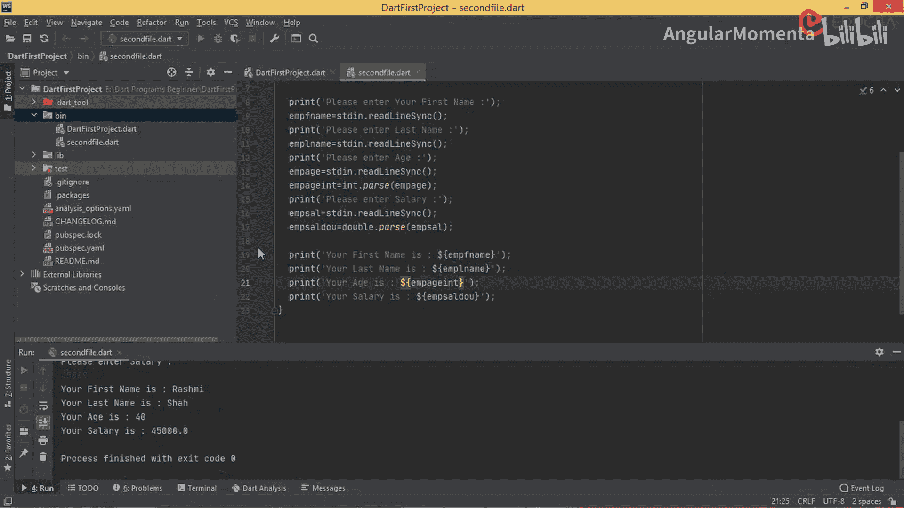
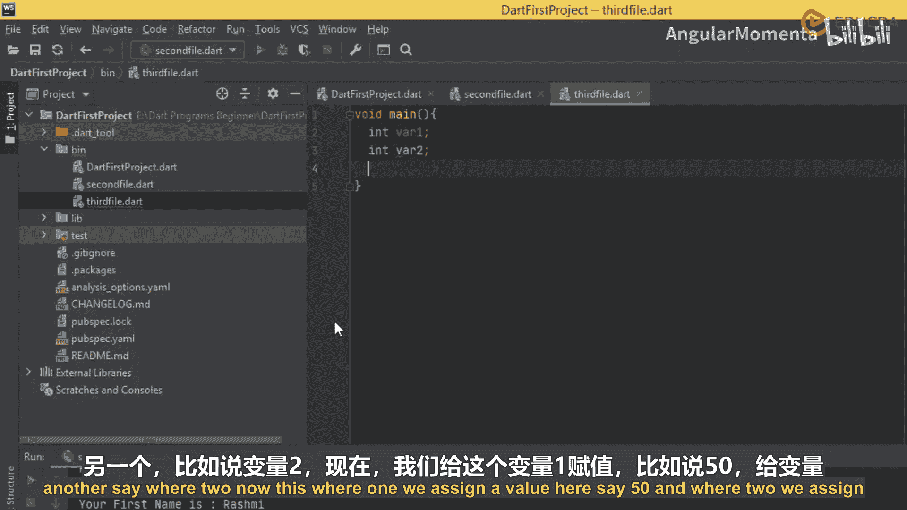
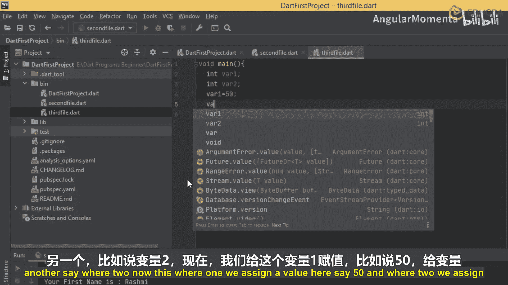
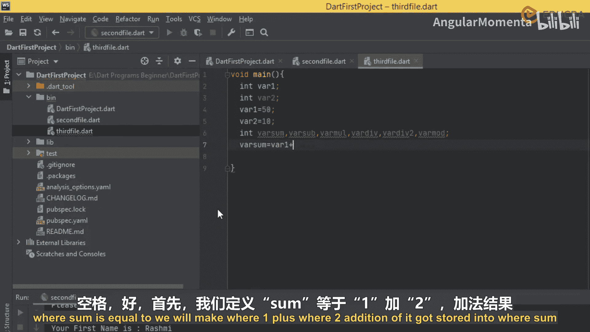
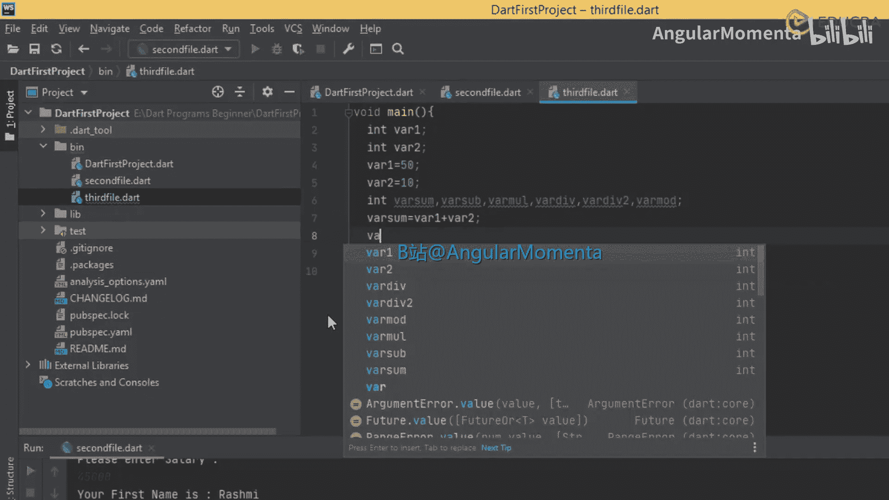
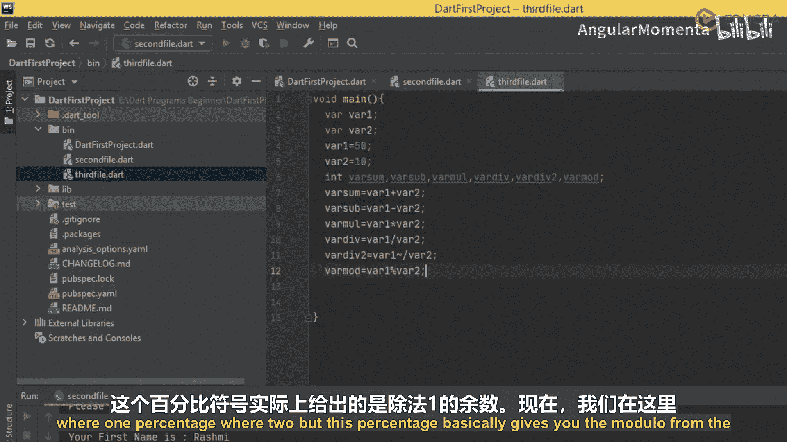
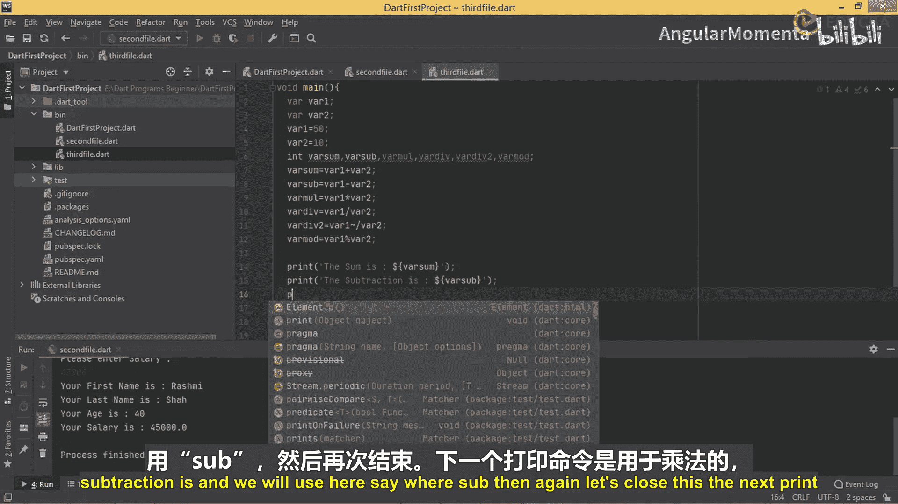
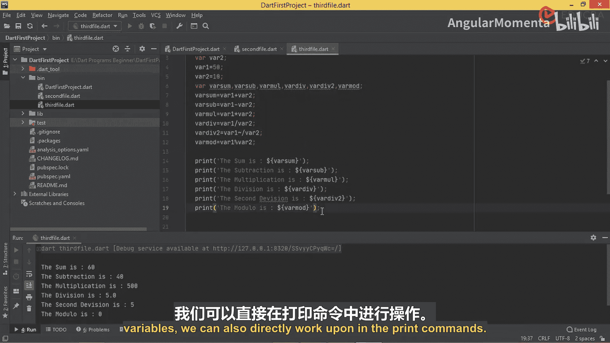

# 010：Dart运算符与算术运算入门 🧮

在本节课中，我们将要学习Dart编程语言中的运算符，特别是算术运算符。我们将通过创建简单的示例来演示如何使用这些运算符进行基本的数学计算，并理解它们之间的区别。

## 算术运算符概述

上一节我们介绍了Dart的基础知识，本节中我们来看看Dart中的运算符。首先，我们将重点学习算术运算符。

算术运算符用于执行基本的数学运算。以下是Dart中主要的算术运算符类型：

*   **加法运算符 (`+`)**：用于将两个数值相加。
*   **减法运算符 (`-`)**：用于从一个数值中减去另一个数值。
*   **一元负号运算符 (`-expr`)**：也称为取反运算符，用于反转表达式的符号。例如，正数变为负数，负数变为正数。
*   **乘法运算符 (`*`)**：用于将两个数值相乘。
*   **除法运算符 (`/`)**：用于执行除法运算，结果返回一个双精度浮点数 (`double`)。
*   **整除运算符 (`~/`)**：用于执行除法运算，但结果返回一个整数 (`int`)，即舍弃小数部分。
*   **取模运算符 (`%`)**：用于获取除法运算后的余数。

## 创建示例程序



为了理解这些运算符的用法，让我们创建一个简单的Dart程序。我们将定义两个变量，对它们应用所有算术运算符，并将结果输出给用户。





首先，我们创建一个新的Dart文件，例如 `arithmetic_operators.dart`。在这个简单的示例中，我们不需要导入任何额外的库，因为我们将直接为变量赋值。

以下是示例代码：

```dart
void main() {
  // 定义两个整型变量并赋值
  int var1 = 50;
  int var2 = 10;

  // 使用不同的算术运算符进行计算
  int varSum = var1 + var2;      // 加法
  int varSub = var1 - var2;      // 减法
  int varMul = var1 * var2;      // 乘法
  double varDiv = var1 / var2;   // 除法，结果为double
  int varDiv2 = var1 ~/ var2;    // 整除，结果为int
  int varMod = var1 % var2;      // 取模

  // 打印所有运算结果
  print('The sum is: $varSum');
  print('The subtraction is: $varSub');
  print('The multiplication is: $varMul');
  print('The division is: $varDiv');
  print('The second division (integer result) is: $varDiv2');
  print('The modular is: $varMod');
}
```





运行此程序，你将看到如下输出：

```
The sum is: 60
The subtraction is: 40
The multiplication is: 500
The division is: 5.0
The second division (integer result) is: 5
The modular is: 0
```

## 运算符使用要点



从输出结果中，我们可以观察到以下几点：

1.  加法、减法、乘法的结果都是整数。
2.  使用普通除法运算符 (`/`) 得到的结果是双精度浮点数 `5.0`。
3.  使用整除运算符 (`~/`) 得到的结果是整数 `5`，它直接舍弃了小数部分。
4.  取模运算符 (`%`) 计算了 `50` 除以 `10` 的余数，结果为 `0`。



这个简单的例子展示了如何声明变量、使用运算符进行计算以及输出结果。

## 进阶应用思路

除了将计算结果存储在变量中再打印，我们还可以直接在 `print` 语句中进行运算。例如：

```dart
print('Direct calculation - Sum: ${var1 + var2}');
```

在后续的示例中，我们还可以学习如何从用户那里接收输入值，然后进行运算并将结果反馈给用户，这将使程序更具交互性。

## 课程总结



本节课中我们一起学习了Dart语言中的算术运算符。我们了解了加法 (`+`)、减法 (`-`)、取反 (`-expr`)、乘法 (`*`)、除法 (`/`)、整除 (`~/`) 和取模 (`%`) 运算符的用途和区别，并通过一个完整的代码示例实践了它们的用法。理解这些基础运算符是进行更复杂Dart编程的第一步。