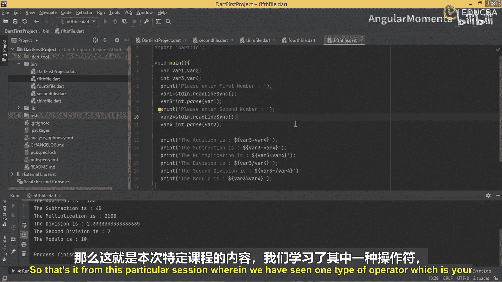

# 011：使用算术运算符进行计算 🧮

在本节课中，我们将要学习如何在Dart程序中使用算术运算符进行计算。我们将从编写一个简单的静态计算程序开始，然后逐步过渡到创建一个能够从用户那里接收输入并进行计算的交互式程序。

## 静态计算程序

上一节我们介绍了算术运算符的基本概念，本节中我们来看看如何在一个简单的Dart程序中使用它们。我们将创建一个名为`fourth_file.dart`的文件，在其中直接使用运算符进行计算，而无需将中间结果存储在额外的变量中。

以下是`fourth_file.dart`的代码示例：

```dart
void main() {
  var var1 = 10;
  var var2 = 5;

  print('Addition is: ${var1 + var2}');
  print('Subtraction is: ${var1 - var2}');
  print('Multiplication is: ${var1 * var2}');
  print('Division is: ${var1 / var2}');
  print('Second Division is: ${var1 ~/ var2}');
  print('Modulo is: ${var1 % var2}');
}
```

运行此程序，输出结果将与之前使用多个变量的程序完全相同。唯一的区别在于，我们节省了创建额外变量的时间，使程序更加简洁。

## 交互式计算程序

静态程序虽然简单，但缺乏灵活性。接下来，我们将创建一个能够从用户那里接收输入的程序，使其更具交互性。我们将创建一个名为`fifth_file.dart`的新文件。

为了实现用户输入，我们需要导入`dart:io`库。以下是创建交互式程序的步骤：

1.  导入必要的库。
2.  提示用户输入两个数字。
3.  将输入的字符串转换为整数。
4.  使用算术运算符进行计算并输出结果。

以下是`fifth_file.dart`的完整代码：

```dart
import 'dart:io';

void main() {
  print('Please enter first number:');
  var input1 = stdin.readLineSync();
  var var3 = int.parse(input1!);

  print('Please enter second number:');
  var input2 = stdin.readLineSync();
  var var4 = int.parse(input2!);

  print('Addition is: ${var3 + var4}');
  print('Subtraction is: ${var3 - var4}');
  print('Multiplication is: ${var3 * var4}');
  print('Division is: ${var3 / var4}');
  print('Second Division is: ${var3 ~/ var4}');
  print('Modulo is: ${var3 % var4}');
}
```

运行此程序时，它会提示用户输入第一个和第二个数字。例如，输入`70`和`20`，程序将计算并输出以下结果：
- 加法结果为 `90`
- 减法结果为 `50`
- 乘法结果为 `1400`
- 除法结果为 `3.5`
- 整除结果为 `3`
- 取模结果为 `10`

这种方法比静态程序更有意义，因为它允许用户动态地输入他们想要计算的值，从而使程序变得真正有用。

## 总结




本节课中我们一起学习了Dart中算术运算符的两种应用方式。我们首先编写了一个直接使用固定值进行计算的简洁程序，然后创建了一个能够从用户获取输入并进行计算的交互式程序。理解如何接收和处理用户输入是构建实用应用程序的基础。通过本节的学习，你应该已经掌握了使用基本算术运算符执行计算的方法。