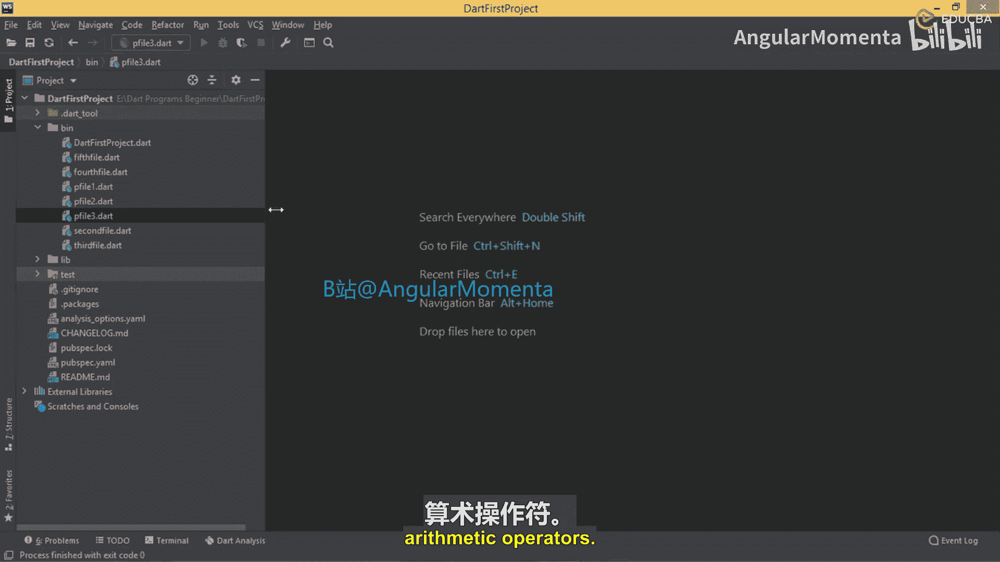
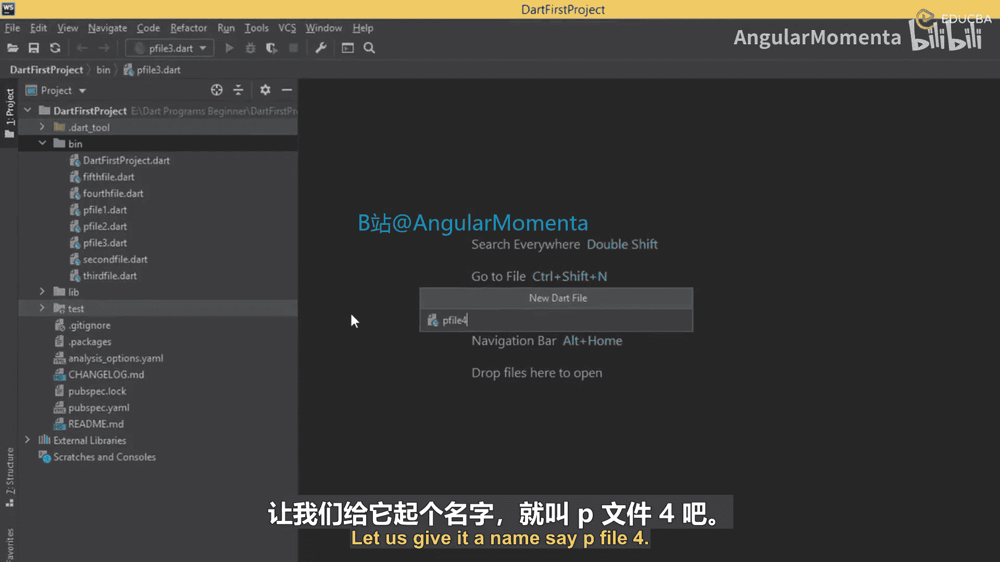
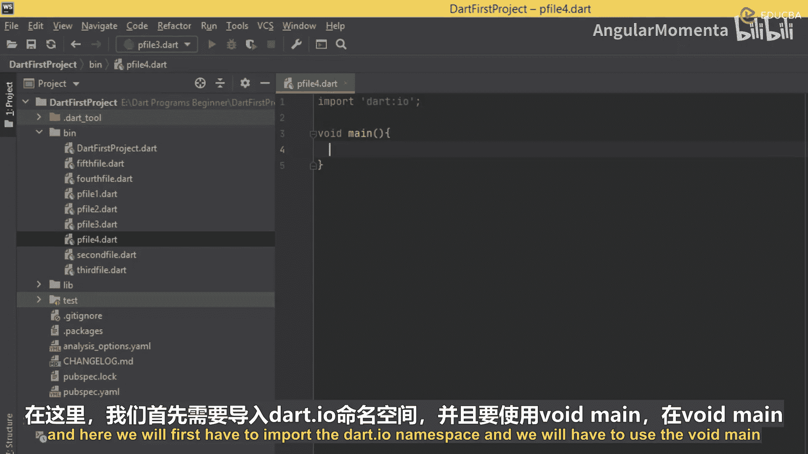
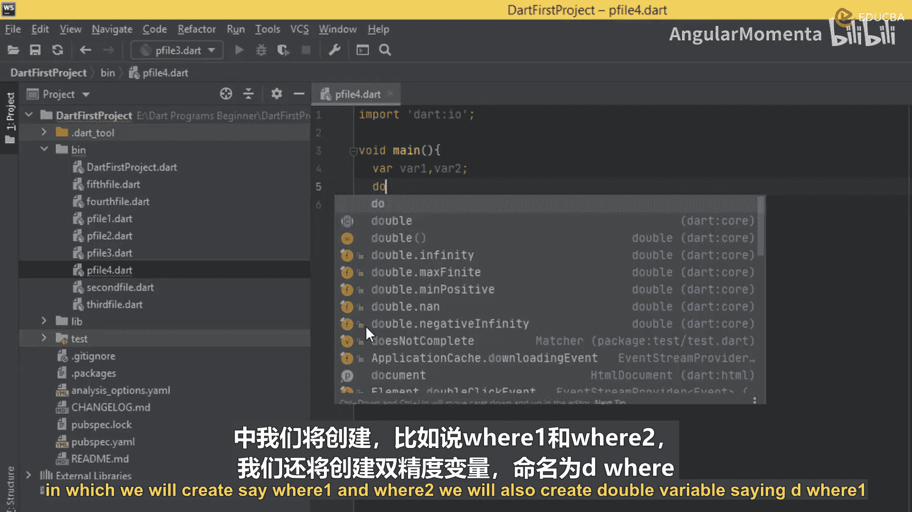
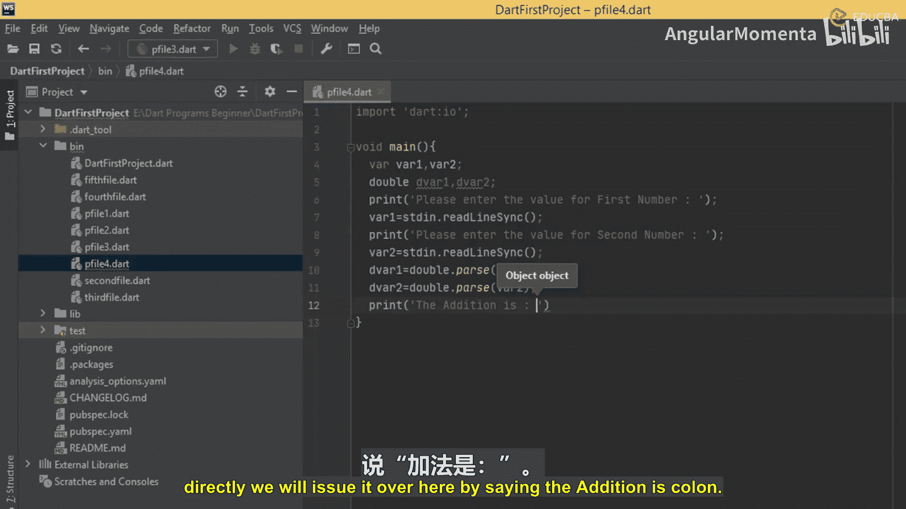
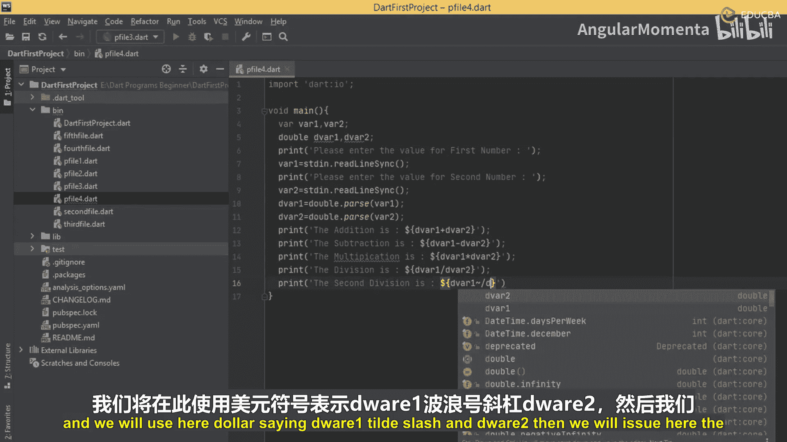
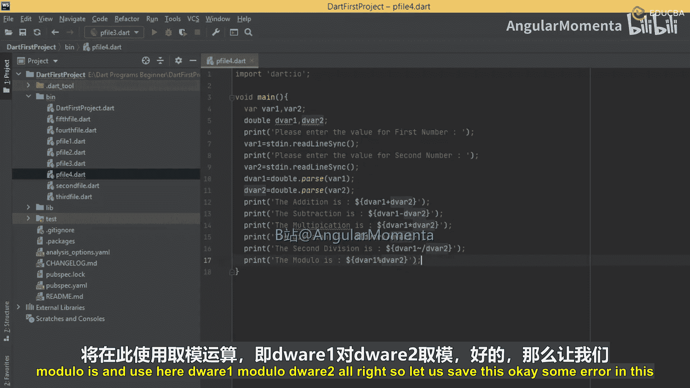
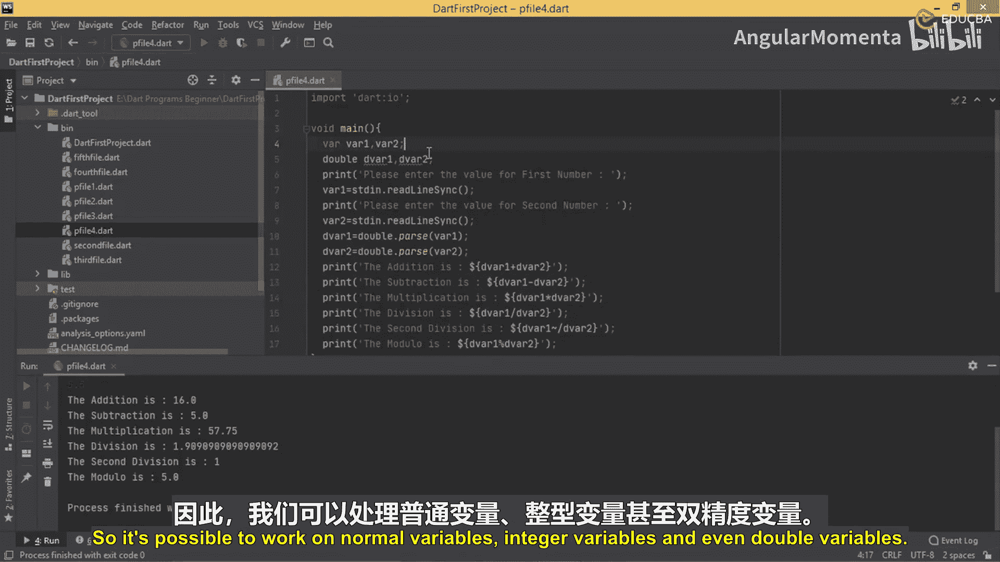

# 012：使用关系运算符比较数值

在本节课中，我们将学习如何在Dart程序中对双精度浮点数（`double`类型）使用算术运算符。我们将创建一个程序，从用户那里接收两个浮点数，然后执行并打印所有基本算术运算的结果。

上一节我们介绍了如何在整数变量上使用算术运算符。本节中我们来看看如何对`double`类型的变量执行相同的操作。



## 创建程序文件

首先，我们需要创建一个新的Dart文件。我们将其命名为 `p_file_4.dart`。

在文件的开头，我们必须导入 `dart:io` 命名空间，以便从控制台读取用户输入。然后，在 `main` 函数中，我们将声明变量并编写逻辑。





以下是创建文件并设置基本结构的步骤：



1.  导入 `dart:io` 库。
2.  定义 `main` 函数。
3.  在 `main` 函数内声明两个 `String` 类型的变量（`var1` 和 `var2`）来接收用户输入。
4.  使用 `print` 函数提示用户输入。
5.  使用 `stdin.readLineSync()` 方法获取用户输入。

## 接收并转换用户输入

程序需要接收两个数字。由于从控制台读取的输入是字符串格式，我们需要将其转换为 `double` 类型才能进行数学运算。

以下是处理输入的具体步骤：



1.  提示用户输入第一个数字，并将输入存储在 `var1` 中。
2.  提示用户输入第二个数字，并将输入存储在 `var2` 中。
3.  使用 `double.parse()` 方法将 `var1` 和 `var2` 的字符串值转换为双精度浮点数，并分别存储在新的 `double` 类型变量 `d_var1` 和 `d_var2` 中。

关键转换代码如下：
```dart
d_var1 = double.parse(var1);
d_var2 = double.parse(var2);
```

## 执行算术运算并输出结果

转换完成后，我们可以直接对 `d_var1` 和 `d_var2` 使用算术运算符，并使用字符串插值将结果打印出来，而无需创建额外的结果变量。



我们将依次执行以下运算：



*   **加法**：`d_var1 + d_var2`
*   **减法**：`d_var1 - d_var2`
*   **乘法**：`d_var1 * d_var2`
*   **除法**：我们将演示两种除法：
    *   **普通除法**：`d_var1 / d_var2` (结果是 `double`)
    *   **整除**：`d_var1 ~/ d_var2` (结果是 `int`，丢弃小数部分)
*   **取模**：`d_var1 % d_var2` (求余数)

以下是输出这些运算结果的代码示例：
```dart
print('Addition is: ${d_var1 + d_var2}');
print('Subtraction is: ${d_var1 - d_var2}');
print('Multiplication is: ${d_var1 * d_var2}');
print('Division is: ${d_var1 / d_var2}'); // 普通除法
print('Second division is: ${d_var1 ~/ d_var2}'); // 整除
print('Modulo is: ${d_var1 % d_var2}');
```

## 运行与测试

保存文件后，我们可以在终端中运行它来测试功能。

运行命令：
```bash
dart p_file_4.dart
```

程序会等待用户输入。例如，输入 `52.8` 作为第一个数，`12.6` 作为第二个数。程序将计算并显示所有运算结果。即使结果是整数（如整除运算），由于原始变量是 `double` 类型，输出也可能显示为 `10.0` 这样的格式，这是正常的。

通过这个练习，我们可以看到，算术运算符不仅适用于整数（`int`），也同样适用于浮点数（`double`）。处理流程是相似的：获取输入、进行类型转换、执行运算、输出结果。



本节课中我们一起学习了如何为 `double` 类型的变量应用算术运算符。我们创建了一个完整的程序，从接收用户输入、转换数据类型，到执行加、减、乘、除、整除和取模运算，并直接输出结果。这巩固了我们对Dart基本运算和输入处理的理解。