# 013：运用赋值运算符

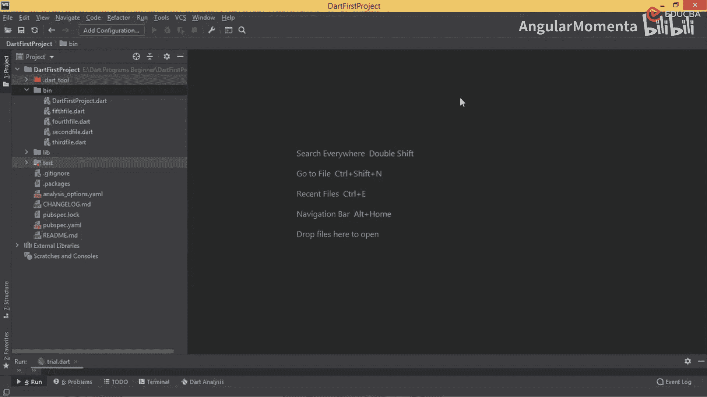

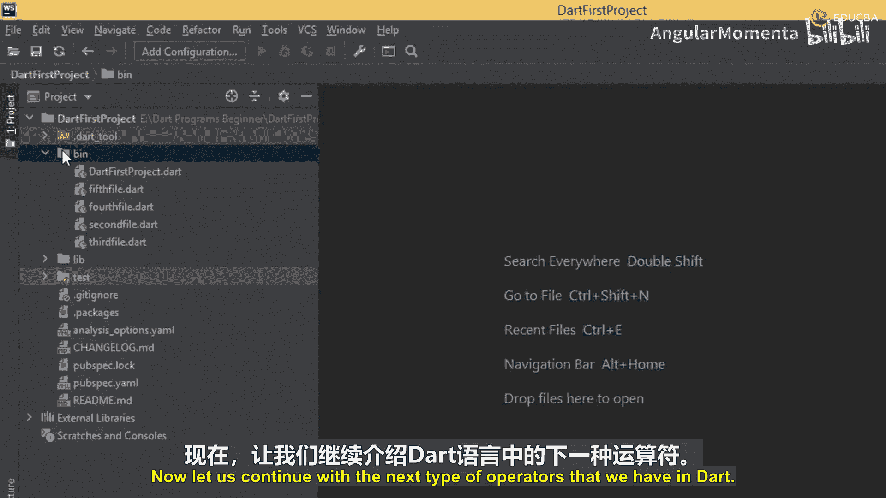

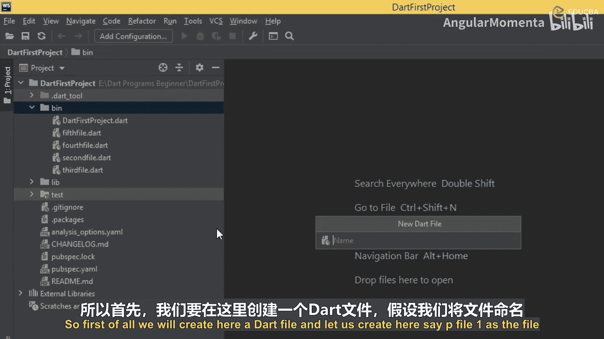

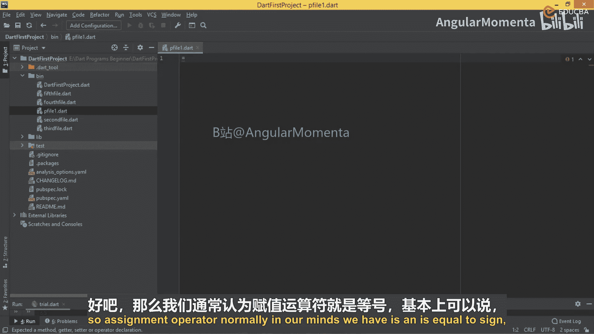

在本节课中，我们将要学习Dart语言中的赋值运算符。赋值运算符用于为变量赋值，除了基础的等号（`=`）外，Dart还提供了一系列复合赋值运算符，它们能更简洁地执行运算和赋值操作。

上一节我们介绍了逻辑运算符，本节中我们来看看赋值运算符。

## 理解赋值运算符

赋值运算符的核心功能是为变量分配值。最基本的赋值运算符是等号 `=`。

例如，在 `void main()` 方法中创建一个变量并赋值：
```dart
void main() {
  var num1 = 50;
}
```
在这个例子中，`=` 就是一个简单的赋值运算符。

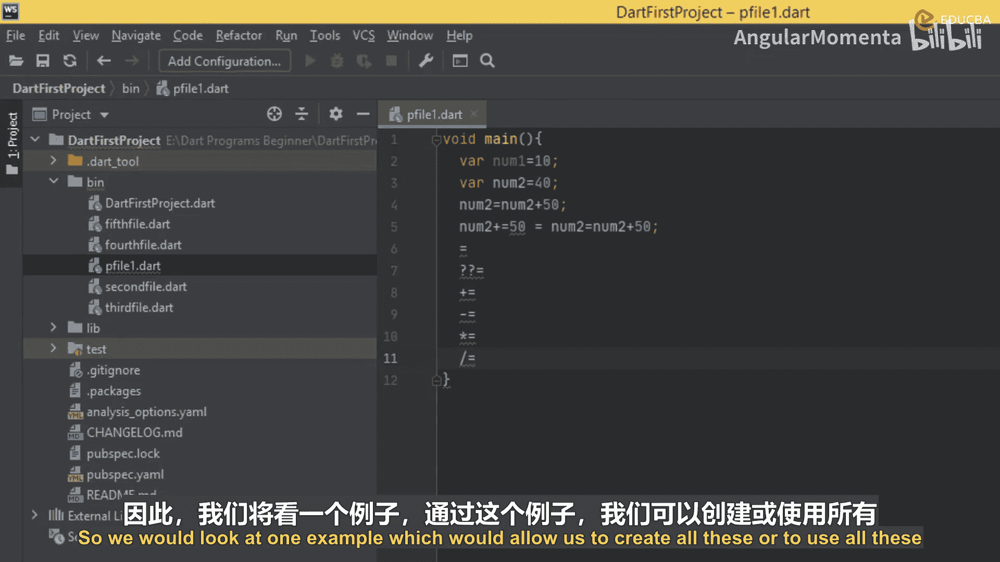

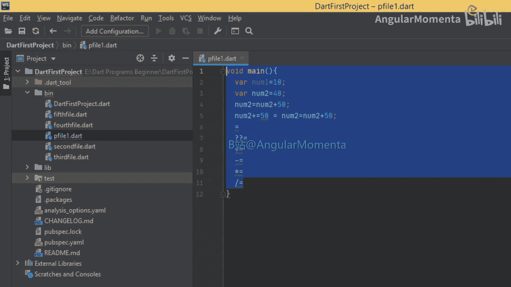

然而，Dart还提供了其他类型的赋值运算符，它们结合了算术运算和赋值。例如：
```dart
num2 = num2 + 50;
```
这行代码可以简写为：
```dart
num2 += 50;
```
这里的 `+=` 就是一个算术赋值运算符，它表示“先加后赋值”。

以下是Dart中主要的赋值运算符类型：
*   **简单赋值运算符**：`=`。
*   **空感知赋值运算符**：`??=`。仅当变量为 `null` 时才进行赋值。
*   **加法赋值运算符**：`+=`。
*   **减法赋值运算符**：`-=`。
*   **乘法赋值运算符**：`*=`。
*   **除法赋值运算符**：`/=`。
*   **取模赋值运算符**：`%=`。

## 实践：使用赋值运算符

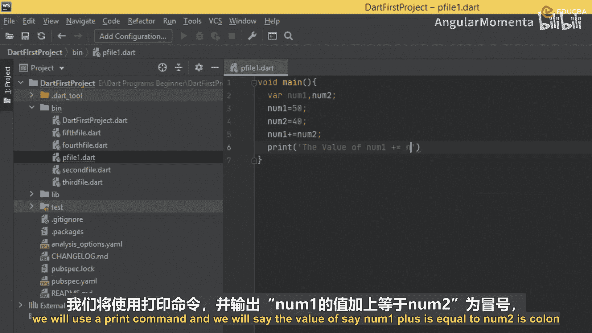

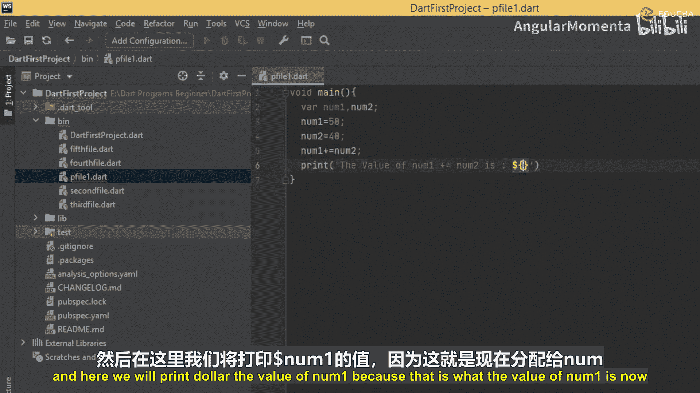

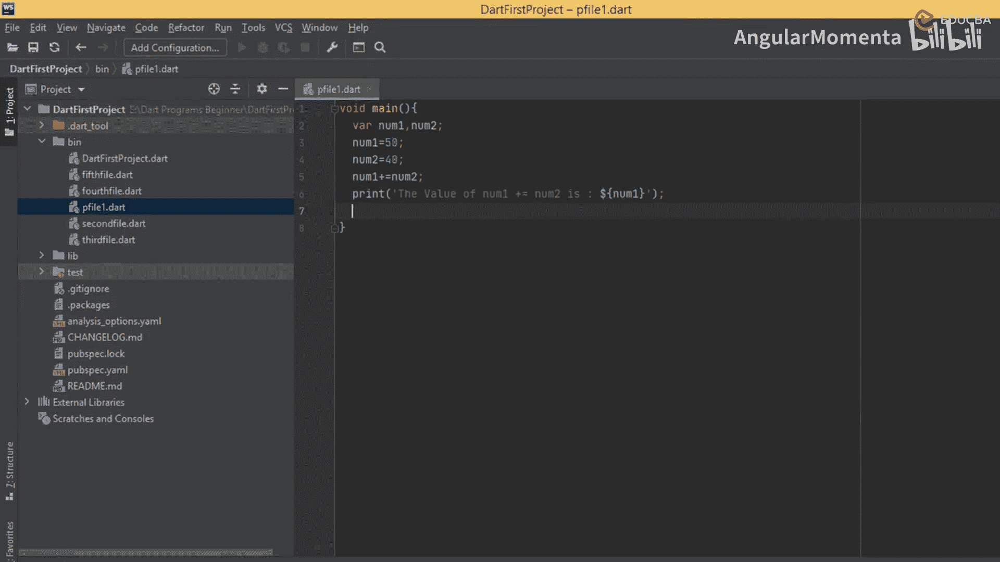

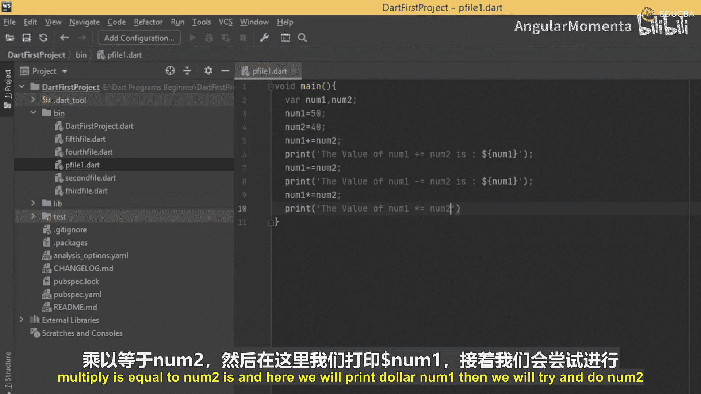

为了理解这些运算符如何工作，我们将创建一个程序来演示它们的用法。这个程序不接收用户输入，而是直接定义变量、赋值，然后使用各种赋值运算符进行计算并打印结果。

以下是完整的程序代码：
```dart
void main() {
  // 初始化变量
  int number1 = 50;
  int number2 = 40;

  // 使用 += 运算符
  print('初始值: number1 = $number1, number2 = $number2');
  number1 += number2; // 等价于 number1 = number1 + number2
  print('执行 number1 += number2 后，number1 的值为: $number1');

  // 使用 -= 运算符
  print('当前值: number1 = $number1, number2 = $number2');
  number1 -= number2; // 等价于 number1 = number1 - number2
  print('执行 number1 -= number2 后，number1 的值为: $number1');

  // 使用 *= 运算符
  print('当前值: number1 = $number1, number2 = $number2');
  number1 *= number2; // 等价于 number1 = number1 * number2
  print('执行 number1 *= number2 后，number1 的值为: $number1');

  // 使用 /= 运算符 (注意结果会变为 double 类型)
  print('当前值: number1 = $number1, number2 = $number2');
  number1 /= number2; // 等价于 number1 = number1 / number2
  print('执行 number1 /= number2 后，number1 的值为: $number1');

  // 使用 %= 运算符
  print('当前值: number1 = $number1, number2 = $number2');
  number1 %= number2; // 等价于 number1 = number1 % number2
  print('执行 number1 %= number2 后，number1 的值为: $number1');
}
```

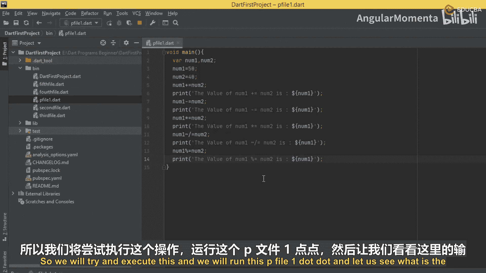

运行此程序，你将看到类似以下的输出：
```
初始值: number1 = 50, number2 = 40
执行 number1 += number2 后，number1 的值为: 90
当前值: number1 = 90, number2 = 40
执行 number1 -= number2 后，number1 的值为: 50
当前值: number1 = 50, number2 = 40
执行 number1 *= number2 后，number1 的值为: 2000
当前值: number1 = 2000, number2 = 40
执行 number1 /= number2 后，number1 的值为: 50.0
当前值: number1 = 50, number2 = 40
执行 number1 %= number2 后，number1 的值为: 10
```

通过每一步打印变量的当前值，我们可以清晰地跟踪 `number1` 是如何被每个赋值运算符改变的：
1.  `50 + 40 = 90`
2.  `90 - 40 = 50`
3.  `50 * 40 = 2000`
4.  `2000 / 40 = 50.0`
5.  `50 % 40 = 10` (50除以40的余数)

## 总结

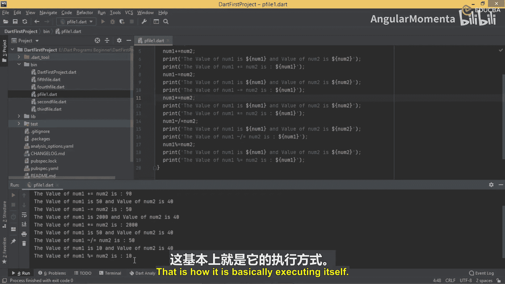

本节课中我们一起学习了Dart的赋值运算符。我们了解到，除了基础的 `=`，Dart还提供了 `+=`、`-=`、`*=`、`/=` 和 `%=` 等复合赋值运算符，它们能够用更简洁的语法实现运算和赋值的结合。通过实际编程练习，我们观察了这些运算符如何逐步改变变量的值。掌握这些运算符能让你的代码更加简洁高效。