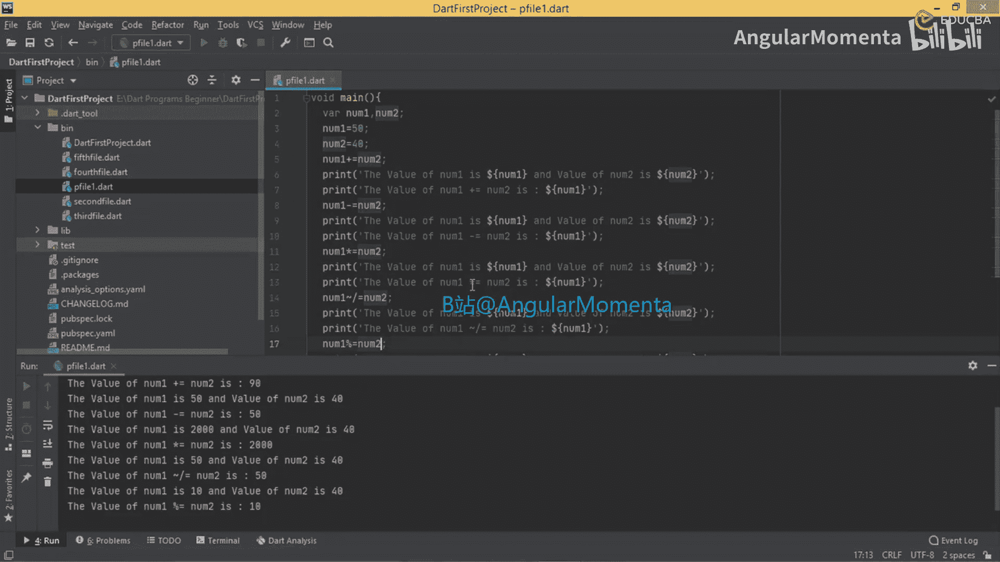
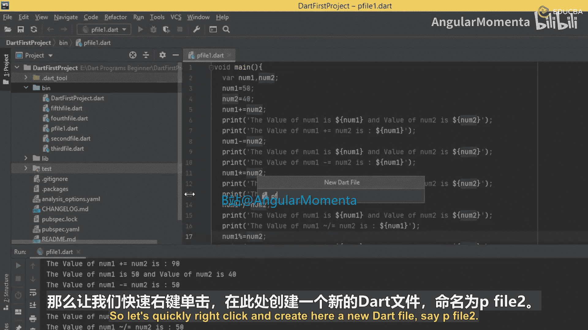
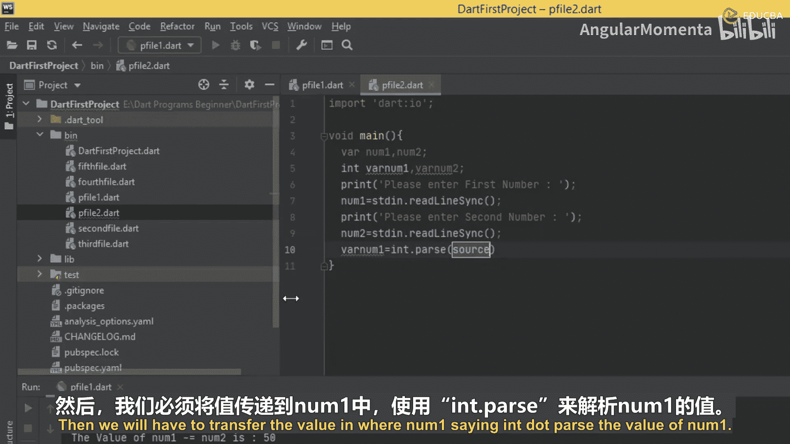
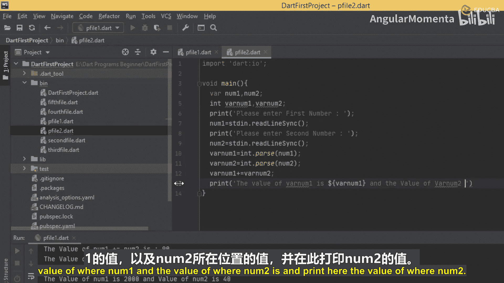
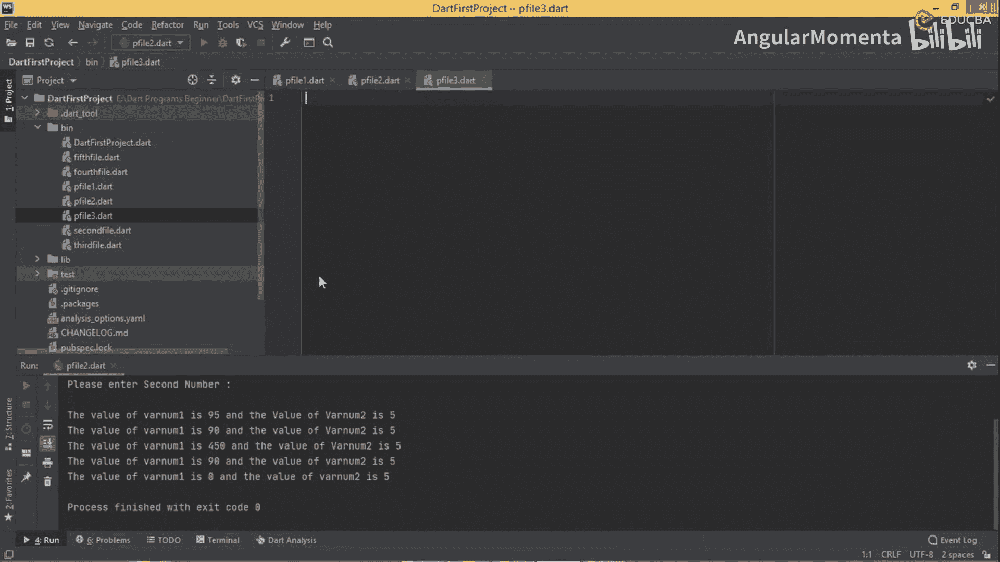
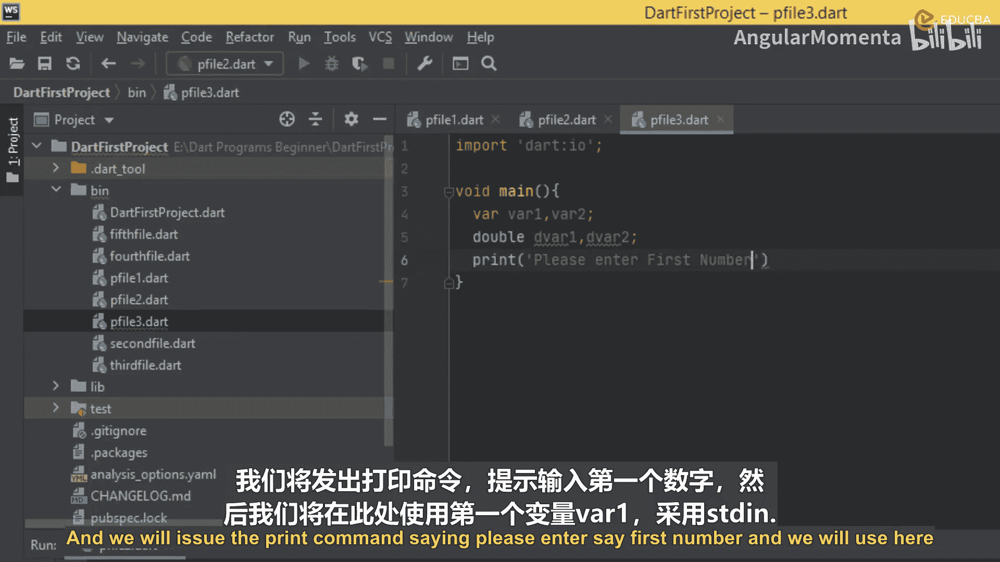
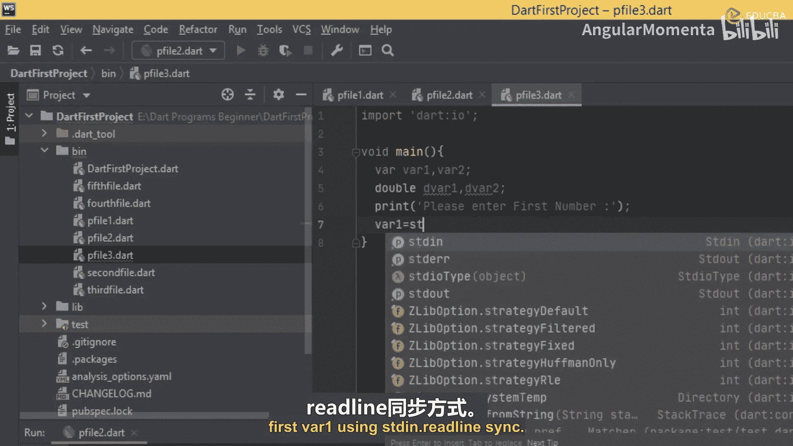
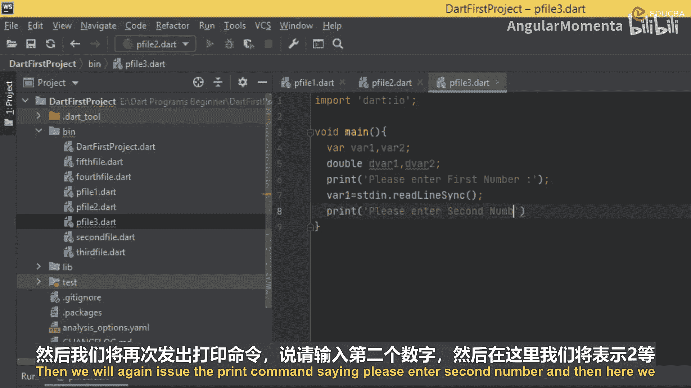
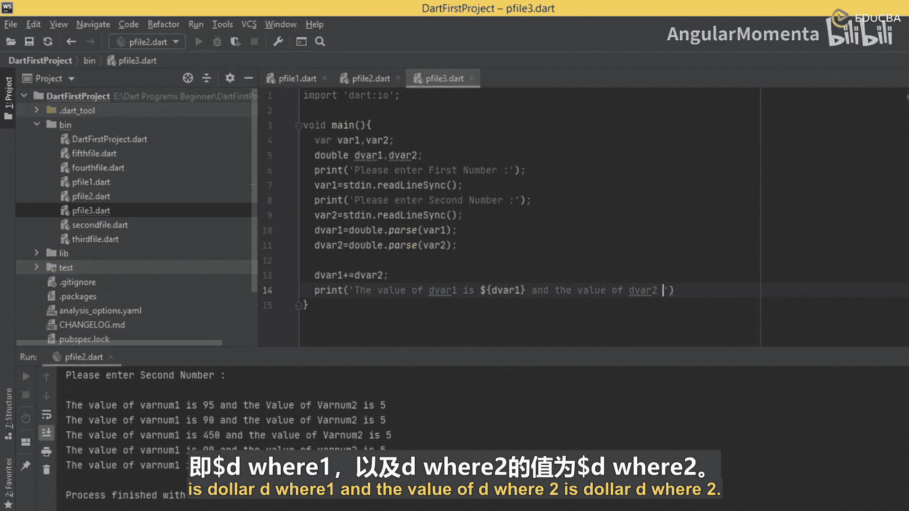
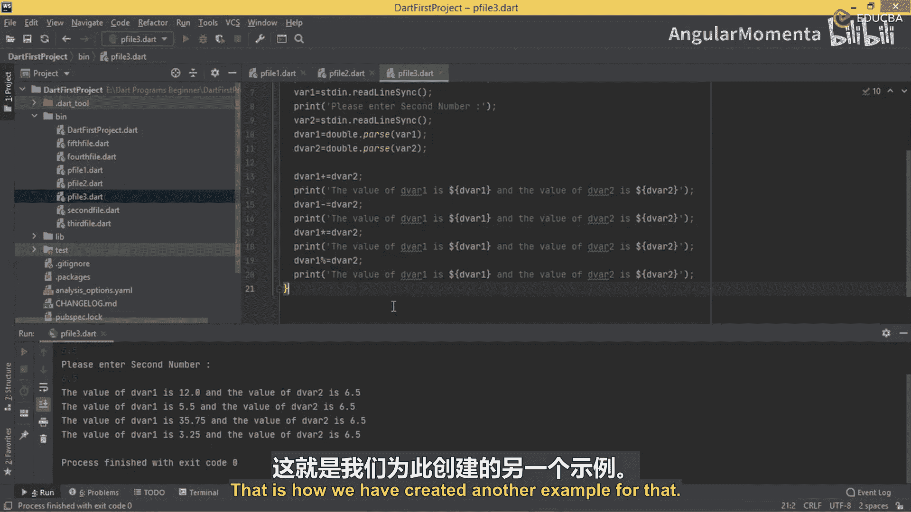

# 014：理解相等与比较运算符

在本节课中，我们将学习如何创建一个接受用户输入的程序，并使用各种赋值运算符对输入的数据进行操作。我们将从整数运算开始，然后扩展到浮点数运算，以全面理解赋值运算符的应用。





## 创建整数运算程序

上一节我们介绍了赋值运算符的基本概念，本节中我们来看看如何结合用户输入来使用它们。我们将创建一个程序，从用户处获取两个整数，并对它们执行一系列赋值运算。

首先，我们需要导入 `dart:io` 库以支持输入输出操作，并定义主函数 `main`。

```dart
import 'dart:io';



void main() {
  // 变量声明
  String num1, num2;
  int varNum1, varNum2;

  // 获取用户输入
  print('Please enter first number:');
  num1 = stdin.readLineSync()!;
  print('Please enter second number:');
  num2 = stdin.readLineSync()!;

  // 将字符串转换为整数
  varNum1 = int.parse(num1);
  varNum2 = int.parse(num2);

  // 使用赋值运算符进行计算
}
```



以下是程序的核心计算步骤，我们将对两个变量依次使用 `+=`、`-=`、`*=`、`/=` 和 `%=` 运算符，并在每次运算后打印结果。

1.  **加法赋值 (`+=`)**
    ```dart
    varNum1 += varNum2;
    print('The value of varNum1 is $varNum1 and the value of varNum2 is $varNum2');
    ```

2.  **减法赋值 (`-=`)**
    ```dart
    varNum1 -= varNum2;
    print('The value of varNum1 is $varNum1 and the value of varNum2 is $varNum2');
    ```

3.  **乘法赋值 (`*=`)**
    ```dart
    varNum1 *= varNum2;
    print('The value of varNum1 is $varNum1 and the value of varNum2 is $varNum2');
    ```

4.  **除法赋值 (`/=`)**
    ```dart
    varNum1 ~/= varNum2; // 注意：整数除法使用 `~/=`
    print('The value of varNum1 is $varNum1 and the value of varNum2 is $varNum2');
    ```

5.  **取模赋值 (`%=`)**
    ```dart
    varNum1 %= varNum2;
    print('The value of varNum1 is $varNum1 and the value of varNum2 is $varNum2');
    ```

运行此程序，例如输入 `90` 和 `5`，控制台将逐步输出每次运算后的结果。

## 创建浮点数运算程序



理解了整数运算后，我们进一步探索赋值运算符在浮点数（`double` 类型）上的应用。其逻辑与整数程序类似，主要区别在于变量的数据类型和解析方法。

以下是浮点数运算程序的核心代码结构：





```dart
import 'dart:io';



void main() {
  // 声明字符串和双精度浮点数变量
  String str1, str2;
  double dVar1, dVar2;

  // 获取用户输入
  print('Please enter first number:');
  str1 = stdin.readLineSync()!;
  print('Please enter second number:');
  str2 = stdin.readLineSync()!;

  // 将字符串转换为双精度浮点数
  dVar1 = double.parse(str1);
  dVar2 = double.parse(str2);

  // 使用赋值运算符进行计算
}
```

以下是针对双精度浮点数的运算步骤列表：



1.  **加法赋值 (`+=`)**
    ```dart
    dVar1 += dVar2;
    print('The value of dVar1 is $dVar1 and the value of dVar2 is $dVar2');
    ```

2.  **减法赋值 (`-=`)**
    ```dart
    dVar1 -= dVar2;
    print('The value of dVar1 is $dVar1 and the value of dVar2 is $dVar2');
    ```

3.  **乘法赋值 (`*=`)**
    ```dart
    dVar1 *= dVar2;
    print('The value of dVar1 is $dVar1 and the value of dVar2 is $dVar2');
    ```

4.  **除法赋值 (`/=`)**
    ```dart
    dVar1 /= dVar2; // 对于 double 类型，使用标准的 `/=` 运算符
    print('The value of dVar1 is $dVar1 and the value of dVar2 is $dVar2');
    ```

运行此程序，输入如 `5.5` 和 `6.5`，程序将演示浮点数上的赋值运算过程。需要注意的是，取模运算符 `%=` 通常用于整数，对浮点数的支持取决于具体语言规范，在此示例中我们主要展示前四种运算。



本节课中我们一起学习了如何利用 Dart 的赋值运算符结合用户输入进行动态计算。我们创建了两个程序：一个处理整数运算，另一个处理浮点数运算。通过实践，你应已掌握 `+=`、`-=`、`*=`、`/=` 和 `%=` 等运算符的使用方法，并理解了如何通过 `int.parse()` 和 `double.parse()` 转换用户输入的数据类型。这些是构建交互式控制台应用程序的基础。