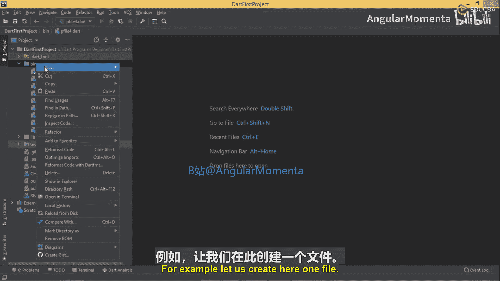
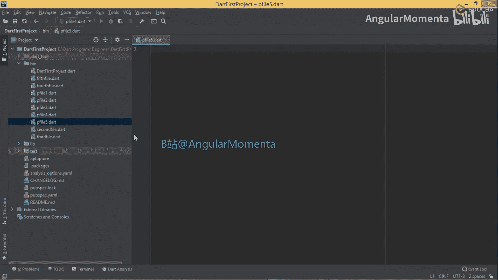
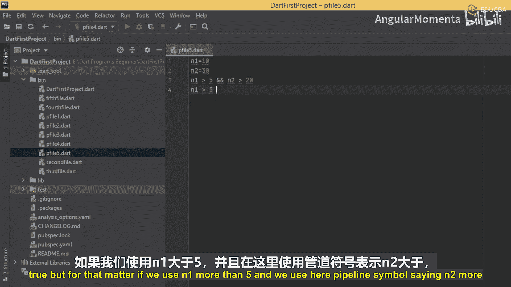
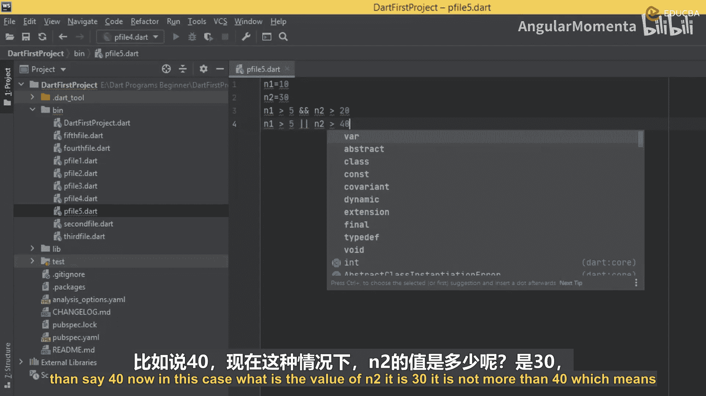
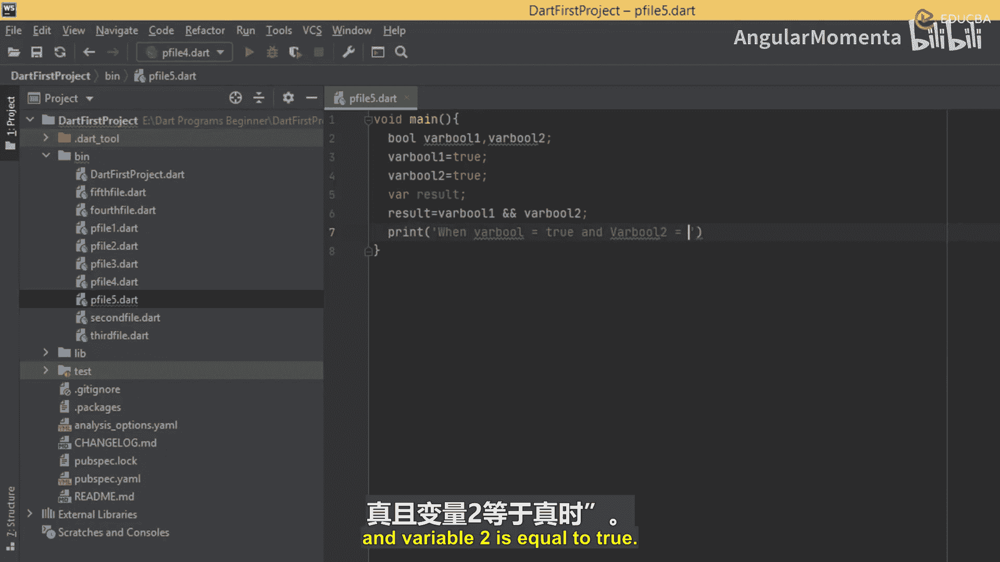
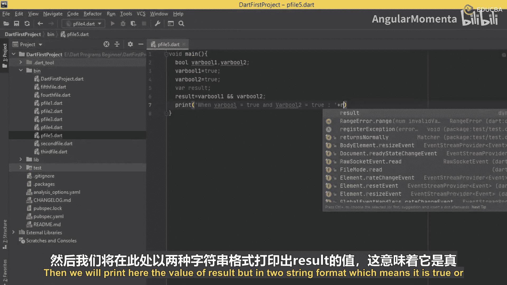
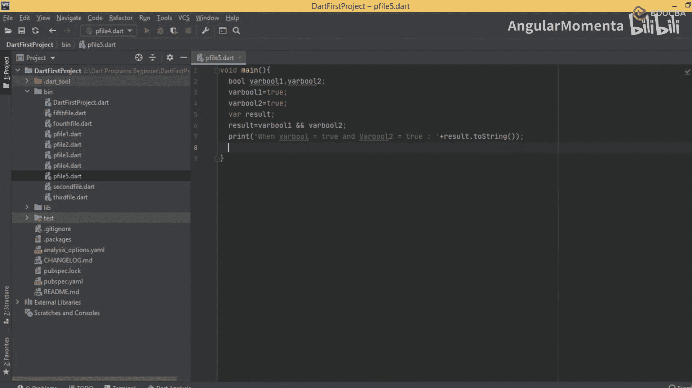
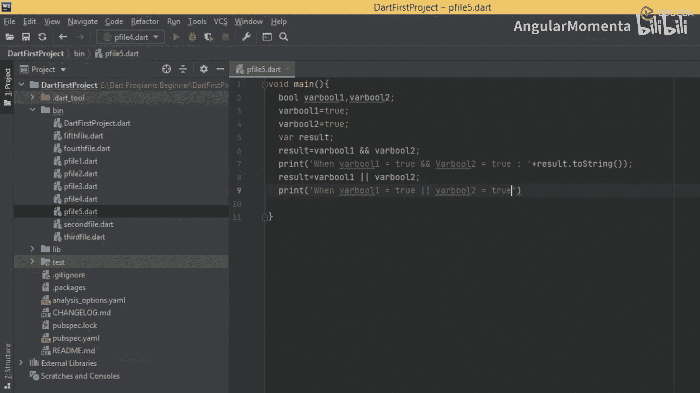
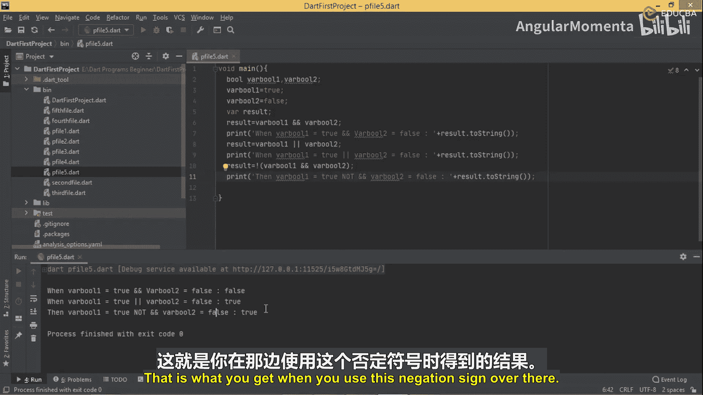

# 015：使用逻辑运算符

在本节课中，我们将要学习Dart编程语言中的逻辑运算符。逻辑运算符用于组合多个布尔表达式，以构建更复杂的条件判断。我们将通过具体的代码示例来理解 `&&`（与）、`||`（或）和 `!`（非）这三个运算符的工作原理。

## 逻辑运算符概述

逻辑运算符用于连接两个或多个布尔表达式，并返回一个布尔结果。它们是基于布尔逻辑（真/假）进行运算的。





以下是三种主要的逻辑运算符：
*   **`&&`（与运算符）**：只有当**所有**连接的表达式都为 `true` 时，整个表达式的结果才为 `true`。
*   **`||`（或运算符）**：只要**任意一个**连接的表达式为 `true`，整个表达式的结果就为 `true`。
*   **`!`（非运算符）**：这是一个一元运算符，用于**反转**其后表达式的布尔值。如果表达式为 `true`，则变为 `false`；如果为 `false`，则变为 `true`。

## 逻辑运算符详解

上一节我们介绍了逻辑运算符的基本概念，本节中我们来看看它们的具体工作方式。

### `&&`（与）运算符



`&&` 运算符要求其两边的表达式**同时**为真，结果才为真。



例如，假设我们有两个变量：
```dart
int n1 = 10;
int n2 = 30;
```
现在考虑表达式：
```dart
(n1 > 5) && (n2 > 20)
```
*   `n1 > 5` 为 `true`。
*   `n2 > 20` 为 `true`。
*   由于两个条件都为 `true`，因此整个 `(n1 > 5) && (n2 > 20)` 表达式的结果为 `true`。

如果其中任何一个条件为假，例如 `(n1 > 5) && (n2 > 40)`，因为 `n2 > 40` 为 `false`，所以整个表达式的结果为 `false`。

### `||`（或）运算符

`||` 运算符要求其两边的表达式**至少有一个**为真，结果就为真。

使用相同的变量，考虑表达式：
```dart
(n1 > 5) || (n2 > 40)
```
*   `n1 > 5` 为 `true`。
*   `n2 > 40` 为 `false`。
*   由于第一个条件为 `true`，满足“至少一个为真”的条件，因此整个 `(n1 > 5) || (n2 > 40)` 表达式的结果为 `true`。

只有当所有条件都为假时，例如 `(n1 > 15) || (n2 > 40)`，整个表达式的结果才为 `false`。

### `!`（非）运算符

`!` 运算符对其后的布尔表达式进行取反操作。





例如：
```dart
!(n1 > 5)
```
*   `n1 > 5` 本身是 `true`。
*   应用 `!` 运算符后，表达式 `!(n1 > 5)` 的结果变为 `false`。



同理，如果表达式为 `false`，应用 `!` 后结果会变为 `true`。



## 实践练习：编写逻辑运算符程序

理解了每个运算符的规则后，让我们通过一个实际的Dart程序来验证它们的行为。

我们将创建两个布尔变量，并应用不同的逻辑运算符来观察输出结果。

以下是程序代码：
```dart
void main() {
  // 定义两个布尔变量并赋值
  bool variable1 = true;
  bool variable2 = false;

  // 使用 && 运算符
  bool result = variable1 && variable2;
  print('当 variable1 = $variable1 且 variable2 = $variable2 时，variable1 && variable2 的结果是：$result');

  // 使用 || 运算符
  result = variable1 || variable2;
  print('当 variable1 = $variable1 且 variable2 = $variable2 时，variable1 || variable2 的结果是：$result');

  // 使用 ! 运算符
  result = !(variable1 && variable2);
  print('当 variable1 = $variable1 且 variable2 = $variable2 时，!(variable1 && variable2) 的结果是：$result');
}
```

运行此程序，你将看到类似以下的输出：
```
当 variable1 = true 且 variable2 = false 时，variable1 && variable2 的结果是：false
当 variable1 = true 且 variable2 = false 时，variable1 || variable2 的结果是：true
当 variable1 = true 且 variable2 = false 时，!(variable1 && variable2) 的结果是：true
```
输出结果验证了我们之前的解释：
1.  `true && false` 结果为 `false`（与运算要求两者皆真）。
2.  `true || false` 结果为 `true`（或运算要求至少一个为真）。
3.  `!(true && false)` 即 `!false`，结果为 `true`（非运算对结果取反）。

## 总结



本节课中我们一起学习了Dart语言中的逻辑运算符。我们明确了 `&&`（与）运算符需要所有条件为真才返回真，`||`（或）运算符在至少一个条件为真时即返回真，而 `!`（非）运算符则用于对布尔值进行取反。通过实际的代码示例，我们验证了这些运算符的行为，这是构建复杂程序逻辑和条件判断的基础。