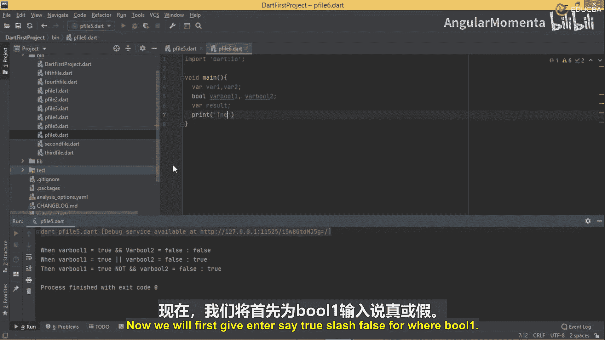
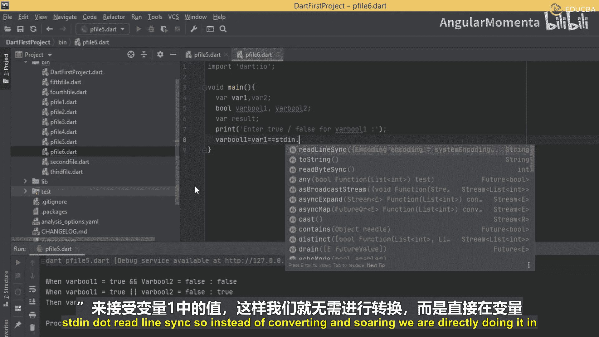
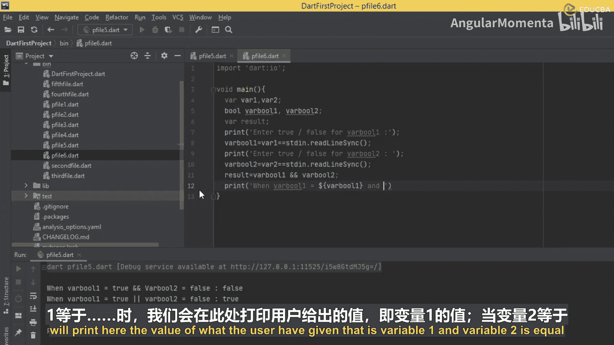
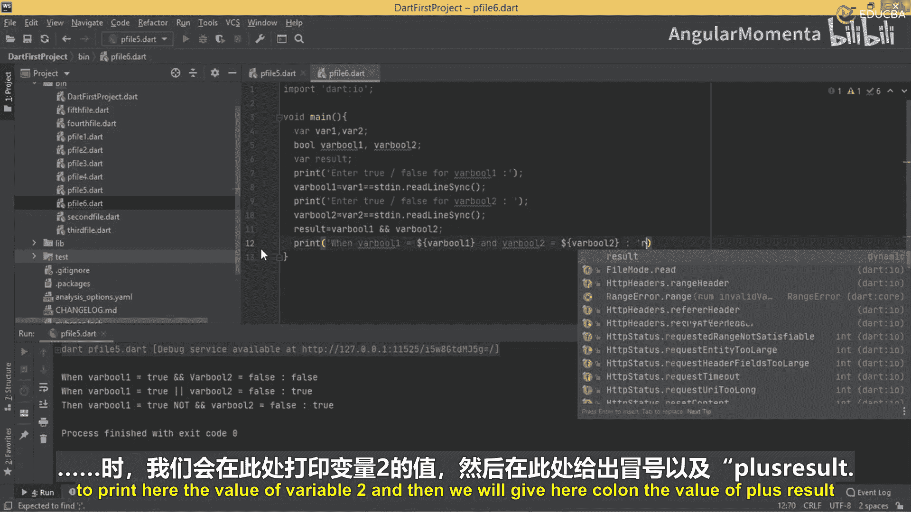
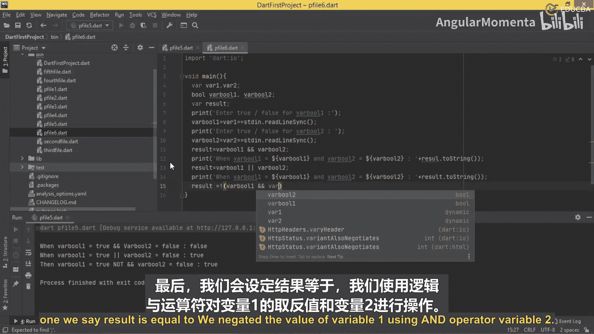
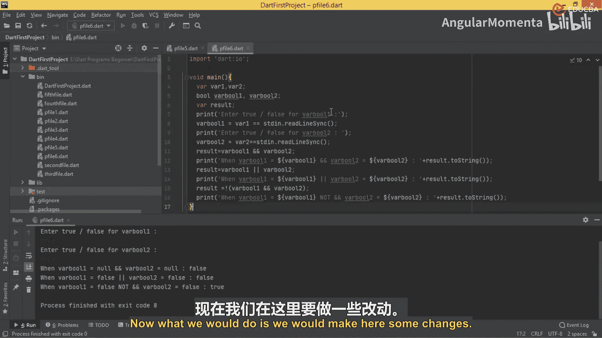
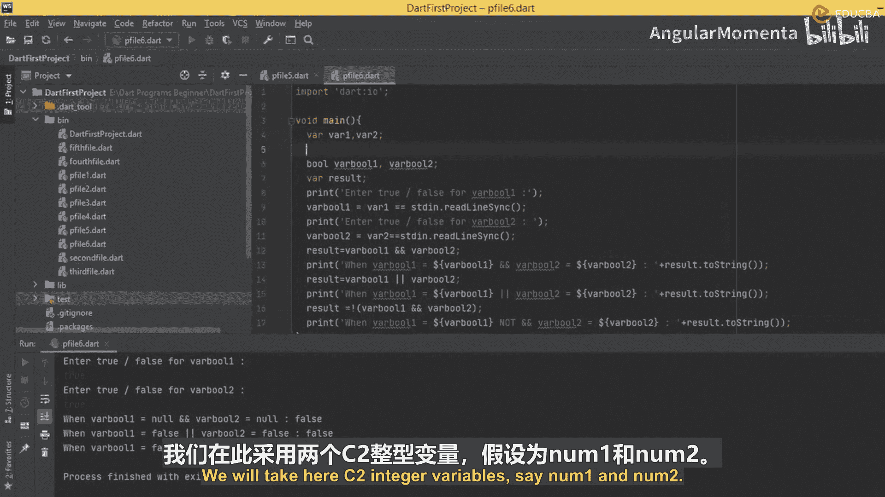
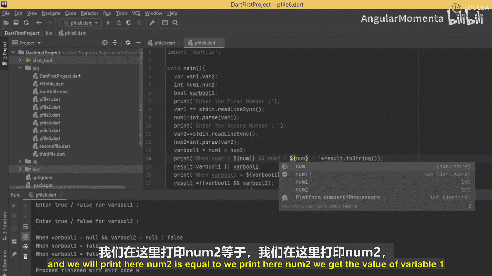
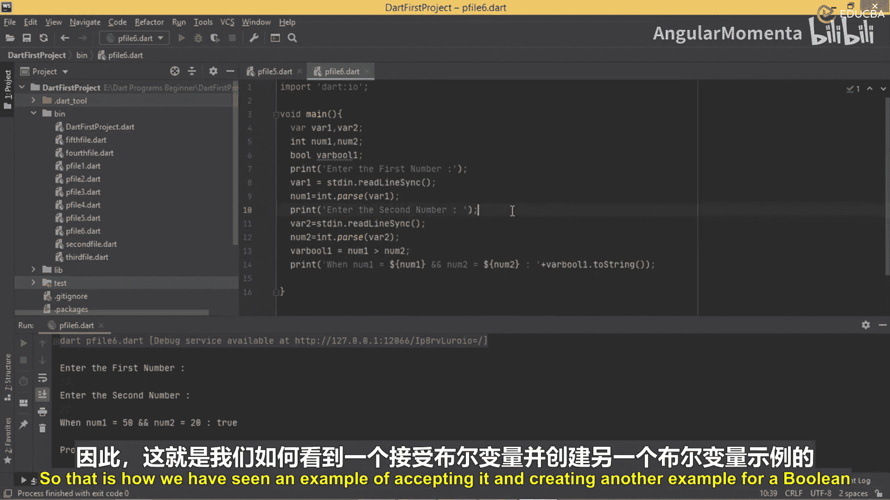

# 016：使用逻辑与和或组合条件

在本节课中，我们将学习如何从用户处接收输入，并利用这些输入值来组合逻辑条件。我们将创建一个程序，让用户输入两个值，然后程序会计算并展示这些值在不同逻辑运算符（与、或、非）下的结果。

上一节我们介绍了布尔变量的基本概念，本节中我们来看看如何让程序与用户交互，动态地获取数据并进行逻辑判断。



## 创建新文件与基础结构



首先，我们需要创建一个新的Dart文件，并导入必要的库来支持用户输入。

```dart
import 'dart:io';

void main() {
  // 程序主体将在这里编写
}
```

## 声明变量





在`main`函数内部，我们需要声明几个变量来存储用户输入和计算结果。

```dart
  var variable1;
  var variable2;
  bool result;
```

## 接收用户输入



以下是接收用户输入并存储到变量中的步骤。

首先，提示用户输入第一个值，并读取它。

```dart
  print('请输入第一个布尔值（true/false）:');
  variable1 = stdin.readLineSync();
```

接着，提示用户输入第二个值，并同样读取。

```dart
  print('请输入第二个布尔值（true/false）:');
  variable2 = stdin.readLineSync();
```

## 执行逻辑运算并输出结果

获取输入后，我们将使用逻辑运算符进行计算，并打印结果。



首先，使用**逻辑与**运算符（`&&`）进行计算。



```dart
  result = (variable1 == 'true') && (variable2 == 'true');
  print('当 variable1 = $variable1 且 variable2 = $variable2 时，逻辑与的结果是: ${result.toString()}');
```

然后，使用**逻辑或**运算符（`||`）进行计算。

```dart
  result = (variable1 == 'true') || (variable2 == 'true');
  print('当 variable1 = $variable1 或 variable2 = $variable2 时，逻辑或的结果是: ${result.toString()}');
```

最后，使用**逻辑非**与**逻辑与**的组合进行计算。

```dart
  result = !((variable1 == 'true') && (variable2 == 'true'));
  print('当 variable1 = $variable1 且 variable2 = $variable2 时，逻辑非与逻辑与组合的结果是: ${result.toString()}');
```



## 调试与改进：使用数值比较

直接比较字符串`’true’`可能不够直观且容易出错。一个更稳健的方法是让用户输入数字，然后通过数值比较来生成布尔值。

以下是改进后的代码片段：

```dart
  print('请输入第一个数字:');
  var input1 = stdin.readLineSync();
  int num1 = int.parse(input1!);

  print('请输入第二个数字:');
  var input2 = stdin.readLineSync();
  int num2 = int.parse(input2!);

  bool boolResult = num1 > num2;
  print('当 num1 = $num1 且 num2 = $num2 时，(num1 > num2) 的结果是: $boolResult');
```

在这个改进版本中，布尔变量`boolResult`存储的是表达式`num1 > num2`的评估结果，这比直接处理字符串`”true”`或`”false”`更符合布尔逻辑的本质。

## 总结



本节课中我们一起学习了如何构建一个交互式的Dart程序。我们掌握了从标准输入读取用户数据的方法，并运用逻辑与（`&&`）、逻辑或（`||`）和逻辑非（`!`）运算符对输入值进行组合判断。最后，我们还探讨了通过数值比较来生成布尔值的更佳实践，这有助于编写更清晰、更不易出错的逻辑代码。