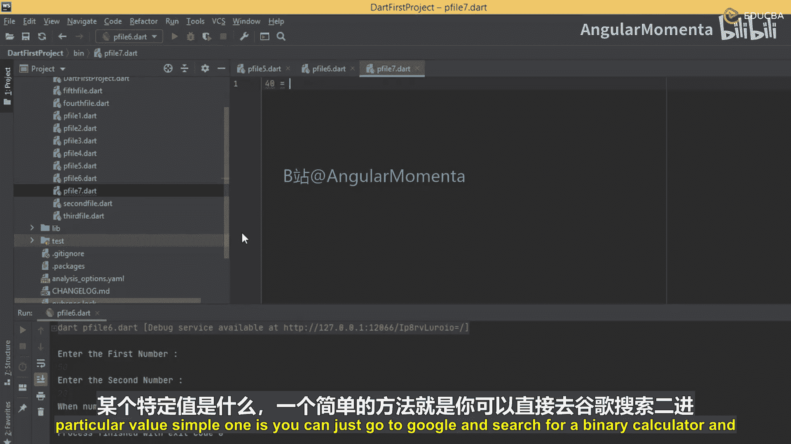
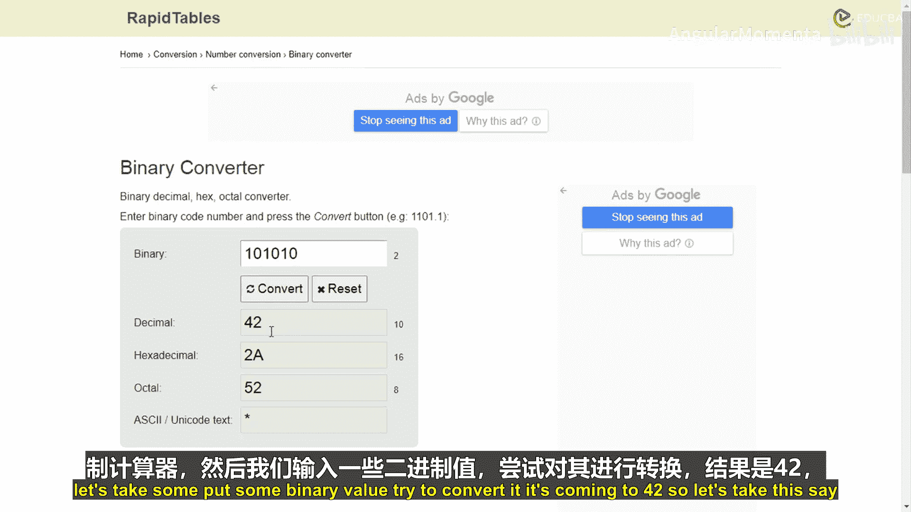
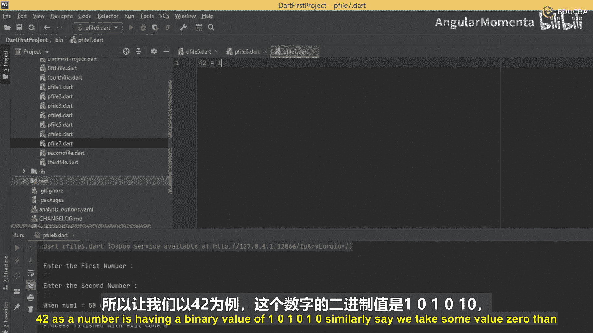
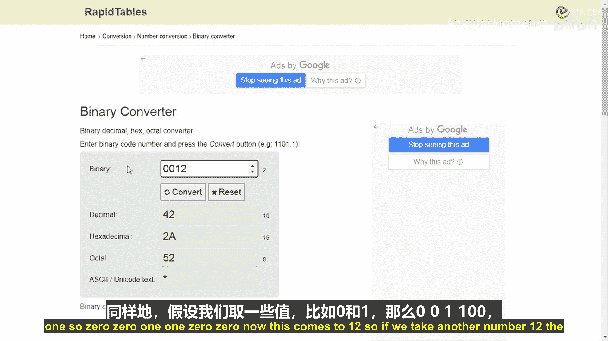
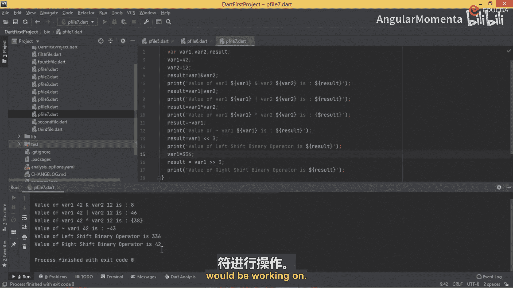

# 017：使用位运算符









## 概述
在本节课中，我们将学习Dart编程语言中的位运算符。位运算符允许我们在二进制位级别上对数据进行操作，这对于处理底层数据、优化性能或执行特定计算非常有用。我们将通过创建示例程序来理解各种位运算符的工作原理。

## 位运算符简介
上一节我们介绍了三元运算符，本节中我们来看看位运算符。位运算符意味着在操作数的二进制位级别执行计算或操作。例如，数字42的二进制表示为`101010`，数字12的二进制表示为`001100`。内存中的每个数字或字母都有其对应的二进制值，位运算符就是对这些二进制值进行操作的。

以下是Dart中主要的位运算符：
*   **`&` (按位与)**：对两个操作数的每一位执行逻辑与操作。
*   **`|` (按位或)**：对两个操作数的每一位执行逻辑或操作。
*   **`^` (按位异或)**：对两个操作数的每一位执行逻辑异或操作。
*   **`~` (按位取反)**：对操作数的每一位执行逻辑非操作（即取反）。
*   **`<<` (左移)**：将操作数的所有位向左移动指定的位数，右侧用0填充。
*   **`>>` (右移)**：将操作数的所有位向右移动指定的位数。

## 创建位运算符示例
现在，让我们创建一个简单的示例程序来演示这些位运算符的用法。我们将声明两个整数变量，对它们应用各种位运算符，并打印结果。

```dart
void main() {
  // 声明变量并赋值
  int var1 = 42;
  int var2 = 12;
  int result;

  // 1. 按位与 (&) 操作
  result = var1 & var2;
  print('var1 的值是：$var1');
  print('var2 的值是：$var2');
  print('var1 & var2 的结果是：$result');

  // 2. 按位或 (|) 操作
  result = var1 | var2;
  print('\nvar1 | var2 的结果是：$result');

  // 3. 按位异或 (^) 操作
  result = var1 ^ var2;
  print('var1 ^ var2 的结果是：$result');

  // 4. 按位取反 (~) 操作
  result = ~var1;
  print('~var1 的结果是：$result');

  // 5. 左移 (<<) 操作
  result = var1 << 3;
  print('var1 << 3 (左移3位) 的结果是：$result');

  // 为了演示右移，我们使用左移后的结果
  var1 = result; // var1 现在变为 336
  // 6. 右移 (>>) 操作
  result = var1 >> 3;
  print('var1 >> 3 (右移3位) 的结果是：$result');
}
```

## 代码执行与输出分析
保存并运行上述代码后，你将看到类似以下的输出。让我们分析每个操作的结果：

1.  **按位与 (`&`)**：`42 & 12` 的结果是 `8`。这是因为在二进制中，只有两个对应位都为1时，结果位才为1。
2.  **按位或 (`|`)**：`42 | 12` 的结果是 `46`。这是因为只要两个对应位中有一个为1，结果位就为1。
3.  **按位异或 (`^`)**：`42 ^ 12` 的结果是 `38`。这是因为当两个对应位不同时，结果位为1。
4.  **按位取反 (`~`)**：`~42` 的结果是 `-43`。这是因为取反操作会翻转所有位（包括符号位），在二进制补码表示中得到了这个负数值。
5.  **左移 (`<<`)**：`42 << 3` 的结果是 `336`。这相当于将42乘以2的3次方 (`42 * 8`)。
6.  **右移 (`>>`)**：将左移后的结果 `336` 右移3位，得到 `42`。这相当于将336除以2的3次方 (`336 / 8`)，结果取整数部分。



## 总结
本节课中我们一起学习了Dart中的位运算符。我们了解了`&`、`|`、`^`、`~`、`<<`和`>>`这些运算符的功能，并通过一个完整的示例程序观察了它们在实际运算中的结果。位运算符是进行底层数据处理和特定算法优化的强大工具。在下一节中，我们将探讨如何从用户输入获取值，并在此基础上应用位运算符。