# 018：使用Dart类型运算符检查数据类型

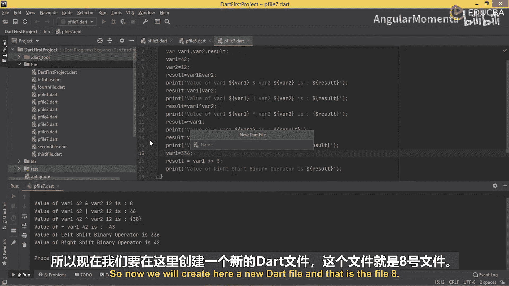

## 概述
在本节课中，我们将学习Dart编程语言中的位运算符和条件运算符。我们将通过创建多个示例程序来理解这些运算符的工作原理，包括如何执行位运算以及如何使用条件运算符进行快速的条件判断。

## 位运算符示例

上一节我们介绍了基本的算术运算符，本节中我们来看看位运算符。位运算符直接对整数的二进制位进行操作。

以下是创建第一个位运算符示例程序的步骤。

1.  创建一个名为 `file8.dart` 的新文件。
2.  在文件开头导入 `dart:io` 库。
3.  在 `void main()` 函数中，声明变量 `var1`、`var2` 和 `result`。
4.  使用 `print` 和 `stdin.readLineSync()` 提示用户输入 `var1` 和 `var2` 的值。
5.  使用 `int.parse()` 将输入的字符串转换为整数，并分别赋值给 `intVar1` 和 `intVar2`。
6.  执行位与运算：`result = intVar1 & intVar2`。
7.  使用 `print` 语句输出 `intVar1`、`intVar2` 和 `result` 的值。
8.  复制上述打印语句，将运算符 `&` 依次改为 `|`（位或）、`^`（位异或）。
9.  对于按位取反运算符 `~`，只需对一个操作数进行运算，例如 `result = ~intVar1`。
10. 对于左移运算符 `<<`，执行 `result = intVar1 << 2`（左移2位）。
11. 对于右移运算符 `>>`，执行 `result = intVar1 >> 2`（右移2位）。
12. 分别输出这些运算的结果。

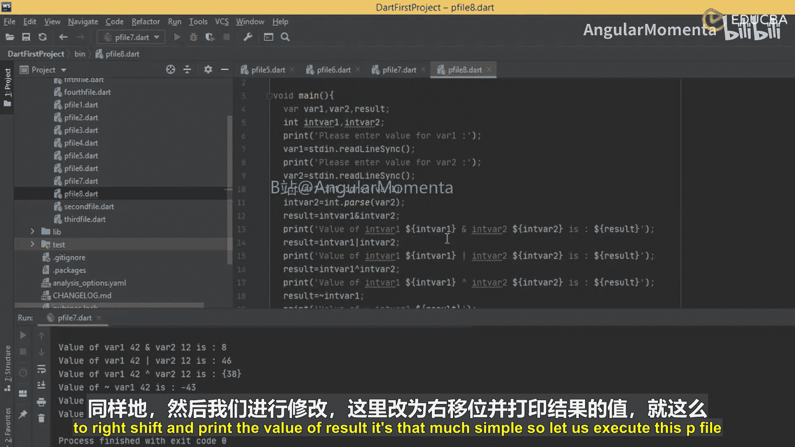

运行 `file8.dart` 程序，输入两个数字（例如4和2），程序将显示所有位运算的结果。理解这些结果需要计算输入数字的二进制表示。

## 条件运算符

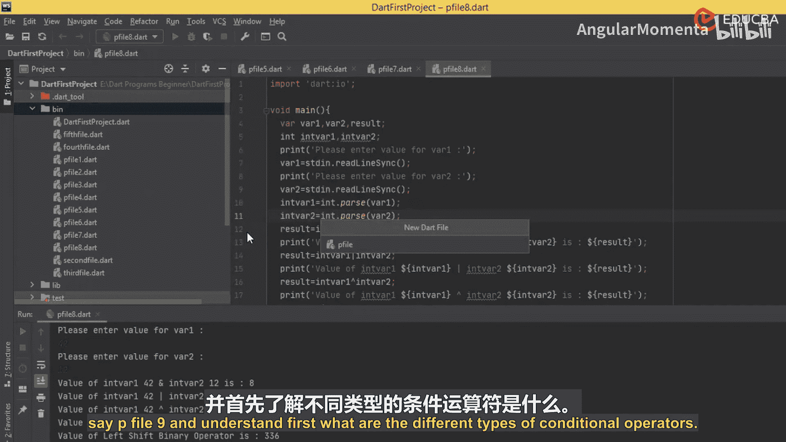

现在，让我们进入下一组运算符：条件运算符。条件运算符有多种类型。

以下是两种主要的条件运算符。

*   **三元运算符 (`? :`)**：这是 `if` 语句的简写形式。它评估一个表达式，如果为真，则返回问号 `?` 后面的值；如果为假，则返回冒号 `:` 后面的值。其基本形式为：`condition ? exprIfTrue : exprIfFalse`
*   **空值合并运算符 (`??`)**：用于处理可能为 `null` 的值。如果第一个表达式不为 `null`，则返回其值；如果为 `null`，则返回第二个表达式的值。其基本形式为：`expr1 ?? expr2`

### 三元运算符示例

首先，我们通过示例学习三元运算符。

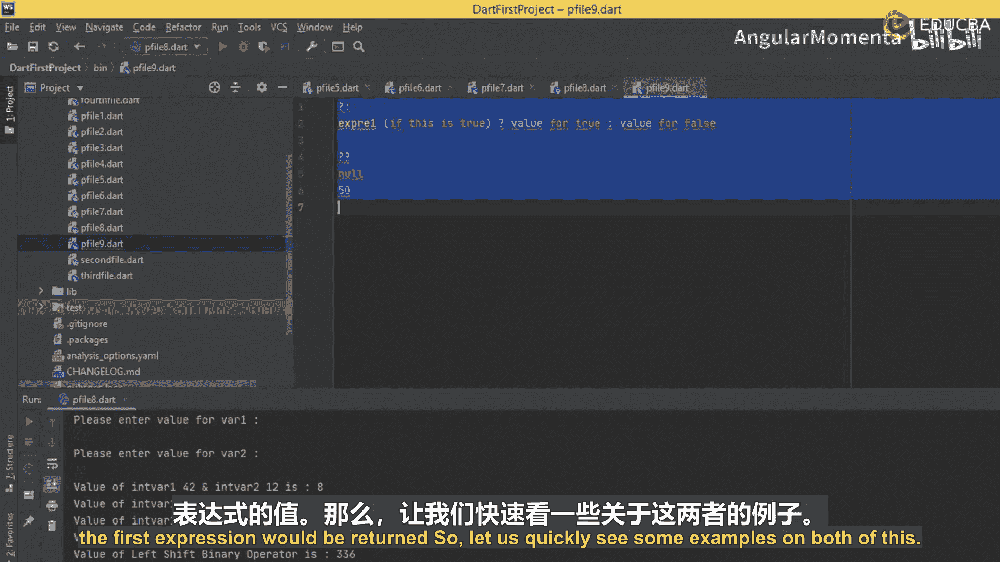

以下是使用三元运算符比较两个数字的步骤。

1.  创建一个名为 `file9.dart` 的新文件。
2.  在 `void main()` 函数中，声明两个整数变量并赋值，例如 `number1 = 40`， `number2 = 30`。
3.  使用三元运算符：`result = (number1 > number2) ? ‘Higher Number’ : ‘Smaller Number’`。
4.  打印结果：`print(‘The result is: $result’)`。
5.  运行程序。因为 `40 > 30` 为真，所以输出 “Higher Number”。如果将 `number1` 改为 `20`，表达式为假，则输出 “Smaller Number”。

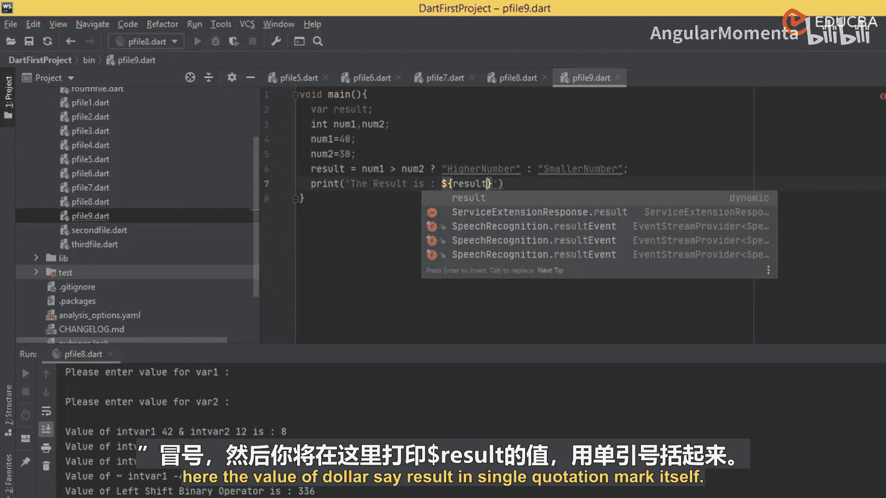

为了使其交互性更强，我们可以创建一个接受用户输入的程序。

以下是创建交互式三元运算符程序的步骤。

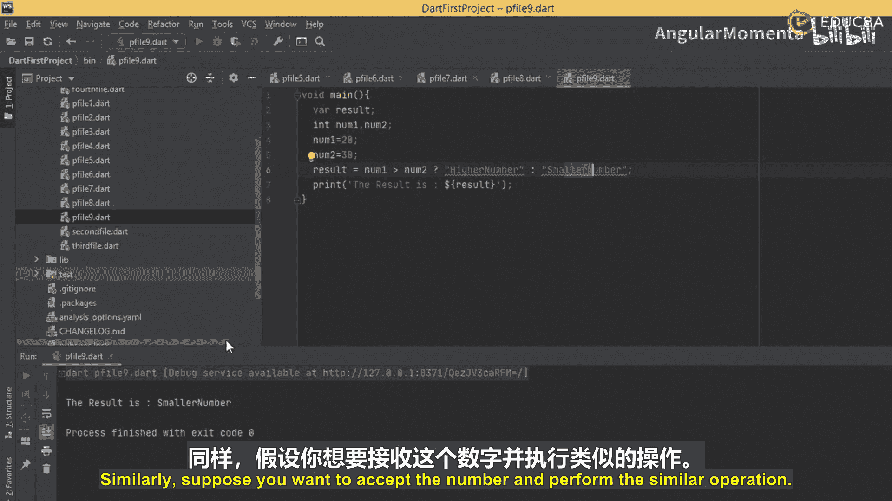

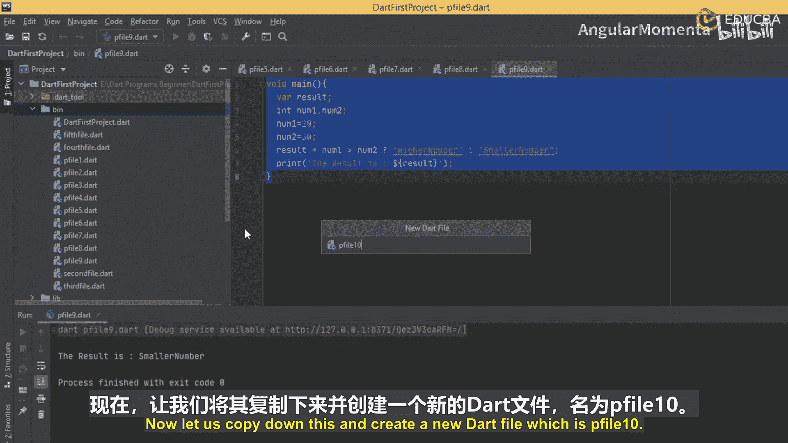

1.  创建新文件 `file10.dart`。
2.  导入 `dart:io`。
3.  在 `main` 函数中，声明变量 `number1`、`number2` 和 `result`。
4.  使用 `print` 和 `stdin.readLineSync()` 提示用户输入两个数字。
5.  使用 `int.parse()` 将输入转换为整数。
6.  使用相同的三元运算符逻辑判断并存储结果。
7.  打印结果。
8.  运行程序，输入不同的数字组合（如90和5，或5和90）以验证逻辑。

### 空值合并运算符示例

接下来，我们看看空值合并运算符 `??` 的用法。

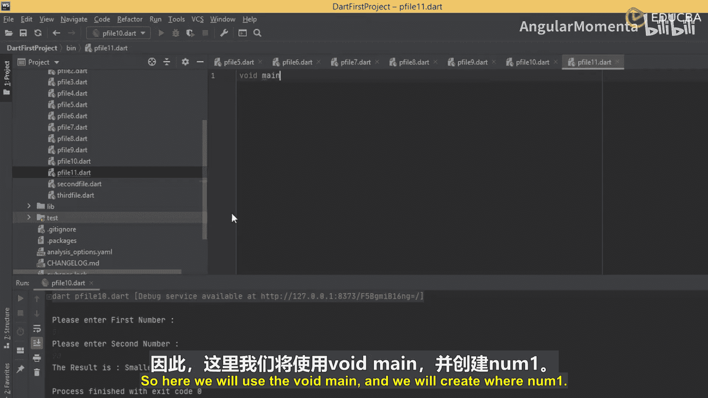

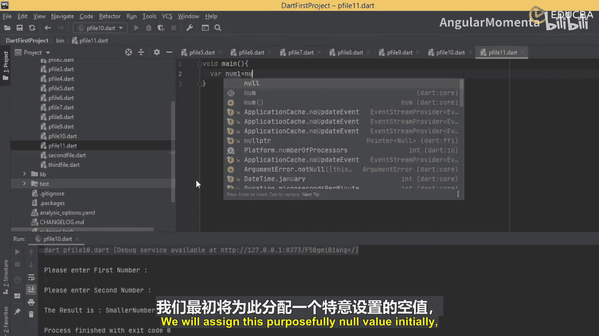

以下是空值合并运算符的基本示例。

1.  创建新文件 `file11.dart`。
2.  在 `main` 函数中，声明两个变量：`int? number1 = null` 和 `int number2 = 40`。
3.  使用空值合并运算符：`result = number1 ?? number2`。
4.  打印结果：`print(‘The result is: $result’)`。
5.  运行程序。因为 `number1` 为 `null`，所以输出 `number2` 的值 `40`。
6.  将 `number1` 改为非空值（如 `4`）并再次运行，此时将输出 `number1` 的值 `4`。

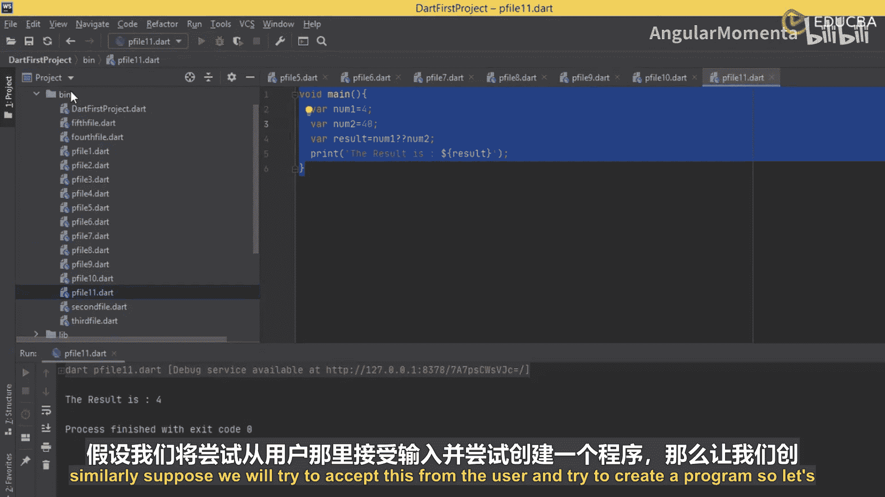

我们也可以创建一个接受用户输入的程序来演示。

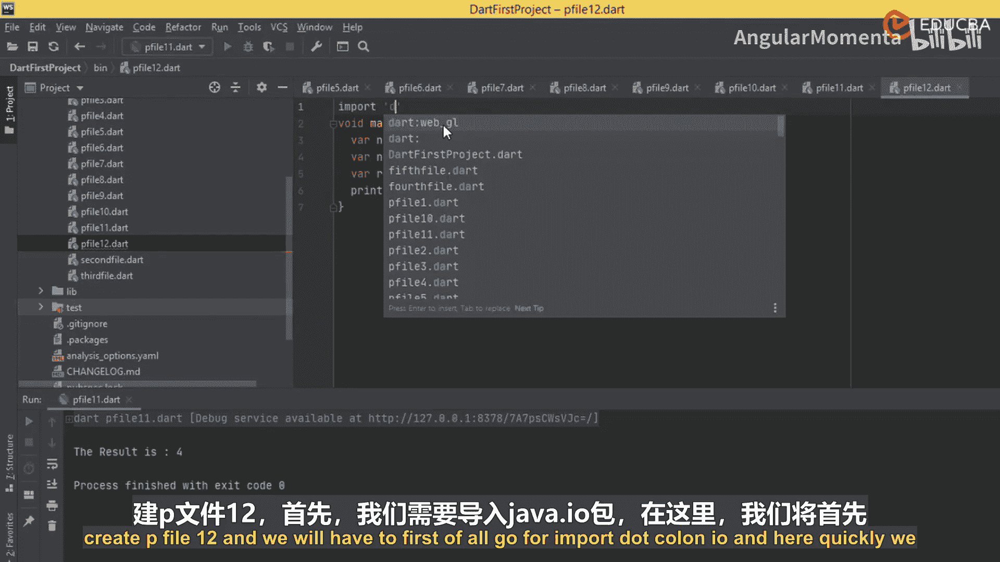

以下是创建交互式空值合并运算符程序的步骤。

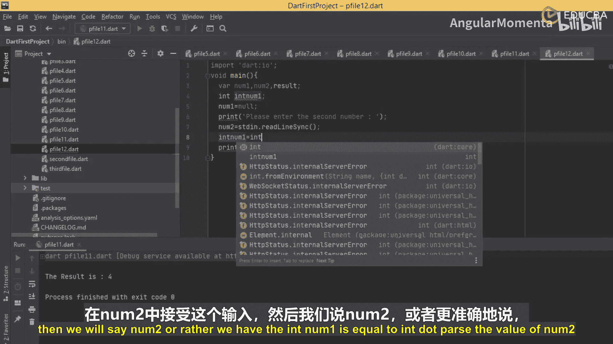

1.  创建新文件 `file12.dart`。
2.  导入 `dart:io`。
3.  在 `main` 函数中，声明 `int? number1 = null` 和 `int number2`。
4.  提示用户输入 `number2` 的值，并使用 `int.parse()` 进行转换。
5.  使用 `result = number1 ?? number2` 进行赋值。
6.  打印结果。由于 `number1` 始终为 `null`，程序将输出用户输入的 `number2` 的值。

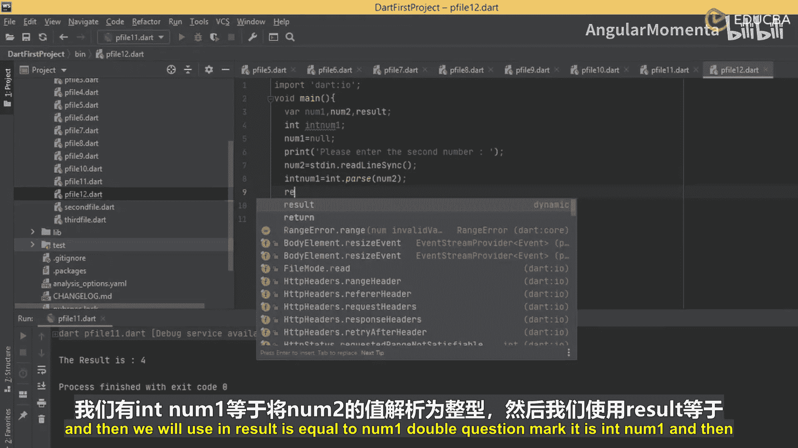

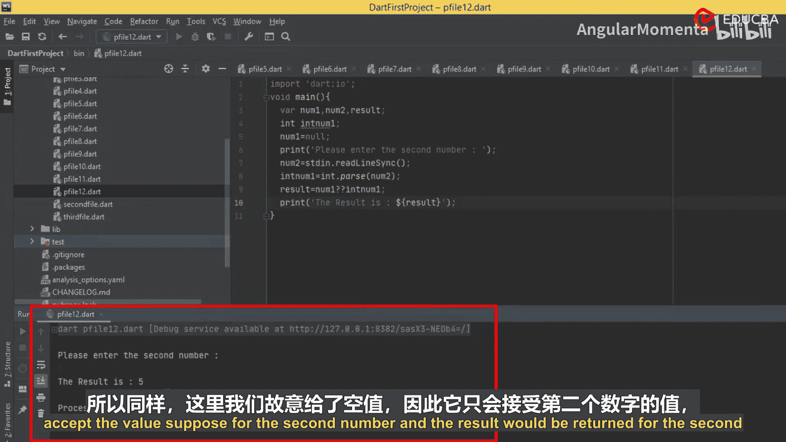

## 总结
本节课中我们一起学习了Dart中的位运算符和条件运算符。我们通过实践了解了位与(`&`)、位或(`|`)、位异或(`^`)、取反(`~`)、左移(`<<`)和右移(`>>`)等位运算。同时，我们掌握了三元运算符(`? :`)用于简化条件判断，以及空值合并运算符(`??`)用于安全地处理可能为`null`的变量。这些运算符是构建复杂逻辑和进行底层数据操作的基础工具。