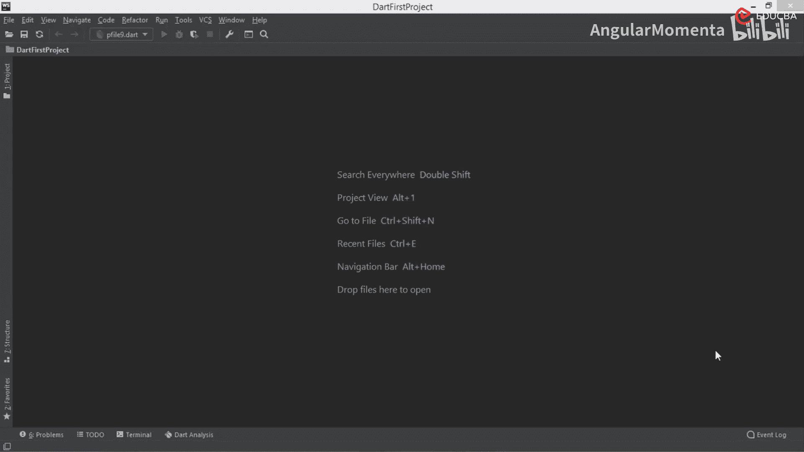
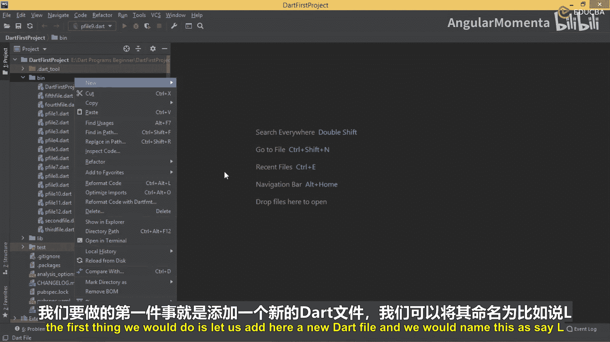
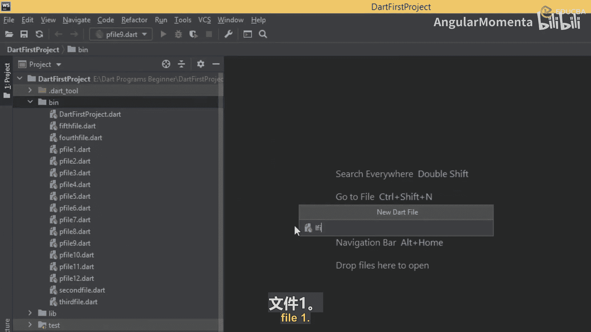
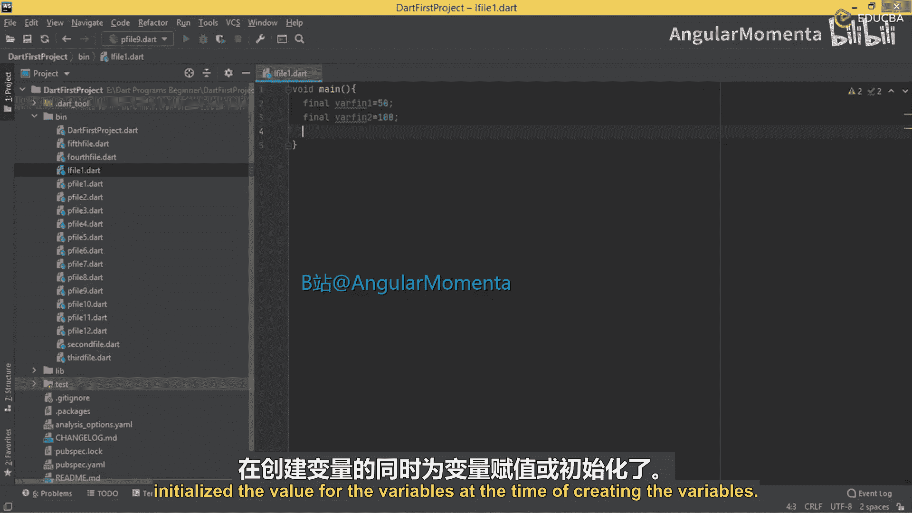
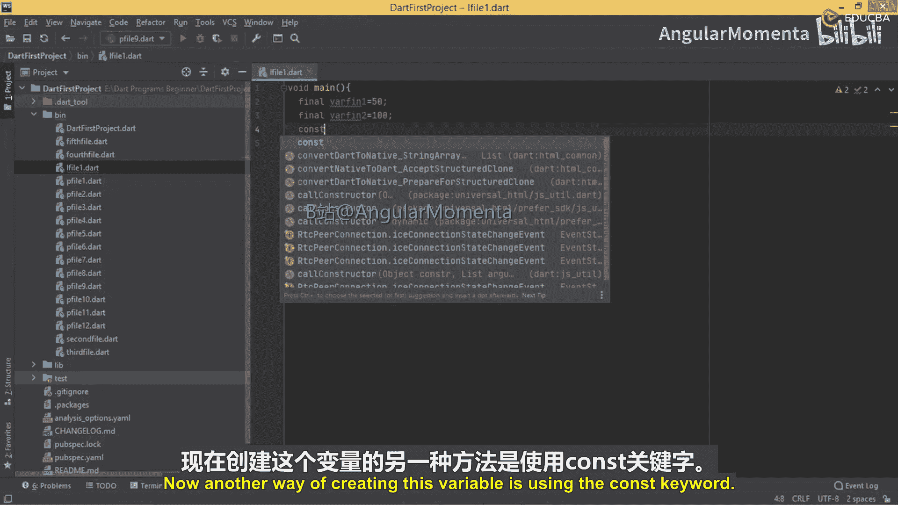
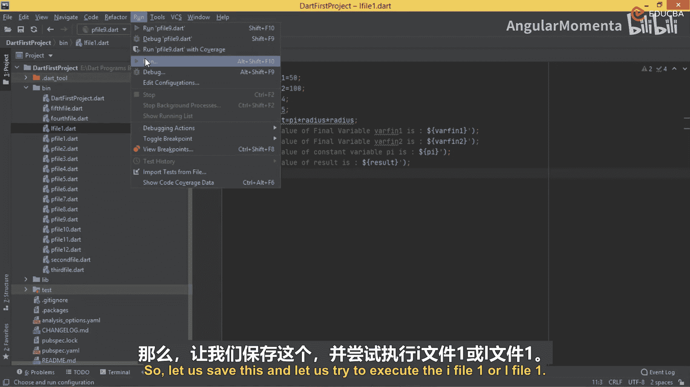
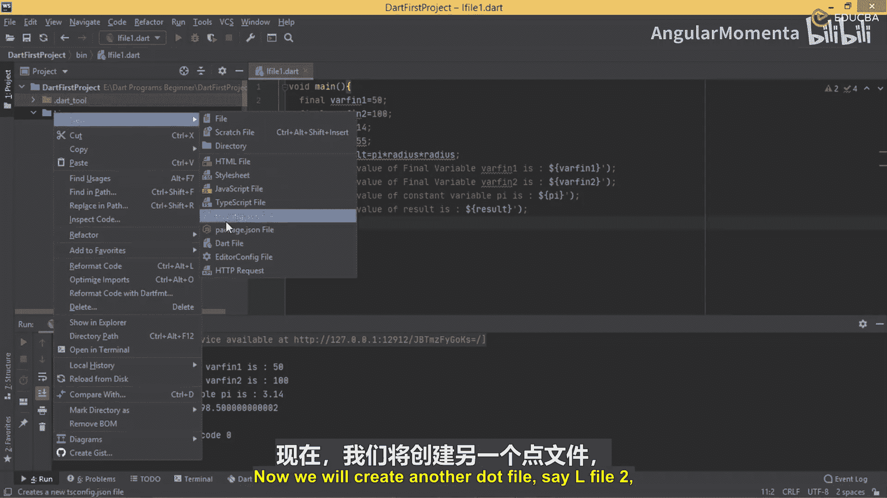
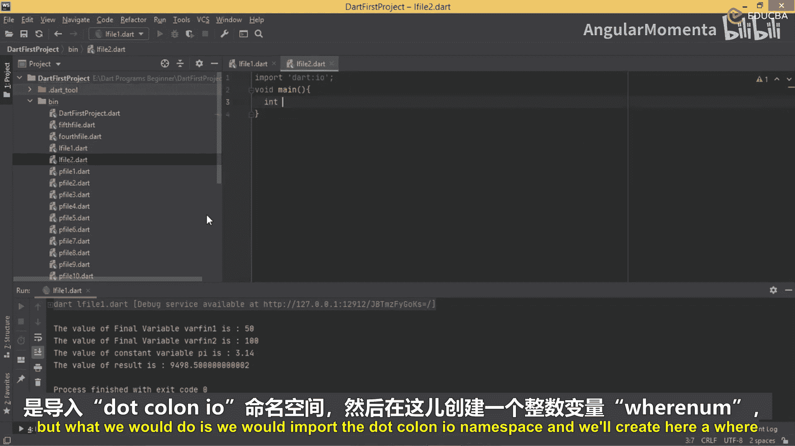
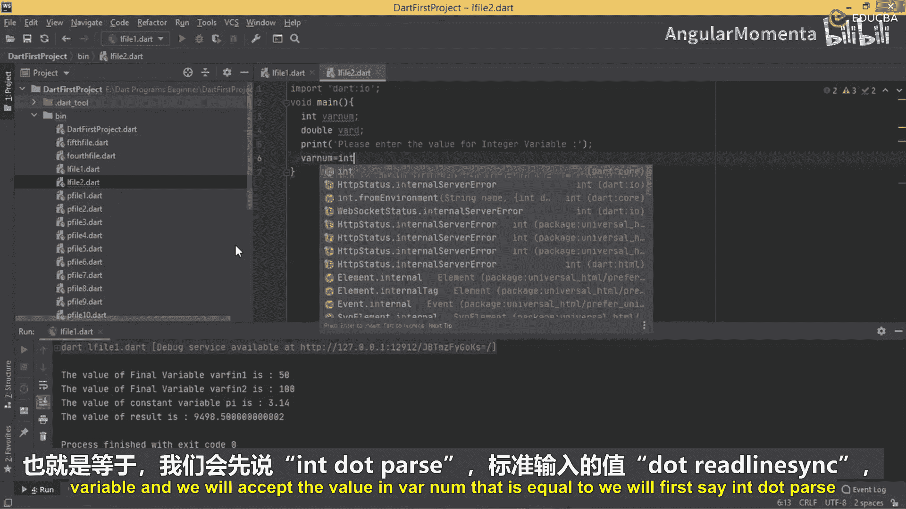
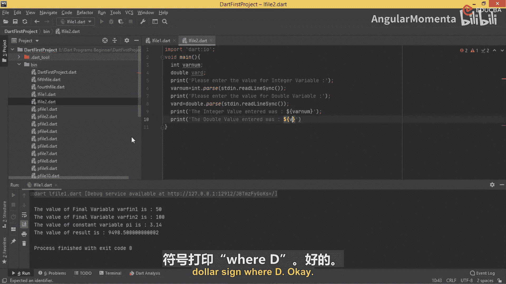

# 019：Dart常量 🎯



## 概述
在本节课中，我们将要学习Dart编程语言中的常量。我们将了解什么是常量，如何创建和使用`final`与`const`关键字来定义常量变量，以及它们与普通变量的区别。掌握常量对于编写稳定、可预测的代码至关重要。

## 理解常量
在上一节中，我们学习了变量。本节中，我们来看看常量。在任何编程语言中，常量的字面意思都是“不可改变的值”。这意味着，当你创建一个常量变量并为其赋值后，该值在后续的程序执行中将保持不变，无法被重新赋值。这与普通变量不同，普通变量的值可以被修改。

在Dart编程中，有两种方式可以创建常量：
1.  使用 `final` 关键字。
2.  使用 `const` 关键字。

两者的语法和适用场景略有不同，接下来我们将逐一探讨。

## 创建 `final` 变量
首先，我们学习如何使用 `final` 关键字来创建常量。



以下是创建 `final` 变量的步骤和注意事项：
*   **声明并初始化**：使用 `final` 关键字声明变量时，必须同时为其赋值（初始化）。
*   **不可重新赋值**：一旦 `final` 变量被赋值，其值就不能再被改变。



让我们通过一个例子来理解。创建一个名为 `L_file1.dart` 的新文件。

```dart
void main() {
  // 正确：声明final变量并立即初始化
  final varFin1 = 50;

  // 错误：仅声明final变量而不初始化会导致错误
  // final varFin2; // 取消注释这行会看到错误提示

  // 正确：声明的同时进行初始化
  final varFin2 = 0;
}
```
如代码所示，`final varFin2;` 这行代码会引发错误，提示“Final variable must be initialized”。这说明 `final` 变量必须在声明时完成初始化。

## 创建 `const` 变量
接下来，我们看看如何使用 `const` 关键字来创建常量。`const` 用于定义编译时常量，其值必须在编译时就能确定。





一个典型的例子是数学常数π（pi），它的值是固定不变的。

```dart
void main() {
  // 使用const关键字定义常量pi
  const pi = 3.14;

  // 定义一个半径变量（非常量）
  int radius = 55;

  // 使用常量pi进行计算
  double result = pi * radius * radius;

  // 打印所有变量的值
  print('Final variable varFin1 value is: $varFin1');
  print('Final variable varFin2 value is: $varFin2');
  print('Constant variable pi value is: $pi');
  print('The result (pi * r * r) is: $result');
}
```
运行这段代码，输出结果将显示各个变量的值，并计算出圆的面积。尝试在初始化后重新给 `pi` 赋值（例如 `pi = 3.14159;`），编译器会报错“Constant variables can‘t be assigned a value”，这验证了常量的不可变性。

## 常量的核心要点
总结一下关于 `final` 和 `const` 的核心概念：

*   **共同点**：两者声明的变量都只能被赋值一次，之后其值不可更改。
*   **`final`**：侧重于“运行时常量”。变量在运行时被初始化，且初始化后不可变。
*   **`const`**：侧重于“编译时常量”。变量的值必须在代码编译时就确定下来，通常是字面量（如数字、字符串）或其它常量表达式。



**核心公式**：`常量变量 = 一次性赋值 + 值不可变`

## 过渡到数字类型
我们已经掌握了如何创建常量来固定不变的值。接下来，让我们把目光转向Dart中的数字类型（整数 `int` 和浮点数 `double`），看看它们有哪些内置的属性和方法可供使用。

## 数字类型的输入与输出
为了演示数字的用法，我们将创建一个新文件 `L_file2.dart`。这个例子会从控制台读取用户输入的整数和浮点数。

以下是实现用户输入的基本流程：
1.  导入 `dart:io` 库以使用输入输出功能。
2.  提示用户输入并读取控制台的信息。
3.  使用 `int.parse()` 和 `double.parse()` 将字符串转换为数字。

```dart
import 'dart:io';





void main() {
  int varInt;
  double varDouble;

  // 提示用户输入整数
  print('Please enter the value for Integer variable:');
  // 读取一行输入并转换为整数
  varInt = int.parse(stdin.readLineSync()!);

  // 提示用户输入浮点数
  print('Please enter the value for Double variable:');
  // 读取一行输入并转换为浮点数
  varDouble = double.parse(stdin.readLineSync()!);

  // 打印输入的值
  print('Integer value entered was: $varInt');
  print('Double value entered was: $varDouble');
}
```
这段代码演示了如何与用户交互，获取动态的数值输入，并将其存储在相应类型的变量中。



## 总结
本节课中我们一起学习了Dart编程中常量的概念和应用。我们深入探讨了：
*   使用 `final` 关键字创建运行时常量，它必须在声明时初始化。
*   使用 `const` 关键字创建编译时常量，其值在编译时就必须确定。
*   理解了常量“一经赋值，不可更改”的核心特性。
*   通过计算圆面积的例子实践了常量的使用。
*   最后，我们过渡到了数字类型，学习了如何从控制台接收用户的数字输入。



掌握常量能帮助你定义程序中那些不应改变的值（如配置、数学常数），从而使代码更加健壮和清晰。在下一节中，我们将继续探索Dart的其他数据类型。