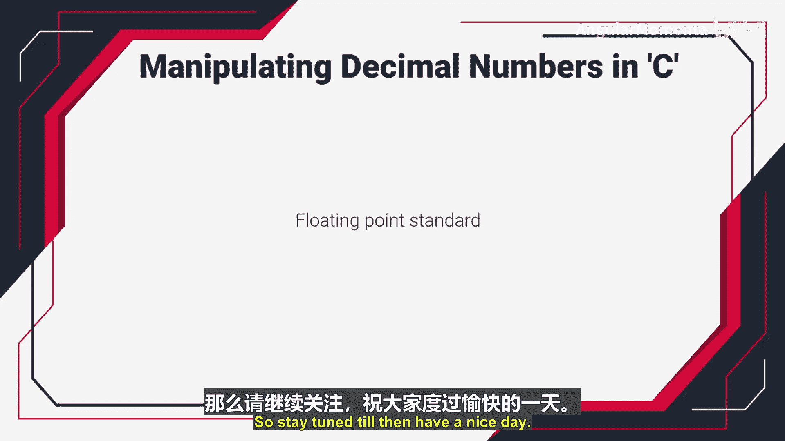

# 001：C语言中的十进制数值操作 💻

在本节课中，我们将学习如何在C语言中操作十进制数值。理解十进制数（或称实数）在计算机中的存储和处理方式，是进行嵌入式系统编程的基础。

## 什么是十进制数？

十进制数是指任何包含小数点的数字。例如，数字 **170.345** 就是一个十进制数。在编程中，这类数字也被称为实数。

## 为什么需要特殊的表示方法？

在计算机内存中，一些实数（例如非常小、非常大或带有小数部分的数字）无法用标准的整数类型来精确表示。为了解决这个问题，业界采用了 **IEEE 754标准** 来存储这些数字。

这种表示方法被称为 **浮点数表示法**，它是实数在计算机中的一种恰当表示形式。如今，所有的计算机系统和微控制器都使用这个标准来在内存中存储实数。

## 何时使用浮点数？

如果你处理的数字包含小数部分，或者使用的整数超出了 `long` 数据类型能表示的范围，那么就可以使用浮点数表示法。

到目前为止，我们讨论的主要是整数数据类型，它们并非按照此标准存储。请记住，浮点数主要用于以下情况：
*   处理非常小的数字，例如 **电子的电荷量**。
*   处理非常大的数字，例如 **地球与某个星系之间的距离**。

这类数字要么太大，无法放入常规的整数类型；要么包含小数部分。因此，它们需要使用浮点表示法。

## C语言中的浮点数据类型

在C语言中，我们主要有两种浮点数据类型：
*   **`float`**：单精度浮点数。
*   **`double`**：双精度浮点数。

你可以使用这些数据类型来声明和操作浮点数值。

## 本节总结

在本节中，我们一起学习了：
1.  十进制数（实数）的定义。
2.  计算机使用 **IEEE 754标准**（浮点数表示法）来存储实数的原因。
3.  在需要处理 **极大**、**极小** 或 **带有小数部分** 的数字时，应使用浮点数。
4.  C语言中用于操作浮点数的主要数据类型：`float` 和 `double`。

在下一节视频中，我们将深入探讨存储浮点数的具体标准。敬请期待，祝你今天愉快！