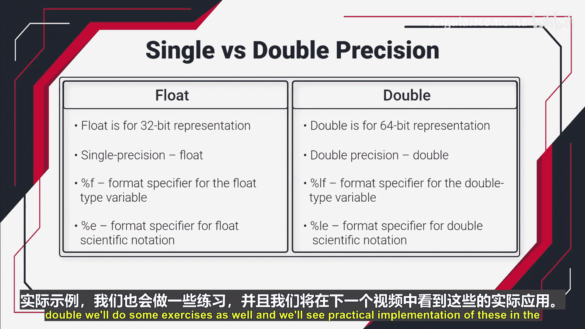

# 002：单精度与双精度浮点数 🧮

在本节课中，我们将学习用于存储实数的 IEEE 754 浮点数格式。这是一种被所有现代计算机系统和微控制器遵循的标准。

上一节我们介绍了整数类型，本节中我们来看看如何存储带有小数部分的数字。

## IEEE 754 浮点数格式

IEEE 754 是一种用于表示和操作浮点数的标准。它解决了如何高效存储大数字的问题。

例如，考虑数字 `8.435 x 10^49`。这是一个非常大的数字。如果将其直接转换为二进制存储，会消耗大量内存。因此，该标准建议不直接存储数字本身，而是存储其近似值以及必要的信息。

这些信息包括：
*   **符号**：表示正负。
*   **指数**：表示数字的缩放比例。
*   **尾数**：也称为有效数字，表示数字的精度部分。

以下是存储这些信息的两种主要格式。

## 单精度与双精度格式

根据精度和存储空间的不同，IEEE 754 定义了两种主要格式。

### 单精度格式
单精度格式使用 **32 位** 来存储一个浮点数。
其位分配如下：
*   **23 位** 用于尾数。
*   **8 位** 用于指数。
*   **1 位** 用于符号。

这种 32 位的表示方式就是单精度表示法。

### 双精度格式
双精度格式使用 **64 位** 来存储一个浮点数。
其位分配如下：
*   **52 位** 用于尾数。
*   **11 位** 用于指数。
*   **1 位** 用于符号。

与单精度实现相比，双精度实现提供了更高级的近似，因此结果也更精确。

## C 语言中的浮点数据类型

了解了存储格式后，我们来看看如何在编程中使用它们。在 C 语言中，我们有专门的数据类型来处理带小数点的数字。

考虑数字 `567.89`。它包含整数部分 `567` 和小数部分 `.89`。你不能使用 `int`、`char` 或 `long` 来存储它，因为这些类型只会存储整数部分，导致小数部分丢失。

因此，你需要使用以下数据类型：
*   **`float`**：用于 32 位的单精度表示。
*   **`double`**：用于 64 位的双精度表示。

## 格式说明符

在 C 语言中，通过标准输入输出函数读写这些小数时，需要使用正确的格式说明符。

以下是常用的格式说明符：
*   **`%f`**：用于读写 `float` 类型变量。
*   **`%lf`**：用于读写 `double` 类型变量。
*   **`%e`**：用于以科学计数法读写 `float` 类型变量。
*   **`%le`**：用于以科学计数法读写 `double` 类型变量。

需要注意的是，在 C 语言中，所有带小数点的常量默认都被编译器视为 `double` 类型。

## 总结与预告

本节课中我们一起学习了 IEEE 754 浮点数标准，了解了单精度和双精度格式如何通过存储符号、指数和尾数来高效表示实数。我们还学习了在 C 语言中如何使用 `float` 和 `double` 数据类型以及对应的格式说明符。

在下一个视频中，我们将通过一些实际例子和练习，来看看如何具体使用 `float` 和 `double`，并实践它们的实现。