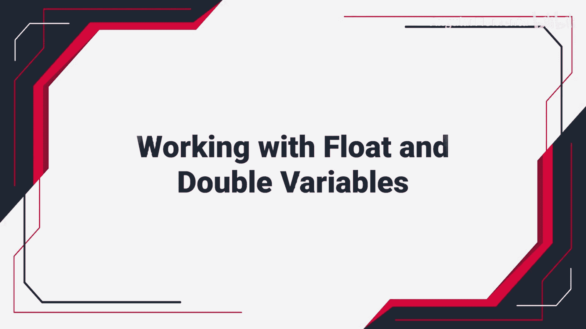
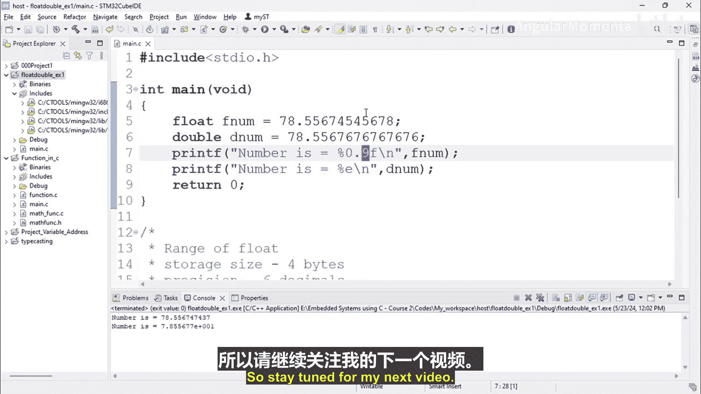

# 003：使用浮点型和双精度型变量 第一部分 🧮




在本节课中，我们将学习C语言中两种用于存储小数的数据类型：`float`（浮点型）和`double`（双精度型）。我们将通过创建项目、编写代码来了解它们的基本用法、存储差异以及如何正确地打印它们的值。

---

## 项目创建与设置

首先，我们需要创建一个新的C/C++项目来实践。我们将使用MinGW GCC编译器，并将项目命名为 `float_double_EX`。项目创建完成后，在项目中新建一个名为 `main.c` 的源文件。

## 浮点型 (float) 介绍

上一节我们完成了项目设置，本节中我们来看看 `float` 数据类型。`float` 用于存储单精度浮点数。

以下是关于 `float` 的关键信息：
*   **存储大小**：`4` 字节。
*   **精度**：最多可精确到 `6` 位小数。

在 `main.c` 文件中，我们首先包含标准输入输出头文件 `stdio.h`，然后在 `main` 函数中声明一个 `float` 类型的变量并赋值。

```c
#include <stdio.h>

int main() {
    // float 存储大小为4字节，精度最多6位小数
    float f_num = 78.123456789;
    printf("Number is %f\n", f_num);
    return 0;
}
```
编译并运行此程序，你会发现打印出的数值被四舍五入到了大约6位小数，这是因为 `float` 的精度限制。

## 双精度型 (double) 介绍

了解了 `float` 之后，我们再来看看精度更高的 `double` 类型。`double` 意为“双倍”，它提供了比 `float` 更高的精度。

以下是关于 `double` 的关键信息：
*   **存储大小**：`8` 字节。
*   **精度**：最多可精确到 `15` 位小数。

现在，我们在程序中添加一个 `double` 类型的变量进行对比。

```c
#include <stdio.h>

int main() {
    // float 存储大小为4字节，精度最多6位小数
    float f_num = 78.123456789;
    // double 存储大小为8字节，精度最多15位小数
    double d_num = 78.123456789;

    printf("Float Number is %.9f\n", f_num);
    printf("Double Number is %.9f\n", d_num);

    return 0;
}
```
注意，在 `printf` 函数中，我们使用了格式说明符 `%.9f` 来指定打印9位小数。运行程序，你会观察到 `double` 类型变量能更准确地保留更多位小数。

## 格式化输出控制

为了更清晰地展示两种类型的精度差异，我们可以通过格式说明符精确控制输出的小数位数。

以下是调整输出精度的示例：
```c
printf("Float Number is %.14f\n", f_num); // 尝试打印14位，但float只能精确约6位
printf("Double Number is %.14f\n", d_num); // double可以精确打印更多位
```
运行修改后的代码，`float` 类型的输出在超出其精度的部分会出现不准确的数字，而 `double` 类型则能正确显示。

## 科学计数法表示

除了常规小数格式，我们还可以使用科学计数法来打印浮点数。这通过格式说明符 `%e` 实现。

以下是如何使用科学计数法：
```c
printf("Scientific notation: %e\n", d_num);
```
此外，我们也可以控制科学计数法表示中的小数位数：
```c
printf("Scientific notation (2 decimals): %.2e\n", d_num);
```
使用 `%.2e` 会将数值四舍五入到小数点后两位，再以科学计数法形式输出。

---



本节课中我们一起学习了 `float` 和 `double` 两种浮点数类型的基本概念、存储精度差异，以及如何使用 `printf` 函数配合 `%f` 和 `%e` 等格式说明符来控制它们的输出格式。正确理解这些数据类型对于进行精确的数值计算至关重要。在下一部分，我们将继续探讨与浮点数相关的更多操作和注意事项。