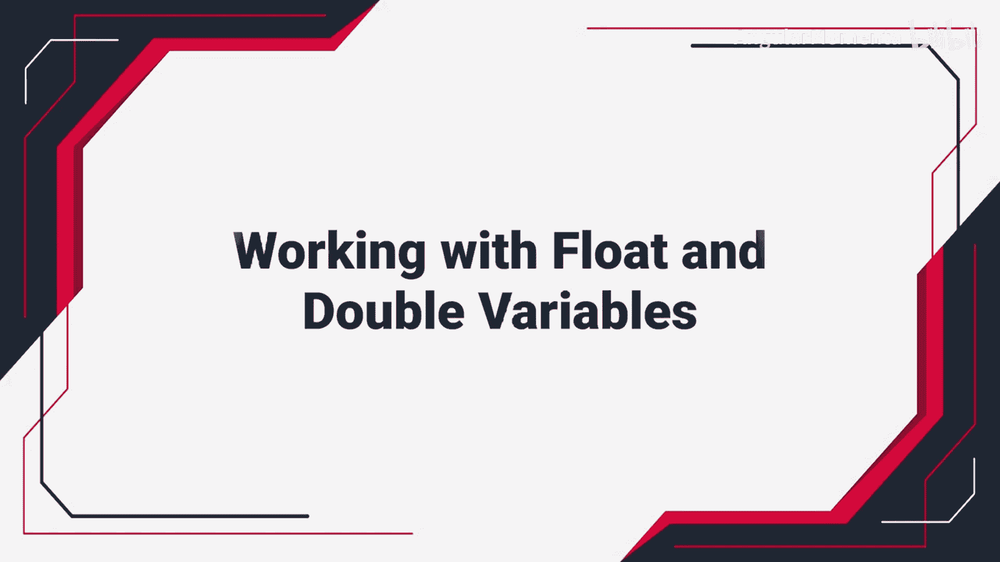
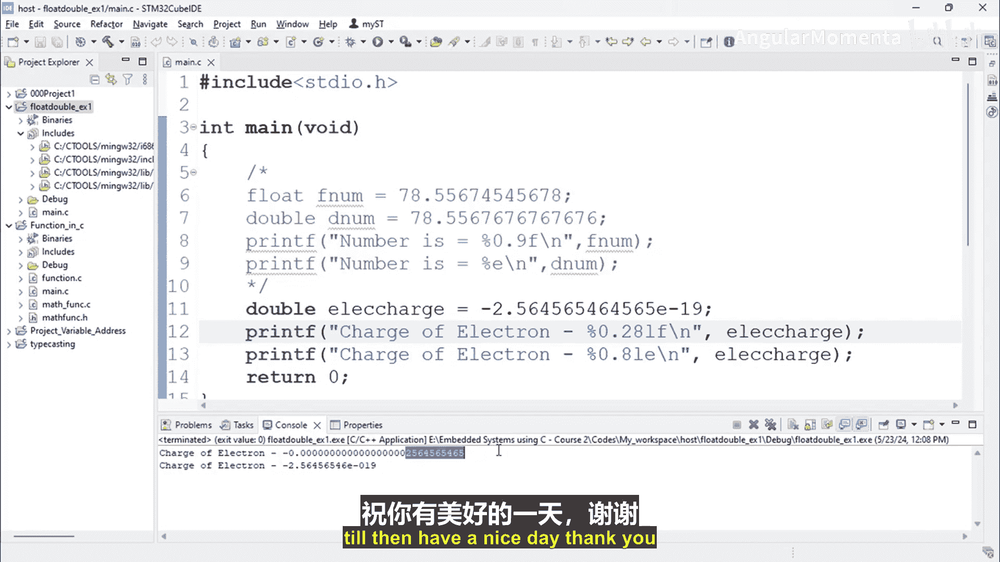

# 004：处理浮点型与双精度变量（第二部分） 🧮




在本节课中，我们将继续学习如何在C语言中处理浮点数和双精度数。我们将通过一个具体的编程示例，演示如何声明、赋值和打印一个极小的数值（如电子电荷），并比较使用`float`和`double`类型时的精度差异。

上一节我们介绍了浮点型变量的基本概念和打印格式。本节中，我们来看看如何在实际编程中应用这些知识，并处理高精度需求。

## 编程示例：存储并打印电子电荷

我们将编写一个程序，创建一个变量来存储电子的电荷值（约为 `1.602 × 10^-19` 库仑），并使用不同的格式打印它。

以下是创建和打印浮点变量的步骤：

1.  首先，我们创建一个`float`类型的变量。
2.  使用科学计数法（`E`表示法）为其赋值。
3.  使用`printf`函数，配合`%f`和`%e`格式说明符来打印这个值。

```c
// 创建一个浮点变量存储电子电荷
float electron_charge = 1.602E-19;

// 使用 %f 格式打印（默认显示6位小数）
printf("Charge of electron is: %f\n", electron_charge);

// 使用 %e 格式打印（科学计数法）
printf("Charge of electron is: %e\n", electron_charge);
```

运行这段代码后，使用`%f`格式可能会输出`0.000000`，这是因为数值太小，默认的6位小数不足以显示它。而`%e`格式则可以正确显示其科学计数法形式。

## 控制输出精度

为了更精确地控制输出的小数位数，我们可以在格式说明符中指定精度。

以下是如何指定输出精度的示例：

*   `%.8f`： 输出浮点数，并保留8位小数。
*   `%.8e`： 以科学计数法输出，并保留8位小数。

将代码修改为指定精度后再次运行，可以观察到输出的小数位数发生了变化。

## 使用双精度类型提升精度

`float`类型通常提供约6-7位有效数字的精度。对于需要更高精度的场景，我们可以使用`double`类型。

以下是使用`double`类型的修改：

1.  将变量类型从`float`改为`double`。
2.  在`printf`中使用对应的格式说明符`%lf`（用于`double`的`%f`）和`%le`（用于`double`的`%e`）。

```c
// 创建一个双精度变量存储电子电荷
double electron_charge_double = 1.602E-19;

// 使用 %lf 格式打印，并指定28位小数以显示这个极小值
printf("Charge of electron (double) is: %.28lf\n", electron_charge_double);
```

使用`double`类型后，由于其提供约15位有效数字的更高精度，当我们指定显示足够多的小数位（例如28位）时，就能清晰地看到这个极小数值的细节，而不仅仅是零。



本节课中我们一起学习了如何声明和打印浮点数与双精度数。通过电子电荷的例子，我们实践了使用科学计数法赋值，并使用`%f`、`%e`及其精度控制格式进行输出。关键点在于理解了`float`和`double`在精度上的差异：对于需要高精度的计算，应优先选择`double`类型，并在打印时指定足够的精度来正确显示数据。