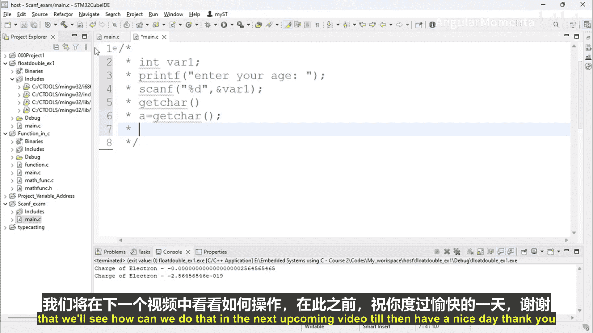

# 005：scanf 函数简介


## 概述

在本节课程中，我们将学习C语言中另一个重要的库函数：`scanf`。我们将了解它的作用、基本用法，以及如何用它从标准输入（如键盘）读取数据。这对于编写能与用户交互的程序至关重要。

## scanf 函数简介

`scanf` 是一个标准库函数，它允许你从标准输入读取数据。在个人计算机上，标准输入通常指键盘。在嵌入式系统中，输入设备可能是触摸屏或按键板等。使用 `scanf` 函数，你可以从键盘读取字符和数字。

## 基本语法与用法

上一节我们介绍了 `scanf` 的基本概念，本节中我们来看看它的具体语法和如何编写代码。

`scanf` 函数的基本语法格式如下：
```c
scanf("格式说明符", &变量名);
```

以下是 `scanf` 使用时的两个核心要点：
1.  **格式说明符**：指定要读取的数据类型，例如 `%d` 表示整数，`%c` 表示字符。
2.  **地址运算符 `&`**：在变量名前使用 `&` 符号，表示将读取的值存储到该变量的内存地址中。

## 代码示例解析

让我们通过一个具体的代码片段来理解 `scanf` 的用法。

假设我们创建一个变量 `age`，并提示用户输入年龄：
```c
int age;
printf("Enter your age: ");
scanf("%d", &age);
```
在这段代码中：
*   `printf` 函数向用户显示提示信息。
*   `scanf("%d", &age)` 会等待用户输入一个整数。
*   用户输入的数字（例如 `25`）会被读取，并通过 `&age` 存储到变量 `age` 的内存地址中。
*   这样，用户输入的数据就被成功读取到程序里了。

## 相关函数：getchar

除了 `scanf`，C语言还提供了 `getchar` 函数用于读取单个字符。

`getchar` 函数用于从标准输入读取一个字符。它不接受参数，并返回一个整数值，该值是所按键的ASCII码。

例如：
```c
int a;
a = getchar();
```
程序执行到 `getchar()` 时会暂停，直到用户按下一个键。该键的ASCII码值会被获取并存储在变量 `a` 中，然后程序继续执行。

## 实践任务预告

在理解了 `scanf` 的基本用法后，下一节视频我们将进行实践。

你需要创建一个程序，该程序使用 `scanf` 从用户那里接收四个整数，计算它们的平均值，并将结果打印给用户。这将巩固你对 `scanf` 函数用法的理解。

## 总结

本节课中我们一起学习了 `scanf` 函数。我们了解到它是一个用于从标准输入读取数据的库函数，其核心在于正确使用格式说明符（如 `%d`、`%c`）和地址运算符 `&`。我们还简单了解了 `getchar` 函数用于读取单个字符的用途。掌握这些输入函数是进行用户交互式编程的基础。



