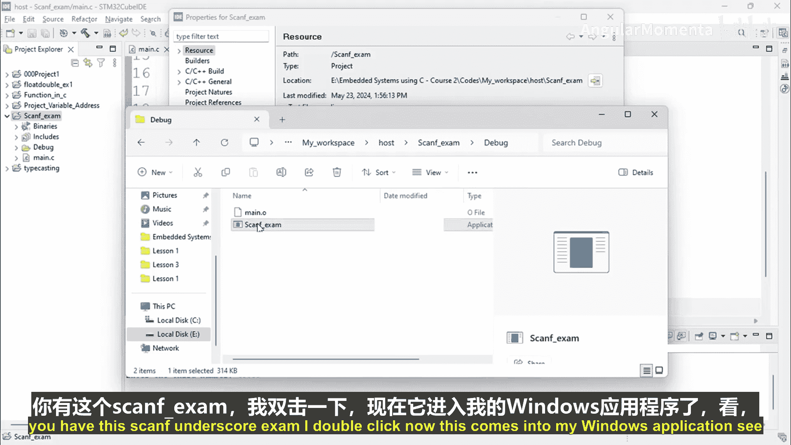
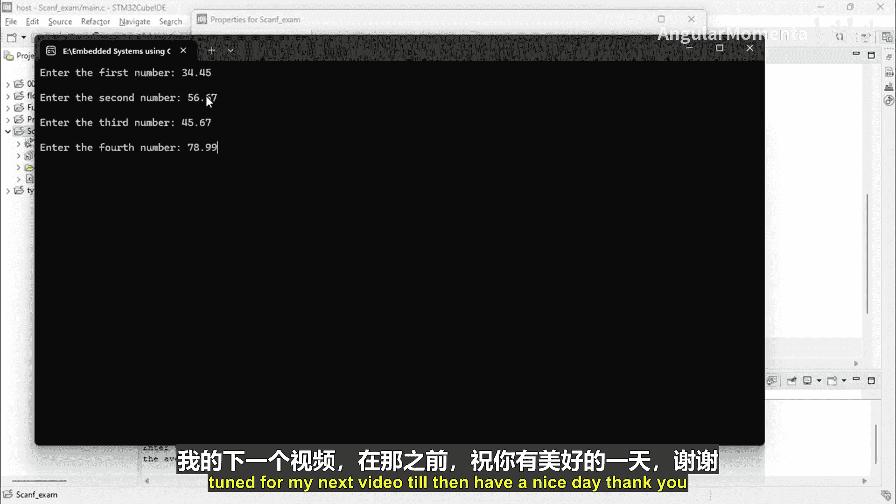

# 006：构建嵌入式系统 p06 01_02_02_scanf练习实现第一部分

在本节课中，我们将学习如何在嵌入式系统项目中实际使用 `scanf` 函数。我们将创建一个简单的C语言程序，用于计算四个数字的平均值。通过这个练习，你将掌握使用 `scanf` 接收用户输入、处理浮点数以及管理控制台输出的基本方法。

## 项目创建与变量声明

上一节我们介绍了 `scanf` 函数的基本概念，本节中我们来看看如何将其应用于一个实际项目。

首先，你需要创建一个新的C++项目。为项目命名，并在其中添加一个新的 `main.c` 文件。在该文件中，创建 `main` 函数作为程序的入口点。

接下来，在 `main` 函数内部，我们需要声明变量来存储用户输入的数字和计算结果。由于平均值可能是小数，我们将使用 `float` 类型。

以下是变量声明的代码示例：
```c
float number1, number2, number3, number4;
float average;
```

## 使用 `printf` 和 `scanf` 获取用户输入

变量声明完成后，我们需要提示用户输入数据，并使用 `scanf` 函数读取这些输入。

我们将使用 `printf` 函数在控制台显示提示信息。为了让用户在同一行输入，我们不在提示信息末尾添加换行符 `\n`。然后，使用 `scanf` 读取用户输入，并将其存储到相应的变量中。`%f` 是用于读取浮点数的格式说明符。

以下是获取四个数字输入的代码：
```c
printf("Enter the first number: ");
scanf("%f", &number1);

printf("Enter the second number: ");
scanf("%f", &number2);

printf("Enter the third number: ");
scanf("%f", &number3);

printf("Enter the fourth number: ");
scanf("%f", &number4);
```

## 计算并输出平均值

获取所有输入后，我们可以计算这四个数字的平均值。计算公式为总和除以数量。

计算平均值的代码如下：
```c
average = (number1 + number2 + number3 + number4) / 4;
```

计算完成后，我们需要将结果显示给用户。使用 `printf` 函数并配合 `%f` 格式说明符来输出 `average` 变量的值。

输出结果的代码如下：
```c
printf("The average is: %f\n", average);
```

## 处理控制台输出缓冲问题

在集成开发环境（如Eclipse）的控制台中运行程序时，你可能会遇到提示信息没有立即显示的问题。这是因为输出内容被缓冲在操作系统的输出缓冲区中，没有立即刷新到控制台显示。

为了解决这个问题，我们需要在每次使用 `printf` 后，显式地刷新输出缓冲区。这可以通过调用 `fflush(stdout)` 函数来实现。

修改后的提示输入代码如下：
```c
printf("Enter the first number: ");
fflush(stdout);
scanf("%f", &number1);

// ... 对其他三个数字重复此模式
```

## 在Windows中直接运行程序

有时，IDE内置的控制台对 `scanf` 的支持并不理想。作为替代方案，你可以直接运行编译生成的可执行文件（.exe）。

以下是找到并运行可执行文件的步骤：
1.  在项目文件夹中，导航到 `Debug` 子目录。
2.  找到与项目同名的 `.exe` 文件（例如 `scanf_example.exe`）。
3.  双击该文件，它将在独立的Windows命令提示符窗口中运行。在这个窗口中，输入和输出通常会按预期工作。



## 总结



本节课中我们一起学习了 `scanf` 函数的实际应用。我们创建了一个计算四个数字平均值的程序，涵盖了从项目创建、变量声明、用户输入获取、数据计算到结果输出的完整流程。我们还探讨了在特定开发环境中可能遇到的输出缓冲问题及其解决方案，并介绍了直接运行可执行文件作为备选测试方法。掌握这些基础知识是进行更复杂嵌入式系统编程的重要一步。