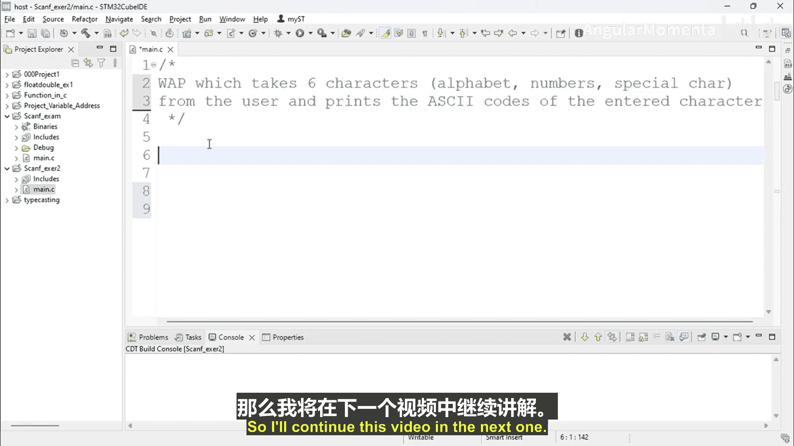

# 008：scanf练习2第1部分

## 概述

在本节课程中，我们将学习如何编写一个C语言程序。该程序需要从用户处接收六个字符输入，并打印出这些字符对应的ASCII码值。我们将使用`scanf`或`getchar`函数来获取输入，并通过整数格式输出字符的ASCII码。

## 创建新项目

首先，我们需要创建一个新的C/C++项目来编写我们的程序。

以下是创建项目的具体步骤：

1.  创建一个新的C/C++项目。
2.  将项目命名为 `ScanfExercise2`。
3.  点击“下一步”并完成项目创建。
4.  关闭项目创建向导。
5.  在项目中添加一个新的源文件，命名为 `main.c`。

## 练习目标

现在，我们来看看本次练习的具体要求。

你需要编写一个程序，该程序能够从用户处读取六个字符。这些字符可以是字母、数字或除换行符外的任何特殊字符。程序需要打印出每个输入字符对应的ASCII码值。

程序的预期输出应为一组数字，即每个输入字符的ASCII码。例如，如果你输入了字符 `a`、`b`、`c`、`d`、`1`、`2`，那么程序应该输出这些字符对应的ASCII码值，如 `97`、`98`、`99`、`100`、`49`、`50`。

为了实现这个功能，你需要将输入的字符存储到变量中，然后以整数格式打印这些变量，从而显示其ASCII码值。

## 后续步骤

在下一节视频中，我们将动手编写这个程序。我们将尝试使用C语言实现上述功能。

## 总结

本节课中，我们一起学习了如何规划一个C语言程序，该程序需要读取用户输入的六个字符并输出其ASCII码。我们创建了项目文件，并明确了程序的功能需求。下一节我们将开始具体的代码实现。