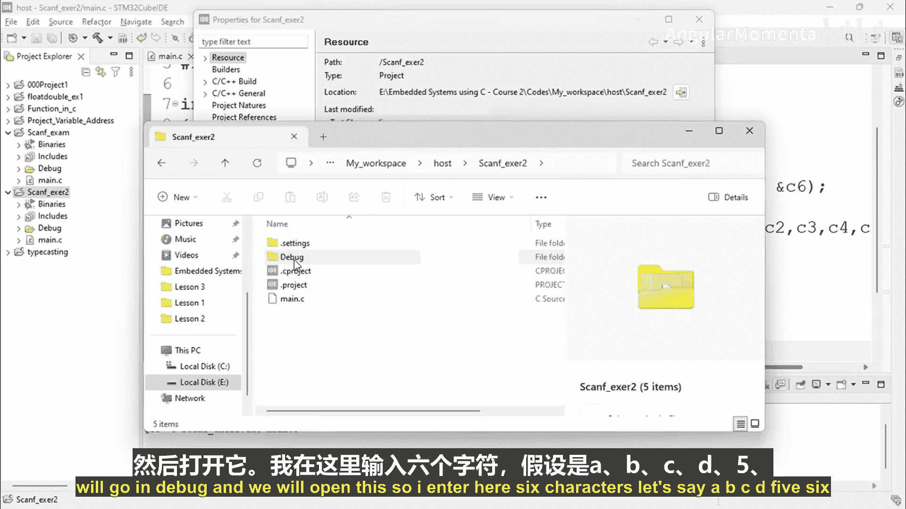
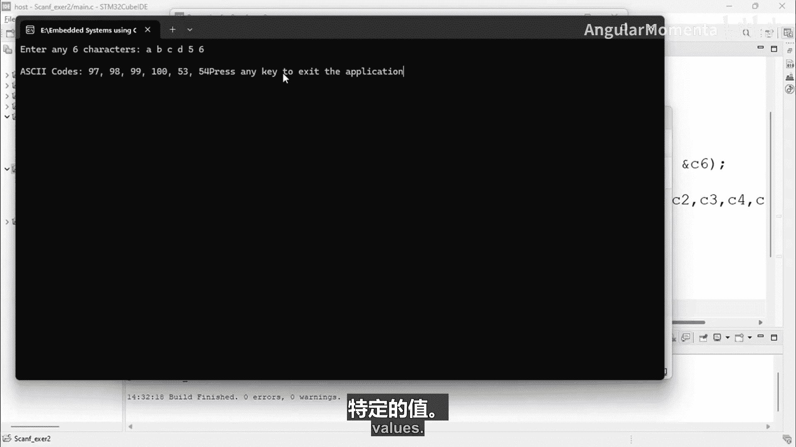
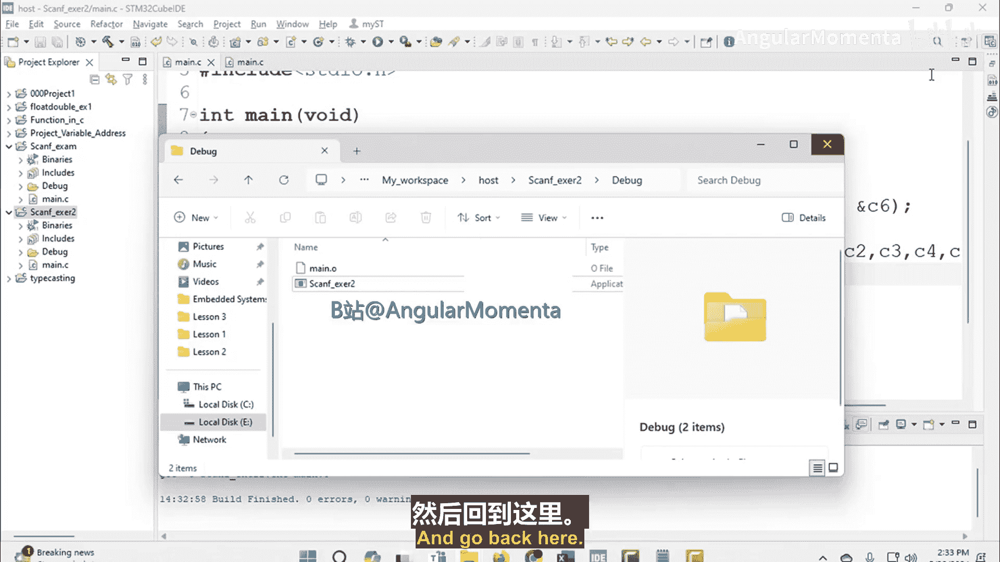
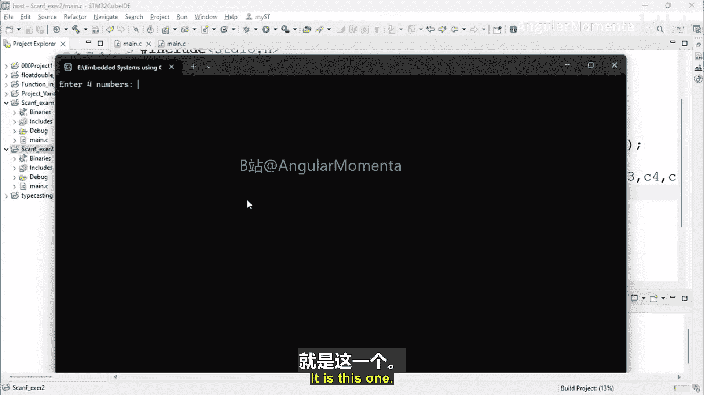
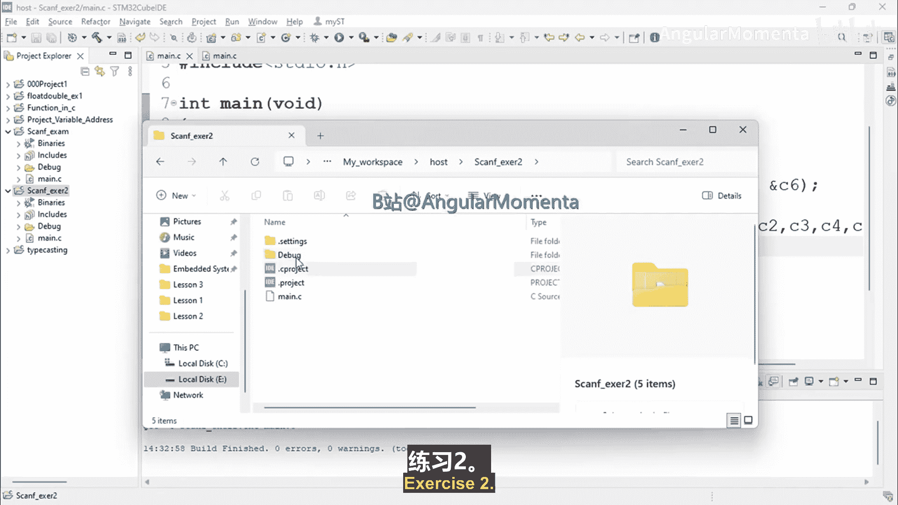
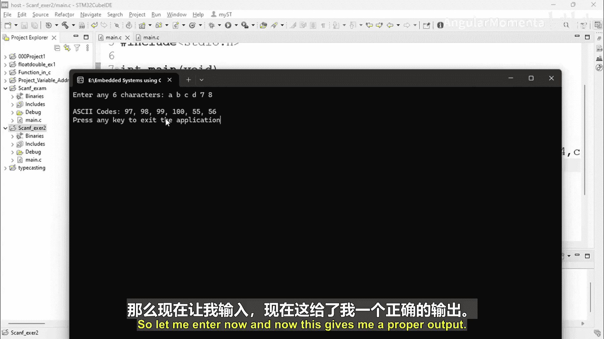
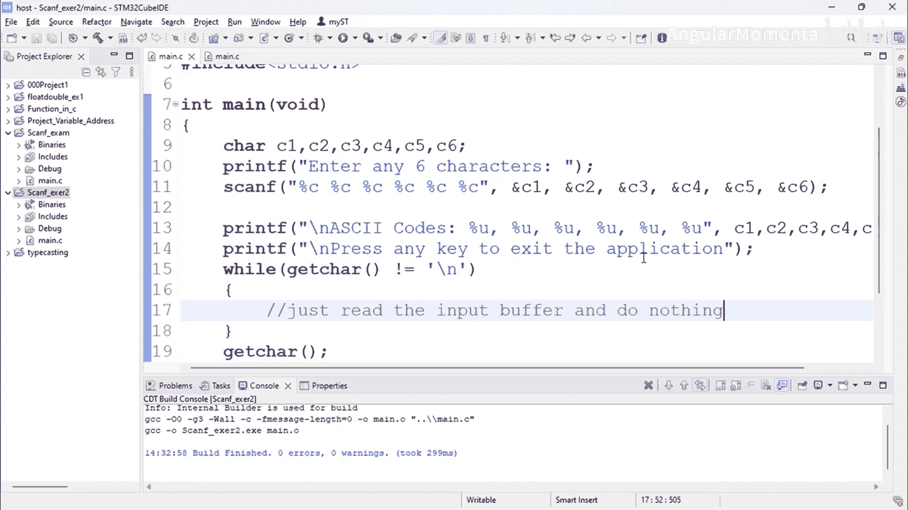

# 009：scanf练习2第二部分 🖥️

在本节课中，我们将继续学习如何在STM32嵌入式系统中使用`scanf`函数。我们将基于上一节创建的项目，编写一个程序来接收用户输入的六个字符，并打印出它们对应的ASCII码值。

## 概述

上一节我们介绍了如何使用`scanf`函数接收用户输入。本节中，我们来看看如何扩展这个程序，使其能够接收多个字符输入，并显示每个字符的ASCII码值。

## 项目准备

项目已在之前的视频中创建完成。首先，我们将使用`SDDio.h`库，并创建`main`函数。

```c
#include "SDDio.h"

int main(void) {
    // 程序代码将写在这里
}
```

## 实现步骤

以下是实现该练习的具体步骤。

### 1. 提示用户输入

我们使用`printf`函数向用户发送一条消息，提示输入六个字符。

```c
printf("请输入六个字符：");
```

### 2. 声明变量

我们需要六个字符变量来存储用户输入的字符。

```c
char c1, c2, c3, c4, c5, c6;
```

### 3. 接收用户输入

使用`scanf`语句接收六个字符。由于`%c`用于读取单个字符，我们需要重复六次。

```c
scanf("%c%c%c%c%c%c", &c1, &c2, &c3, &c4, &c5, &c6);
```

### 4. 打印ASCII码值

接下来，我们使用`printf`函数打印每个字符对应的ASCII码值。ASCII码是数字，可以使用`%d`（有符号整数）或`%u`（无符号整数）格式说明符。这里我们使用`%u`。

```c
printf("ASCII码值为：%u, %u, %u, %u, %u, %u\n", c1, c2, c3, c4, c5, c6);
```

### 5. 完整代码示例



将以上步骤组合起来，完整的代码如下。



```c
#include "SDDio.h"

int main(void) {
    char c1, c2, c3, c4, c5, c6;

    printf("请输入六个字符：");
    scanf("%c%c%c%c%c%c", &c1, &c2, &c3, &c4, &c5, &c6);

    printf("ASCII码值为：%u, %u, %u, %u, %u, %u\n", c1, c2, c3, c4, c5, c6);

    return 0;
}
```

## 编译与调试



保存代码后，编译项目。编译成功后，进入调试模式并运行程序。程序会提示输入六个字符。例如，输入`A BC D56`（注意空格也是一个字符），程序将输出每个字符对应的ASCII码值。



> **注意**：`scanf`会读取输入缓冲区的内容，包括空格和换行符。如果输入后没有立即显示结果，可能需要清除输入缓冲区。可以使用一个额外的`scanf`语句来读取并忽略换行符。



```c
// 读取并忽略输入缓冲区中的剩余内容（包括换行符）
scanf("%*[^\n]");
scanf("%*c");
```



## 替代方案

除了使用`scanf`，也可以使用`getchar`函数来获取单个字符。`getchar`每次读取一个字符，适合简单的字符输入场景。但本教程中，我们选择使用`scanf`来实现。

```c
c1 = getchar();
c2 = getchar();
// ... 以此类推
```

## 总结

本节课中我们一起学习了如何扩展`scanf`函数的使用，以接收多个字符输入并显示它们的ASCII码值。我们回顾了变量声明、输入输出函数的使用，以及编译调试的基本流程。通过这个练习，你应能更熟练地在嵌入式系统中处理用户输入。

---



**提示**：本程序仅用于读取输入缓冲区并显示ASCII值。在实际应用中，可能需要根据具体需求调整输入处理逻辑。