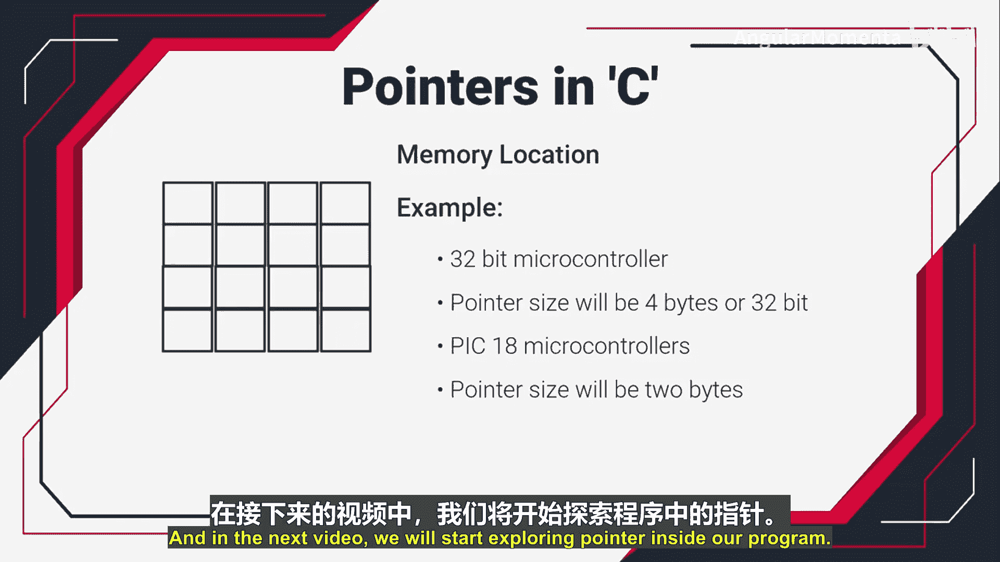

# 010：C语言中的指针


在本节课中，我们将要学习C语言中一个非常核心且强大的概念——指针。指针是嵌入式C编程中与硬件交互、读写外设和配置内存的关键工具。我们将从理解指针的基本定义开始，逐步探索其重要性。

## 什么是指针？🧭

上一节我们介绍了本课程的学习目标，本节中我们来看看指针到底是什么。

指针本质上就是**内存地址**。计算机内存由许多可以存储数据（例如1字节）的单元组成，每个内存单元都有一个唯一的地址。这个地址就被称为指针，因为它“指向”存储在该内存位置的数据。

为了更直观地理解，我们可以想象内存是一系列连续的存储格子：

```
[地址: 0x1000] -> 存储数据 A
[地址: 0x1001] -> 存储数据 B
[地址: 0x1002] -> 存储数据 C
...
```

在这里，`0x1000`、`0x1001`等就是指针，它们指向了具体的数据A、B、C。

## 指针的作用与特性 ⚙️

理解了指针的定义后，我们来看看使用指针可以做什么，以及它有哪些重要特性。

通过指针，我们可以执行多种操作：
*   **写入数据**：向指针所指向的内存位置写入新值。
*   **读取数据**：从指针指向的内存位置读取值到程序中。
*   **指针运算**：对指针进行递增等操作，使其指向下一个内存位置（例如从`0x1000`移动到`0x1001`）。

指针的大小取决于处理器架构：
*   在**64位**系统中，指针大小通常为 **8字节**。
*   在**32位ARM微控制器**（如许多STM32）中，指针大小为 **4字节**。
*   在一些**8位微控制器**中，指针大小可能为 **2字节**。

这个大小决定了指针变量能寻址的内存空间范围。

## 总结与预告 📚

本节课中我们一起学习了指针的基础概念。我们了解到指针就是内存地址，它是访问和操作内存中数据的直接方式，在嵌入式编程中至关重要。指针的大小随处理器架构而变化。

在下一个视频中，我们将开始在具体的C程序里探索指针的声明和使用方法。请继续关注接下来的内容。



---
**课程名称**：构建嵌入式系统 | ARM Cortex (STM32) Fundamentals
**章节编号**：P10
**章节名称**：C语言中的指针