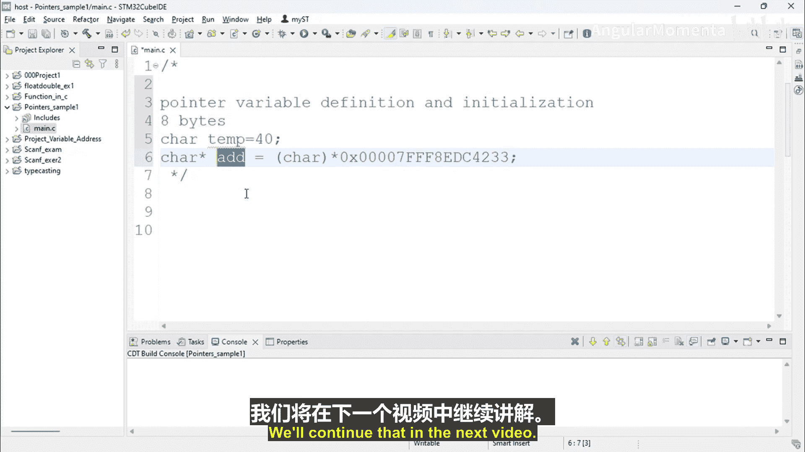

# 011：指针变量与初始化 📝


在本节课中，我们将学习指针变量的定义与初始化。我们将了解指针变量在内存中如何分配空间，以及指针数据类型的作用。

---

上一节我们介绍了指针的基本概念，本节中我们来看看如何定义和初始化一个指针变量。

指针变量的定义使用星号（`*`）符号。例如，定义一个字符型指针变量：
```c
char *ptr;
```
这行代码定义了一个名为 `ptr` 的指针变量，它用于存储一个字符类型数据的地址。

当编译器看到指针变量的定义时，它会为该变量分配内存空间。在64位机器上，无论指针指向何种数据类型，编译器都会为指针变量本身预留 **8字节** 的内存。这是因为在64位架构中，一个内存地址需要8字节来存储。

指针变量存储的值是一个内存地址。这个地址指向计算机内存中的某个数据。指针变量的地址（即存储这个地址值的内存位置）和它存储的地址值（即它指向的数据的地址）是两个不同的概念。

既然指针变量的大小固定为8字节，那么定义指针时指定的数据类型（如 `char *`、`int *`）有何作用呢？其核心目的是**控制通过该指针进行操作时的行为**。

以下是这些操作的具体说明：

*   **读取操作**：当通过指针读取数据时，指针的数据类型决定了从目标地址开始读取多少字节的数据。例如，`char *` 会读取1字节，而 `int *` 在大多数系统上会读取4字节。
*   **写入操作**：同理，写入操作也会根据指针的数据类型来决定写入多少字节的数据。
*   **算术运算**：对指针进行加1（`ptr++`）或减1（`ptr--`）操作时，指针移动的字节数由其指向的数据类型大小决定。`char *` 移动1字节，`int *` 则移动4字节。

因此，`char *ptr;` 定义了一个字符型指针。对该指针进行读取操作将产生1字节的数据。这样的变量也称为“指向字符类型数据的指针”或“字符型指针”。

在下一个视频中，我们将通过实例来创建指针变量和普通变量，并尝试为指针变量赋值，这将使你对指针变量的概念更加清晰。

---



本节课中我们一起学习了指针变量的定义与初始化。我们了解到指针变量本身固定占用8字节内存，而指针的数据类型则决定了通过该指针进行操作（如读写、算术运算）时访问内存的粒度。下一节我们将通过代码实践来巩固这些概念。