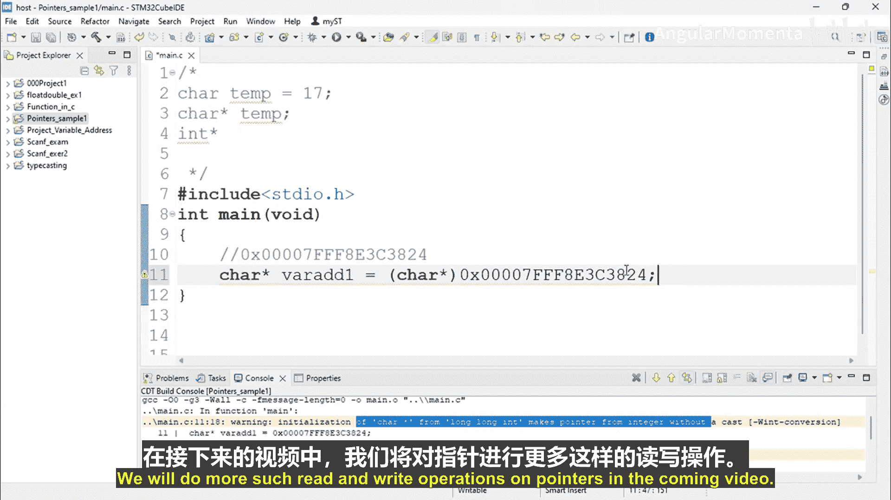

# 012：指针变量与指针数据类型 📌


在本节课中，我们将学习如何在C程序中存储和操作内存地址，即指针。我们将重点理解如何声明指针变量，以及如何通过指针变量来操作数据。

---

## 概述

在之前的课程中，我们了解到内存地址就是指针。本节我们将通过一个具体的例子，学习如何在程序中存储指针，并理解指针变量与普通变量的区别。

---

## 变量与数据存储

在C程序中，要存储一个数据值，我们首先需要创建一个变量。例如，要存储温度值，我们可以创建一个`float`类型的变量`temp`，并将其初始化为17。变量`temp`用于操作数据，例如比较、增减或打印温度值。

**代码示例：**
```c
float temp = 17;
```

变量的核心作用是操作数据。同样，要操作一个指针，我们也需要创建一个指针变量。

---

## 指针变量的声明与操作

指针变量用于存储内存地址，并允许我们对该地址进行读写、递增或递减等操作。声明指针变量时，需要使用特定的指针数据类型。

以下是声明指针变量的步骤：
1.  指定指针所指向的数据类型。
2.  在变量名前使用星号`*`，以区分普通变量和指针变量。

**代码示例：**
```c
char *ptr;  // 声明一个指向字符类型的指针变量
int *intPtr; // 声明一个指向整数类型的指针变量
```

星号`*`是区分普通变量和指针变量的关键。例如，`int`表示整数类型，而`int *`表示指向整数的指针类型。

---

## 在程序中存储指针

现在，让我们在具体的程序中看看如何存储一个指针。首先，我们假设有一个内存地址`0x7ffeeb5b9a3c`。虽然这是一个地址，但对于编译器来说，它只是一个数值。

**初始尝试（错误示范）：**
```c
long long addressVar = 0x7ffeeb5b9a3c;
```
上面的代码只是将一个很大的数值存储在一个`long long`类型的变量中。对于编译器而言，`addressVar`只是一个普通变量，而不是指针变量。

为了告诉编译器这是一个内存地址，我们需要使用指针变量并进行显式类型转换。

**正确方法：**
```c
char *addressPtr = (char *)0x7ffeeb5b9a3c;
```
在这行代码中：
*   `char *` 是指针数据类型，表示指向`char`类型的指针。
*   `addressPtr` 是指针变量名。
*   `(char *)` 是显式类型转换，它告诉编译器后面的数值`0x7ffeeb5b9a3c`是一个地址，而不是普通的`long long`数值。

如果不进行显式转换，编译器会报错，因为它无法自动将一个大整数识别为指针。

---

## 核心概念总结

*   **指针**：即内存地址。
*   **指针变量**：用于存储和操作内存地址的变量。其声明需要在数据类型后加星号`*`，例如 `int *ptr`。
*   **类型转换**：将一个数值（如内存地址）转换为指针类型时，必须使用显式类型转换，例如 `(int *)0x1000`。

---

## 总结



本节课我们一起学习了指针的核心概念。我们了解到，要操作内存地址，必须声明指针变量，并使用正确的数据类型和显式类型转换来存储地址值。指针变量使我们能够对特定的内存位置进行读写和修改操作，这是嵌入式系统编程中直接操作硬件的基础。在接下来的课程中，我们将进一步学习如何使用指针进行实际的读写操作。