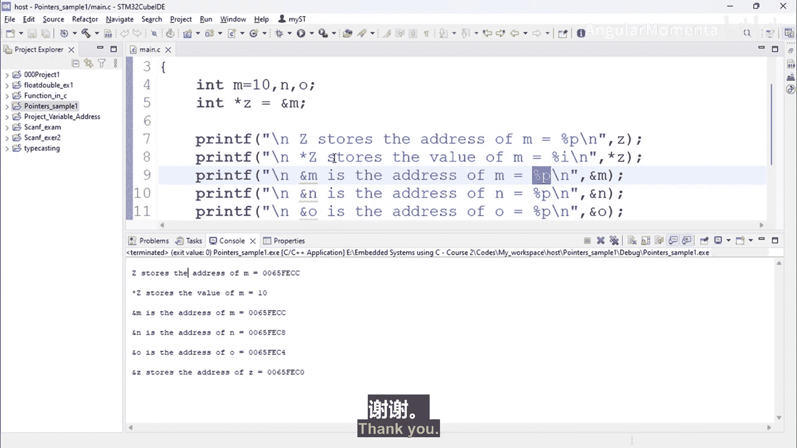

# 013：指针读写操作 📝


在本节课中，我们将学习如何通过指针进行数据的读取和写入操作。理解指针的读写是掌握C语言内存管理的关键步骤。

上一节我们介绍了指针的基本概念和地址操作，本节中我们来看看如何通过指针来访问和修改内存中的数据。

## 读取指针数据

要从指针读取数据，必须对指针进行解引用操作。解引用意味着访问指针所指向的内存地址中存储的实际值。

以下是读取指针数据的基本语法：
```c
data_type variable_name = *pointer_name;
```
在这个上下文中，星号 `*` 也被称为解引用运算符。编译器会根据指针的类型（例如 `char*`）从指针指向的地址获取相应大小的数据（例如1字节），并将其存储到指定的变量中。

## 指针读写实践示例

为了更好地理解，我们创建一个具体的示例程序。该程序将演示如何声明指针、为其赋值、通过指针读取值，以及查看不同变量的地址。

以下是完整的示例代码：
```c
#include <stdio.h>

int main() {
    // 声明并初始化三个整型变量
    int m = 10;
    int n;
    int o;

    // 声明一个整型指针变量，并将变量m的地址赋给它
    int* z = &m;

    // 打印指针z中存储的地址（即m的地址）
    printf("z 存储的地址 = %p\n", z);

    // 通过解引用指针z来读取并打印m的值
    printf("*z 存储的值 = %d\n", *z);

    // 直接使用&运算符打印变量m的地址
    printf("&m 是 m 的地址 = %p\n", &m);

    // 打印变量n和o的地址
    printf("&n 是 n 的地址 = %p\n", &n);
    printf("&o 是 o 的地址 = %p\n", &o);

    // 打印指针变量z自身的地址
    printf("&z 是 z 的地址 = %p\n", &z);

    return 0;
}
```

## 代码输出与分析

运行上述程序后，你将在控制台看到类似以下的输出：

```
z 存储的地址 = 0x7ffd4ffa456c
*z 存储的值 = 10
&m 是 m 的地址 = 0x7ffd4ffa456c
&n 是 n 的地址 = 0x7ffd4ffa4570
&o 是 o 的地址 = 0x7ffd4ffa4574
&z 是 z 的地址 = 0x7ffd4ffa4560
```

对输出结果的分析如下：

1.  **指针存储的地址**：指针变量 `z` 中存储的值是变量 `m` 的内存地址（例如 `0x7ffd4ffa456c`）。
2.  **通过指针读取的值**：通过对指针 `z` 解引用（`*z`），我们得到了变量 `m` 中存储的整数值 `10`。
3.  **变量地址的一致性**：直接通过 `&m` 获取的地址与指针 `z` 中存储的地址完全相同，这验证了 `z = &m;` 这条赋值语句的作用。
4.  **不同变量的地址**：变量 `n`、`o` 和 `z` 都拥有各自独立且不同的内存地址。每个变量在内存中都有其专属的位置。
5.  **打印地址的格式说明符**：在 `printf` 函数中，使用 `%p` 作为格式说明符来打印内存地址。

## 核心要点总结

本节课中我们一起学习了指针的核心读写操作：

*   **读取数据**：通过对指针使用解引用运算符 `*` 来获取其指向地址中的数据。
*   **地址与值的区分**：指针变量本身存储的是一个地址，通过解引用才能得到该地址处的值。
*   **`&` 与 `*` 运算符**：`&` 用于获取变量的地址，`*` 用于获取指针所指地址的值，两者互为逆操作。
*   **内存视图**：每个变量都有唯一的内存地址，可以使用 `&` 运算符查看。指针使我们能够间接地通过这些地址来操作数据。



理解这些概念是进行底层内存操作、数据结构和高效嵌入式编程的基础。