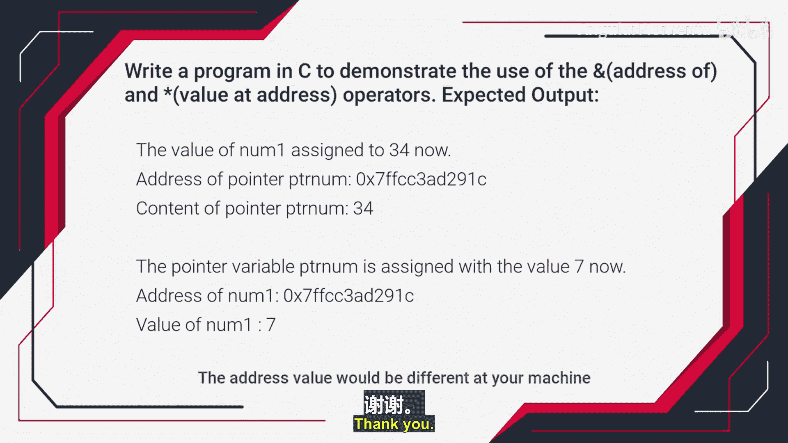

# 014：指针练习1与练习2理解


在本节课程中，我们将学习并完成两个关于指针的编程练习。指针是C语言中一个核心且强大的概念，理解它对于嵌入式系统开发至关重要。我们将通过动手实践来加深对指针操作的理解。

## 练习一：基础指针操作

上一节我们介绍了指针的基本概念，本节中我们来看看第一个练习的具体要求。这个练习旨在帮助你熟悉如何声明指针、如何通过指针访问和修改变量的值。

以下是练习一的预期输出步骤：

1.  打印一个整型变量的地址。
2.  打印该整型变量的值。
3.  声明一个指针变量，将其指向该整型变量。
4.  打印指针变量自身的地址。
5.  打印指针变量所存储的内容（即它所指向的变量的地址）。
6.  通过指针变量，将一个新的值赋给原始整型变量。
7.  再次打印指针变量的地址和内容，观察变化。

这个练习的关键在于理解：通过指针修改变量值后，变量本身的值会改变，但指针变量自身的地址以及它存储的地址（指向关系）通常不会改变。

完成此练习后，你将得到类似下方的输出结果：

```
地址 of number: 0x7ffc7d2b5a34
值 of number: 10
地址 of pointer: 0x7ffc7d2b5a38
内容 of pointer: 0x7ffc7d2b5a34
地址 of pointer: 0x7ffc7d2b5a38
内容 of pointer: 0x7ffc7d2b5a34
值 of number (通过指针修改后): 20
```

## 练习二：多类型指针操作

在掌握了基础指针操作后，我们将进行一个稍复杂的练习。这个练习将演示如何为不同数据类型的变量使用对应的指针。

以下是练习二的具体任务描述：

*   声明三个不同类型的变量：一个整型 (`int`)、一个浮点型 (`float`)、一个字符型 (`char`)，并为它们赋予初始值（例如：`100`， `3.14`， `‘A’`）。
*   使用取地址运算符 **`&`** 打印这三个变量的地址。
*   使用解引用运算符 **`*`** 打印这些地址上的值。例如：`值 at 地址 0x... 是 100`。
*   声明三个对应的指针变量：一个整型指针 (`int *`)、一个浮点型指针 (`float *`)、一个字符型指针 (`char *`)。
*   使用这些指针变量，再次打印三个原始变量的地址。
*   最后，**仅使用指针变量和 `*` 运算符**，打印出各个变量的值。

这个练习的代码框架可能如下所示：

```c
#include <stdio.h>

int main() {
    int intVar = 100;
    float floatVar = 3.14;
    char charVar = ‘A’;

    int *intPtr;
    float *floatPtr;
    char *charPtr;

    // 你的代码将在这里实现上述步骤
    // 例如: printf(“地址 of intVar: %p\n”, &intVar);
    // 例如: intPtr = &intVar; // 将指针指向变量

    return 0;
}
```

完成此练习后，你将得到类似下方的输出，它清晰地展示了变量、地址和指针之间的关系：

```
地址 of intVar: 0x7ffc5a4b8b34
地址 of floatVar: 0x7ffc5a4b8b38
地址 of charVar: 0x7ffc5a4b8b3c
值 at 地址 0x7ffc5a4b8b34 是 100
值 at 地址 0x7ffc5a4b8b38 是 3.140000
值 at 地址 0x7ffc5a4b8b3c 是 A
通过指针打印地址...
intPtr 指向的地址: 0x7ffc5a4b8b34
floatPtr 指向的地址: 0x7ffc5a4b8b38
charPtr 指向的地址: 0x7ffc5a4b8b3c
通过指针打印值...
值 via intPtr: 100
值 via floatPtr: 3.140000
值 via charPtr: A
```

## 总结

本节课中我们一起学习了两个指针练习。第一个练习巩固了指针的声明、赋值以及通过指针修改变量的基础操作。第二个练习则扩展了应用，演示了如何为不同数据类型的变量使用对应的指针，并熟练运用 `&` 和 `*` 运算符。通过这两个练习，你应该对指针如何作为“内存地址的持有者”以及如何通过它间接操作数据有了更直观的理解。请准备好你的开发环境，我们将在接下来的视频中开始动手编写代码。



