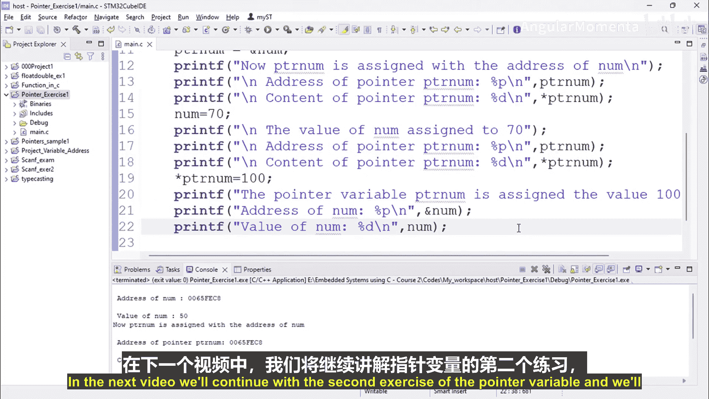

# 015：指针练习一实现 🔧


在本节课程中，我们将通过一个具体的编程练习，来学习如何在C语言中声明、初始化和使用指针变量。我们将创建一个简单的程序，观察如何通过变量本身和指针来访问与修改变量的地址和值。

---

## 概述

指针是C语言中一个核心且强大的概念，它允许我们直接操作内存地址。理解指针对于嵌入式系统开发至关重要。本节课，我们将编写一个程序，完成以下任务：
1.  声明一个整数变量和一个指向它的指针。
2.  打印变量的地址和值。
3.  将变量的地址赋值给指针。
4.  通过指针访问和修改变量的值。
5.  观察修改变量值或指针内容时，地址和值的变化情况。

---

## 代码实现步骤

以下是实现上述功能的完整步骤和代码。

首先，我们创建一个新的C项目，并添加一个源文件 `main.c`。

### 1. 包含头文件与主函数框架

我们首先包含标准输入输出头文件，并建立主函数的基本结构。

```c
#include <stdio.h>

int main() {
    // 后续代码将写在这里
    return 0;
}
```

### 2. 声明变量并初始化

在主函数内部，我们声明一个整数变量和一个指向整数的指针变量，并为整数变量赋初值。

```c
    int *ptr_num; // 声明一个整数指针
    int num = 50; // 声明并初始化一个整数变量
```

### 3. 打印变量的原始信息

使用 `printf` 函数，我们首先打印变量 `num` 自身的地址和值。

```c
    printf("\nAddress of num: %p", &num);
    printf("\nValue of num: %d", num);
```

### 4. 将变量地址赋值给指针

接下来，我们将变量 `num` 的地址赋值给指针变量 `ptr_num`。

```c
    ptr_num = &num; // 将 num 的地址赋给指针 ptr_num
    printf("\n\nNow, ptr_num is assigned with the address of num.");
```

### 5. 通过指针访问信息

赋值后，我们通过指针 `ptr_num` 来打印它自身存储的地址（即 `num` 的地址）以及它所指向的值。

```c
    printf("\nAddress of pointer ptr_num: %p", ptr_num);
    printf("\nContent of pointer ptr_num: %d", *ptr_num);
```

### 6. 修改变量的值

现在，我们直接修改变量 `num` 的值，然后再次通过指针查看其内容是否同步变化。

```c
    num = 70; // 直接修改 num 的值
    printf("\n\nThe value of num assigned to 70.");
    printf("\nAddress of pointer ptr_num: %p", ptr_num);
    printf("\nContent of pointer ptr_num: %d", *ptr_num);
```

### 7. 通过指针修改变量的值

最后，我们通过解引用指针 `*ptr_num` 来修改它所指向的内存内容（即 `num` 的值），并检查变量 `num` 的地址和值是否受到影响。

```c
    *ptr_num = 100; // 通过指针修改 num 的值
    printf("\n\nThe pointer variable ptr_num is assigned the value 100 now.");
    printf("\nAddress of num: %p", &num);
    printf("\nValue of num: %d", num);
```

---

## 程序运行结果分析

运行上述程序，你将观察到类似以下的输出：

```
Address of num: 0x7ffc065fc8
Value of num: 50

Now, ptr_num is assigned with the address of num.
Address of pointer ptr_num: 0x7ffc065fc8
Content of pointer ptr_num: 50

The value of num assigned to 70.
Address of pointer ptr_num: 0x7ffc065fc8
Content of pointer ptr_num: 70

The pointer variable ptr_num is assigned the value 100 now.
Address of num: 0x7ffc065fc8
Value of num: 100
```

从输出中可以总结出以下关键点：
*   **地址不变**：变量 `num` 的地址（`0x7ffc065fc8`）在整个程序运行期间始终不变。
*   **指针存储地址**：指针 `ptr_num` 存储的值就是 `num` 的地址。
*   **值同步变化**：无论是直接修改 `num`，还是通过 `*ptr_num` 修改，另一方访问到的值都会同步更新。这证明指针 `ptr_num` 和变量 `num` 指向同一块内存。
*   **地址独立于值**：修改变量的值不会改变其内存地址。

---

## 总结

在本节课中，我们一起完成了一个基础的指针练习。我们学习了：
1.  如何声明指针变量（`int *ptr;`）。
2.  如何使用取地址运算符（`&`）获取变量的地址并赋值给指针。
3.  如何使用解引用运算符（`*`）通过指针访问或修改其指向的变量值。
4.  理解了变量地址的固定性，以及通过变量本身或指针修改变量值的等价性。



这个练习清晰地展示了指针作为“内存地址引用”的本质。在下一节中，我们将继续进行第二个指针练习，以加深对这一核心概念的理解。