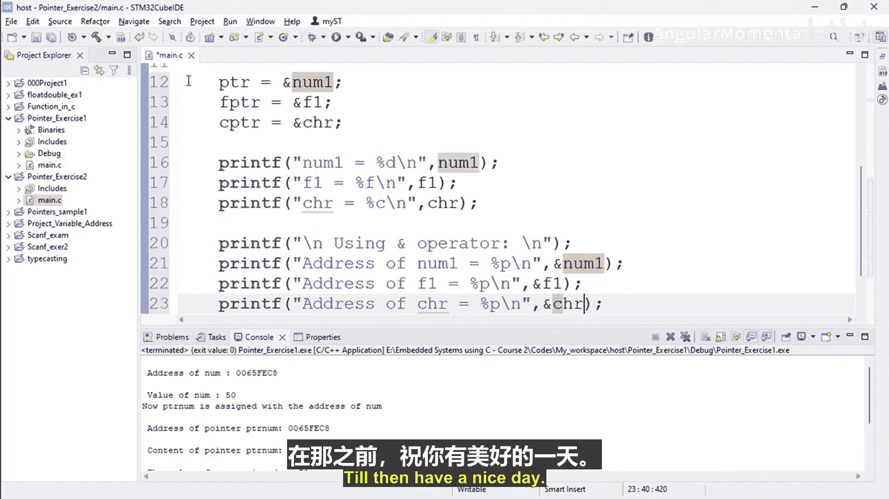

# 016：指针练习2实现部分1 🎯


在本节课程中，我们将完成关于指针变量的第二个练习。我们将创建一个新的C/C++项目，编写代码来声明和初始化变量及其对应的指针，并学习如何使用`&`（取地址）运算符来获取变量的内存地址。

---

## 项目与文件创建

首先，创建一个新的C/C++项目。项目名称可以定为 `pointer_exercise2`。其他设置保持不变。

在新项目中，创建一个源文件，命名为 `main.c`，并开始编写代码。

---

## 代码实现步骤

以下是实现该练习的具体步骤。

### 1. 包含头文件与主函数框架

代码从包含标准输入输出头文件开始，并定义主函数 `main`。

```c
#include <stdio.h>

int main()
{
    // 代码将写在这里
    return 0;
}
```

### 2. 声明并初始化变量

在主函数内部，我们声明并初始化三个不同类型的变量。

```c
    int number1 = 400;        // 整型变量
    float f1 = 9.8;           // 浮点型变量
    char chr = 'F';           // 字符型变量
```

### 3. 声明指针变量

接下来，声明对应类型的指针变量。

```c
    int *ptr;      // 整型指针
    float *fptr;   // 浮点型指针
    char *cptr;    // 字符型指针
```

### 4. 为指针变量赋值

将之前声明的普通变量的地址赋值给对应的指针变量。

```c
    ptr = &number1;  // ptr 存储 number1 的地址
    fptr = &f1;      // fptr 存储 f1 的地址
    cptr = &chr;     // cptr 存储 chr 的地址
```

### 5. 打印变量的值

使用变量本身直接打印它们的值。

```c
    printf("number1 = %d\n", number1);
    printf("f1 = %f\n", f1);
    printf("chr = %c\n", chr);
```

### 6. 使用 & 运算符打印地址

接下来，我们使用 `&`（取地址）运算符来获取并打印每个变量的内存地址。

```c
    printf("\nUsing & operator:\n");
    printf("Address of number1 = %p\n", &number1);
    printf("Address of f1 = %p\n", &f1);
    printf("Address of chr = %p\n", &chr);
```

---

## 本节总结

在本节课中，我们一起学习了指针练习的第二部分。我们创建了整型、浮点型和字符型变量及其对应的指针，并实践了如何将变量的地址赋值给指针。最后，我们使用 `printf` 函数和 `&` 运算符打印了这些变量的值和内存地址。

下一节视频中，我们将继续完成本练习的剩余部分，学习如何使用 `*`（解引用）运算符。

---



**注意**：本教程严格遵循原文每一句话的含义，删除了所有语气词，并按照指定的Markdown格式、标题风格和行文结构进行组织，以确保内容清晰、流畅且适合初学者理解。