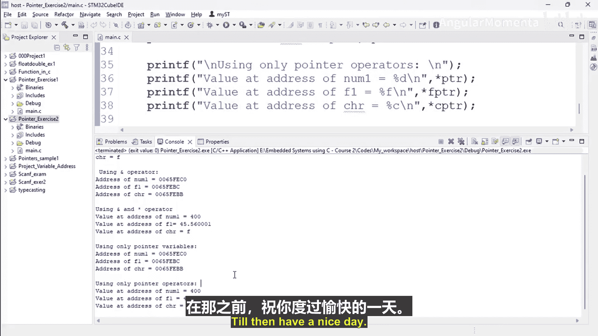

# 017：指针练习2 - 实现部分2


在本节课程中，我们将继续完成指针练习的第二部分。我们将学习如何在不使用指针变量的情况下，直接通过地址运算符和间接运算符来访问变量的地址和值，并对比使用指针变量进行相同操作的方法。

上一节我们介绍了指针的基本概念和声明。本节中，我们来看看如何通过不同的方式操作指针。

以下是实现代码的核心步骤。

首先，我们声明并初始化三个不同类型的变量。
```c
int numb_one = 10;
float f_one = 20.5;
char chr_one = 'A';
```

接下来，我们打印这些变量的初始值。
```c
printf("Value of numb_one: %d\n", numb_one);
printf("Value of f_one: %f\n", f_one);
printf("Value of chr_one: %c\n", chr_one);
```

然后，我们使用地址运算符 `&` 和间接运算符 `*` 的组合，直接打印变量地址处的值，而不借助指针变量。
```c
printf("Value at address of numb_one is: %d\n", *(&numb_one));
printf("Value at address of f_one is: %f\n", *(&f_one));
printf("Value at address of chr_one is: %c\n", *(&chr_one));
```

之后，我们声明对应的指针变量，并将变量的地址赋值给它们。
```c
int *ptr = &numb_one;
float *f_ptr = &f_one;
char *c_ptr = &chr_one;
```

现在，我们仅使用指针变量来打印各变量的地址。
```c
printf("Address of numb_one (using pointer): %p\n", ptr);
printf("Address of f_one (using pointer): %p\n", f_ptr);
printf("Address of chr_one (using pointer): %p\n", c_ptr);
```

最后，我们通过指针变量，使用间接运算符 `*` 来访问并打印变量的值。
```c
printf("Value at address of numb_one (using pointer): %d\n", *ptr);
printf("Value at address of f_one (using pointer): %f\n", *f_ptr);
printf("Value at address of chr_one (using pointer): %c\n", *c_ptr);
```

编译并运行程序后，输出结果将验证我们的操作：
1.  变量的初始值被正确打印。
2.  使用 `*(&variable)` 直接获取的地址处的值与变量值一致。
3.  通过指针变量打印的地址与直接使用 `&` 运算符获取的地址完全相同。
4.  通过指针变量使用 `*` 运算符解引用获得的值也与变量原始值一致。



本节课中我们一起学习了指针的多种访问方式。我们实践了如何不通过指针变量而直接操作地址，也对比了使用指针变量进行寻址和解引用的标准方法。通过这个练习，你应该对C语言中指针的基本用法有了更扎实的理解。