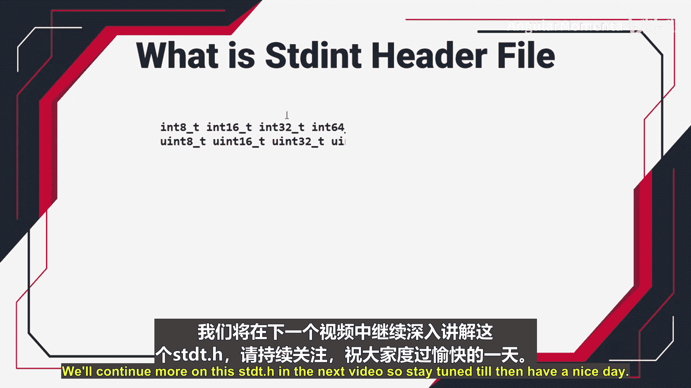

# 018：什么是stdint头文件 📚


在本节课中，我们将要学习 `stdint.h` 这个标准库头文件的重要性。理解它如何帮助我们编写可移植性更强、更可靠的嵌入式C语言代码。

## 为什么需要 `stdint.h`？ 🤔

上一节我们介绍了嵌入式编程的基础，本节中我们来看看代码可移植性面临的一个具体挑战。

假设你编写了一个C程序，其中使用了特定的数据类型（如 `int`, `long`）。当你更换编译器时，这些数据类型的**大小**可能会发生变化。代码虽然可能编译通过，但会引入潜在的、难以发现的错误，这就是**可移植性问题**。

## 可移植性问题的根源

C语言标准（如C99）并没有严格规定 `int` 或 `long` 等基本数据类型的确切大小（例如是2字节还是4字节）。标准只定义了这些类型的**最小值范围**。具体的大小由**编译器设计者**根据目标硬件平台（如8位、32位微控制器）的架构和效率来决定。

以下是两个例子：
*   **XC8编译器**（针对8位PIC MCU）可能将 `int` 定义为2字节。
*   **ARM编译器**（针对32位Cortex-M MCU）可能将 `int` 定义为4字节。

## 一个具体的例子

让我们通过一段代码来直观地理解这个问题。

```c
unsigned int count = 0;
count++;
if (count > 65536) {
    // 执行某些任务
}
```

这段代码在不同编译器下的行为：
*   在将 `unsigned int` 视为 **4字节** 的编译器上，`count` 可以超过65536，条件判断可能为真，任务得以执行。
*   在将 `unsigned int` 视为 **2字节** 的编译器上，`count` 的最大值是65535。当增加到65536时，值会**回绕**到0。因此，`count > 65536` 这个条件永远为假，预设的任务永远不会执行。

这就导致了**同一份代码在不同平台/编译器下行为不一致**的严重问题。

## 解决方案：使用 `stdint.h`

为了解决上述因数据类型大小不明确导致的问题，我们需要停止直接使用 `int`、`long` 这类“模糊”的标准类型。取而代之的是使用定义在 `stdint.h` 头文件中的**固定宽度整数类型**。

这些类型通过 **`typedef`**（类型别名）的方式，为C语言的标准数据类型赋予了新的、含义明确的名字。它们不是新的数据类型，而是已有类型的别名，但其名称直接指明了确切的位宽。

你需要将 `stdint.h` 包含到你的项目中才能使用这些别名。

以下是 `stdint.h` 中定义的一些常用固定宽度整数类型别名：

*   **8位整数**
    *   `int8_t`: 精确的8位有符号整数。
    *   `uint8_t`: 精确的8位无符号整数。
*   **16位整数**
    *   `int16_t`: 精确的16位有符号整数。
    *   `uint16_t`: 精确的16位无符号整数。
*   **32位整数**
    *   `int32_t`: 精确的32位有符号整数。
    *   `uint32_t`: 精确的32位无符号整数。
*   **64位整数**
    *   `int64_t`: 精确的64位有符号整数。
    *   `uint64_t`: 精确的64位无符号整数。

使用这些类型，我们可以将前面有问题的代码重写为可移植的形式：

```c
#include <stdint.h> // 包含头文件

uint32_t count = 0; // 明确使用32位无符号整数
count++;
if (count > 65536) {
    // 执行某些任务
}
```

现在，无论使用哪个编译器，`count` 都被明确定义为32位无符号整数，代码的行为在所有平台上都将保持一致。

## 总结 📝



本节课中我们一起学习了 `stdint.h` 头文件的核心价值。我们了解到，直接使用 `int`、`long` 等原生C类型会导致代码可移植性差，因为它们的位宽依赖于编译器。通过引入并**使用 `stdint.h` 中定义的固定宽度整数类型**（如 `uint32_t`），我们可以明确指定变量的位宽，从而编写出在不同硬件平台和编译器之间都能**行为一致、可靠**的嵌入式C代码。这是编写专业嵌入式软件的重要基石。在接下来的视频中，我们将继续深入探讨 `stdint.h` 的更多细节。