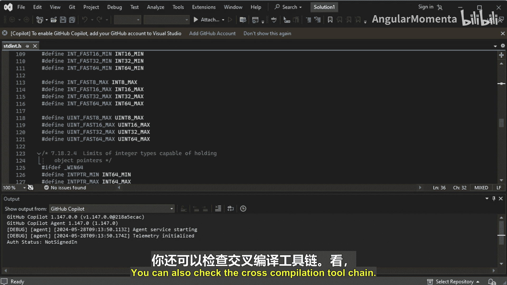
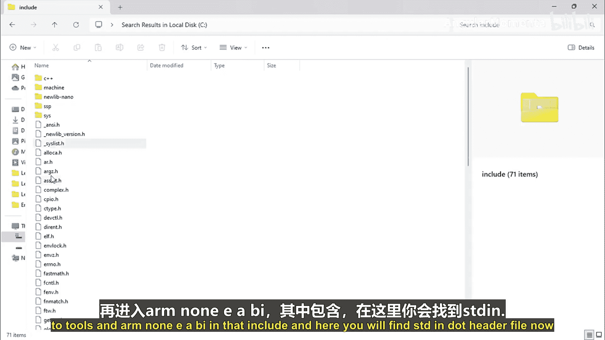
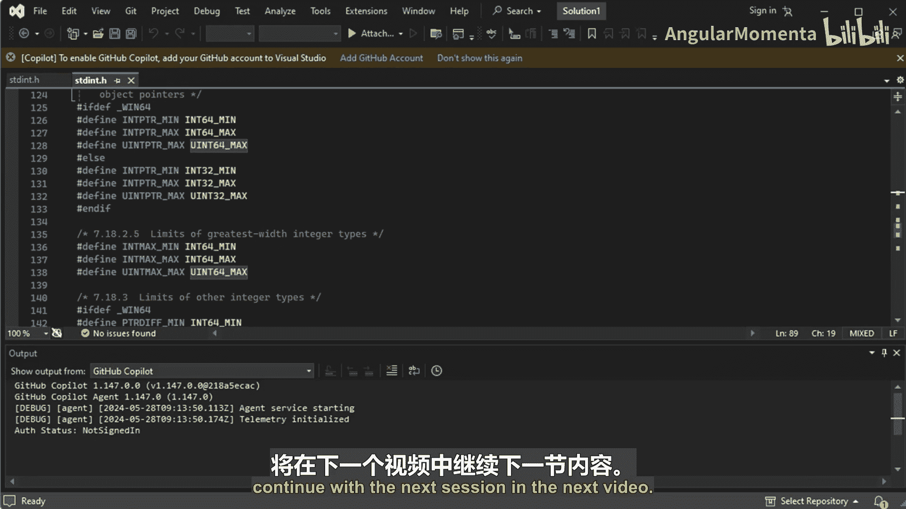

# 019：p19 02_01_02_理解 stdint.h 📚

在本节课中，我们将要学习 `stdint.h` 头文件。这个文件定义了标准整数类型的别名，是编写可移植嵌入式代码的关键。我们将了解它的作用、如何找到它，以及其中定义的一些有用类型。

上一节我们介绍了标准数据类型别名，本节中我们来看看这些别名是如何在 `stdint.h` 文件中被定义和管理的。

## 核心概念：`stdint.h` 的作用

`stdint.h` 头文件管理所有标准整数类型的别名。使用这些别名定义变量，可以确保变量在不同编译器和架构下具有确定的大小，从而避免程序错误或漏洞。

例如，使用 `int32_t` 定义变量 `count`：
```c
int32_t count;
```
这行代码会确保 `count` 变量始终占用 32 位，无论使用何种编译器。


## 如何定位 `stdint.h` 文件

`stdint.h` 是标准库头文件，位于工具链的安装目录中。以下是查找方法：



*   对于 MinGW 编译器，路径通常类似于：`C:\tools\MinGW\i686-w64-mingw32\include\stdint.h`
*   对于 ARM Cortex 工具链（如 STM32CubeIDE），路径通常类似于：`...\STM32CubeIDE\plugins\...\tools\arm-none-eabi\include\stdint.h`

不同编译器的 `stdint.h` 文件内容可能不同，这是由编译器自身定义的。



## `stdint.h` 中的有用类型别名

除了基本的固定宽度整数类型（如 `int8_t`, `uint16_t`），`stdint.h` 还定义了一些其他有用的类型和宏。

以下是几个关键的类型和宏定义：

*   **`UINT8_MAX`, `UINT16_MAX`, `UINT32_MAX`, `UINT64_MAX`**：这些宏定义了对应无符号整数类型能表示的最大值。
*   **`INT8_MAX`, `INT8_MIN`**：这些宏定义了对应有符号整数类型能表示的最大值和最小值。
*   **`uintptr_t`** 和 **`UINTPTR_MAX`**：`uintptr_t` 是一个无符号整数类型，其宽度足以存储一个指针的值。`UINTPTR_MAX` 是其最大值。当你不确定目标架构的指针大小时，可以使用这个类型。

## 使用建议

在为未知架构（如 PIC、RISC-V）编写代码时，如果无法确定指针的大小，可以使用 `uintptr_t` 类型来定义指针变量。`stdint.h` 头文件会负责将其映射到当前系统合适的指针数据类型，你无需担心具体的指针大小。

在后续的实际编程中开始使用这些类型，你会更深刻地理解它们的便利性。



本节课中我们一起学习了 `stdint.h` 头文件的重要性、如何找到它，以及其中定义的核心类型别名。掌握这些知识是编写跨平台、可移植嵌入式代码的基础。下一节我们将继续学习其他相关内容。